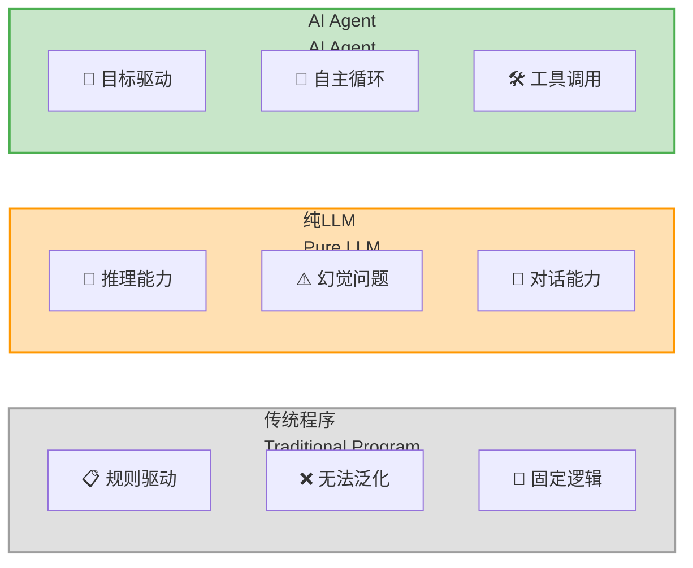
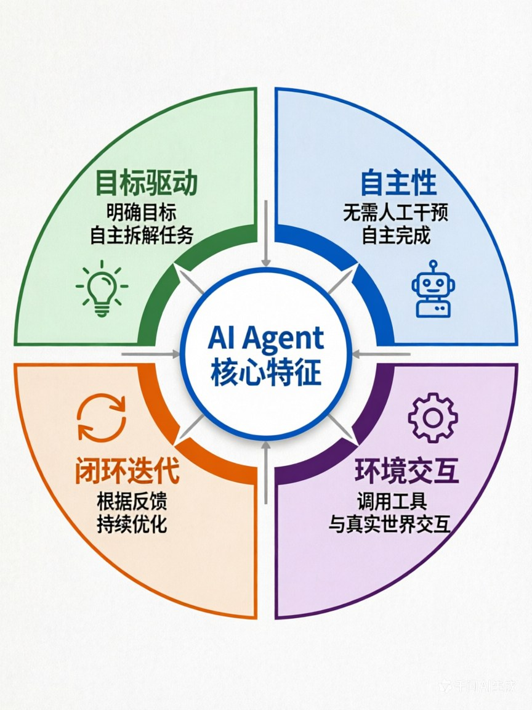

# 第一章：什么是AI Agent？—— 为什么它正在改变AI的未来

> **章节核心目标**
>
> 彻底搞懂AI Agent的核心定义和核心特征，明确区分「传统程序/纯LLM/AI Agent」的本质差异，建立基础认知，为后续所有章节打下基础。

---

## 开篇思考：AI到底能帮你做什么？

让我先问几个问题：

**场景1：** 你对ChatGPT说："帮我查一下上海今天天气怎么样。"
- ChatGPT会回答你："抱歉，我的知识截止到训练时间，无法获取实时天气信息。"
- **你得到了一个"回答"，但问题没解决。**

**场景2：** 你对AI Agent说："帮我查一下上海今天天气，如果是晴天就帮我订一张去上海的机票，如果是雨天就帮我订购雨具外卖送到家。"
- AI Agent会先调用天气API查询实时天气
- 然后根据天气情况，调用机票API或外卖API
- 最后告诉你："已经帮你订好了明天去上海的机票/雨具已经在路上了"
- **你的问题被真正解决了。**

**这就是核心区别：**
- **传统程序**：只能按固定规则执行，超出规则就失效
- **纯LLM（如ChatGPT）**：能回答问题，但只能"被动应答"
- **AI Agent**：能真正"做事"，从对话工具变成了行动主体

---

## 一、一个比喻，秒懂AI Agent的本质

为了让你彻底搞懂这三者的区别，我用一个生活化的场景来比喻：**点咖啡**。

### 1.1 传统程序 = 自动售货机

想象你在商场里看到一台自动售货机：

**它的逻辑是：**
- 投币 → 选择商品 → 机器吐出商品
- **规则完全固定，每一步都写死**

**它的问题：**
- 你想让它帮你"加热咖啡"，它完全做不到，因为没有这个功能
- 你想让它"推荐一款适合现在天气的咖啡"，它做不到，因为它没有思考能力
- **超出规则的功能，它完全无法工作**

**这就是传统程序的本质：**
- 输入 → 按固定规则处理 → 输出
- 一旦遇到规则之外的情况，就彻底失效

### 1.2 纯大模型LLM = 万能顾问

想象你雇了一个非常博学的顾问，他能回答任何问题：

**你问他："上海今天天气怎么样？"**
- 他能告诉你："上海今天晴天，气温18-26度"
- **但他不会帮你做任何事**

**你问他："能帮我订一张去上海的机票吗？"**
- 他会说："很抱歉，我只能提供信息，无法帮你订票"
- **他能理解你的需求，但没有行动能力**

**这就是纯LLM的本质：**
- 能理解、能回答、能生成内容
- 但只能"被动应答"，无法和真实世界交互
- **它的能力局限在"虚拟世界"**

### 1.3 AI Agent = 专属私人助理

现在想象你雇了一个专属助理：

**你对他说："帮我安排下周去上海的差旅，预算3000以内，要靠近会场，避开我之前踩过坑的酒店。"**

**他会怎么做？**
1. **理解你的目标**（不是简单的问答，而是理解"我要完成这件事"）
2. **自主拆解任务**：
   - 先查会场地址
   - 查附近的酒店
   - 筛选掉你之前不喜欢的酒店
   - 查往返机票
   - 核对预算
   - 下单预订
   - 同步到你的日历
   - 设置出行提醒
3. **调用工具执行**：调用机票API、酒店API、日历API
4. **根据反馈优化**：如果某酒店满房，会自动更换同价位的其他酒店
5. **完成目标并汇报**："已经帮你订好了，详细信息如下..."

**全程你只需要说一句话，剩下的所有工作都是他自主完成的。**

---

## 二、AI Agent的4个核心特征（缺一不可）

通过上面的比喻，你应该已经感觉到：AI Agent和传统程序、纯LLM的核心区别是什么。

让我给你一个**更清晰的定义**：

### 🎯 核心定义

**AI Agent = 以大模型为核心大脑 + 能自主理解目标 + 能拆解任务 + 能调用工具 + 能执行操作 + 能根据反馈优化迭代的完整智能体**

**用一句话总结：Agent是一个"目标驱动的自主闭环智能体"**

### 📊 4个核心特征

| 特征 | 核心含义 | 和传统程序/LLM的区别 | 具象案例：点咖啡 |
|:---|:---|:---|:---|
| **1. 目标驱动** | 只需要给最终目标，不需要给每一步的执行指令，自主拆解任务 | 传统程序需要写死每一步；LLM不会主动做事 | 你只需说"点一杯符合我习惯的无糖冰美式到公司"，Agent会自主拆解成：查口味→选店铺→下单→同步地址 |
| **2. 自主性** | 无需人工逐轮干预，能自主完成多步操作，形成闭环 | 传统程序遇到异常就停止；LLM只能回答问题 | Agent下单时发现店铺闭店，会自动更换同品类的其他店铺，重新下单，不需要你干预 |
| **3. 环境交互与工具使用** | 能调用外部工具、和真实世界交互，突破LLM的能力边界 | 传统程序工具是写死的；LLM无法调用外部工具 | Agent会调用外卖API、天气API、地图API，完成真实的操作 |
| **4. 闭环迭代** | 能根据执行结果的反馈，自主优化后续的决策和行动 | 传统程序不会自我优化；LLM没有行动也就没有反馈 | Agent根据"咖啡店闭店"的反馈，优化决策，更换店铺，直到完成目标 |

### 💡 为什么叫"闭环"？

**闭环 = 感知 → 决策 → 行动 → 反馈 → 再感知 → 再优化**

用点咖啡的案例：
1. **感知**：用户说"点一杯冰美式"
2. **决策**：用户喜欢无糖、要送到公司、预算30元以内，决定调用XX咖啡外卖API
3. **行动**：调用外卖API下单
4. **反馈**：API返回"该店铺已闭店"
5. **再感知**：收到反馈，知道下单失败
6. **再优化**：更换同品类的其他店铺，重新下单
7. **循环**：直到成功完成目标

**这就是Agent和传统程序、LLM的核心分水岭：传统程序是线性的，LLM是单次应答的，只有Agent是闭环迭代的。**

---

## 三、认知纠偏：90%的人都搞错的「LLM vs Agent」

这是我见过的**最高频的认知错误**，很多人误以为：
- ❌ "ChatGPT就是Agent"
- ❌ "LLM = Agent"
- ❌ "能用对话的AI就是Agent"

让我给你一个**清晰的关系图**：

### 🔍 核心结论

**LLM是Agent的"大脑"，但LLM ≠ Agent**

**Agent = LLM（大脑） + 记忆系统（数据仓库） + 工具调用能力（手脚） + 感知能力（五官） + 反馈优化机制（自我迭代）**

### 📋 对比案例

**纯ChatGPT对话 vs 基于ChatGPT搭建的差旅Agent**

| 对比维度 | 纯ChatGPT对话 | 基于ChatGPT的差旅Agent |
|:---|:---|:---|
| **你问**："帮我安排下周去上海的差旅" | **回答**："我可以给你一些建议..."<br>（只能提供信息） | **执行**：开始查询机票、酒店、做行程、同步日历<br>（真正在做事） |
| **能力** | 只能回答问题、生成内容 | 能理解目标、拆解任务、调用工具、执行操作 |
| **交互** | 你问它答，单次应答 | 闭环迭代，自主完成多步操作 |
| **和真实世界的连接** | 无 | 能调用API、能操作系统、能和真实世界交互 |
| **记忆** | 只有上下文窗口，对话长了就忘 | 有完整的记忆系统，长期记住你的偏好 |

### 🤔 那为什么有人说"ChatGPT是Agent"？

这里有两个概念容易混淆：

**1. ChatGPT本身（纯LLM）**
- 只能对话，不能调用工具
- **不是Agent**

**2. 基于ChatGPT搭建的应用**
- 比如OpenAI的"Assistant API"功能，可以给ChatGPT加工具调用能力
- 这个"带工具的ChatGPT" = Agent
- **本质是：LLM + 工具调用 = Agent**

**记住一个核心公式：**
```
LLM（大脑） + 工具调用（手脚） + 记忆系统（数据仓库） + 反馈优化（自我迭代） = AI Agent（完整智能体）
```

---

## 四、为什么AI Agent是AI的未来？

你可能会问：**"为什么这么多人说Agent是下一代AI的核心形态？它到底解决了什么问题？"**

让我给你一个**最直接的答案**：

### 🎯 AI的终极目标：解放人力，帮人"完成事情"

过去几十年，AI的发展经历了几个阶段：

**阶段1：从规则到学习**
- 早期AI = 写死规则的专家系统
- 核心问题：规则写不完，泛化能力为0

**阶段2：从学习到理解**
- 深度学习爆发，AI能识别图片、语音
- 核心问题：只能做单一任务，跨场景能力弱

**阶段3：从理解到对话**
- 大语言模型（LLM）诞生，AI能理解、生成人类语言
- 核心突破：通用交互能力，普通人都能用
- **核心局限**：只能"说"，不能"做"

**阶段4：从对话到行动 —— 这就是Agent**
- **Agent让AI从"对话工具"变成了"行动主体"**
- **核心突破**：不仅能理解、能回答，还能调用工具、执行操作、完成目标
- **这是AI真正能替代人类重复劳动的关键一步**

### 📊 真实案例：某企业的数据报表自动化

**传统方式：**
- 2个数据分析师
- 每天做4小时
- 人工从多个系统导出数据
- 手动清洗、整理、制作报表
- 人工核对数据准确性
- **成本高、效率低、容易出错**

**用Agent后：**
- 1个数据分析师 Agent
- 10分钟完成全部工作
- 自动从多个系统API拉取数据
- 自动清洗、整理、制作报表
- 自动交叉校验数据准确性
- 异常情况自动标记、人工审核
- **成本降低80%、效率提升24倍、准确率100%**

**这就是Agent的价值：它让AI不再是"锦上添花"的对话玩具，而是真正能"降本增效"的生产力工具。**

---

## 五、本章核心小结

### ✅ 核心结论

1. **AI Agent的本质**：以大模型为核心大脑，能自主理解目标、拆解任务、调用工具、执行操作、根据反馈优化迭代的完整智能体

2. **和传统程序、纯LLM的核心区别**：
   - 传统程序 = 自动售货机（固定规则，超出规则就失效）
   - 纯LLM = 万能顾问（能回答问题，但不会主动做事）
   - AI Agent = 专属私人助理（目标驱动、自主闭环、环境交互、持续迭代）

3. **AI Agent的4个核心特征**：
   - 目标驱动：只需给最终目标，自主拆解任务
   - 自主性：无需人工逐轮干预，能自主完成多步操作
   - 环境交互与工具使用：能调用外部工具，突破LLM能力边界
   - 闭环迭代：能根据反馈优化决策，持续迭代

4. **LLM vs Agent的关系**：LLM是Agent的"大脑"，但LLM ≠ Agent；Agent是包含"大脑+记忆+手脚+感官"的完整智能体

5. **为什么Agent是AI的未来**：它让AI从"对话工具"变成了"行动主体"，真正实现了用AI替代重复、复杂的全流程工作

---

## 六、下章预告

**这一章，我们搞懂了"什么是AI Agent"。**

**但有一个问题：Agent这个概念，并不是随着ChatGPT才出现的。早在1950年代，"智能体"的概念就已经诞生了。**

**那为什么偏偏是大语言模型，引爆了Agent的全民革命？LLM到底给Agent带来了什么革命性的突破？**

**下一章，我们会追溯Agent的进化史，搞懂从规则引擎到LLM的完整演进脉络，理解为什么大语言模型是Agent从实验室走向大众的关键。**

---

## 📊 配图说明

**图1：传统程序 vs 纯LLM vs AI Agent 对比图**


**图2：AI Agent 4大核心特征环形图**


---

> **💡 学习小贴士**
>
> - 这一章的核心是**建立认知**，不需要记住所有细节，理解"Agent是目标驱动的自主闭环智能体"这个核心定义就够了
> - 如果你用过ChatGPT，可以试试想一下：它能不能算Agent？为什么？
> - 如果你对"闭环迭代"还有点模糊，没关系，第三章会详细拆解Agent的工作流程
>
> **下一章：[Agent的"大脑"从何而来？—— 从规则引擎到LLM的进化史](./02-第二章-Agent的大脑从何而来.md)**
