# 第二章：Agent的"大脑"从何而来？—— 从规则引擎到LLM的进化史

> **章节核心目标**
>
> 理解Agent技术的完整演进脉络,明确LLM给Agent带来的核心突破,建立对Agent技术的历史认知。

---

## 开篇思考:Agent是ChatGPT诞生后才有的吗?

很多人有一个误解:**"AI Agent是随着ChatGPT才出现的新概念。"**

**事实是:**

- 1956年,"智能体"的概念就已经被提出
- 过去70年,Agent技术经历了多次演进
- 但始终停留在实验室和小众场景
- 直到**大语言模型(LLM)的出现**,才真正让Agent走向大众

**那为什么偏偏是LLM,引爆了Agent的革命?**

**这一章,我们会追溯Agent的进化史,搞懂这个问题。**

---

## 一、认知前置:Agent不是LLM的"新发明"

### 📅 时间线:Agent概念的诞生

**1956年:达特茅斯会议**
- 这是"人工智能"概念的诞生地
- 会议中首次提出"智能体(Agent)"的概念
- **核心理念**:打造一个能"自主感知环境、做出决策、采取行动"的智能体

**1950s-1990s:早期的Agent尝试**
- 专家系统、符号AI
- 核心逻辑:人工写死规则
- **核心痛点**:泛化能力为0,规则维护成本极高

**1995年:BDI Agent经典理论**
- 提出了Agent的三大核心要素:Belief(信念)、Desire(愿望)、Intention(意图)
- **这是Agent理论的里程碑**,但受限于技术,无法落地

**2010s:强化学习Agent**
- AlphaGo(围棋Agent)
- 游戏AI、自动驾驶单场景Agent
- **核心痛点**:只能在单一封闭场景工作,不具备自然语言交互能力

**2022年至今:LLM原生Agent**
- ChatGPT发布后,基于LLM的Agent爆发
- AutoGPT、BabyAGI等项目爆火
- **普通人第一次可以用自然语言让AI自主完成复杂任务**

### 🎯 核心结论

**Agent的概念早就存在,但过去70年,始终有三大瓶颈无法突破:**
1. **泛化能力差**:只能在单一场景工作,无法跨场景
2. **交互门槛高**:需要专业技术,普通人无法使用
3. **落地成本高**:需要海量数据训练,开发周期长

**直到大语言模型(LLM)的出现,才真正解决了这三大瓶颈。**

---

## 二、Agent技术演进的三个核心时代

为了让你更清晰地理解Agent的进化,我把过去70年划分为**三个时代**,每个时代都有清晰的技术特征、核心能力、核心痛点。

### 🕰️ 时代1:符号主义时代(1950s-2010s)—— 规则引擎与专家系统

#### 核心逻辑
**人工写死所有规则,用if-else逻辑实现固定场景的简单响应**

#### 典型代表
- **早期电话语音客服**:"按1查询话费,按2人工服务"
- **银行自助查询系统**:只能查询余额、转账等预设功能
- **专家系统**:医疗诊断系统、故障诊断系统

#### 案例:早期电话语音客服

**你能做什么?**
- 按键1:查询话费 → 系统播报你的话费余额
- 按键2:人工服务 → 转接人工客服
- **规则完全固定,每一步都写死**

**它的局限?**
- 你问:"我这个月为什么话费这么高?"
- **系统完全无法回答**,因为规则里没有这个场景
- **泛化能力为0,超出规则就失效**

#### 核心痛点
1. **泛化能力为0**:只能处理预设好的问题,超出规则完全无法工作
2. **规则维护成本极高**:新功能需要人工写新规则,规则越多越复杂
3. **无法处理复杂场景**:复杂任务需要成千上万条规则,维护成本不可控

**这个时代的Agent,本质上是"超级复杂的if-else程序"。**

---

### 🕰️ 时代2:机器学习时代(2010s-2022)—— 强化学习与单场景Agent

#### 核心逻辑
**通过数据训练让AI学会单场景的最优决策,具备了一定的自主学习能力**

#### 典型代表
- **AlphaGo(2016)**:围棋Agent,通过自我训练击败人类世界冠军
- **游戏AI**:Dota2 AI、星际争霸AI
- **自动驾驶Agent**:特定场景下的自动驾驶

#### 案例:AlphaGo

**它能做什么?**
- 下围棋,自主决策每一步怎么走
- 通过强化学习,不断优化自己的策略
- **在围棋这个单一场景,能力超越人类**

**它的局限?**
- **只能下围棋**,换个游戏就不会了
- 无法理解自然语言,你无法对它说"帮我分析一下这局棋"
- **泛化能力为0,无法跨场景使用**

#### 核心突破
- ✅ 具备了**自主学习能力**,不需要人工写规则
- ✅ 在**单一封闭场景**内,能力可以超越人类

#### 核心痛点
1. **泛化能力为0**:只能在单一场景工作,无法跨场景
2. **不具备自然语言交互能力**:普通人无法使用
3. **训练成本高**:需要海量数据和算力,开发周期长

**这个时代的Agent,本质上是"单一场景的超级专家"。**

---

### 🕰️ 时代3:大语言模型时代(2022年至今)—— 通用LLM原生Agent

#### 核心逻辑
**用LLM的通用理解、推理、任务拆解能力,解决了Agent的泛化、交互、决策三大核心瓶颈**

#### 典型代表
- **AutoGPT(2023)**:上线2个月GitHub星标破10万,引爆Agent热潮
- **BabyAGI**:任务管理Agent,能自主完成复杂任务
- **各种垂直场景Agent**:客服Agent、写作Agent、编程Agent、数据分析Agent

#### 案例:AutoGPT

**它能做什么?**
- 你只需给它一个大目标,比如"帮我做一个番茄炒蛋的食谱网站"
- 它会自主:
  1. 理解目标
  2. 拆解任务(调研食谱→设计网站→写代码→部署)
  3. 调用工具(搜索引擎、代码生成器、网站部署工具)
  4. 执行操作
  5. 根据反馈优化
- **全程无需人工干预,自主完成**

**为什么AutoGPT能爆火?**
- **普通人第一次可以用自然语言让AI自主完成复杂任务**
- 不需要写代码,不需要专业技术
- **真正实现了AI的平民化**

#### 核心突破
- ✅ **通用化**:同一个Agent能做差旅规划、写代码、做数据分析
- ✅ **平民化**:用自然语言就能交互,普通人都能用
- ✅ **低成本**:不需要海量数据训练,通过Prompt就能定义Agent行为

#### 核心瓶颈
- ⚠️ **幻觉问题**:Agent可能会编造信息
- ⚠️ **工程化挑战**:从Demo到商用还有很多工程问题
- ⚠️ **安全风险**:工具调用、Prompt注入等安全问题

**这个时代的Agent,本质上是"通用化、平民化的完整智能体"。**

---

## 三、核心破局:LLM到底给Agent带来了什么?

通过上面的对比,你应该已经感受到:**大语言模型(LLM)给Agent带来了革命性的突破。**

但具体带来了什么?让我给你拆解成**4个核心突破**,每个突破都对应解决了前两个时代的核心痛点。

### 🚀 突破1:通用自然语言理解能力

**解决了什么问题?**
- **符号主义时代**:需要专业技术,写规则、写代码
- **机器学习时代**:不具备自然语言交互能力,普通人无法使用
- **LLM时代**:普通人用大白话就能给Agent下达目标

**具象案例:**
**你想做一个客服Agent**
- **符号主义时代**:需要写几千条if-else规则,比如"用户说'退货',触发规则A"
- **机器学习时代**:需要准备海量对话数据,训练模型,开发周期几个月
- **LLM时代**:只需写一句Prompt,"你是一个客服Agent,帮我解答用户问题",就能用

**核心价值:交互门槛降至0,普通人都能用。**

---

### 🚀 突破2:通用任务拆解与推理能力

**解决了什么问题?**
- **符号主义时代**:只能处理简单任务,复杂任务需要写太多规则
- **机器学习时代**:只能在单一封闭场景工作,无法处理复杂多步骤任务
- **LLM时代**:能把模糊的大目标,拆解成可执行的小步骤

**具象案例:**
**你对Agent说:"帮我安排下周去上海的差旅。"**
- **符号主义时代**:无法实现,因为规则太复杂,无法穷尽所有情况
- **机器学习时代**:无法实现,因为这是跨场景的复杂任务
- **LLM时代**:Agent会自主拆解:
  1. 查会场地址
  2. 查往返机票
  3. 查附近酒店
  4. 筛选用户喜欢的酒店
  5. 核对预算
  6. 下单预订
  7. 同步日历
  8. 设置提醒
  **复杂任务,自主拆解完成。**

**核心价值:复杂任务,自主拆解。**

---

### 🚀 突破3:泛化能力

**解决了什么问题?**
- **符号主义时代**:只能处理预设场景,超出规则就失效
- **机器学习时代**:只能在单一场景工作,换个模型就不行
- **LLM时代**:能跨场景工作,同一个Agent能做多件事

**具象案例:**
**同一个Agent,能做多种完全不同的任务:**
- 任务1:"帮我做一份本月的销售数据报表" → 调用数据分析工具,生成报表
- 任务2:"帮我写一份产品发布会的文案" → 调用文档生成工具,撰写文案
- 任务3:"帮我查一下明天北京的天气,如果下雨就订购雨具" → 调用天气API和外卖API

**核心价值:一个Agent,多场景通用。**

---

### 🚀 突破4:低成本可落地

**解决了什么问题?**
- **符号主义时代**:新功能需要人工写新规则,维护成本高
- **机器学习时代**:需要海量数据训练,开发周期长,成本高
- **LLM时代**:通过Prompt就能定义Agent行为,开发周期短

**具象案例:**
**你想做一个客服Agent**
- **符号主义时代**:需要人工写几千条规则,开发周期几个月
- **机器学习时代**:需要准备海量对话数据,训练模型,开发周期几个月
- **LLM时代**:
  1. 写好Prompt(定义角色和行为)
  2. 接入知识库(产品手册、售后规则)
  3. 配置工具(订单查询、退款操作)
  4. **开发周期几天,就能上线使用**

**核心价值:开发成本低,落地速度快。**

---

## 四、关键节点:Agent发展史上的里程碑事件

为了让你对Agent的发展有更清晰的时间认知,我梳理了**从概念提出到当下的关键节点**:

| 时间 | 事件 | 核心意义 |
|:---|:---|:---|
| **1956年** | 达特茅斯会议 | 首次提出"智能体"概念,AI学科诞生 |
| **1995年** | BDI Agent理论 | 提出Agent的经典理论框架(Belief-Desire-Intention) |
| **1997年** | IBM深蓝击败国际象棋冠军 | 证明AI在单一规则场景可以超越人类 |
| **2016年** | AlphaGo击败围棋世界冠军 | 强化学习Agent的里程碑,证明AI可自主学习 |
| **2017年** | Transformer架构诞生 | 为后来GPT、BERT等大模型奠定基础 |
| **2020年** | GPT-3发布 | 证明大模型的通用能力,为Agent爆发奠定基础 |
| **2022年11月** | ChatGPT发布 | 普通人第一次能接触到强大的LLM,Agent时代前夜 |
| **2023年3月** | AutoGPT爆火 | 上线2个月GitHub星标破10万,引爆Agent热潮 |
| **2023年** | LangChain、CrewAI等框架成熟 | 降低Agent开发门槛,推动大规模落地 |
| **2024年** | 多Agent框架大规模落地 | 企业级Agent应用爆发,Agent走向商用 |
| **2025年** | 端侧Agent成为行业热点 | Agent从云端走向本地,隐私与低延迟优势凸显 |

---

## 五、本章核心小结

### ✅ 核心结论

1. **Agent不是LLM的"新发明"**:Agent的概念早在1950年代就已经提出,过去几十年一直停留在实验室和小众场景

2. **Agent技术经历了三个时代**:
   - **符号主义时代**:规则引擎,泛化能力为0
   - **机器学习时代**:强化学习,单场景Agent,无法跨场景
   - **大语言模型时代**:通用LLM原生Agent,真正实现了平民化

3. **LLM给Agent带来了4个革命性突破**:
   - 通用自然语言理解能力:交互门槛降至0
   - 通用任务拆解与推理能力:复杂任务,自主拆解
   - 泛化能力:一个Agent,多场景通用
   - 低成本可落地:开发周期短,落地速度快

4. **Agent正在从"实验室技术"走向"全民应用"**:2023年AutoGPT爆火,标志着Agent正式走向大众,2024-2025年大规模落地商用

---

## 六、下章预告

**前两章,我们搞懂了"什么是Agent"以及"它是怎么进化来的"。**

**但有一个核心问题还没解决:**一个能自主完成目标的Agent,内部到底是靠什么运转的?

**它有哪些核心组件?这些组件是怎么协作的?它的完整工作流程是什么?**

**下一章,我们会拆解Agent的三大核心支柱——感知、决策、行动,彻底搞懂Agent的完整工作闭环。**

---

## 📊 配图说明

**图1:Agent技术演进时间线图**

```mermaid
flowchart LR
    subgraph Era1["符号推理时代<br/>1950-2010"]
        E1A[标志性技术<br/>专家系统、符号AI]
        E1B[代表案例<br/>Deep Blue]
        E1C[痛点<br/>❌ 规则死板<br/>❌ 无法泛化]
    end

    subgraph Era2["机器学习时代<br/>2010-2020"]
        E2A[标志性技术<br/>强化学习、深度学习]
        E2B[代表案例<br/>AlphaGo]
        E2C[痛点<br/>❌ 需要大量<br/>训练数据]
    end

    subgraph Era3["大语言模型时代<br/>2020-2025"]
        E3A[标志性技术<br/>Transformer、GPT、LLM]
        E3B[代表案例<br/>ChatGPT、Agent]
        E3C[亮点<br/>✨ 通用推理<br/>✨ 能力涌现]
    end

    Era1 --> Era2
    Era2 --> Era3

    style Era1 fill:#E0E0E0,stroke:#9E9E9E,stroke-width:2px
    style Era2 fill:#E3F2FD,stroke:#2196F3,stroke-width:2px
    style Era3 fill:#2196F3,stroke:#1565C0,stroke-width:2px

    style E1C fill:#FFCDD2,stroke:#D32F2F,stroke-width:1px,color:#D32F2F
    style E2C fill:#FFE0B2,stroke:#F57C00,stroke-width:1px,color:#F57C00
    style E3C fill:#FFF9C4,stroke:#FBC02D,stroke-width:1px,color:#F9A825
```

---

> **💡 学习小贴士**
>
> - 这一章的核心是**理解历史脉络**,不需要记住所有年份和事件,理解"三个时代"的特征和LLM的4个突破就够了
> - 重点理解:为什么LLM能让Agent从"实验室技术"走向"全民应用"?
> - 如果你对"强化学习"、"Transformer"等技术细节不熟悉,没关系,这章只需要知道它们的核心价值,不需要深入技术细节
>
> **下一章:[Agent的三大核心支柱:感知、决策、行动](./03-第三章-Agent的三大核心支柱.md)**
