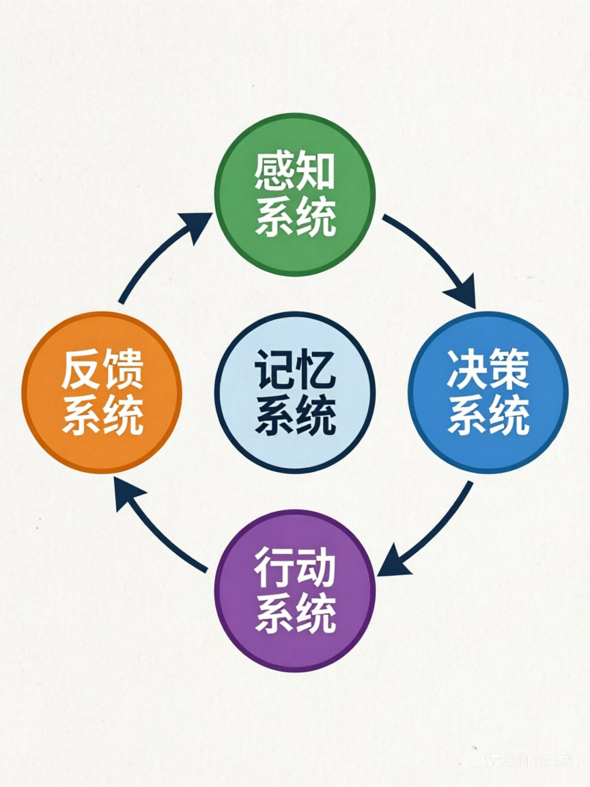
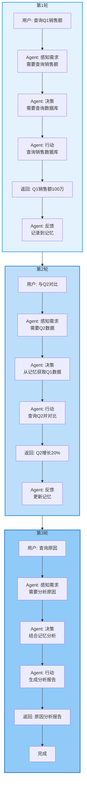

# 第三章：Agent的三大核心支柱—— 感知、决策、行动

> **章节核心目标**
>
> 彻底搞懂Agent的完整工作闭环,建立Agent的核心认知框架,理解感知、决策、行动三大支柱的协作机制。

---

## 开篇思考:Agent是怎么"思考"和"做事"的?

在第一章,我们讲了Agent的核心特征:**目标驱动的自主闭环智能体**。

但你可能还有疑问:**"这个'闭环'具体是怎么运转的?Agent内部有哪些核心组件?这些组件是怎么协作的?"**

**这一章,我们会彻底拆解Agent的"黑箱",让你看清它的完整工作流程。**

---

## 一、先破后立:Agent不是"线性执行",而是"闭环迭代"

这是新手最容易犯的认知错误:**认为Agent的工作逻辑是线性的。**

### ❌ 错误认知:线性执行

```
用户输入 → Agent处理 → 输出结果
```

**这种认知的问题?**
- 认为Agent只会"一次性"完成任务
- 没有考虑"失败重试"、"优化迭代"的情况
- **这是传统程序的思维,不是Agent的思维**

### ✅ 正确认知:闭环迭代

```
感知 → 决策 → 行动 → 反馈 → 再感知 → 再决策 → 再行动 → ...直到完成目标
```

**Agent的核心逻辑是"循环",不是"线性"。**

### 📊 具象案例:帮用户点咖啡

**线性执行(错误):**
1. 用户说:"帮我点一杯冰美式"
2. Agent调用XX咖啡店API下单
3. API返回:"该店铺已闭店"
4. **Agent停止,任务失败**

**闭环迭代(正确):**
1. 用户说:"帮我点一杯冰美式"
2. Agent调用XX咖啡店API下单
3. API返回:"该店铺已闭店"
4. **Agent感知到失败**
5. **Agent重新决策**:换一家同品类的咖啡店
6. Agent调用YY咖啡店API下单
7. API返回:"下单成功"
8. **Agent通知用户:"已经帮你下单了,预计20分钟送达"**

**核心区别:闭环迭代让Agent能"自主优化",直到完成目标。**

---

## 二、底层底座:记忆系统—— 三大支柱的"数据中枢"

在拆解三大支柱之前,我必须先讲一个**容易被忽视但极其重要的组件**:**记忆系统**。

### 🎯 记忆系统的核心作用

**记忆系统是三大支柱的"数据中枢":**
- **感知的内容** → 存入记忆系统
- **决策时** → 调取记忆系统里的内容
- **行动的结果** → 回写记忆系统
- **下一次感知** → 基于更新后的记忆

**没有记忆系统,Agent就"活不过第一轮"。**

### 📋 案例:点咖啡的记忆系统

**Agent的记忆系统存储了什么?**
- 用户的口味偏好:"无糖、冰的、浓度偏淡"
- 用户的地址:"XX公司XX楼XX前台"
- 用户的预算:"不超过30元"
- 用户的历史订单:"上次在YY咖啡店点过,评价不错"
- 用户不喜欢:"XX咖啡店的咖啡太苦,不要点"

**这些记忆,让Agent能做出"正确"的决策:**
- ✅ 调用XX外卖API(而不是其他平台)
- ✅ 选择YY咖啡店(而不是用户不喜欢的XX咖啡店)
- ✅ 点"无糖冰美式,浓度偏淡"(而不是默认配方)

**没有记忆系统,Agent每次都是"第一次见面",无法提供个性化服务。**

---

## 三、支柱一:感知系统—— Agent的"五官"

### 🎯 核心作用

**感知系统是Agent和世界交互的入口,负责"接收信息":**
1. 接收用户的目标指令
2. 获取外部环境的信息
3. 收集行动后的反馈结果

### 📋 感知的4种核心类型

| 感知类型 | 核心作用 | 具象案例 |
|:---|:---|:---|
| **1. 用户自然语言输入** | 接收用户的目标、需求、反馈 | "帮我安排下周去上海的差旅" |
| **2. 工具返回的结果数据** | 接收API、工具的执行结果 | 机票API返回:"已找到3个航班,价格如下..." |
| **3. 多模态信息** | 接收图片、语音、视频等信息 | 用户发送一张餐厅图片,Agent识别出餐厅信息 |
| **4. 环境状态变化** | 感知环境的变化,优化决策 | Agent感知到"现在是晚上10点",决策"不再打电话打扰用户" |

### 🌟 案例:差旅Agent的感知

**它感知了什么?**

1. **用户输入**:"帮我安排下周去上海的差旅,预算3000以内"
2. **外部信息**:
   - 机票API:查询到下周去上海的机票价格
   - 酒店API:查询到会场附近的酒店列表
   - 天气API:查询到上海下周的天气情况
3. **反馈信息**:
   - 酒店预订API:"XX酒店已满房"
   - 飞机票预订API:"已成功出票"
4. **环境状态**:
   - 当前时间:2025年4月1日
   - 用户位置:北京
   - 会议时间:4月10日-12日

**所有这些信息,都通过"感知系统"进入Agent。**

---

## 四、支柱二:决策系统—— Agent的"大脑"

### 🎯 核心作用

**决策系统是Agent的核心中枢,负责"思考":**
1. 理解目标
2. 拆解任务
3. 制定执行计划
4. 选择要调用的工具
5. 判断任务是否完成
6. 优化后续的行动策略

### 📋 决策的核心流程

```
理解目标 → 拆解任务步骤 → 制定执行计划 → 选择工具 → 执行 → 验证结果 → 判断是否完成 → 优化下一步动作
```

### 🌟 案例:差旅Agent的决策

**用户说:"帮我安排下周去上海的差旅,预算3000以内,要靠近会场。"**

**Agent的决策过程:**

**第1步:理解目标**
- 目标:安排上海差旅
- 约束条件:预算3000以内,靠近会场

**第2步:拆解任务**
1. 查会场地址
2. 查附近酒店(筛选符合预算的)
3. 查往返机票
4. 核算总费用
5. 下单预订
6. 同步日历
7. 设置出行提醒

**第3步:制定执行计划**
- 先查会场地址 → 再查酒店 → 再查机票 → 核算预算 → 预订 → 同步日历 → 设置提醒

**第4步:选择工具**
- 查会场:调用搜索引擎
- 查酒店:调用携程API
- 查机票:调用飞猪API
- 同步日历:调用飞书日历API

**第5步:执行并验证**
- 调用携程API,查到3家酒店,价格分别是500、800、1200元
- 选择500元的酒店(符合预算)
- 调用飞猪API,查到机票1200元
- 核算总费用:500×2晚+1200=2200元,符合预算

**第6步:判断是否完成**
- 酒店和机票都预订成功 → 任务完成

**第7步:通知用户**
- "已经帮你订好了上海XX酒店(离会场1公里)和往返机票,总费用2200元,已同步到你的日历。"

---

## 五、支柱三:行动系统—— Agent的"手脚"

### 🎯 核心作用

**行动系统是Agent突破LLM边界的核心,负责"执行":**
1. 调用外部工具和API
2. 生成内容
3. 执行代码
4. 操作文件
5. 发送信息
6. 和其他系统交互

### 📋 行动的5种核心类型

| 行动类型 | 核心作用 | 具象案例 |
|:---|:---|:---|
| **1. 调用外部工具/API** | 和真实世界交互 | 调用天气API、外卖API、日历API |
| **2. 生成内容** | 创造新内容 | 写文案、写代码、生成报告 |
| **3. 执行代码** | 运行代码 | 执行Python代码做数据分析 |
| **4. 操作文件** | 读写文件 | 读取Excel文件、生成PDF报告 |
| **5. 发送信息** | 和用户/系统通信 | 发送邮件、发送微信消息、推送通知 |

### 🌟 案例:差旅Agent的行动

**它执行了哪些行动?**

1. **调用搜索引擎**:查找会场地址
2. **调用携程API**:
   - 查询会场附近的酒店
   - 预订酒店
3. **调用飞猪API**:
   - 查询往返机票
   - 预订机票
4. **调用飞书日历API**:
   - 创建差旅行程
   - 设置出发提醒
5. **发送通知**:
   - 给用户发送预订成功的消息

**所有这些行动,都是通过"行动系统"完成的。**

---

## 六、一个完整案例,串起Agent的全闭环工作流

为了让你彻底理解三大支柱和记忆系统的协作,我用一个完整的案例来串起来:

### 🎯 案例:帮你做销售数据报表

**你的需求:**"帮我做一份本月的销售数据报表,发给部门全员,同步核心问题给领导。"

---

### **第1轮:感知 → 决策 → 行动 → 反馈**

**👁️ 感知:**
- 用户输入:"帮我做一份本月的销售数据报表,发给部门全员,同步核心问题给领导。"
- 记忆系统调取:
  - 部门成员列表
  - 领导联系方式
  - 报表模板偏好(用户喜欢用Excel表格+图表)

**🧠 决策:**
- 理解目标:做报表 → 发全员 → 同步问题给领导
- 拆解任务:
  1. 从销售系统API获取本月数据
  2. 数据分析(计算增长率、识别异常)
  3. 生成报表(Excel+图表)
  4. 识别核心问题
  5. 发邮件给部门全员
  6. 单独发消息给领导,同步核心问题

**🦶 行动:**
- 调用销售系统API,获取本月销售数据
- 执行Python代码,做数据分析
- 生成Excel报表和图表

**🔄 反馈:**
- 数据分析完成,发现本月销售额比上月下降15%
- 核心问题:华东区销售额下降30%

---

### **第2轮:感知 → 决策 → 行动 → 反馈**

**👁️ 感知:**
- 收到上一步的反馈:销售额下降15%,华东区下降30%

**🧠 决策:**
- 优化决策:在报表中重点标注华东区的问题
- 继续执行:生成报表,发送邮件

**🦶 行动:**
- 生成Excel报表(重点标注华东区问题)
- 生成图表(可视化下降趋势)
- 调用邮件API,发送给部门全员(附件:报表)
- 发送消息给领导:"本月销售额下降15%,核心问题是华东区下降30%,详细报表已发送到您的邮箱。"

**🔄 反馈:**
- 邮件发送成功
- 领导消息发送成功

---

### **第3轮:感知 → 决策 → 行动 → 完成**

**👁️ 感知:**
- 收到反馈:所有任务都已完成

**🧠 决策:**
- 判断任务完成,通知用户

**🦶 行动:**
- 通知用户:"已经帮你完成了本月的销售数据报表,已发送给部门全员,核心问题已同步给领导。报表亮点:本月销售额下降15%,核心问题是华东区下降30%。"

**✅ 任务完成!**

---

## 七、本章核心小结

### ✅ 核心结论

1. **Agent的工作逻辑是"闭环迭代",不是"线性执行"**:感知 → 决策 → 行动 → 反馈 → 再感知 → 再优化,循环直到完成目标

2. **记忆系统是三大支柱的"数据中枢"**:感知的内容存入记忆,决策调取记忆,行动的结果回写记忆,是整个闭环能持续运转的核心底座

3. **三大支柱各司其职**:
   - **感知系统**(五官):接收用户指令、获取外部信息、收集执行反馈
   - **决策系统**(大脑):理解目标、拆解任务、制定计划、选择工具、优化策略
   - **行动系统**(手脚):调用工具、生成内容、执行代码、操作文件、发送信息

4. **Agent的完整工作流是"循环迭代"**:每一步都基于上一步的反馈,持续优化,直到完成最终目标

---

## 八、下章预告

**这一章,我们拆解了Agent的三大核心支柱,理解了它的完整工作闭环。**

**但还有一个问题:**这些组件是怎么"拼起来"的?Agent的完整架构长什么样?从最小可行架构到企业级完整架构,有什么区别?**

**下一章,我们会看Agent的架构全景图,搞懂从3个组件就能搭的极简Agent,到5层的完整分层架构,同时对比主流的Agent框架,让你知道该怎么选。**

---

## 📊 配图说明

**图1:Agent闭环工作流环形图**


**图2:销售报表案例完整流程图**


---

> **💡 学习小贴士**
>
> - 这一章是**核心认知框架**,后面所有章节都会基于这个框架展开,一定要理解"三大支柱+记忆系统"的协作机制
> - 重点理解:为什么Agent是"闭环迭代"而不是"线性执行"?
> - 如果你对"决策系统"的细节还有疑问,没关系,第五章会详细讲LLM怎么当Agent的"决策大脑"
>
> **下一章:[Agent架构全景图—— 从最小可行体到完整分层设计](./04-第四章-Agent架构全景图.md)**
