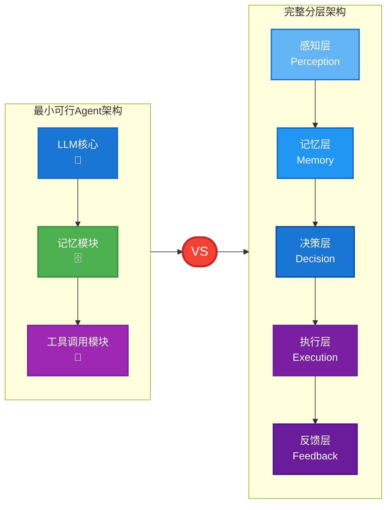
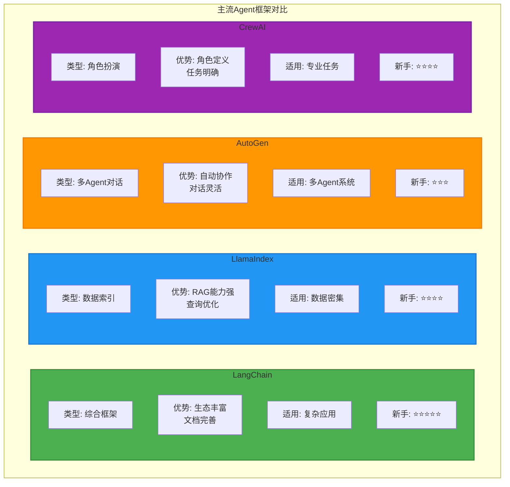

# 第四章：Agent架构全景图—— 从最小可行体到完整分层设计

> **章节核心目标**
> 
> 搞懂Agent的架构组成,理解最小可行架构和完整分层架构,区分「Agent架构」和「Agent框架」,学会架构选型。

---

## 开篇思考:搭一个Agent,需要哪些组件?

在第三章,我们讲了Agent的三大核心支柱:**感知、决策、行动**,以及底层的记忆系统。

但你可能还有一个问题:**"这些组件具体是怎么'拼起来'的?有没有一个标准的架构?"**

**这一章,我们会看Agent的完整架构,从最简单的三组件版本,到企业级的五层完整架构,让你知道怎么设计Agent。**

---

## 一、认知纠偏:先搞懂「架构≠框架」

这是新手最容易混淆的两个概念,必须先搞清楚。

### 📐 Agent架构 vs Agent框架

| 对比维度 | Agent架构 | Agent框架 |
|:---|:---|:---|
| **定义** | Agent的核心组件组成、组件之间的协作逻辑 | 帮你快速搭建Agent的工具库 |
| **比喻** | 房子的"骨架" | 帮你盖房子的"脚手架" |
| **是否必须** | 是,每个Agent都有架构 | 否,简单的Agent不用框架也能写 |
| **典型例子** | 最小可行架构、完整分层架构 | LangChain、CrewAI、AutoGen |

### 🎯 核心结论

**架构是Agent的"设计图",框架是帮你快速实现的"工具包"。**

**新手避坑:**
- ❌ 框架不是必须的,简单的Agent不用框架也能写
- ❌ 不要为了用框架而堆复杂度,先搞懂架构,再选框架
- ✅ 先理解最小可行架构,再决定是否需要框架

---

## 二、新手入门:最小可行Agent架构—— 3个组件就能搭一个Agent

让我给你一个**最简单的Agent架构**,所有复杂Agent都是在这个基础上扩展的。

### 🧱 核心组件1:LLM核心(决策大脑)

**作用:**
- 理解用户的目标
- 拆解任务
- 决策要调用什么工具
- 优化后续行动

**案例:**
- 你说:"帮我查一下北京今天天气"
- LLM理解目标 → 决策调用天气API → 返回结果

---

### 🧱 核心组件2:记忆模块(数据底座)

**作用:**
- 存储用户的偏好
- 存储任务的中间状态
- 存储历史对话

**案例:**
- 你说过"我喜欢晴天"
- Agent记住你的偏好 → 下次查天气时,会特别强调"晴天"

---

### 🧱 核心组件3:工具调用模块(行动能力)

**作用:**
- 调用外部API
- 执行具体操作

**案例:**
- 调用天气API → 获取实时天气 → 返回给用户

---

### 📊 最小可行Agent架构图

```
用户输入 → LLM核心(理解目标、决策) → 工具调用模块(执行API) → 返回结果
                    ↓
                记忆模块(存储偏好、历史)
```

### 🌟 案例:极简天气查询Agent

**架构:**
- LLM核心:豆包大模型
- 记忆模块:本地文件存储用户偏好
- 工具调用模块:天气API

**工作流:**
1. 用户说:"北京今天天气怎么样?"
2. LLM理解目标 → 决策调用天气API
3. 工具调用模块执行API → 获取天气数据
4. LLM总结结果 → "北京今天晴天,气温18-26度"
5. 记忆模块存储:用户查过北京的天气

**3个组件,实现完整闭环,这就是最小可行Agent。**

---

## 三、完整分层架构:企业级Agent的标准设计

对应第三章的三大核心支柱,我来拆解**完整的5层架构**,每一层都对应核心能力和核心组件。

### 🏗️ 第1层:感知层(对应感知系统)

**核心作用:**信息输入与预处理

**核心组件:**
- 自然语言理解模块:理解用户的自然语言输入
- 多模态感知模块:处理图片、语音、视频
- 反馈接收模块:收集工具返回的结果、环境状态变化

**案例:**
- 用户说:"帮我安排上海差旅"
- 感知层解析:目标=安排差旅,约束条件=上海,后续需调用机票酒店API

---

### 🏗️ 第2层:记忆层(对应记忆系统)

**核心作用:**全生命周期的数据存储与调取

**核心组件:**
- 瞬时记忆:存储本轮对话的临时内容(对应LLM上下文窗口)
- 工作记忆:存储当前任务的中间状态、临时数据
- 长期记忆:永久存储用户偏好、专属知识库(对应向量数据库)

**案例:**
- 瞬时记忆:用户刚才说"预算3000以内"
- 工作记忆:查到机票1200元,酒店500元/晚
- 长期记忆:用户喜欢靠近会场的酒店,不喜欢XX酒店(上次体验不好)

---

### 🏗️ 第3层:决策层(对应决策系统)

**核心作用:**任务拆解、推理规划、调度优化

**核心组件:**
- 任务拆解模块:把大目标拆解成小步骤
- 推理引擎:理解目标、逻辑推理
- 反思优化模块:根据反馈优化决策
- 工具调度模块:决定调用哪个工具

**案例:**
- 目标:安排上海差旅
- 任务拆解:查会场 → 查机票 → 查酒店 → 核算预算 → 预订 → 同步日历
- 工具调度:调用携程API查酒店、飞猪API查机票、飞书API同步日历

---

### 🏗️ 第4层:执行层(对应行动系统)

**核心作用:**执行具体操作

**核心组件:**
- 工具调用模块:调用外部API
- API集成模块:和企业系统对接
- 代码执行模块:运行Python代码
- 内容生成模块:写文案、写代码、生成报告

**案例:**
- 调用携程API → 查询酒店列表
- 调用飞猪API → 预订机票
- 执行Python代码 → 计算预算

---

### 🏗️ 第5层:反馈层(闭环优化的核心)

**核心作用:**校验执行结果、评估任务完成度、给决策层返回优化建议

**核心组件:**
- 结果校验模块:验证执行结果是否正确
- 完成度评估模块:判断任务是否完成
- 优化建议模块:给决策层返回反馈

**案例:**
- 工具返回:"XX酒店已满房"
- 反馈层校验:预订失败
- 反馈层建议:更换同价位的其他酒店
- 决策层收到建议 → 优化决策 → 调用其他酒店API

---

### 📊 完整分层架构图

```
┌─────────────────────────────────────────┐
│           反馈层(结果校验、优化建议)        │
└─────────────────────────────────────────┘
                    ↑
┌─────────────────────────────────────────┐
│           执行层(工具调用、API集成)        │
└─────────────────────────────────────────┘
                    ↑
┌─────────────────────────────────────────┐
│     决策层(任务拆解、推理规划、工具调度)   │
└─────────────────────────────────────────┘
                    ↑
┌─────────────────────────────────────────┐
│      记忆层(瞬时记忆、工作记忆、长期记忆)   │
└─────────────────────────────────────────┘
                    ↑
┌─────────────────────────────────────────┐
│    感知层(自然语言理解、多模态感知)        │
└─────────────────────────────────────────┘
```

---

## 四、主流Agent框架对比与选型指南

理解了架构,我们再来看看**怎么选框架**。

### 📦 单Agent主流框架

| 框架 | 核心优势 | 适用场景 | 新手友好度 | 学习成本 |
|:---|:---|:---|:---|:---|
| **LangChain** | 生态最完善、文档最全、社区活跃 | 绝大多数单Agent场景 | ⭐⭐⭐⭐⭐ | 低 |
| **LlamaIndex** | 对知识库/RAG适配最好 | 基于专属知识库的Agent | ⭐⭐⭐⭐ | 中 |

**推荐:**
- 新手入门首选**LangChain**,文档全、案例多、社区活跃
- 做知识库Agent首选**LlamaIndex**,RAG能力强

---

### 📦 多Agent主流框架

| 框架 | 核心优势 | 适用场景 | 新手友好度 | 学习成本 |
|:---|:---|:---|:---|:---|
| **CrewAI** | 角色分工明确、上手简单 | 新手入门多Agent开发 | ⭐⭐⭐⭐⭐ | 低 |
| **AutoGen** | 微软出品、群聊协作能力强 | 复杂多角色场景 | ⭐⭐⭐⭐ | 中 |
| **LangGraph** | LangChain官方出品、状态管理强 | 企业级复杂场景 | ⭐⭐⭐ | 高 |

**推荐:**
- 新手入门多Agent首选**CrewAI**,上手简单、文档完善
- 复杂场景首选**AutoGen**,群聊协作能力极强
- 企业级场景首选**LangGraph**,状态管理完善

---

## 五、架构选型避坑指南

给新手的3个核心选型原则,避开90%的架构坑。

### 🎯 原则1:匹配原则

**架构复杂度匹配任务复杂度**

- 简单任务(查天气、发邮件) → 用最小可行架构
- 中等任务(个人助理、简单客服) → 用3-4层架构
- 复杂任务(企业级客服、多Agent协作) → 用完整5层架构

**❌ 避坑:不要堆冗余组件**
- 查天气Agent不需要复杂的记忆系统
- 简单客服Agent不需要多Agent协作

---

### 🎯 原则2:落地原则

**优先选自己能掌控的架构和框架**

- 新手 → 从最小可行架构开始,不用框架
- 有基础 → 用LangChain等成熟框架
- 有经验 → 根据场景选择AutoGen、CrewAI等

**❌ 避坑:不要盲目追新**
- 刚出的框架可能Bug多、文档少
- 优先选文档全、社区活跃的成熟框架

---

### 🎯 原则3:扩展原则

**预留扩展空间**

- 现在是单Agent,未来可能升级多Agent → 架构要支持
- 现在工具少,未来可能加更多工具 → 工具调度模块要灵活
- 现在记忆简单,未来可能接向量数据库 → 记忆层要支持扩展

**❌ 避坑:不要写死架构**
- 工具调用要支持动态扩展
- 记忆系统要支持多种存储方式

---

## 六、本章核心小结

### ✅ 核心结论

1. **架构≠框架**:架构是Agent的"骨架",框架是帮搭骨架的"脚手架"

2. **最小可行Agent架构 = 3个核心组件**:
   - LLM核心(决策大脑)
   - 记忆模块(数据底座)
   - 工具调用模块(行动能力)

3. **完整分层架构 = 5层**:
   - 感知层(信息输入)
   - 记忆层(数据存储)
   - 决策层(任务拆解、规划)
   - 执行层(工具调用)
   - 反馈层(结果校验、优化)

4. **框架选型原则**:
   - 新手入门:LangChain(单Agent)、CrewAI(多Agent)
   - 架构匹配任务复杂度
   - 优先选文档全、社区活跃的框架
   - 预留扩展空间

---

## 七、下章预告

**前四章,我们搞懂了Agent的核心概念、进化历史、三大支柱、完整架构。**

**但有一个核心问题还没深入:LLM到底是怎么当Agent的"决策大脑"的?它怎么理解目标?怎么拆解任务?怎么决策调用工具?**

**下一章,我们会深入LLM的决策机制,搞懂Prompt Engineering、思维链(CoT)、ReAct框架、反思机制,彻底搞懂Agent的"思考逻辑"。**

---

## 📊 配图说明

**图1:最小可行Agent架构 vs 完整分层架构对比图**


**图2:主流Agent框架选型对比表**


---

> **💡 学习小贴士**
>
> - 这一章的核心是**理解架构设计**,不要纠结具体实现,先搞清楚"有哪些组件、组件之间怎么协作"
> - 重点理解:最小可行架构(3组件)和完整分层架构(5层)的区别
> - 框架选型:新手先用LangChain,熟悉后再尝试其他框架
>
> **下一章:[LLM如何当Agent的"决策大脑"?—— 自然语言驱动的智能核心](./05-第五章-LLM如何当Agent的决策大脑.md)**
