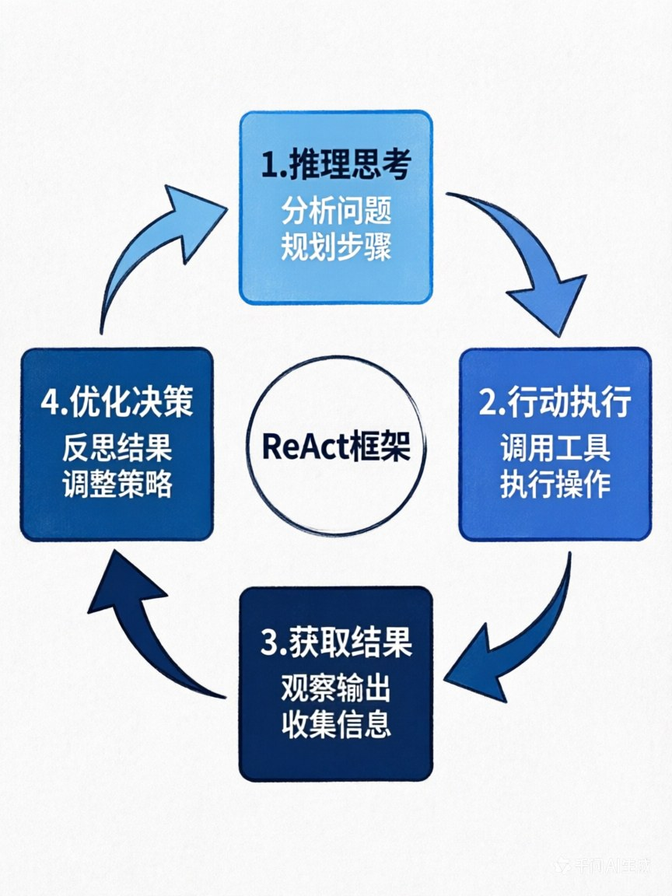
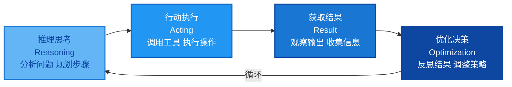
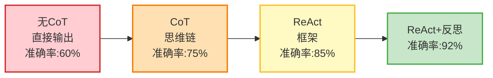

# 第五章：LLM如何当Agent的"决策大脑"？—— 自然语言驱动的智能核心

> **章节核心目标**
>
> 搞懂LLM在Agent中的核心作用，掌握Agent决策的核心范式，理解Prompt Engineering、CoT、ReAct、反思机制在决策中的作用，建立对Agent决策机制的完整认知。

---

## 开篇思考：LLM在Agent里，到底在干什么？

让我们先做一个小测试。

**场景：你对Agent说："帮我安排下周去上海的差旅。"**

你可能认为：LLM的作用是"回答问题"、"生成文案"。

**这是新手最大的认知误区。**

**在Agent里，LLM的核心作用不是"文本生成器"，而是"调度决策中枢"。**

**这一章，我们会彻底搞懂LLM是怎么当Agent的"大脑"的。**

---

## 一、核心定位：LLM是"调度决策中枢"，不是"文本生成器"

### ❌ 错误认知：LLM = 文本生成器

很多人认为LLM在Agent里的作用是：
- 回答用户问题
- 生成文案
- 写代码

**这是不完整的。**

### ✅ 正确认知：LLM = 调度决策中枢

**在Agent里，LLM的核心作用是：**

1. **理解目标**：理解用户的最终目标，不是简单的文本理解
2. **拆解任务**：把大目标拆解成可执行的小步骤
3. **逻辑推理**：分析每一步该做什么，为什么这么做
4. **调度工具**：决定调用哪个工具、怎么调用、调用顺序
5. **验证结果**：判断执行结果是否正确、是否完成目标
6. **优化迭代**：根据反馈优化后续的决策和行动

### 🌟 案例：差旅Agent里的LLM

**你可能认为：LLM会去查机票、订酒店。**

**错！LLM不会做这些具体的操作。**

**LLM真正做的是："指挥"。**

**用户说："帮我安排下周去上海的差旅，预算3000以内，要靠近会场。"**

**LLM的决策过程：**

1. **理解目标**：用户要"安排差旅"，约束条件是"上海、预算3000、靠近会场"
2. **拆解任务**：
   - 第1步：查会场地址
   - 第2步：查往返机票
   - 第3步：查附近酒店
   - 第4步：筛选符合预算的酒店
   - 第5步：核算总费用
   - 第6步：下单预订
   - 第7步：同步日历
   - 第8步：设置提醒

3. **决策调用工具**：
   - 查会场 → 调用search_engine工具
   - 查机票 → 调用flight_api工具
   - 查酒店 → 调用hotel_api工具
   - 同步日历 → 调用calendar_api工具

4. **优化决策**：
   - 查到机票1200元，酒店500元/晚
   - 核算：1200 + 500×2 = 2200元，符合预算
   - 决策：选择这个方案

5. **完成目标并通知用户**

**整个过程中，LLM没有"做"任何具体操作，它只是在"决策"和"指挥"。**

**LLM是整个Agent的"总指挥"，而不是"执行者"。**

---

## 二、决策的基础：Prompt Engineering —— 给大脑定好规则

### 🎯 Prompt在Agent中的核心作用

**大白话解释：**
**Prompt = 给LLM明确的"规则书"，让它知道"该做什么、不该做什么、该怎么输出"。**

**没有Prompt的LLM**：就像一个没有培训的新员工，不知道该干什么，干得五花八门。

**有Prompt的LLM**：就像一个培训合格的员工，清楚自己的职责、工作流程、输出标准。

### 📋 Agent专用Prompt的4个核心要素

#### 要素1：角色定义（Role）

**明确Agent的身份和核心目标**

**示例：**
```
你是一个专业的差旅规划助理。

你的核心目标是：
- 帮助用户高效、经济地安排差旅
- 确保差旅安排符合用户的所有约束条件
- 提供超出用户预期的服务体验
```

**核心要点：**
- 身份要明确："你是XX助理"
- 目标要清晰："你的核心目标是XX"
- 不要含糊不清

---

#### 要素2：行为规则（Behavior Rules）

**明确Agent的执行逻辑、决策原则**

**示例：**
```
执行规则：
1. 收到差旅需求后，必须先拆解任务：
   - 查会场地址 → 查往返机票 → 查附近酒店 → 核算预算 → 预订 → 同步日历

2. 优先选择符合用户偏好的酒店：
   - 参考用户的历史订单
   - 避开用户不喜欢的酒店
   - 优先选择靠近会场的酒店

3. 预算严格控制：
   - 总费用不能超过用户设定的上限
   - 如果超出预算，必须优化方案，不能直接下单

4. 每完成一步，都要向用户汇报进度
```

**核心要点：**
- 规则要具体：不要说"要做得好"，要说"优先选择XX"
- 规则要可执行：每条规则都能落地
- 规则要有约束：明确"必须XX"、"禁止XX"

---

#### 要素3：输出格式（Output Format）

**强制LLM按照固定格式输出，方便程序解析**

**示例：**
```
输出格式（必须是JSON格式）：
{
  "thought": "你的思考过程",
  "action": "要执行的操作（search_flight/book_hotel等）",
  "params": {
    "参数名": "参数值"
  }
}

示例输出：
{
  "thought": "用户要查北京到上海的机票，我需要调用flight_api工具",
  "action": "search_flight",
  "params": {
    "from": "北京",
    "to": "上海",
    "date": "2025-04-10"
  }
}
```

**核心要点：**
- 格式要固定：JSON、XML等结构化格式
- 字段要明确：thought、action、params等
- 示例要提供：给LLM一个参考

---

#### 要素4：限制条件（Constraints）

**明确禁止的行为**

**示例：**
```
禁止事项：
1. 禁止编造信息：
   - 不确定的信息，直接说"不知道"
   - 不要编造机票价格、酒店信息

2. 禁止跳过任务拆解步骤：
   - 必须一步步执行，不能直接跳到预订
   - 每一步都要思考并输出

3. 禁止超过用户设定的预算：
   - 任何方案都不能超出预算上限
   - 如果超出，必须优化方案

4. 禁止调用未授权的工具：
   - 只能调用已定义的工具
   - 不能自己创造新工具
```

**核心要点：**
- 明确"禁止XX"，而不是"尽量不XX"
- 禁止的事项要具体，不要模糊
- 给出替代方案："如果XX，应该YY"

---

### 📝 极简Agent Prompt模板（可直接复制使用）

```
# 角色定义
你是一个{角色名称，如：差旅规划助理}。

# 核心目标
{核心目标，如：帮助用户高效、经济地安排差旅}

# 行为规则
1. {规则1}
2. {规则2}
3. {规则3}

# 输出格式
{输出格式要求，如：必须输出JSON格式，包含thought/action/params字段}

# 禁止事项
1. 禁止编造信息
2. 禁止跳过步骤
3. 禁止{其他禁止事项}

# 可用工具
{可用工具列表，如：search_flight, book_hotel, sync_calendar}
```

**这个模板，新手拿来就能用，只需要替换{xxx}部分。**

---

## 三、决策的核心能力：思维链（CoT）—— 让大脑学会"一步步思考"

### 🎯 什么是CoT？

**CoT = Chain of Thought，思维链**

**大白话解释：**
**让LLM把思考过程一步步写出来，而不是直接给答案。**

**就像人做数学题，先写解题步骤，再给答案。**

---

### ❌ 没有CoT的问题

**用户说："帮我订一杯咖啡"**

**LLM直接回答："好的"**

**问题：**
- 跳过了很多步骤
- 没有考虑用户的口味、地址、预算
- 信息收集不足
- **直接执行，容易出错**

---

### ✅ 有CoT的好处

**LLM一步步思考：**

1. **思考**：用户要订咖啡，我需要先知道：
   - 用户喜欢什么口味？（拿铁、美式、卡布奇诺？）
   - 送到哪里？（公司、家里？）
   - 预算是多少？
   - 要什么规格？（大杯、中杯、小杯？）

2. **决策**：我应该先询问用户这些信息

3. **LLM回答**："好的，为了帮你订一杯满意的咖啡，我需要先了解几个问题：
   - 你喜欢什么口味？
   - 送到哪里？
   - 预算是多少？"

**好处：**
- 任务拆解更清晰
- 不会跳步执行
- 决策更准确
- 方便我们排查问题（能看到LLM的思考过程）

---

### 🌟 CoT在Agent中的核心作用

#### 作用1：避免LLM跳步执行

**没有CoT：**
- 用户："帮我订咖啡"
- LLM直接调用外卖API下单
- 结果：订错了（用户不喜欢喝美式）

**有CoT：**
- LLM思考："我需要先知道用户的口味偏好"
- LLM询问："你喜欢什么口味？"
- 结果：避免错误

---

#### 作用2：避免决策错误

**没有CoT：**
- LLM直接决策调用工具A
- 结果：工具A不合适，任务失败

**有CoT：**
- LLM思考："用户要XX，我有工具A、B、C，工具A最适合"
- LLM决策：调用工具A
- 结果：决策准确

---

#### 作用3：任务拆解更清晰

**没有CoT：**
- LLM一次性尝试完成所有任务
- 结果：任务混乱，容易出错

**有CoT：**
- LLM思考："这个任务要分3步：第1步XX，第2步YY，第3步ZZ"
- LLM一步步执行
- 结果：任务清晰，成功率更高

---

#### 作用4：方便排查问题

**没有CoT：**
- Agent执行失败
- 你不知道为什么失败
- **调试困难**

**有CoT：**
- Agent执行失败
- 你能看到完整的思考过程
- 能快速定位问题出在哪个环节
- **调试容易**

---

### 📝 CoT的简单实现方法

**方法1：在Prompt中明确要求**
```
输出你的思考过程，必须包含：
1. 你理解的目标是什么
2. 你计划如何完成
3. 每一步的决策理由
```

**方法2：提供示例**
```
示例思考过程：
用户说："帮我查天气"
思考：
- 目标：查天气
- 需要的信息：城市、日期
- 决策：调用weather_api工具
- 参数：city="北京", date="今天"
```

**方法3：强制格式化输出**
```
输出格式：
thought: 你的思考过程
action: 要执行的操作
params: 参数
```

---

## 四、Agent决策的灵魂：ReAct框架 —— 推理+行动的完美闭环

### 🎯 什么是ReAct框架？

**ReAct = Reasoning（推理思考）+ Acting（行动执行）**

**这是当前90%以上商用Agent的核心决策范式。**

**核心思想：先思考要做什么，再执行动作，拿到结果后再思考下一步，循环直到完成目标。**

---

### 🔄 ReAct的完整循环流程

```
思考目标 → 拆解步骤 → 决定调用的工具 → 执行行动 → 拿到结果 → 验证结果 → 思考下一步 → 循环直到完成
```

---

### 🌟 案例：天气查询Agent的ReAct循环

**用户说："北京今天天气怎么样？"**

---

#### **第1轮：推理 → 行动 → 结果**

**🧠 推理（Reasoning）：**
- 用户想查北京今天的天气
- 我需要调用天气API获取实时信息
- 我选择调用get_weather工具
- 参数是city="北京"

**🦶 行动（Acting）：**
- 调用get_weather(city="北京")

**📊 结果：**
- API返回：{"city": "北京", "weather": "晴天", "temp_min": 18, "temp_max": 26}

---

#### **第2轮：推理 → 完成**

**🧠 推理（Reasoning）：**
- 我已经拿到了北京的天气信息
- 信息包括：晴天、气温18-26度
- 任务已经完成
- 我应该把这个结果告诉用户

**🦶 行动（Acting）：**
- 生成回答："北京今天晴天，气温18-26度，天气不错！"

**✅ 任务完成！**

---

### 📊 ReAct框架的核心价值

| 价值维度 | 具体含义 | 为什么重要 |
|:---|:---|:---|
| **1. 推理透明** | 能看到Agent的完整思考过程 | 没有黑箱，可信任 |
| **2. 行动可控** | 每一步行动都基于推理 | 不会乱调用工具 |
| **3. 结果可验证** | 每次行动后都验证结果 | 确保每一步都正确 |
| **4. 闭环优化** | 根据结果反馈，优化下一步决策 | 持续迭代，直到完成 |

---

### 🌟 复杂案例：差旅Agent的ReAct循环

**用户说："帮我安排下周去上海的差旅，预算3000以内。"**

---

#### **第1轮：推理 → 行动 → 结果**

**🧠 推理：**
- 目标：安排上海差旅
- 约束：预算3000以内
- 第1步：查会场地址
- 决策：调用search_engine工具

**🦶 行动：**
- 调用search_engine("上海XX大会会场地址")

**📊 结果：**
- 返回："上海市浦东新区XX路XX号"

---

#### **第2轮：推理 → 行动 → 结果**

**🧠 推理：**
- 已知会场地址
- 第2步：查往返机票
- 决策：调用flight_api工具

**🦶 行动：**
- 调用flight_api(from="北京", to="上海", date="2025-04-10")

**📊 结果：**
- 返回：多个航班，最便宜的1200元

---

#### **第3轮：推理 → 行动 → 结果**

**🧠 推理：**
- 机票1200元
- 预算3000，剩余1800元
- 第3步：查会场附近酒店
- 决策：调用hotel_api工具

**🦶 行动：**
- 调用hotel_api(location="上海市浦东新区XX路", budget=1800)

**📊 结果：**
- 返回：多个酒店，推荐XX酒店500元/晚，离会场1公里

---

#### **第4轮：推理 → 行动 → 结果**

**🧠 推理：**
- 机票1200元，酒店500元/晚
- 核算：1200 + 500×2 = 2200元，符合预算
- 第4步：下单预订
- 决策：调用booking_api工具

**🦶 行动：**
- 调用booking_api(book_hotel=True, book_flight=True)

**📊 结果：**
- 返回："预订成功"

---

#### **第5轮：推理 → 完成**

**🧠 推理：**
- 酒店和机票都预订成功
- 总费用2200元，符合预算
- 任务完成
- 应该通知用户

**🦶 行动：**
- 通知用户："已经帮你订好了上海XX酒店（离会场1公里）和往返机票，总费用2200元，已同步到你的日历。"

**✅ 任务完成！**

---

### 💡 ReAct框架的实现要点

**要点1：每次推理都要输出**
- 让LLM输出"thought"字段
- 方便调试和优化

**要点2：推理和行动分离**
- 先推理，再行动
- 不要混在一起

**要点3：每次行动后都要验证结果**
- 检查返回结果是否正确
- 判断任务是否完成

**要点4：未完成任务时继续循环**
- 任务没完成，继续推理→行动
- 直到任务完成

---

## 五、决策的进阶能力：反思/自我优化机制 —— 让大脑学会"复盘优化"

### 🎯 什么是反思机制？

**大白话解释：**
**反思机制 = 让Agent完成一轮行动后，自主复盘"哪里做得不好、为什么出错、该怎么优化"。**

**就像人做完项目写复盘一样。**

---

### ❌ 没有反思机制的问题

**场景：Agent订酒店**

**第1轮：**
- Agent调用XX酒店API
- API返回："酒店已满房"
- Agent反复调用XX酒店API
- **陷入死循环，任务失败**

**问题分析：**
- Agent不知道为什么失败
- Agent不会优化决策
- Agent不会尝试其他方案
- **陷入无限循环**

---

### ✅ 有反思机制的好处

**第1轮：**
- Agent调用XX酒店API
- API返回："酒店已满房"
- **反思：**
  - 失败原因：XX酒店已满房
  - 问题分析：继续调用XX酒店API没有意义
  - 优化方案：更换同价位、同距离的其他酒店
- **优化决策：**调用YY酒店API（同价位、同距离）

**第2轮：**
- Agent调用YY酒店API
- API返回："预订成功"
- **任务完成！**

---

### 🌟 反思机制的核心作用

#### 作用1：解决幻觉问题

**幻觉示例：**
- Agent说："XX酒店预订成功"
- 实际上：预订失败

**没有反思：**
- Agent不知道自己说错了
- 继续执行后续任务
- **错误持续**

**有反思：**
- Agent反思："我说预订成功，但API返回的是失败，我错了"
- Agent纠正："抱歉，预订失败，我重新尝试"
- **错误被纠正**

---

#### 作用2：解决无限循环问题

**无限循环示例：**
- Agent反复调用同一个失败的API
- 无法跳出

**没有反思：**
- Agent不知道为什么失败
- 继续重复同样的动作
- **死循环**

**有反思：**
- Agent反思："我已经失败了3次，同样的方法再试也没用"
- Agent优化："我应该尝试其他方法"
- **跳出循环**

---

#### 作用3：解决任务偏离问题

**任务偏离示例：**
- 用户目标：订咖啡
- Agent中途开始查天气
- **任务偏离**

**没有反思：**
- Agent不知道自己偏离了目标
- 继续做无关的事情
- **任务失败**

**有反思：**
- Agent反思："我的目标是订咖啡，为什么在查天气？"
- Agent纠正："我应该回到订咖啡的任务"
- **回到正轨**

---

### 📝 反思机制的实现方法

**方法1：在Prompt中明确要求**
```
每执行完一步行动后，必须反思：
1. 这一步是否成功？
2. 如果失败，失败原因是什么？
3. 下一步应该如何优化？
```

**方法2：强制输出反思内容**
```
输出格式：
{
  "thought": "思考过程",
  "action": "执行的操作",
  "result": "执行结果",
  "reflection": "反思内容",
  "next_step": "下一步计划"
}
```

**方法3：设置反思触发条件**
```
以下情况必须触发反思：
1. 工具调用失败
2. 连续3步没有进展
3. 任务执行超过10步
4. 出现异常情况
```

---

### 🌟 完整案例：带反思的Agent

**用户说："帮我订一家今晚的酒店。"**

---

#### **第1轮：推理 → 行动 → 反思**

**🧠 推理：**
- 目标：订今晚的酒店
- 第1步：查询酒店
- 决策：调用hotel_api工具

**🦶 行动：**
- 调用hotel_api(date="今晚")

**📊 结果：**
- 返回："找不到可用酒店"

**🤔 反思：**
- 失败原因：今晚的酒店都满了
- 问题分析：我的查询范围太小
- 优化方案：扩大查询范围，包括郊区酒店

---

#### **第2轮：推理 → 行动 → 反思**

**🧠 推理：**
- 根据反思，扩大查询范围
- 决策：调用hotel_api工具，增加郊区选项

**🦶 行动：**
- 调用hotel_api(date="今晚", include_suburbs=True)

**📊 结果：**
- 返回："找到XX酒店，位于郊区，价格300元"

**🤔 反思：**
- 这次成功了
- 但是郊区酒店可能不方便
- 应该告诉用户情况，让用户选择

---

#### **第3轮：推理 → 完成**

**🧠 推理：**
- 找到酒店了，但是郊区酒店
- 应该告诉用户，让用户决定
- 决策：生成回复

**🦶 行动：**
- 生成回复："市区的酒店今晚都满了，我找到一家郊区酒店，价格300元，离市区约10公里。需要预订吗？"

**✅ 任务完成！**

---

### 💡 反思机制的核心要点

**要点1：反思要基于真实结果**
- 不要凭空反思
- 基于API返回结果、执行状态

**要点2：反思要给出优化方案**
- 不要只说"失败了"
- 要说"失败原因是XX，应该YY"

**要点3：反思要触发优化决策**
- 反思不是结束
- 反思后要优化下一步决策

**要点4：反思要适度**
- 不是每步都需要反思
- 失败、异常、长时间无进展时才反思

---

## 六、新手避坑：不同LLM对Agent的适配性差异

### 🎯 核心结论

**闭源大模型（GPT-4、豆包4.0、通义千问）的工具调用、推理、决策能力，远强于多数开源小模型。**

**新手入门优先用闭源模型的免费额度，降低门槛。**

---

### 📋 新手入门首选的LLM列表

| 模型 | 免费额度 | 申请入口 | 核心优势 | 适配场景 | 推荐指数 |
|:---|:---|:---|:---|:---|:---|
| **豆包大模型** | 每日免费额度 | [字节云](https://www.volcengine.com/) | 中文友好、工具调用强 | 新手入门首选 | ⭐⭐⭐⭐⭐ |
| **通义千问** | 每日免费额度 | [阿里云](https://www.aliyun.com/) | 中文理解能力强 | 中文场景 | ⭐⭐⭐⭐⭐ |
| **文心一言** | 每日免费额度 | [百度智能云](https://cloud.baidu.com/) | 中文知识丰富 | 中文知识问答 | ⭐⭐⭐⭐ |
| **智谱GLM** | 每日免费额度 | [智谱AI](https://open.bigmodel.cn/) | 开源友好、代码强 | 代码生成 | ⭐⭐⭐⭐ |
| **Kimi** | 每日免费额度 | [Moonshot AI](https://www.moonshot.cn/) | 长文本能力强 | 长文档处理 | ⭐⭐⭐⭐ |

---

### 🚨 新手避坑指南

**坑1：一开始就折腾本地开源模型**
- 问题：部署复杂、维护成本高、性能参差不齐
- 建议：先用闭源模型的免费API，熟悉了再尝试本地模型

**坑2：选择太小的模型**
- 问题：7B以下的小模型，工具调用、推理能力有限
- 建议：新手优先用大模型（如GPT-4、豆包4.0）

**坑3：过度关注模型参数**
- 问题：参数大小不等于实际效果
- 建议：关注模型的工具调用、推理能力，而不是参数量

**坑4：忽视免费额度**
- 问题：很多闭源模型都有免费额度，新手不知道
- 建议：充分利用免费额度，降低学习成本

---

### 📊 不同LLM的能力对比

| 能力维度 | GPT-4 | 豆包4.0 | 通义千问 | 7B开源模型 | 13B开源模型 |
|:---|:---|:---|:---|:---|:---|
| **工具调用** | ⭐⭐⭐⭐⭐ | ⭐⭐⭐⭐⭐ | ⭐⭐⭐⭐ | ⭐⭐ | ⭐⭐⭐ |
| **推理能力** | ⭐⭐⭐⭐⭐ | ⭐⭐⭐⭐ | ⭐⭐⭐⭐ | ⭐⭐ | ⭐⭐⭐ |
| **中文理解** | ⭐⭐⭐⭐ | ⭐⭐⭐⭐⭐ | ⭐⭐⭐⭐⭐ | ⭐⭐⭐ | ⭐⭐⭐⭐ |
| **成本** | 高 | 低（有免费） | 低（有免费） | 低 | 低 |
| **部署难度** | 无需部署 | 无需部署 | 无需部署 | 中 | 中 |

**建议：**
- 新手入门：豆包4.0、通义千问（免费、中文友好）
- 进阶开发：GPT-4（能力强，稳定）
- 特殊需求：本地部署的开源模型（隐私要求高）

---

## 七、本章核心小结

### ✅ 核心结论

1. **LLM在Agent里的核心定位**：是"调度决策中枢"，不是"文本生成器"，核心作用是理解目标、拆解任务、逻辑推理、调度工具、验证结果、优化迭代

2. **Prompt Engineering**：给LLM明确的规则，4个核心要素是：
   - 角色定义：明确Agent的身份和核心目标
   - 行为规则：明确Agent的执行逻辑、决策原则
   - 输出格式：强制LLM按照固定格式输出，方便程序解析
   - 限制条件：明确禁止的行为

3. **思维链（CoT）**：让LLM把思考过程一步步写出来，而不是直接给答案，核心价值是：
   - 避免LLM跳步执行
   - 避免决策错误
   - 任务拆解更清晰
   - 方便排查问题

4. **ReAct框架**：当前Agent最主流的决策范式，核心是"推理→行动"的循环：
   - 思考要做什么
   - 执行动作
   - 拿到结果
   - 思考下一步
   - 循环直到完成

5. **反思机制**：让Agent完成一轮行动后，自主复盘哪里做得不好、怎么优化，解决：
   - 幻觉问题
   - 无限循环问题
   - 任务偏离问题

6. **LLM选型**：新手优先用闭源大模型的免费额度（如豆包4.0、通义千问），不要一开始就折腾本地开源模型

---

## 八、下章预告

**前五章，我们搞懂了Agent的核心概念、进化历史、三大支柱、完整架构、决策机制。**

**现在你应该理解了：**
- Agent是什么，不是什么
- Agent怎么进化来的
- Agent的三大支柱如何协作
- Agent的完整架构设计
- LLM怎么当Agent的"决策大脑"

**但还有一个核心问题：**
- Agent为什么会"健忘"？
- 怎么让Agent记住你的偏好、历史数据？
- 向量数据库是什么？
- RAG和Agent记忆是什么关系？

**下一章，我们会拆解Agent的记忆系统，搞懂短期记忆、长期记忆和向量数据库的秘密。**

---

## 📊 配图说明

**图1：ReAct框架循环流程图**




*展示"推理→行动→结果→验证→再推理"的完整循环*

**图2：决策能力对比图**

*对比"无CoT直接输出"、"CoT思维链"、"ReAct框架"、"带反思的ReAct"的决策准确率、任务完成率*

**图3：反思机制工作流程图**

*展示Agent如何通过反思机制优化决策*

---

> **💡 学习小贴士**
>
> - 这一章的核心是**理解LLM的决策机制**，重点掌握ReAct框架
> - Prompt Engineering是Agent开发的基础，要多练习
> - CoT和反思机制是提升Agent准确率的关键，一定要理解
> - 新手不要纠结模型选择，先用免费闭源模型，熟悉了再尝试其他
>
> **下一章：[Agent的"记忆"秘密：如何让智能体"不健忘、有经验"](./06-第六章-Agent的记忆秘密.md)**
