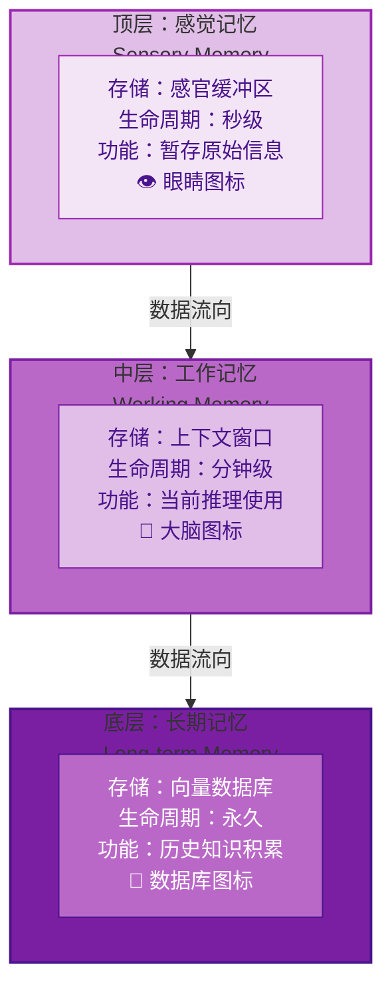
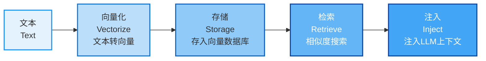
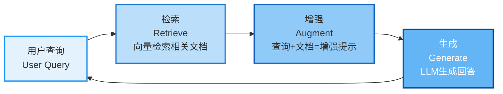

# 第六章：Agent的"记忆"秘密—— 如何让智能体"不健忘、有经验"

> **章节核心目标**
>
> 搞懂Agent的完整记忆体系，区分三类记忆的作用，理解向量数据库和RAG在记忆中的应用，掌握记忆优化的实用技巧，解决Agent"健忘"的核心问题。

---

## 开篇思考：为什么你的Agent总是"健忘"？

你有没有遇到过这些情况：

**情况1：**
- 你跟Agent说过"自己对芒果过敏"
- 后面Agent推荐了芒果蛋糕
- **它完全忘了你说过的话**

**情况2：**
- 你让Agent做一个复杂任务
- 做到一半，Agent忘了最初的目标
- **开始做无关的事情**

**情况3：**
- 你跟Agent聊了很久
- 突然Agent说："对不起，我不记得之前的内容了"
- **对话太长，它"失忆"了**

**这些问题的核心原因：记忆系统没做好。**

**这一章，我们会彻底搞懂Agent的记忆系统，让Agent"不健忘、有经验"。**

---

## 一、为什么你的Agent总是"健忘"？

### 🎯 核心原因：记忆系统设计缺陷

**原因1：只用瞬时记忆，不用长期记忆**
- 所有信息都存在LLM的上下文窗口里
- 上下文满了，前面的内容就被丢弃
- **Agent"失忆"**

**原因2：记忆没分类存储**
- 用户偏好、任务中间数据、历史对话混在一起
- 调取效率低
- **Agent"记不住重点"**

**原因3：记忆没有摘要优化**
- 所有内容都原样存储，包括无关信息
- 无效记忆干扰决策
- **Agent"记性差"**

**原因4：记忆没有权重排序**
- 所有记忆同等对待
- 高频使用的核心记忆没有被优先调取
- **Agent"记不住重点"**

---

### 🌟 案例：客服Agent的"健忘"问题

**场景：用户咨询客服**

**第1轮对话：**
- 用户："我对芒果过敏，你们的产品含芒果吗？"
- Agent："我们的产品不含芒果，您可以放心使用。"
- **Agent应该记住：用户对芒果过敏**

**第5轮对话（2小时后）：**
- 用户："你们的芒果味蛋糕怎么样？"
- Agent："我们的芒果味蛋糕很好吃，强烈推荐！"
- **❌ 糟糕！Agent忘了用户对芒果过敏！**

**问题分析：**
- Agent没有长期记忆系统
- "用户对芒果过敏"这个关键信息，2小时后就被遗忘了
- **这是严重的记忆系统设计缺陷**

---

## 二、Agent的记忆体系：对应人类认知的三类记忆

为了让你彻底理解Agent的记忆系统，我用人类的记忆模型来类比。

### 📊 Agent的三类记忆

| 记忆类型 | 对应人类记忆 | 存储载体 | 生命周期 | 核心作用 | 典型场景 |
|:---|:---|:---|:---|:---|:---|
| **瞬时记忆** | 感觉记忆 | LLM上下文窗口 | 本轮对话 | 临时存储对话内容 | 当前对话的内容 |
| **工作记忆** | 工作记忆 | Agent内部存储 | 当前任务 | 存储任务中间状态 | 查到的机票价格、用户的预算限制 |
| **长期记忆** | 长期记忆 | 向量数据库 | 永久 | 存储核心数据 | 用户偏好、历史订单、专属知识库 |

---

### 🧠 记忆类型1：瞬时记忆（对应LLM上下文窗口）

#### 核心作用
存储本轮对话的临时内容，包括用户输入、Agent回复、工具返回结果。

#### 存储载体
**LLM的上下文窗口（Context Window）**

#### 生命周期
**本轮对话**：对话结束后，这些内容就会被丢弃（除非被转移到长期记忆）

#### 容量限制
- **不同模型的容量不同**：
  - GPT-3.5：约4000 tokens
  - GPT-4：约8000 tokens
  - Claude 2：约100000 tokens
  - 豆包4.0：约32000 tokens
- **一旦超出容量，前面的内容就会被"遗忘"**

#### 典型场景
**你和Agent的对话：**
```
用户：我明天要去上海出差
Agent：好的，需要我帮你安排吗？
用户：帮我订一张去上海的机票
Agent：好的，请问明天什么时间出发？
...
（对话继续，内容不断添加到上下文窗口）
...
（对话太长，超过了上下文窗口大小）
...
（最早的对话内容被丢弃）
Agent：对不起，您刚才说要出差去哪里？
（Agent"失忆"了）
```

#### 核心特点
- ✅ 快速读写：实时存储和调取
- ✅ 无需额外设计：LLM自带能力
- ❌ 容量有限：对话长了会溢出
- ❌ 临时存储：对话结束就丢失

---

### 🧠 记忆类型2：工作记忆（对应任务临时存储）

#### 核心作用
存储当前任务的拆解步骤、中间执行结果、临时状态，供任务执行过程中随时调取。

#### 存储载体
**Agent内部存储（可以是内存、临时文件、Redis等）**

#### 生命周期
**当前任务**：任务完成后可以清理，也可以摘要后转移到长期记忆

#### 典型场景
**差旅Agent的工作记忆：**

**任务：安排上海差旅**

**工作记忆存储的内容：**
```
{
  "task_id": "task_20250410_001",
  "user_goal": "安排上海差旅",
  "constraints": {
    "budget": 3000,
    "location": "靠近会场"
  },
  "task_steps": [
    {"step": 1, "action": "查会场地址", "status": "completed", "result": "上海市浦东新区XX路"},
    {"step": 2, "action": "查机票", "status": "in_progress", "result": "1200元"},
    {"step": 3, "action": "查酒店", "status": "pending"},
    {"step": 4, "action": "核算预算", "status": "pending"},
    {"step": 5, "action": "预订", "status": "pending"}
  ],
  "intermediate_data": {
    "flight_price": 1200,
    "hotel_options": [...],
    "remaining_budget": 1800
  }
}
```

**这些数据在任务执行过程中被频繁调取：**
- 决策下一步时：查看task_steps，知道当前进度
- 核算预算时：调取intermediate_data里的机票价格
- 选择酒店时：调取constraints里的预算限制

#### 核心特点
- ✅ 任务专用：只存储当前任务相关的数据
- ✅ 高频读写：任务执行过程中频繁调取
- ✅ 可清理：任务完成后可以清理
- ❌ 临时存储：不转移到长期记忆就会丢失

---

### 🧠 记忆类型3：长期记忆（对应向量数据库）

#### 核心作用
永久存储用户偏好、历史行为、专属知识库、历史任务经验，随时可以调取。

#### 存储载体
**向量数据库（Vector Database）**

#### 生命周期
**永久**：除非手动删除，否则永久存储

#### 典型场景
**差旅Agent的长期记忆：**

**存储的内容：**
```
用户ID：user_12345

用户偏好：
- 喜欢的酒店：靠近会场、评分4.5以上、价格500元以内
- 不喜欢的酒店：XX酒店（上次体验不好，房间吵）
- 座位偏好：靠窗座位
- 出行习惯：尽量上午出发

历史订单：
- 2025-03-01：北京→上海，XX酒店，2晚，费用2200元
- 2025-02-15：北京→深圳，YY酒店，3晚，费用3500元
- ...

专属知识库：
- 用户常去的会场列表（地址、交通、附近酒店）
- 用户的常用出行方案
...
```

**这些数据永久存储，每次任务都能调取：**
- 新任务开始时：调取用户偏好，个性化推荐
- 选择酒店时：避开用户不喜欢的酒店
- 推荐方案时：参考历史订单，推荐类似方案

#### 核心特点
- ✅ 永久存储：不会丢失
- ✅ 个性化：存储用户专属数据
- ✅ 可扩展：容量无上限
- ✅ 高效检索：向量相似度搜索，快速找到相关记忆
- ⚠️ 需要设计：需要设计存储结构、检索策略

---

## 三、核心认知：向量数据库—— 长期记忆的"存储仓库"

### 🎯 什么是向量数据库？

**大白话解释：**
**向量数据库 = 专门用来存储"向量"（文本转成的数字编码）的数据库，能快速检索最相关的内容。**

**为什么需要向量数据库？**

**问题1：文本怎么存进数据库？**
- 传统数据库：按关键词存储，比如"用户偏好：喜欢靠窗座位"
- 问题：无法理解语义，比如"用户喜欢靠窗"和"用户偏好靠窗座位"是同一个意思，但关键词不同，检索不到

**问题2：怎么快速找到相关的内容？**
- 传统数据库：只能精确匹配关键词
- 问题：用户问"我喜欢什么座位？"，数据库存的是"座位偏好：靠窗"，关键词对不上，检索不到

**向量数据库的解决方案：**
- 把文本转换成向量（数字编码）
- 相似的文本，向量距离近
- 通过计算向量距离，快速找到最相关的内容

---

### 🔄 向量数据库的工作原理

**步骤1：文本向量化**
```
文本："用户喜欢靠窗座位"
↓ （通过Embedding模型）
向量：[0.12, -0.34, 0.56, ..., 0.78] （一个512维的数字数组）
```

**步骤2：存储向量**
```
向量数据库存储：
{
  "id": "memory_001",
  "text": "用户喜欢靠窗座位",
  "vector": [0.12, -0.34, 0.56, ..., 0.78],
  "metadata": {
    "user_id": "user_12345",
    "type": "preference",
    "created_at": "2025-03-01"
  }
}
```

**步骤3：检索相似内容**
```
用户问："我喜欢什么座位？"
↓ （转换成向量）
查询向量：[0.11, -0.33, 0.55, ..., 0.77]
↓ （计算向量距离）
最相关的记忆：
1. "用户喜欢靠窗座位"（距离：0.02）
2. "用户偏好靠窗座位"（距离：0.03）
3. "用户喜欢窗边"（距离：0.05）
```

---

### 📋 主流向量数据库对比

| 数据库 | 类型 | 核心优势 | 适用场景 | 新手友好度 | 成本 |
|:---|:---|:---|:---|:---|:---|
| **Chroma** | 本地轻量型 | 无需部署、易用 | 新手入门、本地开发 | ⭐⭐⭐⭐⭐ | 免费 |
| **Pinecone** | 云端托管型 | 无需运维、性能强 | 商用场景、生产环境 | ⭐⭐⭐⭐ | 按量付费 |
| **Milvus** | 开源企业级 | 性能强、功能全 | 大规模数据场景 | ⭐⭐⭐ | 免费（需自己部署） |
| **Weaviate** | 开源云原生 | 多模态支持 | 图片、视频等多模态场景 | ⭐⭐⭐ | 免费（需自己部署） |

**新手推荐：**
- 入门学习：用**Chroma**，无需部署，pip install就能用
- 商用部署：用**Pinecone**，无需运维，按量付费
- 企业级：用**Milvus**，性能强，开源免费

---

### 🌟 案例：向量数据库在Agent中的应用

**场景：客服Agent**

**问题：**
- 用户问："你们的产品含芒果吗？"
- 知识库里有一万条产品信息
- 怎么快速找到相关信息？

**没有向量数据库：**
```
1. 用关键词搜索："产品 芒果"
2. 搜索结果：
   - "我们的产品不含芒果"（未匹配，因为关键词对不上）
   - "产品配料表：不含芒果成分"（未匹配）
   - "产品成分：芒果香精"（匹配错误，这是含芒果的）
3. 结果：搜索不准确，甚至给错误答案
```

**有向量数据库：**
```
1. 用户问题："你们的产品含芒果吗？" → 转换成向量
2. 向量数据库检索最相关的产品信息：
   - "我们的产品不含芒果，您可以放心使用"（相似度：0.95）
   - "产品配料表：不含芒果成分"（相似度：0.92）
   - "产品成分：芒果香精"（相似度：0.15，排除）
3. 结果：准确找到相关信息，答案正确
```

**核心价值：**
- 不依赖精确关键词匹配
- 理解语义相似度
- 检索更准确

---

## 四、认知纠偏：RAG和Agent记忆的关系

### 🎯 核心结论

**RAG（检索增强生成）是Agent长期记忆的核心实现方式，而不是和记忆并列的概念。**

---

### ❌ 错误认知

很多人认为：
- RAG和记忆是两个独立的概念
- RAG是一种技术，记忆是另一种技术
- Agent可以有记忆，也可以没有RAG

**这是错误的。**

---

### ✅ 正确认知

**大白话解释RAG在Agent中的作用：**

```
RAG = 把外部的专属知识库（比如公司文档、产品手册、用户历史数据）
    → 存入向量数据库
    → Agent需要的时候，检索出最相关的内容
    → 注入到LLM的上下文里
    → 让Agent能用到这些外部知识
    → 解决幻觉、知识过时、健忘的问题
```

**RAG是Agent长期记忆的核心实现方式。**

---

### 🌟 案例：RAG在客服Agent中的应用

**场景：客服Agent回答用户问题**

**没有RAG：**
```
用户："你们的产品支持退款吗？"
LLM：（根据自己的训练数据回答）
"我们的产品支持退款，7天内无理由退款。"
❌ 问题是：这个公司实际的政策是"不支持退款"，LLM回答错了（幻觉）
```

**有RAG：**
```
用户："你们的产品支持退款吗？"
Agent：
1. 检索向量数据库：
   - 查询："产品 退款 政策"
   - 找到相关文档："售后政策：本产品不支持退款，请您在下单前仔细考虑"
2. 把检索结果注入LLM上下文
3. LLM基于检索结果回答：
   "根据我们的售后政策，本产品不支持退款，请您在下单前仔细考虑。"
✅ 答案准确，基于真实知识库
```

**核心价值：**
- 解决幻觉：LLM基于真实知识库回答，不编造
- 解决知识过时：知识库可以实时更新，LLM的知识永远是新的
- 解决健忘：知识库永久存储，不会"忘记"

---

### 📊 RAG vs 传统知识库检索

| 对比维度 | 传统知识库检索 | RAG（检索增强生成） |
|:---|:---|:---|
| **检索方式** | 关键词匹配 | 语义相似度 |
| **理解能力** | 只理解关键词 | 理解语义 |
| **准确性** | 低（关键词对不上就检索不到） | 高（理解语义，检索准确） |
| **知识更新** | 困难（需要重新训练模型） | 容易（更新向量数据库） |
| **幻觉问题** | 严重（LLM容易编造） | 轻微（基于真实知识库） |

**结论：RAG是Agent长期记忆的最佳实现方式。**

---

## 五、怎么让你的Agent"记性更好"？—— 记忆优化的5个实用技巧

### 技巧1：记忆分层存储

**核心原则：**
- 临时内容放瞬时记忆（LLM上下文）
- 任务中间数据放工作记忆（Agent内部存储）
- 核心永久数据放长期记忆（向量数据库）

**示例：差旅Agent**
```
瞬时记忆：
- 当前对话内容
- 用户的临时需求

工作记忆：
- 当前任务的拆解步骤
- 查到的机票价格、酒店信息
- 用户的预算限制

长期记忆：
- 用户偏好（喜欢的酒店类型、座位偏好）
- 历史订单
- 常用会场列表
```

---

### 技巧2：记忆摘要优化

**核心原则：**
不要把所有内容都存起来，对长对话、长文档做摘要，只存核心信息。

**示例：长对话摘要**
```
原始对话（5000字）：
用户：我明天要去上海出差...
Agent：好的，需要我帮你安排吗？
...（大量对话内容）...

摘要（200字）：
用户明天要去上海出差，预算3000元，要靠近会场。用户喜欢靠窗座位，不喜欢XX酒店。已经预订了XX航空的机票和YY酒店，总费用2200元。

只存储摘要，不存储原始对话。
```

**核心价值：**
- 减少存储空间
- 提高检索效率
- 避免无效记忆干扰决策

---

### 技巧3：记忆权重排序

**核心原则：**
给高频使用的核心记忆更高的权重，优先调取。

**示例：客服Agent**
```
高权重记忆（优先调取）：
- 用户过敏史
- 用户的VIP等级
- 历史投诉记录

中权重记忆（正常调取）：
- 用户偏好
- 历史咨询记录

低权重记忆（延后调取）：
- 闲聊内容
- 临时询问
```

**实现方法：**
- 在向量数据库的metadata里存储"权重"字段
- 检索时优先返回高权重的记忆

---

### 技巧4：记忆过期清理

**核心原则：**
给临时记忆设置过期时间，定期清理无效记忆，避免记忆库越来越臃肿。

**示例：过期策略**
```
即时过期：
- 工作记忆在任务完成后清理

1天后过期：
- 临时询问的内容
- 一次性查询的结果

7天后过期：
- 用户浏览过的产品
- 临时关注的内容

30天后过期：
- 普通的对话内容
- 一般性的咨询记录

永不过期：
- 用户偏好
- 过敏史
- VIP等级
```

---

### 技巧5：记忆关联

**核心原则：**
把相关的记忆关联起来，提升调取的准确率。

**示例：用户偏好关联**
```
用户说："我喜欢喝冰美式"
存储记忆：
{
  "preference": "喜欢喝冰美式",
  "related_memories": [
    "咖啡偏好：无糖、冰的",
    "购买习惯：每天早上买一杯",
    "常去店铺：XX咖啡店"
  ]
}

当用户问："我想喝咖啡"
检索时：
1. 检索到"喜欢喝冰美式"
2. 自动关联"咖啡偏好：无糖、冰的"
3. 自动关联"常去店铺：XX咖啡店"
4. Agent回答："帮你推荐XX咖啡店的无糖冰美式，怎么样？"
```

**核心价值：**
- 记忆不再孤立
- 调取更全面
- 体验更好

---

## 六、新手避坑指南

### 坑1：记忆存的越多越好

**问题：**
- 把所有内容都存进长期记忆
- 记忆库越来越臃肿
- 检索效率下降
- 无效记忆干扰决策

**解决方案：**
- 只存储核心有用的信息
- 定期清理过期记忆
- 做摘要优化，减少冗余

---

### 坑2：过度依赖长期记忆

**问题：**
- 把所有信息都存长期记忆
- 包括核心的任务规则、限制条件
- 导致Agent调取不到这些规则

**解决方案：**
- 核心的任务规则、限制条件，放在Prompt里
- 长期记忆只存用户偏好、历史数据
- Prompt和长期记忆配合使用

---

### 坑3：没有做记忆分类

**问题：**
- 所有记忆混在一起
- 检索效率低
- 调取不准确

**解决方案：**
- 分层存储：瞬时、工作、长期
- 分类标记：用户偏好、历史订单、知识库
- 设置权重：优先调取重要记忆

---

### 坑4：忽视记忆摘要

**问题：**
- 长对话、长文档原样存储
- 占用大量存储空间
- 检索效率低

**解决方案：**
- 长内容做摘要
- 只存储摘要，不存储原始内容
- 提高检索效率

---

## 七、本章核心小结

### ✅ 核心结论

1. **Agent"健忘"的核心原因**：记忆系统设计缺陷，包括：只用瞬时记忆、记忆没分类、没有摘要优化、没有权重排序

2. **Agent的三类记忆**：
   - **瞬时记忆**：对应LLM上下文窗口，临时存储对话内容，生命周期是本轮对话
   - **工作记忆**：存储当前任务的中间状态，生命周期是当前任务
   - **长期记忆**：对应向量数据库，永久存储核心数据，生命周期是永久

3. **向量数据库**：长期记忆的"存储仓库"，能快速检索最相关的内容，解决上下文窗口有限的问题

4. **RAG和Agent记忆的关系**：RAG是Agent长期记忆的核心实现方式，把外部知识库存入向量数据库，检索时注入LLM上下文，解决幻觉、知识过时、健忘的问题

5. **记忆优化的5个技巧**：
   - 记忆分层存储
   - 记忆摘要优化
   - 记忆权重排序
   - 记忆过期清理
   - 记忆关联

6. **新手避坑**：不是记忆存的越多越好，不要过度依赖长期记忆，要做记忆分类和摘要优化

---

## 八、下章预告

**前六章，我们搞懂了Agent的核心概念、进化历史、三大支柱、完整架构、决策机制、记忆系统。**

**现在你应该理解了：**
- Agent是什么，怎么工作
- LLM怎么当Agent的"决策大脑"
- 记忆系统怎么让Agent"不健忘"

**但还有一个核心问题：**
- Agent怎么突破LLM的能力边界？
- 怎么调用外部工具和API？
- Function Call的底层逻辑是什么？
- 怎么实现工具调用？

**下一章，我们会给Agent接上"手脚"，搞懂工具调用的底层逻辑，看Agent怎么通过API和工具，和真实世界交互。**

---

## 📊 配图说明

**图1：记忆体系分层图**

*金字塔形分层图，从下到上依次是"长期记忆→工作记忆→感觉记忆"*

**图2：向量数据库工作原理图**

*展示"文本→向量化→存储→检索→注入LLM上下文"的完整流程*

**图3：RAG工作流程图**

*展示RAG如何增强Agent的长期记忆*

---

> **💡 学习小贴士**
>
> - 这一章的核心是**理解记忆系统**，重点掌握三类记忆的区别和作用
> - 向量数据库是Agent长期记忆的核心，新手入门推荐用Chroma
> - RAG是长期记忆的实现方式，不是独立的概念
> - 记忆优化的5个技巧很实用，要理解并应用
>
> **下一章：[Agent的"手脚"怎么长？—— 工具调用与API集成实战](./07-第七章-Agent的手脚怎么长.md)**
