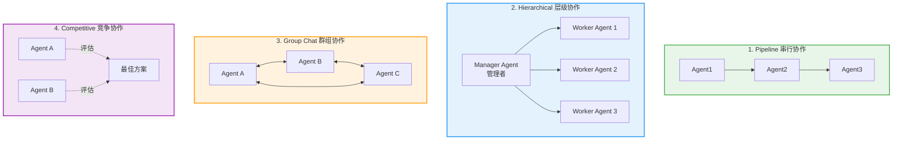
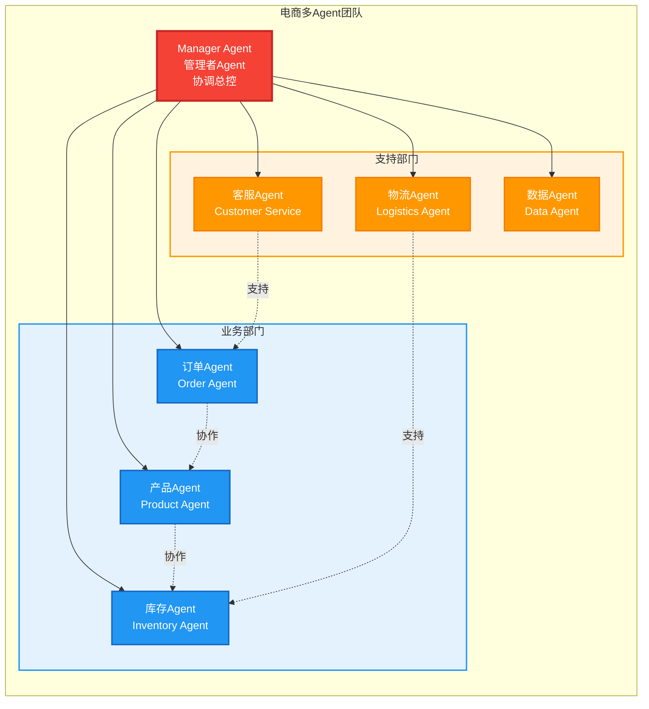

# 第八章：多Agent系统—— 当智能体开始"分工协作"

> **章节核心目标**
>
> 搞懂多Agent系统的核心价值、主流协作范式、角色设计方法，通过具象案例理解多Agent的落地场景，明确什么时候该用多Agent，什么时候不该用。

---

## 开篇思考：一个人好，还是一群人好？

在前面章节，我们讲的都是单Agent：一个Agent完成所有任务。

**但现实是：**
- 复杂任务往往需要多个专业角色协作
- 单Agent能力有限，容易出错
- 真实的企业场景都是团队协作，不是单打独斗

**多Agent系统就是解决这个问题：让多个Agent分工协作，模拟真实的团队。**

**这一章，我们会搞懂：**
- 为什么需要多Agent？
- 多Agent怎么分工协作？
- 有哪些协作模式？
- 怎么设计多Agent系统？

---

## 一、为什么需要多Agent？—— 一个人走得快，一群人走得远

### 🎯 单Agent的核心瓶颈

**瓶颈1：注意力有限**
- 复杂任务容易偏离目标
- 顾此失彼，遗漏细节

**案例：**
```
用户："帮我策划一个产品发布会，包括方案、文案、海报、场地、嘉宾邀请。"

单Agent执行：
- 同时处理5个任务
- 每个任务都做得不够好
- 容易遗漏细节
- 任务质量不高
```

---

**瓶颈2：单角色有能力边界**
- 无法兼顾专业的分工
- 某些领域知识不足

**案例：**
```
用户："帮我优化这个Python代码的性能。"

单Agent执行：
- 可能对性能优化不够专业
- 代码质量提升有限
```

---

**瓶颈3：长任务容易出错**
- 任务步骤多，容易忘记初始目标
- 无法交叉校验，错误难以发现

**案例：**
```
用户："帮我做一个完整的市场调研，包括用户访谈、数据分析、报告撰写。"

单Agent执行：
- 做到一半忘了初始目标
- 分析错误无法被发现
- 最终报告质量不高
```

---

### 🌟 多Agent的核心价值

**价值1：专业分工**
- 每个Agent专注一个领域
- 质量更高

**价值2：能力互补**
- 不同Agent有不同能力
- 覆盖更多场景

**价值3：交叉校验**
- 多个Agent互相检查
- 错误更少

**价值4：并行执行**
- 多个Agent同时工作
- 效率更高

---

### 📊 单Agent vs 多Agent对比

| 对比维度 | 单Agent | 多Agent |
|:---|:---|:---|
| **任务复杂度** | 适合简单任务 | 适合复杂任务 |
| **专业性** | 通用型，不够专业 | 每个Agent很专业 |
| **准确性** | 容易出错 | 多个Agent交叉校验 |
| **效率** | 串行执行，慢 | 并行执行，快 |
| **成本** | 低 | 高（多个LLM调用） |
| **复杂度** | 简单 | 复杂 |

---

### 💡 核心比喻

**单Agent = 一个全能但精力有限的个人**
- 什么都能做一点，但什么都不精
- 复杂任务容易出错

**多Agent系统 = 一个分工明确的完整项目团队**
- 每个人专注自己擅长的领域
- 互相协作，共同完成任务
- 质量更高、效率更快

---

### 🌟 案例：电商大促项目

**场景：策划一个电商大促活动**

**单Agent执行：**
- 同时负责：用户研究、选品、文案、投放、客服、复盘
- 每个环节都做得不够好
- 容易出错，效率低

**多Agent系统执行：**
- 用户研究Agent：分析用户需求
- 选品Agent：选择促销商品
- 文案Agent：撰写促销文案
- 投放Agent：制定广告投放方案
- 客服Agent：准备客服话术
- 复盘Agent：分析活动效果
- 每个Agent专注一个领域，质量高
- 多个Agent并行工作，效率高

**结果：多Agent系统的活动效果远好于单Agent。**

---

## 二、多Agent系统的4种主流协作范式

### 🎯 范式1：流水线模式（顺序执行）

**核心逻辑：**
任务拆分成多个步骤，每个步骤由一个专属Agent负责，前一个Agent完成后，把结果传给下一个Agent，顺序执行。

---

#### 📋 工作流程

```
Agent1（步骤1）
  ↓（传递结果）
Agent2（步骤2）
  ↓（传递结果）
Agent3（步骤3）
  ↓（传递结果）
Agent4（步骤4）
  ↓
完成
```

---

#### 🌟 案例：内容生产流水线

**场景：生产一篇公众号文章**

**Agent分工：**
1. **选题Agent**：分析热点，选择选题
2. **素材Agent**：搜集相关素材
3. **文案Agent**：撰写文章
4. **排版Agent**：美化排版
5. **审核Agent**：质量检查
6. **发布Agent**：定时发布

**工作流：**
```
选题Agent → 选题："AI Agent的最新发展"
    ↓
素材Agent → 素材：相关文章、数据、案例
    ↓
文案Agent → 文章：完整的公众号文章
    ↓
排版Agent → 排版：美化后的文章
    ↓
审核Agent → 审核：检查质量，通过
    ↓
发布Agent → 发布：定时发布到公众号
```

---

#### ✅ 优点
- 流程清晰
- 每个Agent职责明确
- 易于实现

#### ❌ 缺点
- 串行执行，效率低
- 一个Agent出错，后续都受影响
- 灵活性差

#### 🎯 适用场景
- 有明确流程的线性任务
- 内容生产、数据处理、审批流程

---

### 🎯 范式2：层级管理模式（上下级分工）

**核心逻辑：**
模拟企业的组织架构，有一个总负责人Agent（产品经理/项目经理），负责拆解任务、分配工作、统筹全局，下面有多个执行Agent，负责具体的工作。

---

#### 📋 组织架构

```
项目经理Agent（总负责人）
    ├─ 执行Agent1（具体工作）
    ├─ 执行Agent2（具体工作）
    ├─ 执行Agent3（具体工作）
    └─ 执行Agent4（具体工作）
```

---

#### 🌟 案例：软件开发团队

**场景：开发一个新功能**

**Agent分工：**
- **产品经理Agent**（总负责人）：
  - 拆解任务
  - 分配工作
  - 统筹进度
  - 质量把控

- **前端开发Agent**：
  - 开发前端页面
  - 完成后汇报给产品经理

- **后端开发Agent**：
  - 开发后端API
  - 完成后汇报给产品经理

- **测试Agent**：
  - 编写测试用例
  - 执行测试
  - 发现bug汇报给产品经理

- **运维Agent**：
  - 部署上线
  - 监控运行状态
  - 完成后汇报给产品经理

**工作流：**
```
1. 产品经理Agent：拆解任务，分配工作
   ├─ 前端开发Agent：开发前端页面
   ├─ 后端开发Agent：开发后端API
   ├─ 测试Agent：准备测试
   └─ 运维Agent：准备部署环境

2. 前端开发Agent：完成开发，汇报给产品经理
3. 后端开发Agent：完成开发，汇报给产品经理
4. 测试Agent：执行测试，发现bug，汇报给产品经理
5. 产品经理Agent：协调前端、后端修复bug
6. 测试Agent：重新测试，通过，汇报给产品经理
7. 运维Agent：部署上线，汇报给产品经理
8. 产品经理Agent：验收通过，任务完成
```

---

#### ✅ 优点
- 统筹全局，任务清晰
- 并行执行，效率高
- 灵活性强，可动态调整

#### ❌ 缺点
- 复杂度高
- 总负责人Agent压力大

#### 🎯 适用场景
- 复杂的项目管理
- 企业级业务流程
- 多角色协同的复杂任务

---

### 🎯 范式3：群聊协商模式（自由协作）

**核心逻辑：**
多个Agent在一个群聊里，自由对话、自主协商、共同解决问题，没有固定的流程和上下级，每个Agent都可以发表意见、发起行动。

---

#### 📋 群聊场景

```
【群聊：营销方案讨论】

用户："我们需要为新产品制定营销方案，请大家讨论。"

品牌Agent："我建议从高端定位切入，强调产品的独特性。"

投放Agent："我建议先在抖音投放，年轻人多，转化率高。"

创意Agent："我建议做一个挑战赛活动，让用户参与互动。"

数据分析Agent："我分析了一下，我们的目标用户主要是25-35岁，建议重点投放小红书。"

品牌Agent："好的，那我们综合一下：定位高端，重点投放小红书，配合挑战赛活动。"

投放Agent："同意，我来制定小红书投放方案。"

创意Agent："我来设计挑战赛活动。"

...（继续讨论，直到达成共识）
```

---

#### 🌟 案例：营销方案讨论

**场景：为新品牌制定营销方案**

**参与Agent：**
- **用户研究Agent**：分析用户需求
- **品牌Agent**：制定品牌策略
- **投放Agent**：制定投放策略
- **创意Agent**：设计创意方案
- **数据分析Agent**：提供数据支持

**工作流：**
```
【群聊开始】

用户："我们需要为XX品牌制定营销方案。"

用户研究Agent："我先分析一下目标用户。"
（输出用户画像：25-35岁，女性为主，追求品质...）

品牌Agent："基于用户画像，我建议定位高端。"

投放Agent："我建议重点投放小红书，因为目标用户主要在那里。"

创意Agent："我建议做挑战赛活动，让用户参与。"

数据分析Agent："我分析了一下竞品数据，小红书投放ROI最高，支持投放Agent的建议。"

品牌Agent："好的，那方案定了：高端定位，重点投放小红书，配合挑战赛活动。"

投放Agent："我来制定小红书投放详细方案。"

创意Agent："我来设计挑战赛活动。"

...（Agent们继续讨论，完善方案）

【群聊结束，达成共识】
```

---

#### ✅ 优点
- 灵活性极高
- 多角度思考
- 共识决策

#### ❌ 缺点
- 可能陷入无休止讨论
- 效率不确定
- 难以控制

#### 🎯 适用场景
- 头脑风暴
- 方案讨论
- 问题排查
- 创意类任务

---

### 🎯 范式4：竞争对抗模式（博弈优化）

**核心逻辑：**
设置两个或多个对立的Agent，分别扮演不同的角色，通过对抗、辩论、博弈，优化最终的结果。

---

#### 📋 对抗场景

```
【辩论：AI是否会替代人类】

正方Agent（AI会替代人类）：
"AI在计算、数据分析方面远超人类，未来会替代大量重复性工作。"

反方Agent（AI不会替代人类）：
"AI缺乏创造力和情感，很多工作需要人类的创造性和情感交流，无法被替代。"

正方Agent："但AI正在学习创造，AI绘画、AI写作已经很成熟了。"

反方Agent："AI的创造是基于训练数据的模仿，真正的创新需要人类的灵感和情感。"

...（持续辩论，深化认知）
```

---

#### 🌟 案例：代码审计

**场景：审计代码，找出潜在问题**

**Agent分工：**
- **开发Agent**：写代码
- **审计Agent**：找漏洞、提建议

**工作流：**
```
【第1轮】

开发Agent：写了一段代码
```python
def login(username, password):
    query = f"SELECT * FROM users WHERE username='{username}' AND password='{password}'"
    return db.execute(query)
```

审计Agent：发现SQL注入漏洞！
- 问题：直接拼接SQL，存在SQL注入风险
- 建议：使用参数化查询

【第2轮】

开发Agent：修复代码
```python
def login(username, password):
    query = "SELECT * FROM users WHERE username=%s AND password=%s"
    return db.execute(query, (username, password))
```

审计Agent：安全了，但还有问题！
- 问题：密码没有加密存储
- 建议：使用hash加密

【第3轮】

开发Agent：再次修复
```python
def login(username, password):
    query = "SELECT * FROM users WHERE username=%s"
    user = db.execute(query, (username,))
    if user and verify_password(password, user.password_hash):
        return user
```

审计Agent：✅ 通过！代码安全了。

【对抗结束，代码质量大幅提升】
```

---

#### ✅ 优点
- 发现深层问题
- 优化结果质量
- 提升安全性

#### ❌ 缺点
- 可能陷入无休止对抗
- 需要设计好终止条件

#### 🎯 适用场景
- 方案优化
- 代码审计
- 风险评估
- 辩论类任务

---

### 📊 4种协作范式对比

| 协作范式 | 核心逻辑 | 适用场景 | 优点 | 缺点 | 新手友好度 |
|:---|:---|:---|:---|:---|:---|
| **流水线模式** | 顺序执行 | 有明确流程的线性任务 | 流程清晰，易实现 | 串行执行，效率低 | ⭐⭐⭐⭐⭐ |
| **层级管理模式** | 上下级分工 | 复杂项目管理 | 统筹全局，并行执行 | 复杂度高 | ⭐⭐⭐⭐ |
| **群聊协商模式** | 自由协作 | 头脑风暴、方案讨论 | 灵活，多角度 | 可能陷入讨论 | ⭐⭐⭐ |
| **竞争对抗模式** | 博弈优化 | 方案优化、代码审计 | 深化问题，提升质量 | 可能陷入对抗 | ⭐⭐⭐ |

---

## 三、多Agent系统的角色设计原则

### 🎯 原则1：职责单一

**核心原则：每个Agent只负责一个专业领域的工作**

**示例（不好）：**
```python
# 一个Agent做太多事情
agent = {
    "role": "全能助手",
    "responsibilities": [
        "写代码",
        "写文案",
        "做数据分析",
        "设计海报",
        "客服答疑"
    ]
}
```

**示例（好）：**
```python
# 每个Agent专注一个领域
agents = [
    {"role": "编程助手", "responsibility": "写代码"},
    {"role": "文案助手", "responsibility": "写文案"},
    {"role": "数据分析助手", "responsibility": "做数据分析"},
    {"role": "设计助手", "responsibility": "设计海报"},
    {"role": "客服助手", "responsibility": "客服答疑"}
]
```

---

### 🎯 原则2：能力匹配

**核心原则：每个Agent的Prompt、工具、知识库，都和它的角色匹配**

**示例：客服Agent**
```python
customer_service_agent = {
    "role": "客服助手",
    "prompt": "你是一个专业的客服助手，负责解答用户问题、处理售后...",
    "tools": [
        "查询订单",
        "处理退款",
        "查询物流"
    ],
    "knowledge_base": [
        "产品手册",
        "售后政策",
        "常见问题FAQ"
    ]
}
```

**核心要点：**
- Prompt要符合角色定位
- 工具要是角色需要的
- 知识库要是角色相关的

---

### 🎯 原则3：协作边界清晰

**核心原则：明确每个Agent的输入、输出、协作对象**

**示例：内容生产团队**
```python
agents = [
    {
        "role": "选题Agent",
        "input": "用户需求",
        "output": "选题方案",
        "collaborate_with": ["素材Agent"]
    },
    {
        "role": "素材Agent",
        "input": "选题方案",
        "output": "素材集合",
        "collaborate_with": ["选题Agent", "文案Agent"]
    },
    {
        "role": "文案Agent",
        "input": "选题方案 + 素材集合",
        "output": "文章",
        "collaborate_with": ["素材Agent", "排版Agent"]
    }
]
```

**核心要点：**
- 每个Agent知道自己的输入是什么
- 每个Agent知道自己的输出是什么
- 每个Agent知道和谁协作

---

### 🌟 案例：电商大促多Agent团队的角色设计

**场景：策划一个电商大促活动**

**核心角色：**
1. **用户研究Agent**
   - 职责：分析用户需求、用户画像
   - 工具：数据分析工具、问卷工具
   - 知识库：历史用户数据

2. **选品定价Agent**
   - 职责：选择促销商品、制定价格策略
   - 工具：商品数据库、竞品分析工具
   - 知识库：商品信息、历史价格数据

3. **文案创意Agent**
   - 职责：撰写促销文案、设计活动方案
   - 工具：文案生成工具、图片生成工具
   - 知识库：优秀文案案例

4. **广告投放Agent**
   - 职责：制定广告投放策略
   - 工具：广告平台API、数据分析工具
   - 知识库：投放数据、竞品投放策略

5. **智能客服Agent**
   - 职责：准备客服话术、FAQ
   - 工具：客服系统API、知识库检索
   - 知识库：产品手册、售后政策

6. **数据复盘Agent**
   - 职责：分析活动效果、优化建议
   - 工具：数据分析工具、报表生成工具
   - 知识库：历史活动数据

**协作模式：** 层级管理+流水线结合
- **项目经理Agent**：统筹全局
- **每个角色Agent**：分工协作
- **工作流**：用户研究 → 选品定价 → 文案创意 → 广告投放 → 客服准备 → 数据复盘

**量化价值：**
- 筹备周期：15天 → 3天
- 人工成本：下降70%
- 投放ROI：提升35%

---

## 四、新手避坑：不是多Agent一定比单Agent好

### 🚨 什么时候该用多Agent？

**条件1：任务有明确的专业分工**
- 不同环节需要不同专业知识
- 单个Agent无法兼顾

**条件2：流程复杂**
- 任务步骤多，流程复杂
- 需要多个角色协作

**条件3：需要多角色交叉校验**
- 需要多角度验证
- 需要提升准确性

**条件4：单Agent无法覆盖所有能力边界**
- 某些任务需要特定专业能力
- 单个Agent能力有限

---

### 🚨 什么时候不该用多Agent？

**场景1：简单的单一场景任务**
- 示例：查询天气
- 建议：用单Agent

**场景2：步骤少**
- 示例：发送一封邮件
- 建议：用单Agent

**场景3：不需要专业分工**
- 示例：写一段简单的文案
- 建议：用单Agent

**场景4：成本敏感**
- 多Agent成本高（多个LLM调用）
- 如果预算有限，优先用单Agent

---

### 💡 新手入门原则

**原则1：先把单Agent玩明白**
- 不要一上来就搞多Agent
- 先理解单Agent的核心逻辑

**原则2：先从2个Agent的简单协作开始**
- 不要一开始就搞十几个Agent
- 从最简单的2个Agent协作开始

**原则3：能简单就不复杂**
- 单Agent能搞定，就不用多Agent
- 避免过度设计

---

## 五、主流多Agent框架选型

### 📦 新手入门首选：CrewAI

**核心优势：**
- 角色分工明确
- 上手简单
- 文档完善
- 有大量新手案例

**适用场景：**
- 新手入门多Agent开发
- 中小规模多Agent系统

**示例代码：**
```python
from crewai import Agent, Task, Crew

# 定义Agent
researcher = Agent(
    role="研究员",
    goal="研究AI Agent的最新发展",
    backstory="你是一个经验丰富的研究员..."
)

writer = Agent(
    role="作家",
    goal="基于研究结果撰写文章",
    backstory="你是一个专业的作家..."
)

# 定义任务
research_task = Task(
    description="研究AI Agent的最新发展",
    agent=researcher
)

write_task = Task(
    description="基于研究结果撰写文章",
    agent=writer
)

# 创建团队
crew = Crew(
    agents=[researcher, writer],
    tasks=[research_task, write_task]
)

# 执行
result = crew.kickoff()
```

---

### 📦 复杂场景首选：AutoGen

**核心优势：**
- 微软出品
- 群聊协作能力极强
- 支持灵活的对话模式

**适用场景：**
- 复杂的多Agent场景
- 需要群聊协商的任务

**示例代码：**
```python
import autogen

# 定义Agent
assistant = autogen.AssistantAgent(
    name="assistant",
    llm_config={"model": "gpt-4"}
)

user_proxy = autogen.UserProxyAgent(
    name="user_proxy",
    code_execution_config={"work_dir": "coding"}
)

# 开始对话
user_proxy.initiate_chat(
    assistant,
    message="帮我写一个Python函数，计算斐波那契数列"
)
```

---

### 📦 企业级场景首选：LangGraph

**核心优势：**
- LangChain官方出品
- 和LangChain生态完美兼容
- 支持复杂的状态管理

**适用场景：**
- 企业级复杂场景
- 需要复杂状态管理的任务

---

## 六、本章核心小结

### ✅ 核心结论

1. **多Agent的核心价值**：通过专业分工、能力互补、交叉校验、并行执行，解决单Agent的能力瓶颈，完成更复杂的任务

2. **多Agent的4种协作范式**：
   - 流水线模式：顺序执行，适合有明确流程的线性任务
   - 层级管理模式：上下级分工，适合复杂项目管理
   - 群聊协商模式：自由协作，适合头脑风暴、方案讨论
   - 竞争对抗模式：博弈优化，适合方案优化、代码审计

3. **角色设计的3个原则**：
   - 职责单一：每个Agent只负责一个专业领域
   - 能力匹配：Prompt、工具、知识库都和角色匹配
   - 协作边界清晰：明确输入、输出、协作对象

4. **新手避坑**：
   - 什么时候该用多Agent：任务有专业分工、流程复杂、需要交叉校验
   - 什么时候不该用：简单任务、步骤少、不需要专业分工
   - 新手入门原则：先把单Agent玩明白，再从2个Agent的简单协作开始

5. **框架选型**：
   - 新手入门：CrewAI
   - 复杂场景：AutoGen
   - 企业级：LangGraph

---

## 七、下章预告

**前八章，我们搞懂了Agent的核心概念、进化历史、三大支柱、完整架构、决策机制、记忆系统、工具调用、多Agent系统。**

**现在你应该理解了：**
- Agent是什么，怎么工作
- 单Agent的完整架构
- 多Agent的协作模式

**但还有一个核心问题：**
- Agent到底能做什么？
- 有哪些真实的落地案例？
- 这些案例是怎么设计的？
- 有什么可量化的价值？

**下一章，我们会进入实战案例库，从个人效率到企业级商用，精选6个真实落地的Agent案例，每个案例都拆解核心工作流和可量化的价值。**

---

## 📊 配图说明

**图1：4种协作范式示意图**

*每个范式配一个极简的流程图*

**图2：电商多Agent团队架构图**

*组织架构图的形式，展示每个Agent的角色、职责*

---

> **💡 学习小贴士**
>
> - 这一章的核心是**理解多Agent的协作模式**，重点掌握4种范式
> - 新手不要一上来就搞多Agent，先玩明白单Agent
> - 角色设计要遵循3个原则，避免角色冗余、职责不清
>
> **下一章：[Agent实战案例库—— 从个人效率到企业级的落地全场景](./09-第九章-Agent实战案例库.md)**
