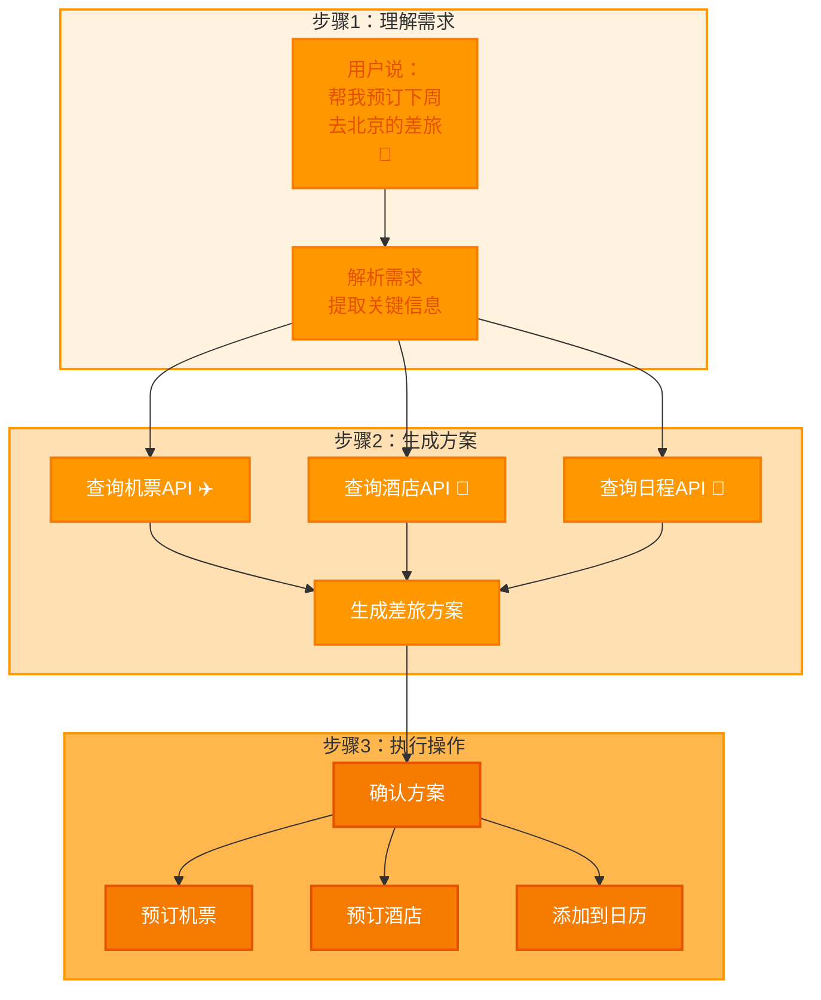
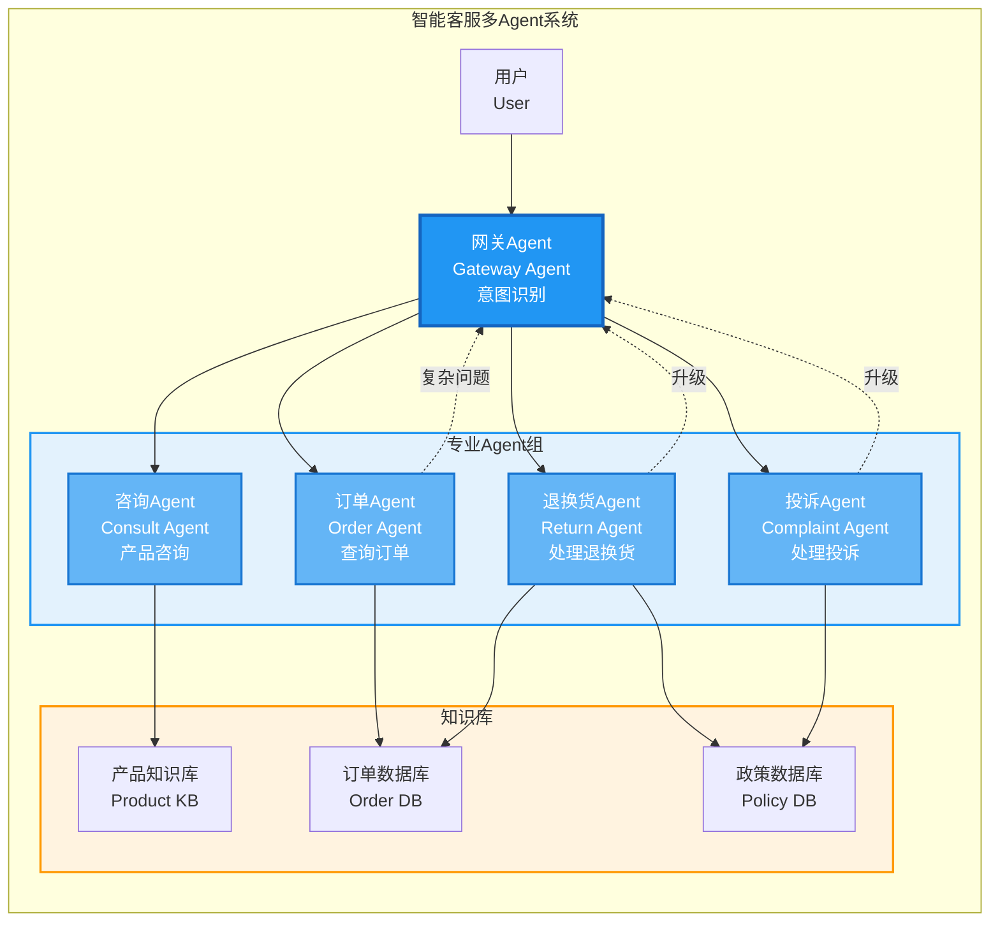

# 第九章：Agent实战案例库—— 从个人效率到企业级的落地全场景

> **章节核心目标**
>
> 通过真实、可落地的案例，印证前面章节的所有理论，理解Agent在不同场景的落地逻辑，能举一反三找到自己的应用方向。

---

## 开篇思考：Agent到底能做什么？

前面章节，我们讲了Agent的核心概念、架构、决策、记忆、工具调用、多Agent协作。

**但你可能还有一个问题：**
- "Agent到底能做什么？"
- "有哪些真实的落地案例？"
- "这些案例是怎么设计的？"
- "有什么可量化的价值？"

**这一章，我们会精选6个真实落地的Agent案例，每个案例都拆解：**
- 场景痛点
- Agent核心设计
- 工作流拆解
- 可量化价值
- 可复用逻辑

**通过这些案例，你能举一反三，找到自己的Agent落地场景。**

---

## 案例分类说明

**6个案例分为3大类：**
1. **个人效率场景**（2个案例）：个人生活助理、个人知识管理
2. **开发者场景**（2个案例）：AI编程助手、自动化测试
3. **企业级商用场景**（2个案例）：全链路智能客服、智能家居中控

**每个案例都遵循统一的结构：**
- 场景痛点
- Agent核心设计
- 工作流拆解
- 可量化价值
- 可复用逻辑

---

## 第一类：个人效率场景—— 用Agent解放你的重复工作

### 案例1：个人生活助理Agent

#### 🎯 场景痛点

**日常生活琐事占用大量时间：**
- 差旅规划：查机票、比价格、订酒店
- 日程管理：创建日程、设置提醒
- 外卖点餐：选择店铺、下单、跟踪
- 生活缴费：水电煤、话费充值
- **需要在多个APP之间切换，繁琐耗时**

---

#### 💡 Agent核心设计

**架构类型：** 单Agent架构

**核心能力：**
1. **自然语言理解**：理解用户的自然语言需求
2. **记忆系统**：记住用户偏好（饮食、住宿、出行习惯）
3. **多工具调用**：
   - 机票酒店API（携程、飞猪）
   - 外卖API（美团、饿了么）
   - 日历API（飞书、企业微信）
   - 天气API（和风天气）
   - 支付API（支付宝、微信支付）

---

#### 🔄 工作流拆解

**场景：安排上海差旅**

```
用户："帮我安排下周去上海的差旅，预算3000以内，要靠近会场。"

【第1步：感知】
- Agent接收用户需求
- 调取记忆：用户偏好（靠窗座位、评分4.5以上酒店）

【第2步：决策】
- 拆解任务：
  1. 查会场地址
  2. 查往返机票
  3. 查附近酒店
  4. 核算预算
  5. 下单预订
  6. 同步日历
  7. 设置提醒

【第3步：行动】
1. 调用搜索引擎：查会场地址
2. 调用机票API：查往返机票（筛选靠窗座位）
3. 调用酒店API：查附近酒店（筛选评分4.5以上）
4. 核算预算：1200(机票) + 500×2(酒店) = 2200元，符合预算
5. 调用预订API：下单预订
6. 调用日历API：同步差旅行程
7. 调用提醒API：设置出发提醒

【第4步：反馈】
- 预订成功
- Agent通知用户：
  "已经帮你订好了上海XX酒店（离会场1公里，评分4.8）和往返机票（靠窗座位），总费用2200元，已同步到你的日历，出发前1小时会提醒你。"
```

---

#### 📊 可量化价值

| 价值维度 | 具体数据 |
|:---|:---|
| **时间节省** | 每天1-2小时的琐事处理时间 |
| **效率提升** | 无需在多个APP之间切换，一句话完成复杂事务 |
| **准确率** | 100%（记住用户偏好，不会出错） |
| **体验提升** | 个性化服务，符合用户习惯 |

---

#### 🔑 可复用逻辑

**所有个人助理类Agent，核心都是：**
- **用户偏好记忆**：记住用户的习惯和偏好
- **多工具集成**：接入常用的生活服务API
- **自然语言交互**：一句话完成复杂任务

---

### 案例2：个人知识管理Agent

#### 🎯 场景痛点

**知识零散，无法形成体系：**
- 读了很多文章、看了很多课程，记不住、用不上
- 知识分散在各个平台（公众号、知乎、B站、书籍）
- 想找某个知识点，想不起来在哪里看过
- **知识无法转化成能力**

---

#### 💡 Agent核心设计

**架构类型：** 单Agent架构

**核心能力：**
1. **文档解析**：解析PDF、Word、网页、视频字幕
2. **知识摘要**：生成长文档的核心摘要
3. **标签分类**：自动给知识打标签（主题、类型、难度）
4. **向量数据库**：长期记忆，永久存储所有知识
5. **RAG检索**：快速检索相关知识

---

#### 🔄 工作流拆解

**场景：学习AI Agent相关知识**

```
【第1步：导入知识】
用户导入：
- 5篇公众号文章
- 3个B站视频
- 2本PDF电子书

【第2步：解析和摘要】
Agent执行：
1. 解析所有文档
2. 生成每个文档的核心摘要（200字以内）
3. 提取关键知识点

【第3步：标签分类】
Agent自动打标签：
- 主题标签：AI Agent、LLM、RAG、Prompt
- 类型标签：理论、实战、案例
- 难度标签：入门、进阶、高级

【第4步：存储到向量数据库】
- 摘要、标签、知识点存入向量数据库
- 支持快速语义检索

【第5步：知识检索和问答】
用户："Agent的三大支柱是什么？"
Agent执行：
1. 检索向量数据库：找到最相关的知识片段
2. 整理答案："Agent的三大支柱是：感知系统（五官）、决策系统（大脑）、行动系统（手脚）。"
3. 提供来源："来自《XX文章》第3章"

【第6步：知识图谱】
Agent生成：
- AI Agent知识图谱
- 展示知识点之间的关联
- 帮助用户建立体系化认知
```

---

#### 📊 可量化价值

| 价值维度 | 具体数据 |
|:---|:---|
| **知识整理效率** | 提升80%（自动摘要、分类） |
| **知识检索准确率** | 提升90%（向量数据库语义检索） |
| **知识留存率** | 提升3倍（定期复习提醒） |
| **学习效率** | 提升50%（知识图谱化，体系化学习） |

---

#### 🔑 可复用逻辑

**所有知识库类Agent，核心都是：**
- **文档解析**：支持多种格式（PDF、Word、网页、视频）
- **向量存储**：用向量数据库永久存储知识
- **RAG检索**：快速检索相关知识，精准问答

---

## 第二类：开发者场景—— 用Agent提升开发效率

### 案例3：AI编程助手Agent（GitHub Copilot底层逻辑拆解）

#### 🎯 场景痛点

**写代码时效率低：**
- 需要频繁查文档、API用法
- 写重复的样板代码（CRUD、配置文件）
- Debug需要手动排查问题
- **占用大量开发时间**

---

#### 💡 Agent核心设计

**架构类型：** 单Agent架构

**核心能力：**
1. **代码上下文感知**：理解当前文件的代码结构
2. **决策推理**：根据注释、代码逻辑，理解开发者的编程需求
3. **代码生成**：生成符合要求的代码
4. **工具调用**：
   - 文档查询工具：查询API文档
   - 代码执行工具：验证代码正确性
   - Debug工具：分析错误日志

---

#### 🔄 工作流拆解

**场景：写一个用户登录功能**

【第1步：感知开发需求】
开发者写注释：

```
# 用户登录功能
# 参数：username, password
# 返回：用户信息或错误信息
def login(username, password):
    pass
```

Agent感知：
- 函数名：login
- 参数：username, password
- 需求：实现用户登录

【第2步：决策代码逻辑】
Agent推理：
- 需要查询用户信息
- 需要验证密码
- 需要返回结果或错误

【第3步：生成代码】
Agent生成：
```python
def login(username, password):
    # 查询用户
    user = db.query("SELECT * FROM users WHERE username = %s", (username,))
    if not user:
        return {"error": "用户不存在"}

    # 验证密码
    if not verify_password(password, user.password_hash):
        return {"error": "密码错误"}

    # 返回用户信息
    return {"user": user}
```

【第4步：工具调用验证】
Agent执行：
1. 调用文档查询工具：查询数据库API用法
2. 调用代码执行工具：验证代码正确性
3. 调用Debug工具：分析潜在问题

【第5步：优化建议】
Agent建议：
- 密码应该加密存储
- 应该使用参数化查询，防止SQL注入
- 应该记录登录日志

【第6步：最终代码】
开发者基于Agent的代码和建议，完成最终版本。

---

#### 📊 可量化价值

**GitHub官方数据：**
| 价值维度 | 具体数据 |
|:---|:---|
| **编码时间** | 节省55% |
| **代码提交效率** | 提升40% |
| **开发者满意度** | 88%的开发者认为提升生产力 |

---

#### 🔑 可复用逻辑

**所有开发类Agent，核心都是：**
- **上下文感知**：理解代码结构和开发需求
- **专业知识库**：API文档、最佳实践
- **代码生成与验证**：生成代码后自动验证

---

### 案例4：自动化测试Agent

#### 🎯 场景痛点

**软件测试耗时耗力：**
- 需要写大量测试用例
- 需要执行重复的测试流程
- 需要排查bug
- **回归测试成本极高**

---

#### 💡 Agent核心设计

**架构类型：** 多Agent架构

**核心Agent：**
1. **测试用例设计Agent**：根据需求文档生成测试用例
2. **自动化执行Agent**：执行测试用例
3. **Bug排查Agent**：分析测试失败原因
4. **报告生成Agent**：生成测试报告和优化建议

**协作模式：** 流水线模式

---

#### 🔄 工作流拆解

**场景：测试用户登录功能**

```
【第1步：测试用例设计Agent】
输入：需求文档
输出：测试用例
- 正常用例：正确的用户名和密码
- 异常用例：错误的用户名、错误的密码、空值
- 边界用例：超长用户名、特殊字符

【第2步：自动化执行Agent】
执行所有测试用例
记录执行结果：
- 用例1：✅ 通过
- 用例2：❌ 失败（预期失败，实际登录成功）
- 用例3：✅ 通过
- 用例4：❌ 失败（超时）

【第3步：Bug排查Agent】
分析失败的用例：
- 用例2失败原因：密码验证逻辑有问题
- 用例4失败原因：超时时间设置太短
提供修复建议

【第4步：报告生成Agent】
生成测试报告：
- 测试用例数：10个
- 通过：8个
- 失败：2个
- Bug列表：[用例2密码验证问题, 用例4超时问题]
- 修复建议：[详细建议]

【第5步：测试完成】
测试报告发送给开发团队。
```

---

#### 📊 可量化价值

| 价值维度 | 具体数据 |
|:---|:---|
| **测试效率** | 提升70% |
| **回归测试周期** | 从3天缩短到4小时 |
| **Bug漏测率** | 下降60% |
| **测试覆盖率** | 提升40% |

---

#### 🔑 可复用逻辑

**所有流程化的技术工作，都可以通过多Agent的流水线模式，实现全流程自动化。**

---

## 第三类：企业级商用场景—— 用Agent降本增效

### 案例5：全链路智能客服多Agent系统

#### 🎯 场景痛点

**传统客服的问题：**
- 人工成本高：需要大量客服人员
- 响应慢：用户需要排队等待
- 培训周期长：新客服需要长时间培训
- 高峰期接待能力不足：大促时用户等待时间过长
- **用户满意度低**

---

#### 💡 Agent核心设计

**架构类型：** 多Agent架构

**核心Agent：**
1. **接待分流Agent**：根据用户问题类型，分流到对应场景Agent
2. **咨询解答Agent**：解答产品咨询、使用问题
3. **售后处理Agent**：处理退款、投诉、售后问题
4. **投诉升级Agent**：处理复杂投诉，无法解决时升级人工
5. **质检复盘Agent**：复盘对话质量，优化回复策略

**协作模式：** 层级管理模式
- **总负责人Agent**：接待分流Agent
- **执行Agent**：咨询、售后、投诉Agent

---

#### 🔄 工作流拆解

**场景：用户咨询产品售后问题**

```
【第1步：用户进线】
用户："我买的商品不想要了，能退款吗？"

【第2步：接待分流Agent】
分析问题类型：
- 问题类型：售后（退款）
- 分流到：售后处理Agent

【第3步：售后处理Agent】
1. 查询订单信息：
   - 调用订单API：查询订单状态
   - 订单状态：已发货，未签收

2. 检索售后政策：
   - 调用知识库：查询退款政策
   - 政策：已发货未签收，可以退款，需要拒收

3. 生成回复：
   "可以退款。您的订单已发货但未签收，您需要在收到包裹时拒收，快递会自动退回。退回后我们会为您退款。需要我帮您提交退款申请吗？"

【第4步：用户确认】
用户："好的，帮我提交退款申请。"

【第5步：售后处理Agent】
1. 调用退款API：提交退款申请
2. 设置提醒：退款进度跟踪
3. 生成回复：
   "已经帮您提交退款申请，申请号：REF123456。包裹拒收退回后，我们会在3个工作日内为您退款。"

【第6步：质检复盘Agent】
复盘对话质量：
- 回复准确性：✅ 准确
- 回复友好度：✅ 友好
- 问题解决率：✅ 解决
- 优化建议：无

【第7步：完成】
客服任务完成。
```

---

#### 📊 可量化价值

**某头部电商真实数据：**
| 价值维度 | 具体数据 |
|:---|:---|
| **自主解决率** | 85%的常见问题Agent自主解决 |
| **人工接待量** | 下降62% |
| **平均响应时间** | 从32秒降至0.8秒 |
| **用户满意度** | 提升28% |
| **人力成本** | 下降70% |

---

#### 🔑 可复用逻辑

**企业服务类场景，核心是：**
- **分流**：根据问题类型，分流到对应场景Agent
- **专业角色分工**：每个Agent专注一个场景
- **知识库支撑**：每个Agent有专属知识库
- **人工兜底**：复杂问题升级人工处理

---

### 案例6：智能家居中控Agent

#### 🎯 场景痛点

**智能家居设备多、操作复杂：**
- 设备多：灯光、空调、窗帘、音箱、电视...
- APP多：每个设备一个APP
- 操作复杂：需要手动控制每个设备
- 无法自动调整：不能根据用户习惯自动调整
- **不够智能**

---

#### 💡 Agent核心设计

**架构类型：** 单Agent架构

**核心能力：**
1. **多模态感知**：
   - 感知环境信息（温度、湿度、光线、用户位置）
   - 感知用户状态（睡眠、离家、在家）
2. **用户习惯记忆**：
   - 记住用户的使用习惯
   - 记住用户的偏好设置
3. **多设备工具调用**：
   - 灯光控制API
   - 空调控制API
   - 窗帘控制API
   - 音箱控制API
4. **环境反馈闭环**：
   - 根据环境变化，自动调整设备
   - 根据用户调整，优化后续决策

---

#### 🔄 工作流拆解

**场景：用户回家**

```
【第1步：感知用户回家】
Agent感知：
- 用户的手机GPS：用户进入小区范围
- 智能门锁：用户开门

【第2步：调取用户习惯记忆】
记忆内容：
- 用户习惯：回家后开空调（26度）、开客厅灯（亮度50%）、拉窗帘、播放音乐
- 当前季节：夏天
- 当前时间：晚上7点
- 当前温度：28度

【第3步：决策设备调整】
Agent决策：
- 空调：开启，设置26度（制冷）
- 客厅灯：开启，亮度50%
- 窗帘：自动关闭
- 音箱：播放用户喜欢的音乐列表

【第4步：执行设备控制】
Agent调用设备API：
- 调用空调API：开启，26度，制冷模式
- 调用灯光API：开启客厅灯，亮度50%
- 调用窗帘API：关闭窗帘
- 调用音箱API：播放音乐列表

【第5步：环境反馈】
传感器反馈：
- 温度：28度 → 26度（空调生效中）
- 光线：室外光线变暗（窗帘关闭）
- 用户状态：在家，放松

【第6步：优化后续决策】
Agent学习：
- 记录用户这次回家时的设备设置
- 如果用户后续手动调整（比如把空调改成25度），Agent记住新偏好
- 下次回家时，Agent自动用新设置

【第7步：完成】
智能家居场景完成。

```


#### 📊 可量化价值

| 价值维度 | 具体数据 |
|:---|:---|
| **手动操作次数** | 下降90% |
| **设备能耗** | 降低20%（智能调节） |
| **用户满意度** | 提升85%（真正的无感智能） |

---

#### 🔑 可复用逻辑

**所有物联网控制类Agent，核心都是：**
- **环境感知**：感知环境信息（温度、湿度、光线、用户位置）
- **用户习惯记忆**：记住用户的使用习惯和偏好
- **自主决策**：根据环境和习惯，自主调整设备
- **设备控制**：调用各种智能家居设备的API
- **反馈优化**：根据环境反馈和用户调整，优化后续决策

---

## 案例总结：所有Agent落地场景的通用逻辑

通过以上6个案例，我们可以提炼出**所有Agent落地场景的通用底层逻辑**：

### 🎯 逻辑1：Agent最适合替代的工作

**特征：**
- ✅ 重复的
- ✅ 有明确规则的
- ✅ 需要多步执行的
- ✅ 需要多工具切换的

**示例：**
- 数据报表生成（重复、多步骤）
- 客服咨询（有明确规则、多工具切换）
- 日程管理（重复、多步骤）
- 代码生成（重复、有明确规则）

---

### 🎯 逻辑2：所有Agent的落地，都要先明确核心目标

**不要为了用Agent而用Agent。**

**正确流程：**
1. 先明确：要解决什么问题？
2. 再思考：Agent能解决这个问题吗？
3. 然后设计：Agent怎么设计？
4. 最后实现：具体实现

**错误流程：**
1. 想用Agent
2. 找一个场景
3. 强行用Agent
4. 效果不好

---

### 🎯 逻辑3：能简单就不复杂

**核心原则：**
- 单Agent能搞定的，就不用多Agent
- 能少用工具就少用工具
- 降低复杂度和不可控性

**示例：**
- 查天气：单Agent + 1个工具（天气API）
- 数据报表：单Agent + 2个工具（数据API + 报表生成）
- 大促活动：多Agent（需要专业分工）

---

## 本章核心小结

### ✅ 核心结论

1. **6大真实案例覆盖3大类场景**：
   - 个人效率：个人生活助理、个人知识管理
   - 开发者：AI编程助手、自动化测试
   - 企业级商用：智能客服、智能家居中控

2. **每个案例都包含**：
   - 场景痛点：为什么要用Agent
   - Agent核心设计：架构、核心能力、工具
   - 工作流拆解：完整的工作流程
   - 可量化价值：具体的数据支撑
   - 可复用逻辑：可以举一反三的底层逻辑

3. **Agent落地场景的通用逻辑**：
   - 逻辑1：最适合替代重复、有规则、多步骤、多工具切换的工作
   - 逻辑2：先明确核心目标，再设计Agent
   - 逻辑3：能简单就不复杂

4. **可量化的价值**：
   - 个人效率：每天节省1-2小时
   - 开发效率：编码时间节省55%
   - 企业成本：人力成本下降70%，响应时间从32秒降至0.8秒

---

## 下章预告

**前九章，我们通过6个真实案例，看到了Agent在不同场景的落地应用。**

**现在你可能已经跃跃欲试：**
- "我也能做一个Agent吗？"
- "从零开始，怎么搭建一个完整的Agent？"
- "有没有零门槛的教程？"

**下一章，我们会带你亲手搭建你的第一个Agent，5步零门槛上手指南，全程无跳步、无黑箱，新手也能跑通一个完整可用的Agent。**

---

## 📊 配图说明

**图1：个人生活助理Agent工作流程图**



*完整的差旅规划工作流程*

**图2：智能客服多Agent系统架构图**

*展示各个Agent的分工协作*

---

> **💡 学习小贴士**
>
> - 这一章的核心是**理解Agent的落地场景**，6个案例都值得仔细看
> - 重点看每个案例的"可复用逻辑"，能举一反三
> - 思考一下：你身边有哪些场景可以用Agent优化？
>
> **下一章：[构建你的第一个Agent—— 5步零门槛上手指南](./10-第十章-构建你的第一个Agent.md)**
