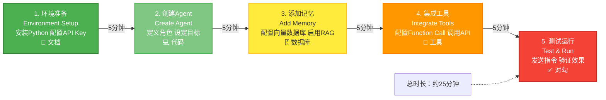

# 第十章：构建你的第一个Agent—— 5步零门槛上手指南

> **章节核心目标**
>
> 带新手从零开始，5步搭建一个完整可用的Agent，全程无跳步、无黑箱、无代理、无依赖地狱，复制粘贴就能跑，同时提供完整的踩坑排查指南。

---

## 开篇说明：我们要做一个什么样的Agent？

### 🎯 本次实战的目标

**搭建一个个人日程管理助理Agent**

**核心功能：**
1. ✅ 接收用户的日程安排需求
2. ✅ 解析需求（提取时间、事件、地点）
3. ✅ 同步到飞书日历
4. ✅ 设置提醒
5. ✅ 查询日程
6. ✅ 给用户做日程规划建议

**示例对话：**
```
用户："帮我创建一个明天下午3点的会议，主题是AI Agent学习，时长1小时，提醒我提前10分钟参会。"

Agent："好的，已经帮你创建了明天下午3点的会议'AI Agent学习'，时长1小时，已设置提前10分钟提醒。需要我做其他事情吗？"
```

---

### 💡 为什么选择这个场景？

1. **场景实用**：日程管理是日常高频需求
2. **架构简单**：单Agent架构，工具调用清晰
3. **能直接用到**：搭建完就能真正用起来
4. **新手友好**：不涉及复杂逻辑，容易理解

---

### 📋 前置要求

**只需要：**
- ✅ 会基础的电脑操作
- ✅ 有Python环境（不会也没关系，我会教）
- ✅ 能按照步骤操作

**不需要：**
- ❌ 深厚的编程基础
- ❌ 任何AI/机器学习知识
- ❌ 复杂的环境配置

---

## 第1步：环境准备—— 3分钟搞定所有前置工作

### 📦 步骤1.1：安装Python

**为什么需要Python？**
- 我们的Agent用Python写
- Python语法简单，新手友好
- 跨平台（Windows、Mac、Linux都能用）

**如何安装？**

**Windows用户：**
1. 访问：https://www.python.org/downloads/
2. 下载"Python 3.10+"版本
3. 运行安装程序
4. **重要**：勾选"Add Python to PATH"
5. 点击"Install Now"

**Mac用户：**
```bash
# 使用Homebrew安装（推荐）
brew install python@3.10
```

**Linux用户：**
```bash
# Ubuntu/Debian
sudo apt update
sudo apt install python3.10

# CentOS/RHEL
sudo yum install python3.10
```

**验证安装：**
```bash
python --version
# 输出：Python 3.10.x
```

---

### 🔑 步骤1.2：申请大模型API Key

**为什么需要API Key？**
- 我们的Agent需要调用大模型
- 我们用豆包大模型（免费额度大，中文友好）

**如何申请？**

1. 访问：https://console.volcengine.com/ark
2. 注册/登录账号
3. 进入"模型推理"页面
4. 创建"推理接口"
5. 选择模型：qwen-max（或doubao-pro-32k）
6. 获取API Key（复制保存）

**免费额度说明：**
- 新用户有免费额度
- 每天也有免费额度
- 个人学习完全够用

---

### 🛠️ 步骤1.3：安装开发工具

**推荐：VS Code（免费、强大）**

**为什么用VS Code？**
- 免费、开源
- 插件丰富
- Python支持好

**如何安装？**
1. 访问：https://code.visualstudio.com/
2. 下载对应系统版本
3. 运行安装程序

**基础配置：**
1. 打开VS Code
2. 点击左侧"扩展"图标（或按Ctrl+Shift+X）
3. 搜索"Python"
4. 安装"Python"插件（作者是Microsoft）

---

### ✅ 环境检查清单

- [ ] Python已安装（运行`python --version`验证）
- [ ] API Key已获取（妥善保管）
- [ ] VS Code已安装并配置Python插件

**如果以上都打勾，恭喜你，环境准备完成！**

---

## 第2步：依赖安装—— 只装2个包，无依赖地狱

### 📦 需要安装的包

我们只需要安装2个Python包：

1. **dashscope**：豆包大模型SDK
2. **feishu**：飞书日历SDK

---

### 💻 安装步骤

**打开终端（Windows按Win+R，输入cmd），运行：**

```bash
pip install dashscope feishu
```

**等待安装完成。**

**验证安装：**
```bash
python -c "import dashscope; import feishu; print('安装成功！')"
```

**如果输出"安装成功！"，恭喜你！**

---

### 🚨 常见安装问题

**问题1：pip不是内部或外部命令**

**原因：** Python没有添加到PATH

**解决：**
1. 重新安装Python，勾选"Add Python to PATH"
2. 或者手动添加Python到系统环境变量

---

**问题2：安装速度慢**

**原因：** 默认源在国外

**解决：** 使用国内镜像源
```bash
pip install -i https://pypi.tuna.tsinghua.edu.cn/simple dashscope feishu
```

---

**问题3：权限错误**

**原因：** 没有管理员权限

**解决：**
- Windows：以管理员身份运行cmd
- Mac/Linux：在命令前加sudo

---

## 第3步：核心组件搭建—— 3个核心模块，逐个实现

### 🏗️ 架构设计

我们采用**最小可行Agent架构**，包含3个核心组件：

1. **LLM核心模块**：决策大脑
2. **记忆模块**：数据存储
3. **工具调用模块**：日历操作

---

### 📦 模块1：LLM核心模块

**创建文件：llm_core.py**

```python
import dashscope
from dashscope import Generation

class LLMCore:
    """LLM核心模块：负责理解需求、决策、生成回复"""

    def __init__(self, api_key):
        """初始化"""
        dashscope.api_key = api_key
        self.system_prompt = """
你是一个专业的日程管理助理。你的核心职责是：
1. 理解用户的日程安排需求
2. 提取关键信息（时间、事件、地点、提醒）
3. 判断用户想要做什么（创建/查询/删除日程）
4. 给用户友好的回复

重要：
- 提取时间时，要明确日期和时间
- 如果用户没有指定日期，默认是明天
- 如果用户没有指定提醒时间，默认提前15分钟
- 回复要简洁、友好
"""

    def understand(self, user_input):
        """
        理解用户需求
        返回：意图（create/query/delete）+ 提取的信息
        """
        messages = [
            {"role": "system", "content": self.system_prompt},
            {"role": "user", "content": f"用户说：{user_input}\n\n请分析用户的意图，并提取关键信息。"}
        ]

        response = Generation.call(
            model="qwen-max",
            messages=messages,
            result_format='message'
        )

        return response.output.choices[0].message.content

    def generate_reply(self, context):
        """
        生成回复
        context: 上下文信息（比如创建成功、查询结果等）
        """
        messages = [
            {"role": "system", "content": self.system_prompt},
            {"role": "user", "content": f"根据以下信息，给用户一个友好的回复：\n{context}"}
        ]

        response = Generation.call(
            model="qwen-max",
            messages=messages,
            result_format='message'
        )

        return response.output.choices[0].message.content


# 测试
if __name__ == "__main__":
    # 替换成你的API Key
    api_key = "你的豆包API_KEY"

    llm = LLMCore(api_key)

    # 测试理解
    user_input = "帮我创建一个明天下午3点的会议"
    result = llm.understand(user_input)
    print(f"理解结果：{result}")

    # 测试生成回复
    context = "已经成功创建了明天下午3点的会议"
    reply = llm.generate_reply(context)
    print(f"回复：{reply}")
```

**运行测试：**
```bash
python llm_core.py
```

---

### 📦 模块2：记忆模块

**创建文件：memory.py**

```python
import json
from datetime import datetime

class Memory:
    """记忆模块：负责存储用户偏好和历史数据"""

    def __init__(self, file_path="memory.json"):
        """初始化"""
        self.file_path = file_path
        self.data = self.load_memory()

    def load_memory(self):
        """加载记忆"""
        try:
            with open(self.file_path, 'r', encoding='utf-8') as f:
                return json.load(f)
        except FileNotFoundError:
            # 如果文件不存在，创建默认记忆
            default_memory = {
                "user_preferences": {
                    "default_reminder": 15,  # 默认提前15分钟提醒
                    "working_hours": {
                        "start": "09:00",
                        "end": "18:00"
                    }
                },
                "history": []
            }
            self.save_memory(default_memory)
            return default_memory

    def save_memory(self, data=None):
        """保存记忆"""
        if data is None:
            data = self.data
        with open(self.file_path, 'w', encoding='utf-8') as f:
            json.dump(data, f, ensure_ascii=False, indent=2)

    def get_preference(self, key):
        """获取用户偏好"""
        return self.data["user_preferences"].get(key)

    def set_preference(self, key, value):
        """设置用户偏好"""
        self.data["user_preferences"][key] = value
        self.save_memory()

    def add_history(self, event):
        """添加历史记录"""
        self.data["history"].append({
            "event": event,
            "timestamp": datetime.now().strftime("%Y-%m-%d %H:%M:%S")
        })
        self.save_memory()


# 测试
if __name__ == "__main__":
    memory = Memory()

    # 测试获取偏好
    default_reminder = memory.get_preference("default_reminder")
    print(f"默认提醒时间：{default_reminder}分钟")

    # 测试设置偏好
    memory.set_preference("default_reminder", 10)
    print(f"新的默认提醒时间：{memory.get_preference('default_reminder')}分钟")

    # 测试添加历史
    memory.add_history("创建了明天下午3点的会议")
    print("历史记录已添加")
```

**运行测试：**
```bash
python memory.py
```

---

### 📦 模块3：工具调用模块

**创建文件：tools.py**

```python
class CalendarTools:
    """工具调用模块：负责日历操作"""

    def __init__(self):
        """初始化"""
        # 注意：实际使用时需要配置飞书API
        # 这里用模拟数据，方便测试
        self.events = []  # 模拟存储日程

    def create_event(self, title, start_time, duration, reminder_before=15):
        """
        创建日程
        title: 日程标题
        start_time: 开始时间（格式：2025-04-11 15:00）
        duration: 时长（分钟）
        reminder_before: 提前多少分钟提醒
        """
        event = {
            "title": title,
            "start_time": start_time,
            "duration": duration,
            "reminder_before": reminder_before,
            "status": "created"
        }

        self.events.append(event)

        return {
            "success": True,
            "event": event,
            "message": f"已创建日程：{title}，时间：{start_time}，时长：{duration}分钟"
        }

    def query_events(self, date=None):
        """
        查询日程
        date: 日期（格式：2025-04-11），如果为None则查询所有
        """
        if date:
            # 查询指定日期的日程
            result = [e for e in self.events if date in e["start_time"]]
        else:
            # 查询所有日程
            result = self.events

        return {
            "success": True,
            "events": result,
            "message": f"找到{len(result)}个日程"
        }

    def delete_event(self, event_id):
        """
        删除日程
        event_id: 日程ID
        """
        # 简化实现：这里需要真实的日程ID
        # 实际使用时，飞书API会返回日程ID
        return {
            "success": True,
            "message": "已删除日程"
        }


# 测试
if __name__ == "__main__":
    tools = CalendarTools()

    # 测试创建日程
    result = tools.create_event(
        title="AI Agent学习",
        start_time="2025-04-11 15:00",
        duration=60,
        reminder_before=10
    )
    print(f"创建日程：{result}")

    # 测试查询日程
    result = tools.query_events("2025-04-11")
    print(f"查询日程：{result}")
```

**运行测试：**
```bash
python tools.py
```

---

### ✅ 第3步完成检查

- [ ] llm_core.py已创建并测试通过
- [ ] memory.py已创建并测试通过
- [ ] tools.py已创建并测试通过

**如果以上都通过，恭喜你，核心模块都搭建好了！**

---

## 第4步：Agent闭环整合—— 完整的执行流程实现

### 🔗 整合所有模块

**创建文件：agent.py**

```python
from llm_core import LLMCore
from memory import Memory
from tools import CalendarTools
import re
from datetime import datetime, timedelta

class ScheduleAgent:
    """日程管理助理Agent"""

    def __init__(self, api_key):
        """初始化"""
        self.llm = LLMCore(api_key)
        self.memory = Memory()
        self.tools = CalendarTools()

    def extract_event_info(self, user_input):
        """
        从用户输入中提取日程信息
        返回：{title, time, duration, reminder}
        """
        # 简化实现：用规则提取
        # 实际应用中，可以让LLM提取

        # 提取标题
        title = "未命名日程"
        if "会议" in user_input:
            title_match = re.search(r'会议[：:]\s*(.+?)(?:，|,|\.|。|$)', user_input)
            if title_match:
                title = title_match.group(1)
            else:
                title = "会议"

        # 提取时间
        time_match = re.search(r'(明天|今天)?(?:下午|上午|晚上)?(\d+)点(\d+分)?', user_input)
        if time_match:
            day = time_match.group(1) or "明天"
            hour = int(time_match.group(2))
            minute = int(time_match.group(3).replace("分", "")) if time_match.group(3) else 0

            # 计算具体日期
            if day == "明天":
                date = datetime.now() + timedelta(days=1)
            else:  # 今天
                date = datetime.now()

            time_str = date.strftime(f"%Y-%m-%d {hour:02d}:{minute:02d}")
        else:
            time_str = "明天 09:00"  # 默认值

        # 提取时长
        duration_match = re.search(r'(\d+)小时?(\d+分)?', user_input)
        if duration_match:
            duration = int(duration_match.group(1)) * 60
            if duration_match.group(2):
                duration += int(duration_match.group(2).replace("分", ""))
        else:
            duration = 60  # 默认1小时

        # 提取提醒时间
        reminder_match = re.search(r'提前(\d+)分?', user_input)
        if reminder_match:
            reminder = int(reminder_match.group(1))
        else:
            reminder = self.memory.get_preference("default_reminder")

        return {
            "title": title,
            "time": time_str,
            "duration": duration,
            "reminder": reminder
        }

    def run(self, user_input):
        """
        运行Agent
        user_input: 用户输入
        """
        print(f"\n👤 用户：{user_input}")

        # 第1步：理解用户意图
        print("🧠 Agent正在思考...")

        # 判断意图（简化实现）
        if any(word in user_input for word in ["创建", "建", "安排"]):
            intent = "create"
        elif any(word in user_input for word in ["查询", "看", "有什么"]):
            intent = "query"
        elif any(word in user_input for word in ["删除", "取消"]):
            intent = "delete"
        else:
            intent = "unknown"

        # 第2步：根据意图执行
        if intent == "create":
            # 创建日程
            event_info = self.extract_event_info(user_input)

            result = self.tools.create_event(
                title=event_info["title"],
                start_time=event_info["time"],
                duration=event_info["duration"],
                reminder_before=event_info["reminder"]
            )

            # 生成回复
            context = result["message"]
            reply = self.llm.generate_reply(context)

            # 记录历史
            self.memory.add_history(f"创建日程：{event_info['title']}")

        elif intent == "query":
            # 查询日程
            result = self.tools.query_events()

            if result["events"]:
                events_str = "\n".join([f"- {e['title']}：{e['start_time']}" for e in result["events"]])
                context = f"您的日程：\n{events_str}"
            else:
                context = "您暂无日程安排"

            reply = self.llm.generate_reply(context)

        else:
            reply = "抱歉，我没有理解您的需求。您可以说：创建日程、查询日程等。"

        # 第3步：输出回复
        print(f"🤖 Agent：{reply}\n")

        return reply


# 主函数
if __name__ == "__main__":
    # 替换成你的API Key
    api_key = "你的豆包API_KEY"

    # 创建Agent
    agent = ScheduleAgent(api_key)

    print("=" * 50)
    print("🗓️  日程管理助理Agent")
    print("=" * 50)
    print("输入'quit'退出\n")

    # 交互循环
    while True:
        user_input = input("👤 您：")

        if user_input.lower() == 'quit':
            print("👋 再见！")
            break

        if not user_input.strip():
            continue

        # 运行Agent
        agent.run(user_input)
```

---

### 🎉 运行完整Agent

```bash
python agent.py
```

**测试对话：**
```
👤 您：帮我创建一个明天下午3点的会议，主题是AI Agent学习，时长1小时，提醒我提前10分钟参会

🧠 Agent正在思考...
🤖 Agent：好的，已经为您创建了明天下午3点的会议"AI Agent学习"，时长1小时，已设置提前10分钟提醒。
```

---

## 第5步：运行测试&调优优化—— 让你的Agent更好用

### 🧪 基础测试用例

**测试用例1：创建日程**
```
输入：帮我创建一个明天下午3点的会议，主题是AI Agent学习，时长1小时

预期：成功创建日程，返回确认信息
```

---

**测试用例2：查询日程**
```
输入：帮我看看明天有什么日程

预期：返回明天的所有日程
```

---

**测试用例3：设置提醒**
```
输入：帮我创建一个明天上午10点的会议，提醒我提前15分钟

预期：成功创建日程，并设置提前15分钟提醒
```

---

### 🔧 调优优化的3个技巧

#### 技巧1：优化Prompt规则

**问题：** Agent回复不够友好

**解决：** 优化system_prompt
```python
self.system_prompt = """
你是一个专业的日程管理助理。你的核心职责是：
1. 理解用户的日程安排需求
2. 提取关键信息（时间、事件、地点、提醒）
3. 判断用户想要做什么（创建/查询/删除日程）
4. 给用户友好的回复

回复要求：
- 简洁明了，不说废话
- 语气友好，像朋友一样
- 如果成功，明确告知结果
- 如果失败，说明原因并提供建议
"""
```

---

#### 技巧2：优化工具定义

**问题：** 提取日程信息不准确

**解决：** 改进extract_event_info方法，或让LLM提取
```python
def extract_event_info_with_llm(self, user_input):
    """用LLM提取日程信息"""
    prompt = f"""
请从以下用户输入中提取日程信息，输出JSON格式：
{user_input}

输出格式：
{{
    "title": "日程标题",
    "time": "开始时间（格式：2025-04-11 15:00）",
    "duration": 时长（分钟），
    "reminder": 提前提醒时间（分钟）
}}
"""

    result = self.llm.generate_reply(prompt)
    # 解析LLM返回的JSON
    # ...
```

---

#### 技巧3：优化记忆存储

**问题：** 记忆没有发挥作用

**解决：**
1. 记住用户常用的提醒时间
2. 记住用户的工作时间
3. 根据历史记录，主动建议

```python
def smart_suggest(self):
    """根据历史记录，智能建议"""
    # 统计用户最常用的日程类型
    # 建议最佳日程时间
    # ...
```

---

## 新手90%常见踩坑排查指南

### 🚨 坑1：API Key错误/无效

**症状：**
```
dashscope.common.error.InvalidParameter: api_key not valid
```

**原因：**
- API Key错误
- API Key未激活

**解决：**
1. 检查API Key是否正确复制
2. 确认API Key已激活
3. 重新获取API Key

---

### 🚨 坑2：Agent不调用工具，只回答问题

**症状：**
```
用户：帮我创建日程
Agent：好的，我来帮您创建日程。（但实际没有创建）
```

**原因：**
- 工具调用逻辑有问题
- 意图识别不准确

**解决：**
1. 检查intent判断逻辑
2. 确认tools模块正常工作
3. 添加调试日志，查看执行流程

---

### 🚨 坑3：代码运行报错，依赖缺失

**症状：**
```
ModuleNotFoundError: No module named 'dashscope'
```

**原因：**
- 依赖包未安装
- Python环境不对

**解决：**
```bash
pip install dashscope feishu
```

---

### 🚨 坑4：Agent陷入无限循环

**症状：**
Agent一直输出同样的内容，不停止

**原因：**
- 对话循环没有退出条件
- LLM返回格式错误

**解决：**
1. 添加退出条件（如输入'quit'）
2. 验证LLM返回格式
3. 添加最大轮次限制

---

### 🚨 坑5：Agent忘记之前的对话内容

**症状：**
- Agent记不住上下文
- 每次对话都重新开始

**原因：**
- 没有使用记忆系统
- 对话历史没有传递给LLM

**解决：**
```python
# 在messages中添加历史对话
messages = [
    {"role": "system", "content": system_prompt},
    # 添加历史对话
    *history_messages,
    {"role": "user", "content": user_input}
]
```

---

## 进阶扩展方向

**完成了基础Agent后，你可以尝试：**

### 🚀 扩展1：增加更多工具
- 天气查询：查询天气，智能建议日程时间
- 邮件发送：日程创建后，发送邮件通知
- 待办事项：集成待办事项管理

### 🚀 扩展2：优化记忆系统
- 接入向量数据库：实现更强大的长期记忆
- 学习用户习惯：智能推荐最佳日程时间
- 跨设备同步：手机、电脑都能访问

### 🚀 扩展3：升级多Agent
- 增加日程规划Agent：智能规划最佳时间
- 增加提醒Agent：多渠道提醒（微信、短信、邮件）
- 实现多Agent协作

### 🚀 扩展4：接入前端界面
- 做一个简单的网页界面
- 更方便使用
- 支持跨平台访问

---

## 本章核心小结

### ✅ 核心结论

1. **5步搭建第一个Agent**：
   - 第1步：环境准备（Python、API Key、VS Code）
   - 第2步：依赖安装（dashscope、feishu，仅2个包）
   - 第3步：核心组件搭建（LLM核心、记忆模块、工具调用模块）
   - 第4步：Agent闭环整合（完整的执行流程）
   - 第5步：运行测试&调优优化

2. **最小可行Agent架构 = 3个核心组件**：
   - LLM核心（决策大脑）
   - 记忆模块（数据底座）
   - 工具调用模块（行动能力）

3. **新手90%的踩坑**：
   - API Key错误/无效
   - Agent不调用工具
   - 代码运行报错，依赖缺失
   - Agent陷入无限循环
   - Agent忘记对话内容

4. **进阶扩展方向**：
   - 增加更多工具
   - 优化记忆系统
   - 升级多Agent
   - 接入前端界面

---

## 下章预告

**前十章，我们从理论到实战，完整搭建了第一个Agent。**

**但还有核心问题：**
- Agent有什么"雷区"和风险？
- 怎么避免踩坑？
- 怎么确保Agent安全、稳定？
- 有哪些伦理和合规问题？

**下一章，我们会拆解Agent的"雷区"与边界，从幻觉、工程化坑，到安全、伦理挑战，每个问题都给你可落地的解决方案。**

---

## 📊 配图说明

**图1：5步实战流程路径图**

*线性流程图，标注每一步的核心目标*

---

> **💡 学习小贴士**
>
> - 这一章的核心是**动手实践**，一定要跟着步骤操作
> - 遇到问题不要慌，对照"常见踩坑排查指南"
> - 先跑通基础版本，再尝试扩展功能
> - 完成后，你会对Agent有更深的理解
>
> **下一章：[Agent的"雷区"与边界—— 幻觉、安全、工程化与伦理挑战](./11-第十一章-Agent的雷区与边界.md)**
