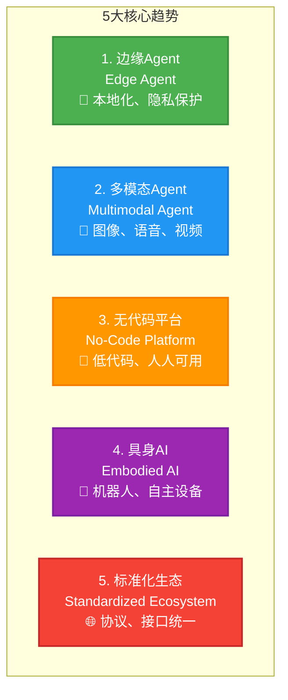
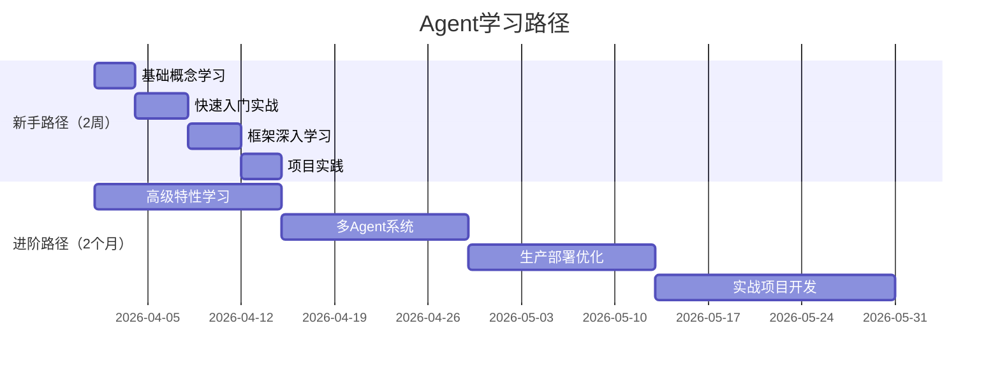

# 第十二章：未来已来—— Agent技术的核心趋势与系统学习路线

> **章节核心目标**
>
> 给读者明确的Agent技术未来发展趋势，同时分人群提供系统的学习路线，以及精准的高价值学习资源清单，给整个系列做完整的收尾。

---

## 开篇总结：我们走过的Agent学习之路

### 🎯 回顾核心内容

**通过前面11章，我们建立了完整的Agent认知体系：**

**第1章：** 搞懂了Agent是什么，以及它和传统程序、LLM的核心区别

**第2章：** 理解了Agent的进化史，从规则引擎到LLM的完整演进

**第3章：** 掌握了Agent的三大核心支柱：感知、决策、行动

**第4章：** 学习了Agent的完整架构，从最小可行到企业级分层

**第5章：** 深入理解了LLM怎么当Agent的"决策大脑"

**第6章：** 搞懂了Agent的记忆系统，解决了"健忘"问题

**第7章：** 给Agent接上了"手脚"，实现了工具调用

**第8章：** 进阶到多Agent系统，实现了智能体协作

**第9章：** 通过6个真实案例，看到了Agent的落地价值

**第10章：** 动手搭建了第一个Agent

**第11章：** 了解了Agent的风险和边界，学会了避坑

---

### 📈 你现在的水平

**完成这个系列的学习后，你应该：**
- ✅ 彻底搞懂Agent的核心概念
- ✅ 理解Agent的完整工作原理
- ✅ 能独立搭建一个可用的Agent
- ✅ 看懂所有Agent落地场景
- ✅ 避开90%的新手踩坑
- ✅ 建立了系统的Agent知识体系

**你已经从一个Agent小白，成长为能够独立开发、落地Agent的入门开发者！**

---

## Agent技术的5大核心发展趋势（2026-2028年）

### 🚀 趋势1：端侧本地化Agent—— 隐私与低延迟的终极解决方案

#### 核心逻辑

**大模型越来越小，性能越来越强，能在手机、电脑、智能家居设备上本地运行。**

**Agent完全本地化，数据不出端，隐私有保障，延迟极低。**

---

#### 🌟 落地场景

**场景1：端侧个人助理**
```
你的手机上有一个本地Agent：
- 完全运行在手机上
- 数据不上传云端
- 响应速度极快
- 隐私绝对安全
```

**场景2：本地智能家居中控**
```
家里的智能音箱里运行Agent：
- 本地处理指令
- 无需联网
- 延迟极低
- 24小时在线
```

**场景3：车载Agent**
```
你的汽车里运行Agent：
- 本地语音交互
- 智能导航
- 无需联网
- 实时响应
```

**场景4：无网络环境的工业Agent**
```
工厂里的设备运行Agent：
- 本地监控设备
- 预测性维护
- 无需联网
- 数据不出厂
```

---

#### 🎯 对普通人的影响

**每个人都能拥有一个完全属于自己的、隐私安全的专属Agent：**
- 不用担心数据泄露
- 响应速度极快
- 24小时在线
- 完全个性化

---

### 🚀 趋势2：多模态原生Agent—— 从"能说"到"能看、能听、能动手"

#### 核心逻辑

**Agent不再只处理文本，而是原生支持图片、语音、视频、3D场景的感知和交互。**

**能理解视觉信息、听懂语音、操作画面，真正和物理世界交互。**

---

#### 🌟 落地场景

**场景1：具身智能机器人**
```
家庭服务机器人：
- 能看到环境（视觉）
- 能听懂指令（语音）
- 能操作物体（机械臂）
- 能自主导航（移动）
真正走进现实世界，帮你做家务
```

**场景2：自动驾驶Agent**
```
自动驾驶汽车：
- 能看到路况（视觉）
- 能听懂语音指令
- 能自主驾驶（决策）
- 能和乘客对话（交互）
```

**场景3：直播带货Agent**
```
直播Agent：
- 能看到直播间画面
- 能识别商品
- 能和观众实时互动
- 能根据观众反应优化话术
```

**场景4：工业质检Agent**
```
工厂质检Agent：
- 能看到产品图像
- 能识别缺陷
- 能分类判断
- 能实时反馈
```

---

#### 🎯 对普通人的影响

**Agent能做的事情不再局限于线上，能真正走进现实世界：**
- 家庭机器人帮你做家务
- 自动驾驶汽车送你出行
- 智能监控保护家庭安全
- 工业机器人提升生产效率

---

### 🚀 趋势3：无代码/低代码Agent平台—— 人人都能定制自己的Agent

#### 核心逻辑

**Agent的开发门槛越来越低，通过无代码/低代码平台，普通人不用写一行代码，就能定制自己的专属Agent。**

---

#### 🌟 落地场景

**场景1：中小企业的定制化客服Agent**
```
中小企业老板：
- 登录无代码平台
- 拖拽式配置Agent
- 上传产品手册
- 配置回复规则
- 30分钟上线客服Agent
```

**场景2：个人的效率Agent**
```
普通上班族：
- 登录平台
- 选择模板（日程管理Agent）
- 配置个人偏好
- 绑定日历API
- 5分钟拥有个人助理
```

**场景3：门店的会员管理Agent**
```
门店店主：
- 上传会员数据
- 配置营销规则
- 设置自动回复
- 上线会员管理Agent
```

**场景4：老师的教学辅助Agent**
```
老师：
- 上传教学资料
- 配置答疑规则
- 上线教学Agent
- 帮助学生答疑
```

---

#### 🎯 对普通人的影响

**Agent不再是开发者的专利，每个人都能根据自己的需求，定制属于自己的Agent：**
- 真正实现AI的平民化
- 不需要编程知识
- 门槛降至0

---

### 🚀 趋势4：具身智能Agent—— 从虚拟世界走向物理世界

#### 核心逻辑

**Agent和机器人、机械臂、自动驾驶设备结合，能在物理世界自主移动、操作物体、完成复杂的物理任务。**

**真正实现"能思考、能动手"。**

---

#### 🌟 落地场景

**场景1：家庭服务机器人**
```
机器人Agent：
- 能自主导航
- 能识别物体
- 能操作家电
- 能做家务
- 能和人交互
```

**场景2：工业生产机器人**
```
工厂机器人Agent：
- 能自主装配
- 能质量检测
- 能包装运输
- 能协作配合
```

**场景3：物流配送机器人**
```
配送机器人Agent：
- 能自主导航
- 能避障
- 能配送货物
- 能和客户交互
```

**场景4：医疗辅助机器人**
```
医疗机器人Agent：
- 能辅助手术
- 能配送药品
- 能照顾病人
- 能监测健康
```

---

#### 🎯 对普通人的影响

**Agent能真正帮你完成现实世界的体力劳动：**
- 从线上的助理，变成线下的管家
- 解放双手，提升生活质量
- 重新定义"生活服务"

---

### 🚀 趋势5：多Agent生态标准化—— 从碎片化到互联互通

#### 核心逻辑

**当前Agent框架、协议、工具都是碎片化的，未来会形成标准化的协议。**

**不同平台的Agent能互联互通、互相调用、协作完成任务，形成完整的Agent生态。**

---

#### 🌟 落地场景

**场景1：企业级Agent生态**
```
企业内部的多个Agent：
- 客服Agent
- 销售Agent
- 数据分析Agent
- 财务Agent

标准化协议：
- Agent之间可以互相调用
- 数据可以共享
- 协作更顺畅
```

**场景2：跨平台个人助理Agent**
```
你的个人Agent：
- 可以在你的手机上
- 可以在你的电脑上
- 可以在你的智能音箱上
- 可以在你的汽车上

数据同步：
- 所有平台数据同步
- 体验一致
- 无缝切换
```

**场景3：Agent之间的服务交易**
```
Agent A（擅长数据分析）：
- 可以提供数据分析服务
- 其他Agent可以调用
- 收取费用

Agent B（擅长文案创作）：
- 可以提供文案服务
- 其他Agent可以调用
- 收取费用

形成Agent服务市场
```

---

#### 🎯 对普通人的影响

**你的Agent能对接所有的平台和服务：**
- 不用在多个APP之间切换
- 一个Agent搞定所有事情
- 真正实现"一站式服务"

---

## 系统学习路线：分人群的精准学习路径

### 📚 路线1：小白入门路线（零基础，2周入门）

**适合人群：**
- 零基础小白
- 想快速了解Agent
- 不想深入技术细节

---

#### 第1阶段（3天）：基础认知

**学习内容：**
- 搞懂LLM、Agent的核心概念
- 理解Agent的4个核心特征
- 看懂Agent的应用场景

**学习资源：**
- 本系列博客：第一章、第二章、第九章
- 视频：搜索"AI Agent入门"
- 实践：体验ChatGPT、豆包等大模型

**阶段目标：** 理解Agent是什么，能看懂Agent相关讨论

---

#### 第2阶段（4天）：基础实操

**学习内容：**
- 学习Prompt Engineering
- 学会用现成的Agent平台
- 搭建无代码Agent

**学习资源：**
- 本系列博客：第五章
- 无代码平台：Coze、扣子、Dify
- 实践：在平台上搭建第一个Agent

**阶段目标：** 能搭建一个简单的无代码Agent

---

#### 第3阶段（5天）：代码入门

**学习内容：**
- 学习Python基础
- 跑通本系列第十章的第一个Agent代码
- 搞懂核心组件

**学习资源：**
- 本系列博客：第十章
- Python教程：廖雪峰Python教程
- 实践：运行、修改代码

**阶段目标：** 能跑通一个完整的Agent代码

---

#### 第4阶段（4天）：进阶实操

**学习内容：**
- 给Agent增加更多工具
- 优化记忆系统
- 尝试简单的多Agent协作

**学习资源：**
- 本系列博客：第六章、第七章、第八章
- 实践：改造自己的Agent

**阶段目标：** 能独立搭建一个可用的Agent

---

**总时长：** 2周（每天2-3小时）

**核心目标：**
- 能独立搭建一个可用的Agent
- 搞懂Agent的核心逻辑
- 能看懂主流的Agent落地场景

---

### 📚 路线2：进阶深耕路线（有基础，2个月深耕）

**适合人群：**
- 有编程基础
- 想深入掌握Agent
- 想从事Agent相关工作

---

#### 第1阶段（1周）：架构深耕

**学习内容：**
- 深入学习Agent的各类架构设计
- 掌握完整的分层架构
- 学习状态管理、长任务处理

**学习资源：**
- 本系列博客：第四章
- 书籍：《Designing Machine Learning Systems》
- 论文：Agent架构相关论文

**阶段目标：** 能设计复杂的Agent架构

---

#### 第2阶段（2周）：核心技术深耕

**学习内容：**
- 深入学习ReAct、反思机制
- 记忆系统优化
- RAG进阶
- Function Call进阶

**学习资源：**
- 本系列博客：第五章、第六章、第七章
- 论文：ReAct、Reflexion、AutoGPT
- 实践：复现经典论文

**阶段目标：** 深入理解Agent核心技术

---

#### 第3阶段（2周）：多Agent深耕

**学习内容：**
- 深入学习多Agent的协作范式
- 角色设计、通信机制
- 复杂场景落地

**学习资源：**
- 本系列博客：第八章
- 框架：AutoGen、CrewAI源码
- 实践：搭建复杂多Agent系统

**阶段目标：** 能设计并实现复杂多Agent系统

---

#### 第4阶段（3周）：工程化落地

**学习内容：**
- Agent的工程化部署
- 稳定性优化
- 成本控制
- 安全防护
- 合规设计

**学习资源：**
- 本系列博客：第十一章
- 实践：部署生产级Agent
- 书籍：《Building Production-Grade AI Applications》

**阶段目标：** 能部署企业级Agent系统

---

#### 第5阶段（2周）：实战落地

**学习内容：**
- 完成一个完整的商用Agent项目
- 从需求分析、架构设计、开发实现、部署上线、优化迭代全流程

**实战项目：**
- 选择一个真实场景
- 完整实现Agent
- 部署上线
- 收集反馈，优化迭代

**阶段目标：** 有一个完整的商用Agent项目经验

---

**总时长：** 2个月（每天4-6小时）

**核心目标：**
- 能独立设计、开发、部署企业级Agent系统
- 解决实际的业务问题
- 成为Agent领域的专业人才

---

## 高价值学习资源清单（精准筛选，不堆砌）

### 📖 官方文档（入门首选）

**LangChain官方文档**
- 地址：https://python.langchain.com/
- 特点：文档最全，案例丰富
- 适合：新手入门

**CrewAI官方文档**
- 地址：https://docs.crewai.com/
- 特点：多Agent开发，上手简单
- 适合：多Agent入门

**AutoGen官方文档**
- 地址：https://microsoft.github.io/autogen/
- 特点：微软出品，群聊协作强
- 适合：复杂多Agent场景

---

### 🎓 免费系统课程

**吴恩达《AI Agent for Everyone》**
- 平台：Coursera
- 特点：系统全面，适合零基础
- 时长：6小时

**Fast.ai《Practical Deep Learning for Coders》**
- 平台：Fast.ai
- 特点：实战导向，免费
- 时长：20小时

**李宏毅《机器学习》**
- 平台：B站、YouTube
- 特点：中文讲解，通俗易懂
- 时长：30小时

---

### 📄 必看经典论文

**ReAct: Synergizing Reasoning and Acting in Language Models (2022)**
- 核心价值：提出ReAct框架，90%商用Agent的基础
- 难度：⭐⭐⭐
- 链接：https://arxiv.org/abs/2210.03629

**Reflexion: Language Agents with Verbal Reinforcement Learning (2023)**
- 核心价值：提出反思机制，大幅提升Agent能力
- 难度：⭐⭐⭐⭐
- 链接：https://arxiv.org/abs/2303.11366

**AutoGPT: An Autonomous GPT-4 Agent (2023)**
- 核心价值：引爆Agent热潮的项目
- 难度：⭐⭐⭐
- GitHub：https://github.com/Significant-Gravitas/AutoGPT

**Cognitive Architectures for Language Agents (2024)**
- 核心价值：Agent认知架构的综述
- 难度：⭐⭐⭐⭐⭐
- 链接：https://arxiv.org/abs/2309.02427

---

### 💻 优质开源项目

**LangChain**
- GitHub：https://github.com/langchain-ai/langchain
- Star：90k+
- 特点：最流行的Agent框架

**AutoGen**
- GitHub：https://github.com/microsoft/autogen
- Star：30k+
- 特点：微软出品，多Agent协作

**CrewAI**
- GitHub：https://github.com/joaomdmoura/crewAI
- Star：10k+
- 特点：角色明确，上手简单

**AgentLite**
- GitHub：https://github.com/OpenBMB/AgentLite
- Star：3k+
- 特点：轻量级Agent框架

---

### 🌐 优质社区与资讯平台

**国外：**
- GitHub：跟踪最新开源项目
- HuggingFace：模型和Agent社区
- Reddit（r/LocalLLama）：Agent讨论社区
- Twitter：关注Agent领域专家

**国内：**
- 掘金：Agent技术文章
- 知乎：Agent讨论和问答
- 公众号：机器之心、AI前线、新智元
- B站：Agent教程视频

---

## 系列收尾：AI Agent的未来，是让每个人都能拥有专属的智能助理

### 🎯 核心观点

**AI Agent的核心价值，不是替代人，而是解放人的重复劳动，让人能专注于更有创造力、更有价值的事情。**

---

### 🌈 未来已来

**未来5年，我们可能会看到：**
- 每个人都有一个专属的AI Agent
- Agent走进千家万户，成为生活助手
- Agent重塑企业，提升生产力
- Agent改变工作方式，解放人类

---

### 💪 你的Agent学习之路

**完成这个系列的学习后，你已经：**
- ✅ 建立了完整的Agent知识体系
- ✅ 能独立搭建Agent
- ✅ 能看懂所有Agent落地场景
- ✅ 能避开90%的新手踩坑

**下一步，你可以：**
1. **动手实践**：搭建自己的Agent
2. **深入学习**：选择进阶路线，深耕技术
3. **参与社区**：分享经验，共同成长
4. **持续关注**：跟踪Agent最新发展

---

### 🚀 最后的邀请

**AI Agent正在改变AI的未来，这是一个巨大的机会。**

**希望这个系列能帮你：**
- 打开AI Agent的大门
- 在未来的AI时代，抓住属于自己的机会
- 用Agent提升效率，解放创造力
- 成为AI时代的先行者

**未来已来，让我们一起创造！**

---

## 📊 配图说明

**图1：5大核心趋势全景图**

*5个板块展示5大趋势*

**图2：学习路线路径图**

*时间轴展示两个学习路线*

---

## 📝 全系列最终总结

**我们完成了什么？**
- 12章完整内容
- 开篇词 + 附录
- 约5万字的系统科普
- 6大真实案例
- 1个完整实战教程
- 0门槛入门指南

**你收获了什么？**
- 完整的Agent知识体系
- 动手实践的能力
- 避坑的经验
- 未来的方向

**下一步是什么？**
- 动手搭建你的Agent
- 持续学习，持续实践
- 分享经验，共同成长

---

> **💡 最后的话**
>
> 感谢你陪伴这个系列走完完整的Agent学习之旅。
>
> 希望这个系列能真正帮助你理解AI Agent，搭建自己的Agent，在AI时代抓住属于自己的机会。
>
> **未来已来，让我们一起创造！**
>
> **👋 再见，祝你在Agent的世界里，探索出属于自己的精彩！**

---

**系列完结！**
