# 开篇总序：让AI模型真正"武装上阵"

> 写给每一个想让AI模型走出实验室的工程师、决策者和爱好者

---

## 写在前面

你可能在Notebook里把模型调到了99%的准确率，但一上线就频频崩溃；

你可能做出了一个惊艳的LLM应用，但并发一高就超时瘫痪；

你可能训练了优秀的推荐模型，但线上效果却离线效果大相径庭。

这些问题，不是你的模型不够好，而是你的模型缺少了一层"作战装备"——**Harness Engineering**。

---

## 本系列写给谁看？

### 👶 纯新手/学生/AI爱好者

你刚刚接触AI，可能跑过几个模型Demo，想了解如何让AI模型真正落地到生产环境。

**阅读路径**：重点关注第1-5章、第10章，跟着新手任务动手实操，7天跑通最小可行Harness体系。

### 💻 个人开发者/初级算法工程师

你已经训练过模型，但模型上线后总是遇到各种问题，想系统学习如何让模型稳定运行。

**阅读路径**：重点读第2-8章，理解核心模块，学习工具选型，掌握落地流程，避开常见陷阱。

### 🏢 初创公司/小团队

你们团队已经做了一些AI应用，但工程化水平不高，故障频发，迭代缓慢，想提升稳定性。

**阅读路径**：重点读第2-6章、第8章，学习最小可行体系，参考正向案例，避开发散式大而全的陷阱。

### 👔 技术负责人/技术决策者

你需要评估是否在团队内推行Harness Engineering，想知道投入产出比、落地路径、未来趋势。

**阅读路径**：重点读第2-3章、第8-10章，理解核心价值，参考真实案例，制定团队落地计划。

---

## 读完这套系列，你将收获什么？

### ✅ 清晰的认知框架

搞懂Harness Engineering的定义、边界、核心模块，知道它和MLOps、DevOps、AI Agent的关系和区别，建立完整的认知体系。

### ✅ 可落地的实战能力

掌握从0到1落地Harness Engineering的五步法，每一步都有明确的动作、模板、验收标准，可以直接复用到你的项目中。

### ✅ 避开90%的踩坑

学习行业内上百个团队的踩坑经验，提前规避"特征不一致"、"只监控技术指标"、"大而全陷阱"等高频问题。

### ✅ 工具选型能力

了解主流工具的特点、适用场景、新手友好度，能根据团队规模和技术栈选择最合适的工具组合。

### ✅ 分人群的行动计划

无论你是纯新手、初级工程师还是技术负责人，都有对应的成长路径和落地计划，可以直接照着执行。

---

## 核心术语澄清：什么是 Harness Engineering？

在正式开始之前，我们必须先澄清一个容易混淆的术语。

### ⚠️ 术语强制澄清

本文讨论的 **Harness Engineering**，特指：

> **通过工程化手段，将AI模型封装为高可用、可监控、可迭代的生产级服务的全链路实践**，是MLOps在落地层的深化实践。

**它不是**：CI/CD工具 Harness（软件交付平台）

**为什么需要澄清**？

因为"Harness"这个词在技术领域有两个常见的含义：
1. **CI/CD工具 Harness**：一个用于软件交付的DevOps平台
2. **Harness Engineering**（本文主题）：AI模型工程化落地的实践体系

为了避免混淆，本文开篇即明确：**我们讨论的是AI模型工程化，不是CI/CD工具**。

---

## 大白话核心价值

Harness Engineering的本质，就是**给AI模型做"全流程售后保障"**。

让它从实验室里的"完美样品"，变成能扛住高并发、不出故障、可随时升级的线上"合格品"。

打个比方：

- **训练模型**：就像造一辆法拉利跑车，在实验室里跑得飞快
- **Harness Engineering**：就像给这辆车装上刹车系统、安全气囊、导航仪、保养体系，让它能在真实的公路上稳定、安全地跑

没有Harness Engineering的模型，就像一辆没有刹车、没有安全气囊的跑车，在实验室里很炫，但一上公路就会出问题。

---

## 受众分层阅读指南

### 👶 纯新手/学生/AI爱好者

**优先阅读**：第1-5章、第10章

**核心目标**：
- 理解为什么需要Harness Engineering
- 掌握最小可行Harness（3步搭建）
- 跟着新手任务动手实操
- 7天内跑通第一个带监控的模型服务

**时间投入**：5-7天

### 💻 个人开发者/初级算法工程师

**优先阅读**：第1-8章

**核心目标**：
- 理解核心定义和四大支柱
- 掌握工具选型方法
- 学习五步落地流程
- 避开90%的常见陷阱
- 能在项目中落地最小可行体系

**时间投入**：7-10天

### 🏢 初创公司/小团队

**优先阅读**：第2-6章、第8章

**核心目标**：
- 理解核心价值和边界
- 选择合适的工具组合
- 参考正向案例的落地路径
- 避开"大而全"陷阱
- 提升服务稳定性和迭代效率

**时间投入**：10-14天（含试点落地）

### 👔 技术负责人/技术决策者

**优先阅读**：第2-3章、第8-10章

**核心目标**：
- 理解Harness Engineering的ROI
- 评估团队落地路径
- 参考真实案例的投入产出
- 了解未来趋势
- 制定团队落地计划

**时间投入**：3-5天

---

## 配套资源说明

为了让你的学习更加高效，本系列博客配套了完整的资源：

### 📦 GitHub开源仓库（即将发布）

包含所有章节的：
- 示例代码（FastAPI模型服务化、监控接入、CI/CD配置）
- Docker配置文件
- Prometheus+Grafana监控模板
- Kubernetes部署YAML
- 一键回滚脚本

你可以直接复制使用，快速搭建自己的Harness体系。

### 🎨 配套图表

每章都配套了：
- Mermaid流程图（核心流程可视化）
- 对比表格（概念辨析、工具选型）
- 架构图（系统设计参考）

图片存放在 `image/` 文件夹中，方便查阅和引用。

### 💬 互动交流

每章末尾都有思考题和投票，欢迎在评论区分享你的观点和经验。

---

## 最佳阅读体验建议

1. **按顺序阅读**：建议按章节顺序阅读，每章内容前后呼应，建立完整认知体系
2. **边读边动手**：遇到"新手入门小任务"，建议动手尝试，加深理解
3. **结合自己的项目**：阅读时思考"这个内容如何应用到我的项目中"，效果更好
4. **记笔记**：每章结束后，记录核心要点和自己的思考，形成知识体系
5. **查阅术语表**：遇到不熟悉的术语，可以回顾第二章的边界辨析部分

---

## 全系列导航

```mermaid
graph LR
    A[00-开篇总序<br/>建立全貌认知] --> B[01-破题<br/>理解为什么需要]
    B --> C[02-正名<br/>明确定义与边界]
    C --> D[03-核心辨析<br/>vs AI Agent]
    D --> E[04-四大支柱<br/>掌握核心模块]
    E --> F[05-工具全景图<br/>学习工具选型]
    F --> G[06-实战五步法<br/>掌握落地流程]
    G --> H[07-避坑指南<br/>避开常见陷阱]
    H --> I[08-全案复盘<br/>参考真实案例]
    I --> J[09-未来趋势<br/>了解发展方向]
    J --> K[10-行动指南<br/>制定落地计划]

    style A fill:#e1f5ff
    style E fill:#fff4e1
    style G fill:#ffe1f5
    style K fill:#e1ffe1
```

**章节快速跳转**：
- 想了解"为什么需要"？→ [第1章：破题](./01-第一章-破题.md)
- 想知道"是什么"？→ [第2章：正名](./02-第二章-正名.md)
- 想理解"四大支柱"？→ [第4章：四大支柱](./04-第四章-四大支柱.md)
- 想学习"落地流程"？→ [第6章：实战五步法](./06-第六章-实战五步法.md)
- 想制定"行动计划"？→ [第10章：行动指南](./10-第十章-行动指南.md)

---

## 写在最后

AI行业的发展，已经从"拼模型效果"的时代，进入了"拼落地能力"的时代。

能把模型训练到99%的准确率，是算法能力；
能把99%准确率的模型，稳定、低成本地给百万用户用，就是Harness Engineering的工程能力。

希望这套系列博客，能帮你给你的AI模型，打造一套坚不可摧的"作战装备"，让它真正走出实验室，在生产环境里"武装上阵"，创造实际的业务价值。

**准备好开始这段旅程了吗？让我们从第1章开始吧！** 🚀

---

**下一章**：[第1章：破题｜当你的AI模型"走出实验室"后，为何频频"掉链子"？](./01-第一章-破题.md)
