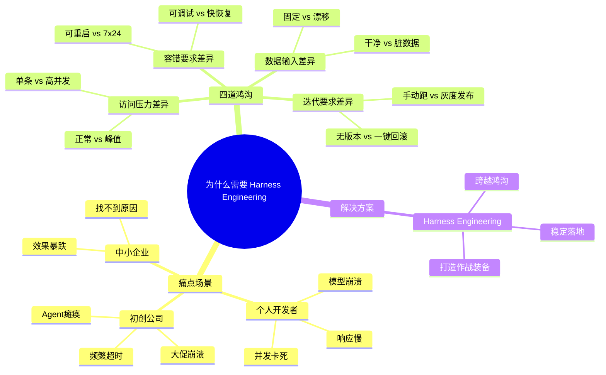

# 第1章：破题｜当你的AI模型"走出实验室"后，为何频频"掉链子"？

> 建立读者共鸣，用真实痛点戳中需求，讲清"为什么我们需要Harness Engineering"

---

## 开篇思考：你是否遇到过这些情况？

你在Jupyter Notebook里把MNIST手写识别模型调到了99%的准确率，用Flask简单打包上线后：

- 用户上传一张稍微模糊的图片，服务直接崩溃
- 第一个请求要等5秒才响应，用户以为网站挂了
- 并发一超过10，整个服务就卡死不动

你做了一个LLM客服机器人，在测试环境对答如流：

- 上线后并发超过50就频繁超时
- 调用翻译模型时出错，直接导致整个Agent瘫痪
- 大促期间流量暴涨，服务全线崩溃2小时

你训练了商品推荐模型，离线AUC高达0.85：

- 上线后推荐点击率不升反降
- 完全找不到问题出在哪
- 不知道是模型问题、数据问题还是工程问题

如果你有过以上任何一种经历，那么恭喜你——**你遇到的不是模型问题，而是典型的"模型走出实验室"后的工程化问题**。

这正是Harness Engineering要解决的核心问题。

---

## 本章核心定位

用真实痛点戳中需求，讲清「为什么我们需要Harness Engineering」，是全文的钩子章节。

---

## 1. 三个全民级痛点场景（覆盖全受众）

### 场景1：个人开发者 —— "在Notebook里飞快，一上线就崩溃"

**背景**：
小明是个AI爱好者，刚学了深度学习，在Jupyter Notebook里训练了一个MNIST手写识别模型，测试集准确率达到了99%。

**问题**：
他用Flask简单包装了一下，部署到云服务器上。结果：
- 首次请求要加载模型权重到GPU，耗时5秒，用户以为网站挂了
- 用户上传了一张稍微模糊的图片，预处理代码没有做异常处理，服务直接500错误
- 同时有5个用户访问，Python进程CPU直接打满，后续请求全部超时

**根本原因**：
实验环境和生产环境是两套完全不同的逻辑：
- 实验室：干净的数据、单条请求、没有并发压力
- 生产环境：脏数据、高并发、突发的异常情况

---

### 场景2：初创公司 —— "测试时对答如流，上线后频频瘫痪"

**背景**：
某初创公司做了一款LLM智能客服Agent，能自动回答用户咨询、查订单、调用翻译模型处理海外用户问题。在测试环境里，一切都运行得很完美。

**问题**：
上线后遇到大促活动，用户并发暴涨：
- 翻译模型接口开始频繁超时
- Agent没有熔断机制，等待翻译接口导致所有用户的请求全部阻塞
- 整个客服系统全线瘫痪2小时，损失超百万

**根本原因**：
缺少工程化的保障机制：
- 没有限流机制，流量直接打垮服务
- 没有熔断降级，单点故障导致整个系统瘫痪
- 没有监控告警，出现问题后无法快速定位

---

### 场景3：中小企业 —— "离线AUC 0.85，上线后效果暴跌"

**背景**：
某电商公司训练了商品推荐模型，离线测试AUC达到了0.85，效果很不错。

**问题**：
上线后，推荐点击率不升反降，完全找不到问题出在哪：
- 数据团队说模型没问题，离线效果很好
- 工程团队说服务没问题，接口正常返回
- 业务团队说推荐结果不相关，用户不点击

折腾了一个月，才发现是训练和推理用了两套特征计算代码，归一化参数不一致，导致模型上线后效果暴跌。

**根本原因**：
训练和推理的特征逻辑不一致，这是90%团队都踩过的坑。

---

## 2. 核心矛盾拆解：实验环境 vs 生产环境的4道鸿沟

为什么会这样？因为实验室环境和生产环境之间，存在4道巨大的鸿沟：

| 维度 | 实验室环境 | 生产环境 | 鸿沟有多大？ |
|------|-----------|----------|------------|
| **数据输入** | 干净、标准化的测试集 | 脏数据、模糊数据、恶意输入，分布随时变化 | 🔴 巨大 |
| **访问压力** | 单条/少量批量请求 | 高并发、突发流量、峰值请求 | 🔴 巨大 |
| **容错要求** | 出错可重启、可重跑 | 7×24小时可用，故障必须快速恢复 | 🔴 巨大 |
| **迭代要求** | 改完参数手动跑一遍 | 灰度发布、一键回滚、效果可量化对比 | 🔴 巨大 |

让我们逐个拆解这4道鸿沟：

### 鸿沟1：数据输入的巨大差异

**实验室**：
- 数据集经过精心清洗，格式统一
- 没有缺失值、异常值、恶意输入
- 数据分布固定，不会随时间变化

**生产环境**：
- 用户上传的图片可能模糊、翻转、格式不对
- 文本输入可能包含特殊字符、恶意注入
- 数据分布会随时间漂移，导致模型效果悄悄下降

**影响**：
你在实验室里测试通过的模型，一上线就因为输入数据不标准而崩溃。

---

### 鸿沟2：访问压力的巨大差异

**实验室**：
- 一次只处理一条或一个小批量的请求
- 可以等待模型加载、推理完成
- 没有并发竞争

**生产环境**：
- 每秒可能有成百上千个请求
- 大促期间可能有10倍、100倍的峰值流量
- 多个请求并发竞争资源

**影响**：
单条请求处理得再好，并发一上来就全部超时、崩溃。

---

### 鸿沟3：容错要求的巨大差异

**实验室**：
- 出错了可以重启程序、重新跑一遍
- 没有时间压力，可以慢慢调试
- 不影响任何用户

**生产环境**：
- 必须保证7×24小时高可用
- 出故障后必须在几分钟内恢复
- 每分钟故障都可能带来业务损失

**影响**：
实验室里可以容忍的错误，在生产环境里就是重大事故。

---

### 鸿沟4：迭代要求的巨大差异

**实验室**：
- 改完参数，手动跑一遍测试集
- 不需要对比效果，没有版本管理
- 想改就改，想回滚就重来

**生产环境**：
- 需要灰度发布，先给1%用户测试
- 需要量化对比新旧版本的效果
- 出问题需要一键回滚到上一个稳定版本

**影响**：
模型迭代变成高风险操作，很多团队因为怕出问题而不敢频繁上线新模型。

---

## 3. 概念引出：Harness Engineering 是什么？

面对这4道鸿沟，我们需要一个专门的工程化体系来解决——这就是 **Harness Engineering**。

> **Harness Engineering**：为AI模型打造"作战装备"的工程学科，专门解决模型从实验室到生产环境的落地难题。

打个比方：

- **训练模型**：就像在实验室里造一辆法拉利跑车，性能极致
- **Harness Engineering**：就像给这辆车装上：
  - 刹车系统（熔断降级）
  - 安全气囊（故障容错）
  - 导航仪（全链路监控）
  - 保养体系（持续迭代）

让这辆"实验室赛车"能在真实的公路上稳定、安全地行驶。

---

## 4. 你将在本文学到什么？

通过本章，你已经了解了：

- ✅ **3个真实痛点**：个人开发者、初创公司、中小企业都会遇到的"模型走出实验室"问题
- ✅ **4道核心鸿沟**：实验环境和生产环境的巨大差异
- ✅ **Harness Engineering 的核心价值**：专门解决这些鸿沟的工程化体系

在接下来的章节中，你将学到：

- **第2章**：Harness Engineering 的精准定义、边界辨析、最小可行方案
- **第3章**：与AI Agent的区别与协作关系
- **第4章**：四大核心支柱（服务化、数据、可观测、安全）
- **第5章**：工具选型指南，不同团队规模的适配方案
- **第6章**：从0到1落地的五步法
- **第7章**：90%团队都会踩的坑，提前避坑
- **第8章**：真实案例复盘，正反对比
- **第9章**：大模型时代的新挑战与新方向
- **第10章**：分人群的落地计划与成长路径

---

## 5. 章末互动

### 思考题

你的AI模型/项目，上线后遇到过最头疼的问题是什么？

- A. 准确率暴跌，找不到原因
- B. 响应超时，用户体验差
- C. 服务崩溃，频繁故障
- D. 无法快速定位问题
- E. 其他（欢迎评论区分享）

### 投票

你踩过以下哪个坑？

- [ ] 准确率暴跌：训练效果好，上线效果差
- [ ] 响应超时：首请求要等很久
- [ ] 服务崩溃：并发一高就挂
- [ ] 找不到问题：出了问题不知道在哪

欢迎在评论区投票和分享你的经历！👇

---

## 本章要点回顾

---

**下一章**：[第2章：正名｜什么是Harness Engineering？——定义、边界与常见误区](./02-第二章-正名.md)

我们将深入探讨Harness Engineering的精准定义，它与MLOps、DevOps的关系，以及最常见的3个认知误区。
