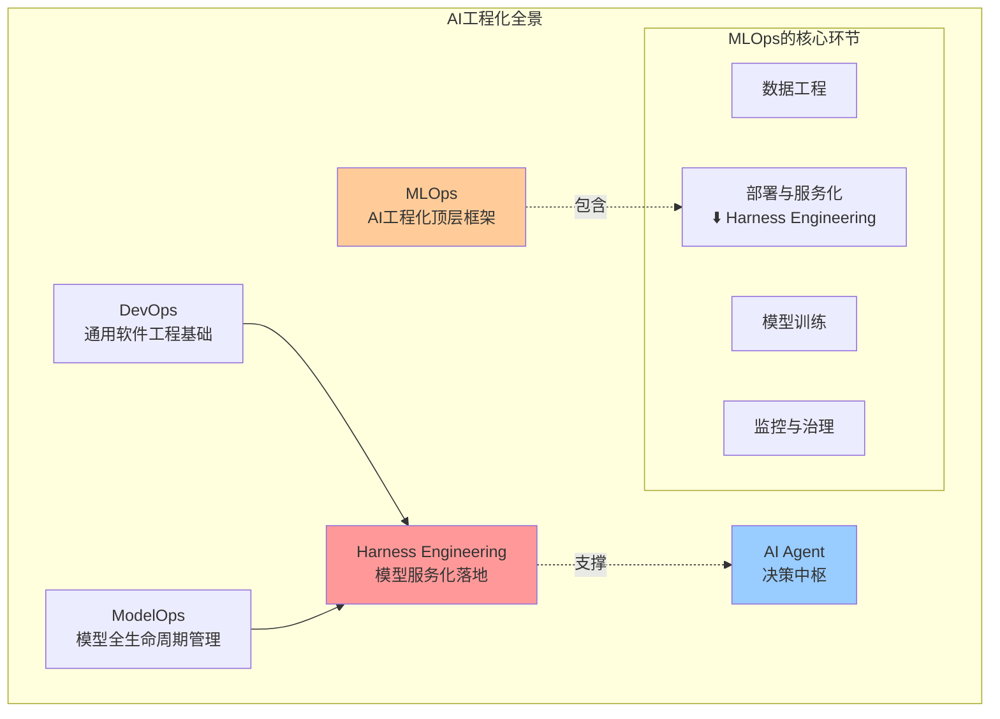
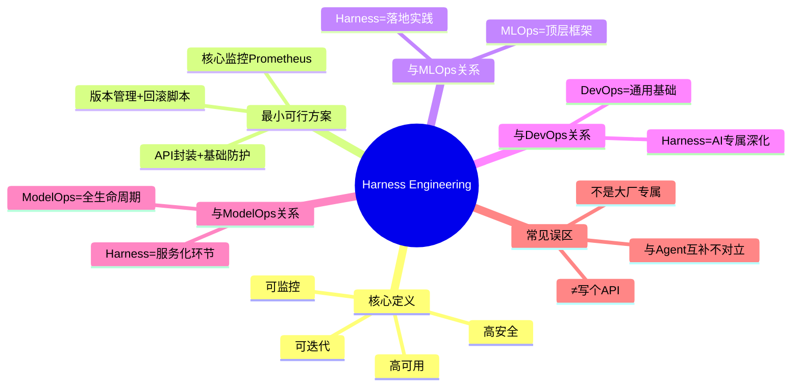

# 第2章：正名｜什么是Harness Engineering？——定义、边界与常见误区

> 给Harness Engineering下精准、无歧义的定义，划清与相关概念的边界，纠正常见认知误区

---

## 开篇思考：为什么需要"正名"?

在第1章中，我们看到了AI模型"走出实验室"后频频"掉链子"的三大痛点。

但你可能会问：

- "这听起来像MLOps啊？有什么区别？"
- "是不是就是给模型写个API接口？"
- "我们小团队用得上吗？这感觉是大厂的专属"

这些问题，都源于对Harness Engineering的**定义不清、边界不明、认知有误区**。

本章的目标，就是给Harness Engineering下一个**精准、无歧义的定义**，划清它与相关概念的边界，纠正最常见的认知误区，给新手一个**最低门槛的入门抓手**。

---

## 本章核心定位

给Harness Engineering下精准、无歧义的定义，划清与相关概念的边界，纠正常见认知误区，给读者建立清晰的认知框架，同时给新手最低门槛的入门抓手。

---

## 1. 精准权威定义

### 什么是 Harness Engineering？

> **Harness Engineering**：通过标准化的工程化手段，将AI/ML模型封装为**高可用、可监控、可迭代、高安全**的生产级服务，覆盖**模型推理服务化、数据治理、可观测、风险管控**的全链路实践体系。

### 大白话解读

它不是让模型变得更准，而是让**准的模型能稳定、安全、低成本地给用户用**，不会半路"掉链子"。

打个比方：

- **模型训练**：把菜做好（味道好）
- **Harness Engineering**：把菜送到客户手中（送得快、不洒、保温、可追溯、能退货）

---

## 2. 核心要素拆解

让我们拆解这个定义中的4个核心要素：

### 要素1：高可用（High Availability）

**是什么**：服务7×24小时稳定运行，故障率极低。

**为什么重要**：
- 用户不会因为服务故障而流失
- 业务不会因为服务中断而损失

**怎么做**：
- 容错设计：单点故障不影响整体服务
- 自动扩缩容：流量高峰时自动增加资源
- 多可用区部署：避免单区域故障导致服务全挂

---

### 要素2：可监控（Observability）

**是什么**：能实时看到服务的运行状态，出了问题能快速定位。

**为什么重要**：
- 黑盒运行是最大的风险
- 出了问题找不到原因是最大的痛苦

**怎么做**：
- 指标监控：QPS、延迟、错误率、GPU利用率
- 日志追踪：每一次请求的完整链路
- 异常告警：指标异常时自动通知

---

### 要素3：可迭代（Iterability）

**是什么**：能快速、安全地更新模型版本，出问题能快速回滚。

**为什么重要**：
- 模型需要持续优化才能保持效果
- 线上出问题需要快速恢复

**怎么做**：
- 版本管理：每个模型版本都有唯一的标识
- 灰度发布：先给小流量用户测试，验证通过后再全量
- 一键回滚：出问题后快速切回上一个稳定版本

---

### 要素4：高安全（Security）

**是什么**：防止恶意攻击、数据泄露、合规风险。

**为什么重要**：
- AI服务往往涉及敏感数据
- 恶意攻击可能导致服务瘫痪或数据泄露

**怎么做**：
- 输入校验：防止Prompt注入、恶意输入
- 权限管控：API鉴权、角色权限隔离
- 合规审计：操作日志留存、数据隐私保护

---

## 3. 最小可行Harness（MVH）：新手入门最低门槛

看到这里，你可能会想："这也太复杂了吧？我们小团队哪有资源做全链路？"

别担心，你不需要一步到位做全链路。我们定义了一个**最小可行Harness（Minimum Viable Harness, MVH）**，让个人和小团队也能快速上手。

### 最小可行Harness：3步就能搭建

针对个人/小团队，3步就能搭建的最小可用体系：

#### 第一步：API封装 + 基础防护

用FastAPI给模型做标准化API封装，加入：
- 输入校验：防止异常输入导致服务崩溃
- 基础限流：防止流量打垮服务
- 错误处理：统一的错误返回格式

**代码示例**：
```python
from fastapi import FastAPI, HTTPException
from pydantic import BaseModel
from slowapi import Limiter, _rate_limit_exceeded_handler
from slowapi.util import get_remote_address
from slowapi.errors import RateLimitExceeded

app = FastAPI()
limiter = Limiter(key_func=get_remote_address)
app.state.limiter = limiter
app.add_exception_handler(RateLimitExceeded, _rate_limit_exceeded_handler)

class PredictionRequest(BaseModel):
    text: str
    max_length: int = 100

@app.post("/predict")
@limiter.limit("10/minute")  # 限流：每分钟10次
async def predict(request: PredictionRequest):
    try:
        # 输入校验
        if not request.text or len(request.text) > 1000:
            raise HTTPException(status_code=400, detail="Invalid input")

        # 模型推理
        result = model.predict(request.text)

        return {"result": result}
    except Exception as e:
        # 统一错误处理
        raise HTTPException(status_code=500, detail=str(e))
```

---

#### 第二步：核心监控

用Prometheus接入核心监控指标：
- QPS：每秒请求数
- 延迟：P95/P99响应时间
- 错误率：请求失败的比例

**代码示例**：
```python
from prometheus_fastapi_instrumentator import Instrumentator

# 暴露Prometheus指标
Instrumentator().instrument(app).expose(app)
```

---

#### 第三步：版本管理 + 回滚脚本

编写模型版本快照与一键回滚脚本：

**脚本示例**：
```bash
#!/bin/bash
# rollback.sh - 一键回滚到上一个版本

CURRENT_VERSION=$(cat current_version.txt)
PREVIOUS_VERSION=$(cat previous_version.txt)

echo "Rolling back from $CURRENT_VERSION to $PREVIOUS_VERSION"

# 切换模型版本
ln -sf /models/$PREVIOUS_VERSION /models/current

# 更新版本文件
echo $PREVIOUS_VERSION > current_version.txt

# 重启服务
systemctl restart model-service

echo "Rollback completed!"
```

---

### MVH总结

这3步，1-2天就能完成，能覆盖80%的核心需求：
- ✅ 服务不会因为异常输入崩溃
- ✅ 流量不会打垮服务
- ✅ 出了问题能看到监控指标
- ✅ 新模型出问题能快速回滚

这就是最小可行Harness，**不用一步到位做全链路，先解决最核心的问题**。

---

## 4. 与相关概念的边界辨析

### 概念辨析表格

| 概念 | 核心角色 | 与Harness Engineering的关系 | 核心差异关键词 |
|------|---------|---------------------------|--------------|
| **MLOps** | AI工程化的顶层方法论框架 | Harness是MLOps在「部署-运维-服务化」环节的具象化落地实践 | **框架 vs 落地执行** |
| **DevOps** | 通用软件工程的基础体系 | Harness是DevOps在AI领域的垂直深化，叠加了模型、特征、推理的专属特性 | **通用软件工程 vs AI专属工程化** |
| **ModelOps** | 模型全生命周期管理体系 | Harness侧重模型的「服务化落地」环节，是ModelOps的核心子集 | **全生命周期管理 vs 生产服务化** |

让我们逐个分析：

---

### 4.1 Harness Engineering vs MLOps

#### MLOps是什么？

MLOps（Machine Learning Operations）是**AI工程化的顶层方法论框架**，覆盖：
- 数据工程
- 模型训练
- 模型部署
- 监控与治理
- 持续集成与交付

#### Harness Engineering是什么？

Harness Engineering是**MLOps在「部署-运维-服务化」环节的具象化落地实践**，专注于：
- 模型推理服务化
- 运行时监控与治理
- 故障容错与恢复
- 安全与合规

#### 关系比喻

- **MLOps**：就像盖房子的"建筑设计规范"
- **Harness Engineering**：就像盖房子时的"具体施工工艺"

MLOps是宏观的方法论，Harness Engineering是微观的落地执行。

---

### 4.2 Harness Engineering vs DevOps

#### DevOps是什么？

DevOps是**通用软件工程的基础体系**，覆盖：
- 持续集成（CI）
- 持续交付（CD）
- 基础设施即代码（IaC）
- 监控与日志

#### Harness Engineering有什么不同？

Harness Engineering是**DevOps在AI领域的垂直深化**，叠加了AI专属的特性：
- 模型版本管理（不是代码版本）
- 特征一致性保证（训练 vs 推理）
- 数据漂移检测（输入分布变化）
- 模型性能监控（准确率、召回率等）

#### 关系比喻

- **DevOps**：就像通用的"汽车驾驶手册"
- **Harness Engineering**：就像"F1赛车的专属驾驶手册"

DevOps适用于所有软件，Harness Engineering专门针对AI/ML系统的特殊需求。

---

### 4.3 Harness Engineering vs ModelOps

#### ModelOps是什么？

ModelOps是**模型全生命周期管理体系**，覆盖：
- 模型开发
- 模型训练
- 模型验证
- 模型部署
- 模型监控
- 模型退役

#### Harness Engineering有什么不同？

Harness Engineering**侧重模型的「服务化落地」环节**，专注于：
- 模型推理服务的高可用
- 运行时监控与故障恢复
- 安全防护与合规审计

#### 关系

Harness Engineering是ModelOps的核心子集，专注于生产运行环节。

---

## 5. 3个最常见的认知误区澄清

### ❌ 误区1：Harness Engineering = 给模型写个Flask/FastAPI接口

**纠正**：API封装只是其中1%的工作。

缺少以下能力的接口，上线后必然出问题：
- ❌ 没有监控 → 出了问题找不到原因
- ❌ 没有限流 → 流量打垮服务
- ❌ 没有熔断 → 下游故障导致整个系统瘫痪
- ❌ 没有回滚 → 新模型出问题无法快速恢复
- ❌ 没有数据校验 → 脏数据导致服务崩溃

**正确理解**：API封装只是第一步，更重要的是背后的监控、容错、安全体系。

---

### ❌ 误区2：Harness Engineering是大厂专属，小团队/个人用不上

**纠正**：小团队更需要——没有大厂的运维资源，更要靠标准化工程化避免线上故障。

**为什么小团队更需要**：
- 大厂：有专门的SRE团队、完善的监控体系、充足的资源
- 小团队：没有专职运维，出问题就是全团队的灾难

**最小可行Harness的优势**：
- ✅ 成本低：开源工具就能搞定，不需要昂贵的商业平台
- ✅ 见效快：3步就能搭建，1-2天就能上线
- ✅ 价值大：避免90%的常见故障，节省大量救火时间

**正确理解**：Harness Engineering不是大厂专属，小团队用它反而能获得更高的投入产出比。

---

### ❌ 误区3：Harness Engineering和AI Agent是对立的，二选一即可

**纠正**：二者是互补的支撑关系，没有Harness的底座，Agent就是"空中楼阁"。

**关系**：
- **AI Agent**：决定"做什么"（决策中枢）
- **Harness Engineering**：保障"怎么做"（工程底座）

**没有Harness的Agent问题**：
- 翻译工具超时 → Agent阻塞瘫痪
- 向量库故障 → Agent无法检索
- 流量暴涨 → Agent服务崩溃

**正确理解**：Agent决定了AI服务的「上限」，而Harness Engineering决定了AI服务的「下限」。没有稳定的工程底座，再聪明的Agent也无法落地商用。

---

## 6. 概念关系可视化



---

## 7. 章末互动

### 思考题

看完定义，你觉得你的项目当前最需要Harness解决的问题是什么？

- A. 服务频繁崩溃，需要高可用
- B. 出了问题找不到原因，需要可观测
- C. 模型迭代太慢，需要快速回滚
- D. 害怕被攻击，需要安全防护

欢迎在评论区分享你的想法！👇

---

## 本章要点回顾



---

**下一章**：[第3章：核心辨析｜Harness Engineering vs AI Agent：谁在"开车"，谁在"修路"？](./03-第三章-核心辨析.md)

我们将彻底讲清当下最容易混淆的两个概念的本质区别与协作关系，纠正"做Agent就不用做工程化"的错误认知。
