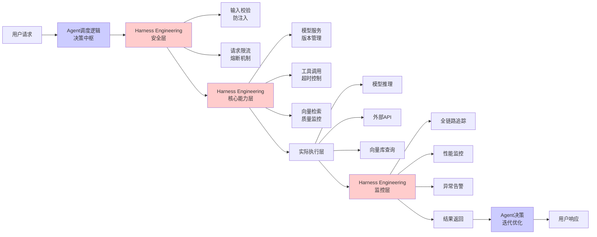
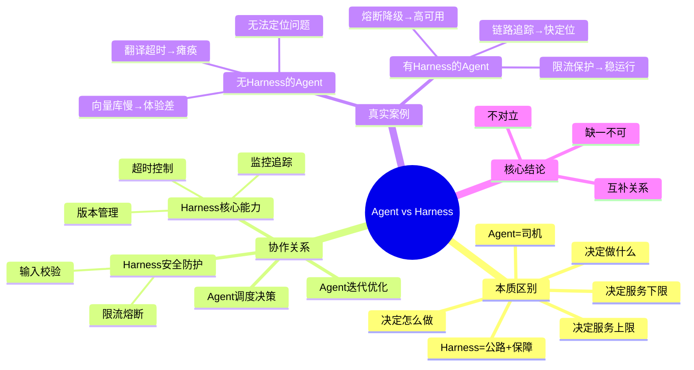

# 第3章：核心辨析｜Harness Engineering vs AI Agent：谁在"开车"，谁在"修路"？

> 彻底讲清当下最容易混淆的两个概念的本质区别与协作关系，纠正"做Agent就不用做工程化"的错误认知

---

## 开篇思考：两个最容易混淆的概念

随着AI Agent的火爆，很多从业者产生了一个困惑：

> "做了AI Agent，还需要做Harness Engineering吗？"
> "Agent不就是工程化的体现吗？为什么还要单独做Harness？"
> "是不是二选一就够了？"

这个困惑的背后，是**对两个概念本质的不理解**。

AI Agent和Harness Engineering，不是非此即彼的替代关系，而是**互补的支撑关系**。

- **AI Agent**：决定"做什么"（决策中枢）
- **Harness Engineering**：保障"怎么做"（工程底座）

没有Harness的底座，Agent就是"空中楼阁"，随时会因为单点故障而瘫痪。

---

## 本章核心定位

彻底讲清当下最容易混淆的两个概念的本质区别与协作关系，纠正"做Agent就不用做工程化"的错误认知，为后续的核心模块讲解做铺垫。

---

## 1. 本质区别：用通俗类比讲透核心

### 什么是AI Agent？

**AI Agent**：智能体，是「开车的司机」——核心是决定「做什么」

> 基于大模型的自主决策单元，能够理解目标、拆解任务、调用工具、迭代优化，比如自动订票机器人、智能客服、自主数据分析Agent。

**核心能力**：
- 🧠 理解目标：理解用户的真实意图
- 🎯 拆解任务：把复杂目标拆解成可执行的步骤
- 🔧 调用工具：使用外部工具完成具体任务
- 🔄 迭代优化：根据反馈调整策略

**典型场景**：
- 自动订票Agent：理解"帮我订一张明天北京到上海的机票"，拆解任务，调用订票API
- 智能客服Agent：理解用户咨询，调用知识库查询，调用订单系统查询
- 数据分析Agent：理解"分析上个月的销售趋势"，调用SQL查询，生成图表

---

### 什么是Harness Engineering？

**Harness Engineering**：支撑底座，是「修好的公路+交通规则+安全气囊+刹车系统」——核心是解决「怎么稳定做到」

> 保障AI服务安全、稳定、持续运行的工程体系，覆盖模型推理服务化、数据治理、可观测、风险管控的全链路实践。

**核心能力**：
- 🛡️ 高可用：服务7×24小时稳定运行
- 👁️ 可观测：实时监控、快速定位问题
- 🚀 可迭代：快速、安全地更新模型版本
- 🔒 高安全：防止攻击、数据泄露、合规风险

**典型场景**：
- 模型服务化：把模型打包成高可用的API服务
- 监控告警：实时监控QPS、延迟、错误率
- 故障恢复：一键回滚、自动扩缩容
- 安全防护：输入校验、权限管控、审计日志

---

### 通俗类比：开车 vs 修路

| 维度 | AI Agent（司机） | Harness Engineering（公路+保障） |
|------|----------------|---------------------------|
| **核心角色** | 决定去哪里、怎么走 | 保障道路畅通、安全、可导航 |
| **关键能力** | 理解目的地、规划路线 | 铺路、设置红绿灯、安装护栏 |
| **失效后果** | 到不了目的地、走错路 | 车祸、堵死、无法通行 |
| **价值体现** | 决定上限（能做多少事） | 决定下限（能不能稳定跑） |

**核心结论**：
- 有了好司机（Agent），但路不好（没有Harness），车还是跑不快、容易出事故
- 有了好路（Harness），但司机不行（没有Agent），车也到不了目的地
- **最佳组合**：优秀的司机（Agent）+ 完善的道路保障（Harness）

---

## 2. 协作关系可视化流程图

让我们通过一个完整的流程图，看看Agent和Harness是如何协作的：



### 流程拆解

1. **用户请求** → Agent调度逻辑
   - Agent理解用户意图，决定要做什么

2. **Agent决策** → Harness安全层
   - 输入校验：防止Prompt注入、恶意输入
   - 请求限流：防止流量打垮服务

3. **Harness安全层** → 核心能力层
   - 模型服务版本管理：保证使用正确的模型版本
   - 工具调用超时控制：防止某个工具调用阻塞整个流程

4. **核心能力层** → 实际执行层
   - 模型推理：LLM生成内容
   - 外部API：调用翻译、天气等外部服务
   - 向量库查询：检索相关知识

5. **实际执行** → Harness监控层
   - 全链路追踪：记录每个环节的耗时和状态
   - 性能监控：QPS、延迟、错误率
   - 异常告警：出现问题时自动告警

6. **监控层** → Agent迭代优化
   - Agent根据执行结果，决定是否继续迭代
   - 比如工具调用失败，Agent可以尝试备用方案

7. **Agent决策** → 用户响应
   - Agent将最终结果返回给用户

---

## 3. 真实落地案例：没有Harness的Agent，就是"裸奔"

### 案例背景

某初创公司做了一款**电商智能客服Agent**，功能很强大：
- 自动处理用户咨询
- 查询订单状态
- 调用翻译模型处理海外用户问题
- 检索商品知识库

在测试环境里，Agent对答如流，效果非常好。

### 上线后的灾难

大促期间，用户并发暴涨，问题接踵而至：

#### 问题1：翻译模型接口超时

**现象**：
- 海外用户咨询激增，翻译模型接口开始超时
- Agent没有熔断机制，一直等待翻译接口返回
- 所有用户的请求全部阻塞，客服系统全线瘫痪2小时
- 直接损失超百万

**原因分析**：
- Agent只是简单地调用翻译API，没有超时控制
- 翻译API超时后，整个Agent流程阻塞
- 没有降级机制，无法快速恢复

---

#### 问题2：向量库查询变慢

**现象**：
- 知识库文档越来越多，向量库查询变慢
- Agent每次都要等3-5秒才能拿到检索结果
- 用户体验极差，大量用户流失

**原因分析**：
- 没有监控向量库的查询性能
- 没有对慢查询进行优化
- 没有缓存机制

---

#### 问题3：无法定位问题

**现象**：
- 出了问题后，不知道是哪个环节出了问题
- 是LLM推理慢？还是工具调用慢？还是网络问题？
- 团队花了一整天才排查出原因

**原因分析**：
- 没有全链路追踪
- 没有性能监控
- 出了问题只能瞎猜

---

### Harness层的解决方案

针对这些问题，团队引入了Harness Engineering：

#### 解决方案1：熔断降级机制

**实现**：
```python
from circuitbreaker import circuit

@circuit(failure_threshold=5, recovery_timeout=60)
def call_translation_model(text):
    """调用翻译模型，带熔断机制"""
    try:
        # 设置2秒超时
        result = translation_api.translate(text, timeout=2)
        return result
    except TimeoutError:
        # 超时后降级：返回原文
        return text
    except Exception as e:
        raise CircuitBreakerError(f"Translation failed: {e}")
```

**效果**：
- 翻译模型超时后，自动降级为基础中文回复
- 不阻塞主流程，客服系统继续运行
- 用户体验不受影响

---

#### 解决方案2：全链路追踪

**实现**：
```python
from opentelemetry import trace
from opentelemetry.instrumentation.fastapi import FastAPIInstrumentor

# 初始化链路追踪
tracer = trace.get_tracer(__name__)

@app.post("/agent")
async def agent_endpoint(request: AgentRequest):
    with tracer.start_as_current_span("agent_execution") as span:
        # 记录请求开始
        span.set_attribute("user_id", request.user_id)
        span.set_attribute("query", request.query)

        # LLM推理
        with tracer.start_as_current_span("llm_inference"):
            llm_result = llm.generate(request.query)

        # 工具调用
        with tracer.start_as_current_span("tool_call"):
            tool_result = call_tool(llm_result.tool_name)

        # 向量检索
        with tracer.start_as_current_span("vector_search"):
            search_result = vector_store.search(llm_result.query)

        return {"result": combine_results(llm_result, tool_result, search_result)}
```

**效果**：
- 精准定位是哪个环节、哪个工具调用出了问题
- 每个环节的耗时一目了然
- 出问题后能快速排查

---

#### 解决方案3：限流机制

**实现**：
```python
from slowapi import Limiter
from slowapi.util import get_remote_address

limiter = Limiter(key_func=get_remote_address)

@app.post("/agent")
@limiter.limit("100/minute")  # 每分钟100次
async def agent_endpoint(request: AgentRequest):
    # Agent逻辑
    pass
```

**效果**：
- 峰值流量自动排队，避免服务被打垮
- 核心用户优先保障
- 系统稳定性大幅提升

---

### 改造后成果

| 指标 | 改造前 | 改造后 | 提升 |
|------|--------|--------|------|
| **故障恢复时间** | 2小时 | 3分钟 | 97.5% ↓ |
| **平均响应时间** | 8秒 | 1.5秒 | 81% ↓ |
| **系统可用性** | 95% | 99.5% | +4.5% |
| **问题定位时间** | 1天 | 10分钟 | 98% ↓ |

---

## 4. 核心结论：Agent和Harness的互补关系

### Agent决定了AI服务的「上限」

- Agent的决策能力决定了AI服务能做什么
- 更聪明的Agent = 更强大的功能
- 更好的用户体验 = 更高的业务价值

### Harness Engineering决定了AI服务的「下限」

- Harness的稳定性决定了AI服务能不能稳定跑
- 更完善的Harness = 更少的故障
- 更快的故障恢复 = 更好的用户信任

### 互补关系，不是替代关系

| 场景 | 只有Agent | 只有Harness | Agent + Harness |
|------|----------|------------|----------------|
| **功能** | ✅ 强大 | ❌ 无功能 | ✅ 强大 |
| **稳定性** | ❌ 差 | ✅ 高 | ✅ 高 |
| **可维护性** | ❌ 差 | ✅ 好 | ✅ 好 |
| **落地可行性** | ❌ 低 | ❌ 无意义 | ✅ 高 |

**核心结论**：
- 没有稳定的工程底座（Harness），再聪明的Agent也无法落地商用
- 没有强大的决策中枢（Agent），再稳定的底座也没有业务价值
- **最佳组合**：聪明的Agent + 坚实的Harness = 可落地、有价值、能赚钱的AI服务

---

## 5. 章末互动

### 思考题

你做的/接触的Agent项目，有没有因为工程化缺失导致的故障？

- A. 工具调用超时，导致整个Agent阻塞
- B. 向量库查询慢，用户体验差
- C. 出了问题找不到原因，排查困难
- D. 并发一高就崩溃
- E. 其他（欢迎评论区分享）

欢迎在评论区分享你的经历！👇

---

## 本章要点回顾



---

**下一章**：[第4章：四大支柱｜构建可靠AI服务的核心工程模块](./04-第四章-四大支柱.md)

我们将拆解Harness Engineering的核心架构，深入讲解四大支柱：智能服务化、数据生命线、全链路可观测、安全与韧性。
