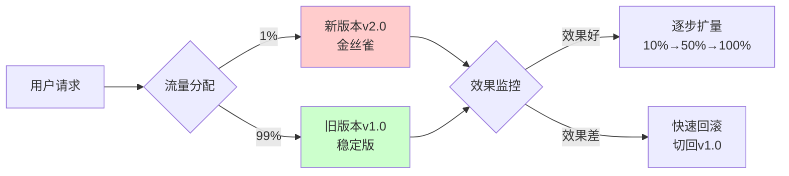
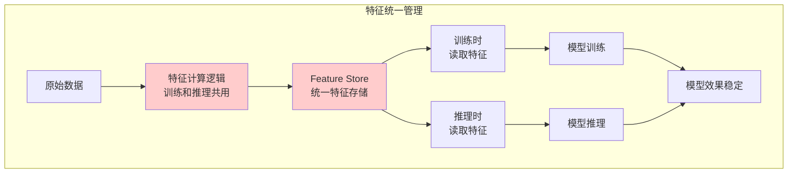
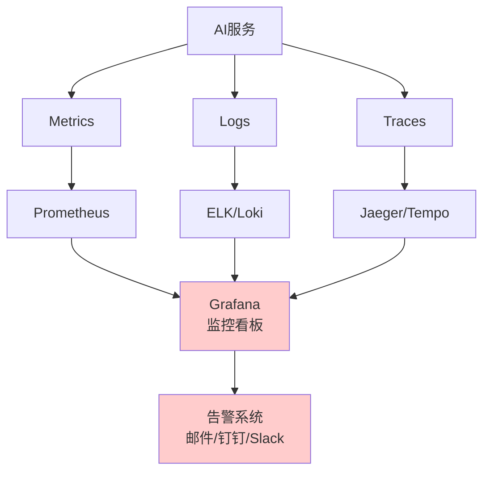
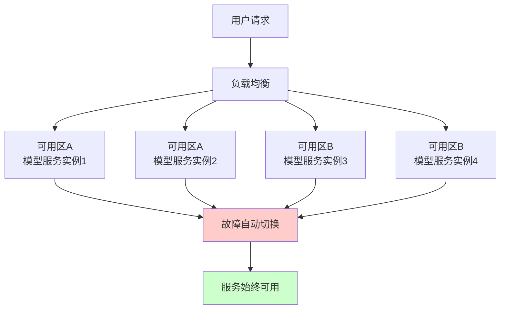
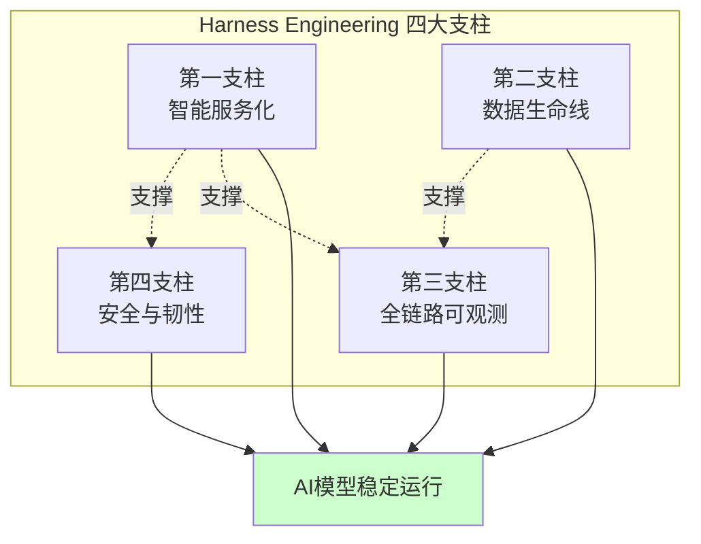
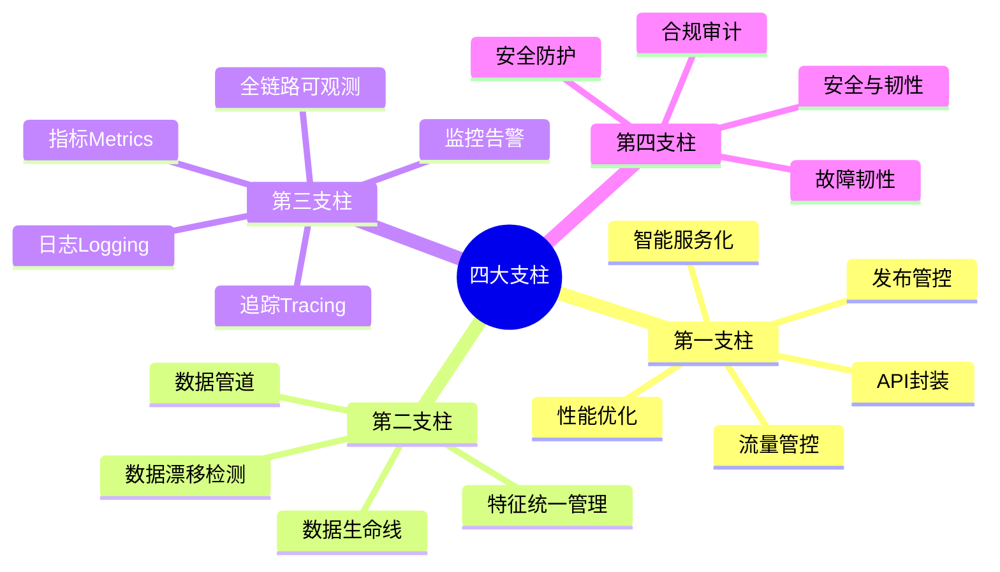

# 第4章：四大支柱｜构建可靠AI服务的核心工程模块

> 拆解Harness Engineering的核心架构，每个模块都配套大白话解读、核心动作、新手入门任务

---

## 开篇总述：一套完整的体系由4个不可缺少的核心模块组成

一套完整的Harness Engineering体系，由**4个不可缺少的核心模块**组成，缺一不可。

这就像桌子的四条腿，少一条就会不稳：
- 缺少服务化 → 模型只是一个脚本，不是服务
- 缺少数据治理 → 模型效果悄悄下降，找不到原因
- 缺少可观测 → 出了问题瞎猜，无法快速定位
- 缺少安全韧性 → 一次故障就彻底瘫痪

**本章核心定位**：拆解Harness Engineering的核心架构，让读者明白"一套完整的体系到底包含什么"，每个模块都配套大白话解读、核心动作、新手入门任务。

---

## 本章核心定位

拆解Harness Engineering的核心架构，让读者明白"一套完整的体系到底包含什么"，每个模块都配套大白话解读、核心动作、新手入门任务，兼顾专业性与实操性。

---

## 第一支柱：智能服务化
## ——给模型装一个"稳定可控的接口"

### 大白话解读

把训练好的模型，打包成一个能扛流量、能升级、能灰度、能随时回滚的标准化服务，而不是一个跑一次就崩的脚本。

**打个比方**：
- **没有服务化的模型**：就像在路边摆摊，风吹日晒，想开就开，想关就关
- **有服务化的模型**：就像在正规商场开门店，标准化装修，统一管理，可复制扩张

---

### 核心落地动作

#### 1. 标准化API封装

**目标**：提供统一的、标准的接口，让调用方方便使用

**实现要点**：
- REST/gRPC双协议支持
- 统一输入输出格式
- 完善的接口文档

**代码示例（FastAPI）**：
```python
from fastapi import FastAPI, HTTPException
from pydantic import BaseModel

app = FastAPI(title="模型推理服务", version="1.0.0")

class PredictionRequest(BaseModel):
    text: str
    max_length: int = 100

class PredictionResponse(BaseModel):
    result: str
    confidence: float
    model_version: str

@app.post("/predict", response_model=PredictionResponse)
async def predict(request: PredictionRequest):
    """模型推理接口"""
    try:
        # 模型推理
        result = model.predict(request.text)

        return PredictionResponse(
            result=result.text,
            confidence=result.confidence,
            model_version="v1.0.0"
        )
    except Exception as e:
        raise HTTPException(status_code=500, detail=str(e))
```

---

#### 2. 性能优化

**目标**：提升推理速度，降低延迟

**核心技巧**：
- **动态批处理**：把多个请求合并成一批，统一推理，提升GPU利用率
- **模型预热**：服务启动时提前加载权重、跑一次测试请求，避免首请求慢
- **推理加速**：使用TensorRT、ONNX等加速框架

**代码示例（动态批处理）**：
```python
from asyncio import Queue

class BatchProcessor:
    def __init__(self, batch_size=8, timeout=0.1):
        self.batch_size = batch_size
        self.timeout = timeout
        self.queue = Queue()

    async def process(self, text):
        """将请求加入批处理队列"""
        future = asyncio.Future()
        await self.queue.put((text, future))
        return await future

    async def batch_loop(self):
        """批处理循环"""
        while True:
            batch = []
            for _ in range(self.batch_size):
                try:
                    item = await asyncio.wait_for(
                        self.queue.get(),
                        timeout=self.timeout
                    )
                    batch.append(item)
                except asyncio.TimeoutError:
                    break

            if batch:
                texts, futures = zip(*batch)
                results = model.predict_batch(texts)

                for future, result in zip(futures, results):
                    future.set_result(result)
```

---

#### 3. 发布管控

**目标**：安全、可控地更新模型版本

**核心技巧**：
- **模型版本管理**：每个模型版本都有唯一的标识
- **A/B测试框架**：同时运行多个模型版本，对比效果
- **灰度/金丝雀发布**：先给1%用户流量，验证通过后再扩量

**架构图**：


---

#### 4. 流量管控

**目标**：避免服务被流量打垮

**核心技巧**：
- **限流**：按用户/IP/接口级别限制请求频率
- **熔断**：下游服务故障时，快速失败，不阻塞主流程
- **降级**：核心功能保障，非核心功能降级

**代码示例（熔断机制）**：
```python
from circuitbreaker import circuit

@circuit(failure_threshold=5, recovery_timeout=60)
def call_external_api(text):
    """调用外部API，带熔断机制"""
    try:
        result = external_api.call(text, timeout=2)
        return result
    except Exception as e:
        # 连续失败5次后，熔断器打开，直接抛异常
        raise CircuitBreakerError(f"API call failed: {e}")
```

---

### 新手入门小任务

**任务**：用FastAPI给你的文本分类模型做API封装

**要求**：
1. 安装FastAPI：`pip install fastapi uvicorn`
2. 创建接口：`POST /predict`，接收文本，返回分类结果
3. 加入输入合法性校验：文本不能为空，长度不超过1000
4. 用slowapi添加基础限流功能：每分钟10次

**预计时间**：30分钟

---

## 第二支柱：数据生命线
## ——守住模型效果的"底层防线"

### 大白话解读

模型的效果由数据决定，训练和推理用的数据逻辑不一致、数据分布变了，模型准确率必然暴跌，这是90%团队都踩过的坑。

**打个比方**：
- **没有数据治理**：就像厨师用的食材今天咸、明天淡，做出来的菜味道不稳定
- **有数据治理**：就像标准化供应链，食材品质稳定，菜品质量可预期

---

### 核心落地动作

#### 1. 特征统一管理

**目标**：保证训练和推理的特征计算逻辑100%一致

**核心技巧**：
- **搭建Feature Store**：统一的特征存储和管理平台
- **训练和推理共用一套特征计算代码**：避免逻辑不一致

**架构图**：


---

#### 2. 数据管道

**目标**：自动化数据清洗与标准化

**核心技巧**：
- **实时特征管道**：流式处理数据，实时计算特征
- **离线特征管道**：批量处理数据，定期更新特征

**代码示例（特征管道）**：
```python
from sklearn.preprocessing import StandardScaler
import joblib

class FeaturePipeline:
    def __init__(self):
        self.scaler = StandardScaler()

    def fit(self, X_train):
        """在训练数据上拟合标准化参数"""
        self.scaler.fit(X_train)
        # 保存标准化参数，推理时复用
        joblib.dump(self.scaler, 'scaler.pkl')

    def transform(self, X):
        """特征变换"""
        # 1. 缺失值填充
        X = X.fillna(0)

        # 2. 标准化
        X = self.scaler.transform(X)

        # 3. 特征交叉
        X = self._feature_cross(X)

        return X

    def _feature_cross(self, X):
        """特征交叉"""
        # 实现特征交叉逻辑
        pass
```

---

#### 3. 数据漂移检测

**目标**：实时监控输入数据的分布变化，提前发出告警

**核心技巧**：
- **统计检验**：KL散度、JS散度、Chi-square检验
- **监控指标**：均值、方差、分位数的变化
- **自动化告警**：指标异常时自动通知

**工具推荐**：Evidently AI

**代码示例**：
```python
from evidently import ColumnMapping
from evidently.report import Report
from evidently.metric_preset import DataDriftPreset

# 定义列映射
column_mapping = ColumnMapping()

# 创建数据漂移检测报告
drift_report = Report(metrics=[DataDriftPreset()])

# 对比训练数据和当前数据
drift_report.run(
    reference_data=train_data,
    current_data=production_data,
    column_mapping=column_mapping
)

# 生成报告
drift_report.save_html("data_drift_report.html")

# 判断是否发生数据漂移
if drift_report.as_dict()["metrics"][0]["result"]["dataset_drift"]:
    print("⚠️ 数据漂移检测到！模型效果可能下降！")
    # 发送告警
    send_alert("Data drift detected!")
```

---

### 新手入门小任务

**任务**：用Evidently AI给你的模型做数据漂移检测

**要求**：
1. 安装Evidently AI：`pip install evidently`
2. 准备训练数据和当前线上数据
3. 运行数据漂移检测，生成HTML报告
4. 查看报告，理解哪些特征发生了漂移

**预计时间**：1小时

---

## 第三支柱：全链路可观测
## ——给服务装一个"全景监控仪表盘"

### 大白话解读

线上出了问题，你能在1分钟内找到问题出在哪，而不是对着黑屏瞎猜，这就是可观测的价值。

**打个比方**：
- **没有可观测**：就像开盲车，没有仪表盘，不知道车速、油量、引擎温度
- **有可观测**：就像飞机驾驶舱，全景监控所有指标，异常一目了然

---

### 核心落地动作（三大核心维度）

#### 1. 指标Metrics

**目标**：量化服务的运行状态

**核心指标**：
- **延迟**：P95/P99响应时间
- **QPS**：每秒请求数
- **错误率**：请求失败的比例
- **GPU/CPU利用率**：资源使用情况
- **模型准确率**：业务效果指标

**代码示例（Prometheus监控）**：
```python
from prometheus_client import Counter, Histogram, Gauge
import time

# 定义指标
prediction_counter = Counter('predictions_total', 'Total predictions')
prediction_duration = Histogram('prediction_duration_seconds', 'Prediction duration')
gpu_utilization = Gauge('gpu_utilization_percent', 'GPU utilization')

def predict(text):
    """带监控的模型推理"""
    start_time = time.time()

    try:
        # 模型推理
        result = model.predict(text)

        # 记录指标
        prediction_counter.inc()
        prediction_duration.observe(time.time() - start_time)

        return result
    except Exception as e:
        prediction_counter.labels(status='error').inc()
        raise
```

---

#### 2. 日志Logging

**目标**：记录每一次请求的完整链路

**核心要点**：
- 记录输入、输出、调用环节、耗时
- 使用结构化日志（JSON格式）
- 日志级别：DEBUG/INFO/WARNING/ERROR

**代码示例**：
```python
import logging
import json
from datetime import datetime

# 配置结构化日志
logging.basicConfig(
    level=logging.INFO,
    format='%(message)s'
)
logger = logging.getLogger(__name__)

def predict(text):
    """带日志的模型推理"""
    request_id = generate_request_id()

    logger.info(json.dumps({
        "event": "prediction_start",
        "request_id": request_id,
        "timestamp": datetime.now().isoformat(),
        "input": text
    }))

    try:
        result = model.predict(text)

        logger.info(json.dumps({
            "event": "prediction_success",
            "request_id": request_id,
            "timestamp": datetime.now().isoformat(),
            "output": result,
            "duration": result.duration
        }))

        return result
    except Exception as e:
        logger.error(json.dumps({
            "event": "prediction_error",
            "request_id": request_id,
            "timestamp": datetime.now().isoformat(),
            "error": str(e)
        }))
        raise
```

---

#### 3. 追踪Tracing

**目标**：精准定位是哪个环节出了问题

**核心要点**：
- 分布式链路追踪（OpenTelemetry）
- 记录每个环节的耗时和状态
- 可视化调用链路

**代码示例（OpenTelemetry）**：
```python
from opentelemetry import trace
from opentelemetry.instrumentation.fastapi import FastAPIInstrumentor

# 初始化链路追踪
tracer = trace.get_tracer(__name__)

@app.post("/predict")
async def predict(request: PredictionRequest):
    with tracer.start_as_current_span("prediction") as span:
        # 记录请求参数
        span.set_attribute("input_length", len(request.text))

        # 模型推理
        with tracer.start_as_current_span("model_inference") as inference_span:
            result = model.predict(request.text)
            inference_span.set_attribute("model_version", "v1.0.0")

        # 后处理
        with tracer.start_as_current_span("post_processing"):
            output = post_process(result)

        return {"result": output}
```

---

#### 4. 配套能力

**目标**：自动化告警、异常检测、业务-技术双维度看板

**核心要点**：
- **自动化告警**：指标异常时自动发送通知（邮件、钉钉、Slack）
- **异常检测**：基于历史数据，自动识别异常模式
- **双维度看板**：技术指标（延迟、错误率）+ 业务指标（CTR、转化率）

**架构图**：


---

### 新手入门小任务

**任务**：给你的FastAPI模型服务接入Prometheus+Grafana

**要求**：
1. 安装依赖：`pip install prometheus-fastapi-instrumentator`
2. 在FastAPI中启用Prometheus指标暴露
3. 安装Grafana，配置Prometheus数据源
4. 创建QPS、延迟、错误率的监控看板

**预计时间**：2小时

---

## 第四支柱：安全与韧性
## ——给服务加一个"安全气囊与刹车系统"

### 大白话解读

避免服务被恶意攻击、出了故障能快速恢复、符合合规要求，不会因为一次故障就彻底瘫痪。

**打个比方**：
- **没有安全与韧性**：就像开车没有刹车、没有安全气囊，出事故就是大事故
- **有安全与韧性**：就像现代汽车，有ABS、有安全气囊、有碰撞预警，安全可靠

---

### 核心落地动作

#### 1. 安全防护

**目标**：防止恶意攻击、数据泄露、合规风险

**核心要点**：
- **输入校验**：防止Prompt注入、恶意输入
- **输出内容审核**：过滤敏感信息
- **权限隔离**：不同角色有不同的访问权限
- **接口鉴权**：API Key、OAuth2.0

**代码示例（接口鉴权）**：
```python
from fastapi import Security, HTTPException
from fastapi.security import APIKeyHeader

API_KEY_NAME = "X-API-Key"
api_key_header = APIKeyHeader(name=API_KEY_NAME, auto_error=False)

async def get_api_key(api_key_header: str = Security(api_key_header)):
    """验证API Key"""
    if api_key_header not in VALID_API_KEYS:
        raise HTTPException(status_code=403, detail="Invalid API Key")
    return api_key_header

@app.post("/predict")
async def predict(
    request: PredictionRequest,
    api_key: str = Security(get_api_key)
):
    """带鉴权的预测接口"""
    # 业务逻辑
    pass
```

---

#### 2. 故障韧性

**目标**：出故障后能快速恢复

**核心要点**：
- **一键回滚**：新版本出问题，10秒内切回旧版本
- **自动扩缩容**：流量高峰时自动增加资源
- **故障自愈**：检测到故障自动重启服务
- **多可用区部署**：避免单区域故障导致服务全挂

**架构图（多可用区部署）**：


---

#### 3. 合规审计

**目标**：满足等保、GDPR等合规要求

**核心要点**：
- **全操作日志留存**：所有操作都有日志可查
- **数据隐私保护**：敏感数据加密存储
- **权限审计**：定期审计权限使用情况
- **合规报告**：定期生成合规报告

---

### 新手入门小任务

**任务**：给你的模型API添加接口鉴权（API Key）

**要求**：
1. 生成随机的API Key
2. 实现API Key验证逻辑
3. 在模型接口中加入鉴权
4. 测试：无效API Key返回403，有效API Key正常访问

**预计时间**：30分钟

---

## 四大支柱关系图



**核心结论**：
- 四大支柱相互支撑，缺一不可
- 服务化是基础，数据是保障，可观测是眼睛，安全是保险
- 只有四大支柱齐全，AI模型才能稳定、安全、可持续地运行

---

## 章末互动

### 思考题

你的项目当前最缺失哪个支柱模块？打算先从哪个模块入手补全？

- A. 第一支柱：模型还没服务化，还是脚本
- B. 第二支柱：训练和推理特征不一致
- C. 第三支柱：没有监控，出了问题找不到原因
- D. 第四支柱：没有鉴权，担心被攻击

欢迎在评论区分享你的情况！👇

---

## 本章要点回顾



---

**下一章**：[第5章：工具全景图｜Harness Engineering落地工具选型指南（新手友好度评级）](./05-第五章-工具全景图.md)

我们将详细介绍每个模块的主流工具，按新手友好度评级，帮助你选择最适合的工具组合。
