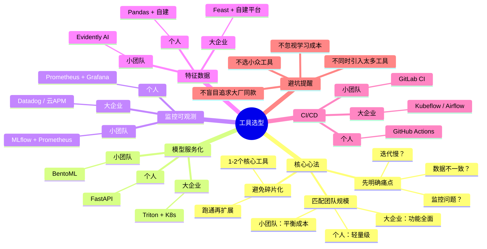

# 第5章：工具全景图｜Harness Engineering落地工具选型指南

> 解决读者"知道要做什么，但不知道用什么工具做"的核心痛点

---

## 开篇困惑：工具太多了，到底该选哪个？

你是不是也有这样的经历：

- 听说Kubeflow是大厂在用的MLOps平台，花了一个月搭好环境，结果发现团队只有2个人，运维成本完全扛不住
- 在GitHub上看到十几个开源工具，不知道该选哪个，最后每个都装了一点，结果完全用不起来
- 想给模型加监控，搜索后发现Prometheus、Grafana、WhyLabs、MLflow都能用，不知道哪个更适合自己

**工具选型，是落地Harness Engineering的第一道关卡**。

选对了，事半功倍；选错了，不仅浪费时间，还可能让整个项目半途而废。

---

## 本章核心定位

按模块分类，给不同团队规模、不同技术栈的读者匹配对应的工具，避免工具炫技，坚持"痛点优先，够用就好"。

---

## 1. 选型核心心法（开篇必讲）

在进入具体工具之前，我们先建立正确的选型思路。这比记住一堆工具名字更重要。

### 心法1：先明确痛点，再选工具

❌ **错误做法**：
- 看到别人用Kubeflow，自己也想搭一套
- 听说哪个工具火热，就先装上再说

✅ **正确做法**：
- 我们当前最核心的痛点是什么？
  - 是模型上线后经常出故障？→ 优先选监控工具
  - 是模型迭代太慢？→ 优先选CI/CD工具
  - 是训练推理特征不一致？→ 优先选Feature Store
- 针对这个痛点，哪个工具最能快速解决问题？

### 心法2：匹配团队规模与技术栈

**个人开发者/纯新手**：
- 不要选Kubeflow这种需要K8s集群的重型工具
- 优先选开箱即用、文档完善的轻量工具
- 学习成本比功能全面更重要

**初创公司/小团队**：
- 不要选运维成本过高的工具
- 优先选云服务托管方案，减少运维负担
- 2-3人的团队，要把时间花在业务模型上，而不是运维上

**中大型企业**：
- 可以考虑重型平台，但要评估ROI
- 优先选能和现有技术栈集成的工具
- 要考虑多团队协作、合规审计等需求

### 心法3：避免工具碎片化

❌ **错误做法**：
- 监控用Prometheus，日志用ELK，追踪用Jaeger，模型管理用MLflow，特征用Feast
- 引入了10+个工具，每个都要单独维护，最后哪个都用不好

✅ **正确做法**：
- 优先选能覆盖多个需求的平台型工具
- 比如：MLflow既能做模型管理，也能做实验追踪，还能做部分监控
- 先用1-2个核心工具跑通流程，再逐步扩展

---

## 2. 分模块工具选型表（含新手友好度评级）

我们把工具按四大支柱模块分类，每个工具都标注了新手友好度，方便你快速匹配。

### 2.1 模型服务化工具

这个模块的核心是：把你的训练好的模型，打包成一个能扛流量、能升级、能回滚的标准化服务。

| 工具 | 核心能力 | 适用场景 | 新手友好度 | 学习成本 |
|------|---------|---------|-----------|---------|
| **FastAPI** | 轻量级API框架，自动生成文档，支持异步 | 个人开发者、小团队、快速原型开发 | ★★★★★ | 1-2天 |
| **BentoML** | 模型服务全栈框架，支持多模型、批处理、监控 | 小团队、中型团队、需要开箱即用的完整方案 | ★★★★☆ | 3-5天 |
| **Triton Inference Server** | 高性能推理服务器，支持多框架、动态批处理 | 中大型企业、高并发场景、多模型部署 | ★★☆☆☆ | 1-2周 |
| **TorchServe** | PyTorch官方推理服务器，深度集成Torch生态 | 以PyTorch为主的技术栈、需要Torch专属优化 | ★★★☆☆ | 5-7天 |
| **AWS SageMaker Endpoints** | 云托管推理服务，免运维 | 使用AWS云、预算充足、不想管运维 | ★★★★☆ | 2-3天 |
| **阿里云PAI-EAS** | 云托管推理服务，支持多种框架 | 使用阿里云、需要快速上线 | ★★★★☆ | 2-3天 |

#### 推荐组合方案

**个人开发者**：
```
FastAPI + Docker + 云服务器
```
- 优点：完全免费，学习成本低，灵活度高
- 缺点：需要自己处理监控、限流等功能

**初创公司/小团队**：
```
BentoML + 云服务托管
```
- 优点：开箱即用，自带监控、多模型管理，运维成本低
- 缺点：有一定学习成本，需要理解BentoML的概念

**中大型企业**：
```
Triton + K8s + Istio
```
- 优点：高并发、高可用、多团队协作
- 缺点：运维成本高，需要专门的平台团队

---

### 2.2 特征与数据治理工具

这个模块的核心是：保证训练和推理的特征计算逻辑一致，监控数据质量，及时发现数据漂移。

| 工具 | 核心能力 | 适用场景 | 新手友好度 | 学习成本 |
|------|---------|---------|-----------|---------|
| **Feast** | 开源Feature Store，支持离线/在线特征 | 中大型团队、多模型共享特征、需要特征统一管理 | ★★★☆☆ | 1-2周 |
| **Evidently AI** | 数据质量监控、数据漂移检测、报告生成 | 所有团队、需要快速发现数据问题 | ★★★★★ | 1-2天 |
| **Great Expectations** | 数据质量检测、数据文档、测试框架 | 数据工程团队、需要严格的数据质量管控 | ★★★☆☆ | 1周 |
| **WhyLabs** | 云服务数据监控，自动异常检测 | 预算充足、不想自己维护监控系统 | ★★★★☆ | 2-3天 |
| **GCP Vertex AI Feature Store** | 云托管Feature Store，全托管服务 | 使用GCP云、中大型企业 | ★★★☆☆ | 3-5天 |
| **阿里云PAI Feature Store** | 云托管Feature Store，国内访问快 | 使用阿里云、需要快速上线 | ★★★☆☆ | 3-5天 |

#### 推荐组合方案

**个人开发者**：
```
Pandas + 基础统计监控
```
- 优点：零成本，快速上手
- 缺点：功能有限，需要自己写监控代码

**小团队**：
```
Evidently AI + 简单特征存储
```
- 优点：开箱即用，生成漂亮的报告，新手友好
- 缺点：Feature Store能力有限

**中大型企业**：
```
Feast + Evidently AI + 自建数据平台
```
- 优点：完整的特征管理+监控体系，可扩展性强
- 缺点：需要专门的平台团队维护

---

### 2.3 可观测与监控工具

这个模块的核心是：出了问题能在1分钟内找到问题在哪，而不是对着黑屏瞎猜。

| 工具 | 核心能力 | 适用场景 | 新手友好度 | 学习成本 |
|------|---------|---------|-----------|---------|
| **Prometheus + Grafana** | 业界标准监控方案，生态完善 | 所有团队、需要灵活定制监控 | ★★★★☆ | 3-5天 |
| **MLflow Tracking** | 实验追踪+模型监控+部分生产监控 | 小团队、需要实验到生产的全流程追踪 | ★★★★★ | 1-2天 |
| **WhyLabs** | 云服务监控，自动异常检测 | 预算充足、不想自己维护监控系统 | ★★★★☆ | 2-3天 |
| **Datadog** | 商业APM平台，全栈监控 | 预算充足、需要一站式监控 | ★★★★☆ | 2-3天 |
| **AWS CloudWatch** | AWS云监控，深度集成AWS服务 | 使用AWS云、预算充足 | ★★★☆☆ | 3-5天 |
| **阿里云ARMS** | 阿里云APM，国内访问快 | 使用阿里云、需要APM能力 | ★★★☆☆ | 3-5天 |

#### 推荐组合方案

**个人开发者**：
```
Prometheus + Grafana
```
- 优点：免费、开源、社区活跃、文档完善
- 缺点：需要自己搭建和维护

**小团队**：
```
Prometheus + Grafana + MLflow Tracking
```
- 优点：覆盖实验到生产的全流程监控
- 缺点：需要维护两套系统

**中大型企业**：
```
Datadog / 云厂商APM + 自建监控平台
```
- 优点：功能全面、运维负担小、支持告警、日志、追踪一体化
- 缺点：成本较高

---

### 2.4 流程编排与CI/CD工具

这个模块的核心是：让测试、构建、部署自动化，不需要人工干预。

| 工具 | 核心能力 | 适用场景 | 新手友好度 | 学习成本 |
|------|---------|---------|-----------|---------|
| **MLflow Projects** | 轻量级流程管理，代码打包+环境复现 | 小团队、需要快速上手的实验管理 | ★★★★★ | 1-2天 |
| **GitHub Actions** | CI/CD自动化，GitHub深度集成 | 使用GitHub、需要免费CI/CD方案 | ★★★★☆ | 2-3天 |
| **GitLab CI** | CI/CD自动化，GitLab深度集成 | 使用GitLab、需要一体化DevOps | ★★★★☆ | 2-3天 |
| **Airflow** | 复杂工作流编排，DAG任务管理 | 数据工程团队、复杂的数据管道 | ★★☆☆☆ | 1-2周 |
| **Kubeflow** | K8s上的ML工作流平台，全链路ML | 中大型企业、已有K8s基础、需要完整MLOps | ★★☆☆☆ | 2-4周 |
| **AWS SageMaker Pipelines** | 云托管ML流水线，无服务器 | 使用AWS云、预算充足 | ★★★☆☆ | 1周 |
| **阿里云PAI Pipelines** | 云托管ML流水线，国内访问快 | 使用阿里云、需要快速上线 | ★★★☆☆ | 1周 |

#### 推荐组合方案

**个人开发者**：
```
MLflow Projects + GitHub Actions
```
- 优点：免费、简单、社区活跃
- 缺点：功能相对基础

**小团队**：
```
GitLab CI + MLflow
```
- 优点：一体化、开箱即用、学习成本低
- 缺点：GitLab CI的高级功能需要付费

**中大型企业**：
```
Kubeflow / Airflow + 企业级CI/CD
```
- 优点：功能强大、可扩展、支持复杂流程
- 缺点：运维成本高、学习曲线陡

---

### 2.5 安全与合规工具

这个模块的核心是：防止恶意攻击、保护数据隐私、满足合规要求。

| 工具 | 核心能力 | 适用场景 | 新手友好度 | 学习成本 |
|------|---------|---------|-----------|---------|
| **NVIDIA NeMo Guardrails** | LLM防护，防止Prompt注入、越狱 | LLM应用、需要安全防护 | ★★★☆☆ | 3-5天 |
| **OpenPolicyAgent** | 策略引擎，细粒度权限控制 | 需要复杂权限管理、合规要求高 | ★★☆☆☆ | 1-2周 |
| **基础鉴权库（PyJWT等）** | JWT鉴权、API Key管理 | 所有团队、基础的接口鉴权 | ★★★★☆ | 1-2天 |
| **云厂商安全套件** | 云服务自带的安全能力 | 使用云服务、需要快速合规 | ★★★☆☆ | 3-5天 |

#### 推荐组合方案

**个人开发者/小团队**：
```
基础鉴权（PyJWT）+ 速率限制（slowapi）
```
- 优点：简单、免费、满足基本需求
- 缺点：功能有限，不支持复杂的安全策略

**中大型企业**：
```
NeMo Guardrails + OpenPolicyAgent + 云安全套件
```
- 优点：全链路安全防护、满足合规要求
- 缺点：成本高、复杂度高

---

## 3. 分受众选型推荐

我们把上面的工具按团队规模和技术能力，给出最推荐的组合方案。

### 3.1 个人开发者/纯新手

**核心诉求**：
- 零成本或低成本
- 学习曲线平缓
- 能快速搭建最小可行Harness

**推荐组合**：
```
FastAPI（模型服务化）
+ Prometheus + Grafana（监控）
+ MLflow（实验管理）
+ GitHub Actions（CI/CD）
+ Evidently AI（数据监控）
```

**为什么选这个组合**：
- ✅ 全部免费，社区活跃
- ✅ 文档完善，新手友好
- ✅ 能覆盖最小可行Harness的全部需求
- ✅ 学习成本：1-2周可以上手

**替代方案**（如果你不想自己搭建）：
```
BentoML（一站式模型服务+监控）
+ MLflow（实验管理）
```

### 3.2 初创公司/小团队

**核心诉求**：
- 平衡功能与运维成本
- 支持多模型、多环境
- 能快速响应业务需求

**推荐组合**：
```
BentoML（模型服务化）
+ Feast（Feature Store）
+ Evidently AI（数据监控）
+ 云服务托管（AWS/阿里云）
+ MLflow（实验+模型管理）
+ GitLab CI（CI/CD）
```

**为什么选这个组合**：
- ✅ BentoML开箱即用，自带监控、多模型管理
- ✅ 云服务托管，减少运维负担
- ✅ 功能全面，能支持中等规模业务
- ✅ 学习成本：2-4周可以落地

**成本估算**（月成本）：
- 云服务器：2-4K
- 云服务托管：3-8K
- 总计：5-12K/月

### 3.3 中大型企业

**核心诉求**：
- 支持高并发、多团队协作
- 满足合规审计要求
- 可扩展性强

**推荐组合**：
```
Triton Inference Server（模型服务化）
+ Kubeflow（工作流编排）
+ 企业级Feature Store（Feast定制/云服务）
+ Datadog/云厂商APM（全链路监控）
+ OpenPolicyAgent（权限控制）
+ K8s + Istio（服务网格）
```

**为什么选这个组合**：
- ✅ 支持高并发、多模型部署
- ✅ 完整的监控、追踪、日志体系
- ✅ 满足合规审计要求
- ✅ 可扩展性强，支持多团队协作
- ⚠️ 需要专门的平台团队维护

**成本估算**（月成本）：
- 平台团队：3-5人
- 云资源：20-50K
- 商业软件：10-30K
- 总计：50-100K/月

---

## 4. 工具选型实战：三个真实案例

### 案例1：个人开发者的选型之路

**背景**：
小张是个AI爱好者，训练了一个商品推荐模型，想上线到自己的博客上。

**错误尝试**：
听人说Kubeflow是大厂在用的MLOps平台，花了一个月学习K8s和Kubeflow，最后发现：
- 自己的博客每天只有100个访问，根本用不上Kubeflow的复杂功能
- K8s集群的运维成本完全扛不住
- 模型上线的事一拖再拖

**正确选型**：
重新评估自己的需求后，换了方案：
```
FastAPI + Docker + Prometheus + Grafana
```

**结果**：
- 2天完成模型API封装
- 3天完成监控搭建
- 1周内成功上线
- 总成本：0元（用免费云服务器）

### 案例2：小团队的工具取舍

**背景**：
某初创公司，3个算法工程师，需要支持5个模型的上线和迭代。

**初始方案**：
引入了10+个开源工具：Kubeflow、Airflow、Feast、Prometheus、Grafana、ELK、Jaeger...
- 3个人完全陷入运维工作
- 每个月都在修工具的bug，没时间优化模型
- 业务方抱怨模型迭代太慢

**优化后方案**：
砍掉了大部分工具，只保留核心的：
```
BentoML（模型服务+基础监控）
+ MLflow（实验管理）
+ GitLab CI（CI/CD）
+ 云服务托管
```

**结果**：
- 运维工作减少80%
- 模型迭代周期从2周缩到3天
- 工程师能专注在模型优化上

### 案例3：中大型企业的选型考量

**背景**：
某中型电商平台，需要支持50+模型的上线，日均QPS百万级。

**选型过程**：
1. 评估需求：高并发、多团队、合规要求
2. 技术栈：已有K8s基础设施
3. 团队：有专门的平台团队（5人）
4. 预算：可以接受商业软件

**最终方案**：
```
Triton（推理服务）
+ Kubeflow（工作流）
+ 自建Feature Store
+ Datadog（监控）
+ K8s + Istio
```

**结果**：
- 支持百万级QPS
- 模型迭代周期从2周缩到2天
- 故障恢复时间从1小时降到3分钟

---

## 5. 新手避坑提醒

### 避坑1：不要盲目追求"大厂同款"

❌ **错误想法**：
"Google用Kubeflow，我们也要用"
"Netflix用自定义平台，我们也要自建"

✅ **正确认知**：
- 大厂的方案是为大厂的规模设计的
- 小团队用重型工具只会徒增运维成本
- 先解决核心痛点，再逐步完善

### 避坑2：不要同时引入太多工具

❌ **错误做法**：
看到好用的工具就想装，结果引入了10+个工具，每个都只用了20%的功能

✅ **正确做法**：
- 先从1-2个核心工具入手
- 跑通流程再逐步扩展
- 优先选能覆盖多个需求的平台型工具

### 避坑3：不要选小众工具

❌ **错误做法**：
在GitHub上找了一个功能很酷但只有100 stars的工具，结果遇到问题找不到解决方案

✅ **正确做法**：
- 优先选社区活跃、文档完善的工具
- 检查工具的GitHub stars、issues响应速度、文档质量
- 避免选没有明确维护者的小众工具

### 避坑4：不要忽视学习成本

❌ **错误做法**：
选了Kubeflow，没有评估团队的学习能力，结果学了2个月还没用起来

✅ **正确做法**：
- 选工具前评估团队的技术栈和学习能力
- 新手优先选文档友好、社区活跃的工具
- 给团队留出学习时间，不要急于求成

---

## 6. 工具对比速查表

为了方便你快速选型，我们把核心工具做成一个速查表：

### 模型服务化工具对比

| 工具 | 学习成本 | 运维成本 | 功能全面性 | 推荐场景 |
|------|---------|---------|-----------|---------|
| FastAPI | ★☆☆☆☆ | ★☆☆☆☆ | ★★☆☆☆ | 个人开发者、快速原型 |
| BentoML | ★★☆☆☆ | ★★☆☆☆ | ★★★★☆ | 小团队、需要完整方案 |
| Triton | ★★★★☆ | ★★★★☆ | ★★★★★ | 高并发、多模型部署 |
| 云服务 | ★☆☆☆☆ | ☆☆☆☆☆ | ★★★☆☆ | 预算充足、不想运维 |

### 监控工具对比

| 工具 | 学习成本 | 运维成本 | 功能全面性 | 推荐场景 |
|------|---------|---------|-----------|---------|
| Prometheus+Grafana | ★★☆☆☆ | ★★☆☆☆ | ★★★★☆ | 所有团队、灵活定制 |
| MLflow Tracking | ★☆☆☆☆ | ★☆☆☆☆ | ★★★☆☆ | 小团队、实验追踪 |
| Datadog | ★☆☆☆☆ | ☆☆☆☆☆ | ★★★★★ | 预算充足、一站式监控 |

### 特征管理工具对比

| 工具 | 学习成本 | 运维成本 | 功能全面性 | 推荐场景 |
|------|---------|---------|-----------|---------|
| Pandas+自建 | ★☆☆☆☆ | ★☆☆☆☆ | ★☆☆☆☆ | 个人开发者、简单场景 |
| Evidently AI | ★☆☆☆☆ | ★☆☆☆☆ | ★★★☆☆ | 所有团队、数据监控 |
| Feast | ★★★☆☆ | ★★★☆☆ | ★★★★★ | 中大型团队、特征统一管理 |

---

## 7. 章末互动

### 思考题

你的团队现有技术栈，最适配哪个工具方案？

- A. 个人开发者：FastAPI + Prometheus + MLflow
- B. 小团队：BentoML + 云服务托管
- C. 中大型企业：Triton + Kubeflow + K8s
- D. 还不确定，需要进一步评估

### 投票

你当前最想入手的工具是哪个？

- [ ] BentoML（一站式模型服务）
- [ ] Prometheus + Grafana（监控）
- [ ] MLflow（实验管理）
- [ ] Evidently AI（数据监控）
- [ ] Triton（高性能推理）

欢迎在评论区投票和分享你的选型经验！👇

---

## 本章要点回顾



---

**下一章**：[第6章：实战五步法｜从0到1落地Harness Engineering全流程](./06-第六章-实战五步法.md)

我们将深入探讨从需求对齐到持续迭代的完整落地流程，每一步都有明确的动作、模板、验收标准，让你看完就能照着落地。
