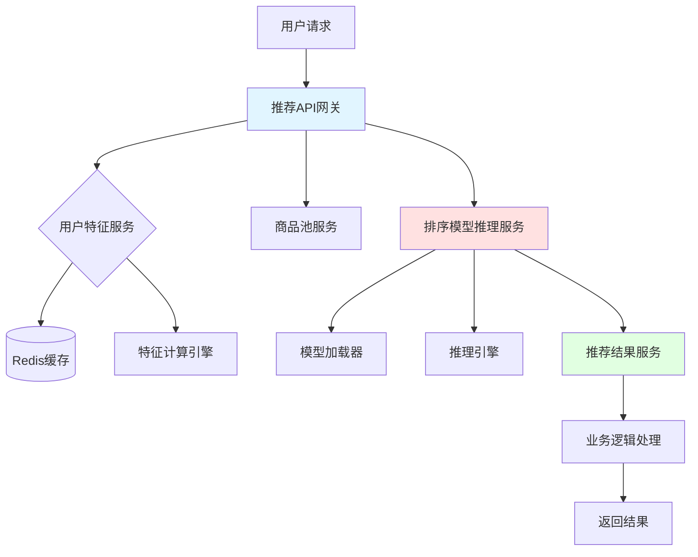
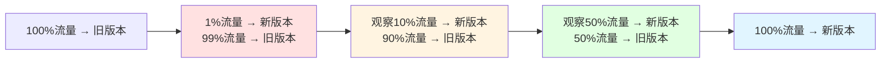
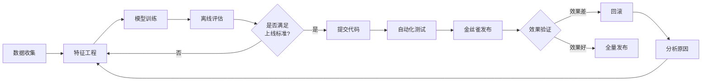
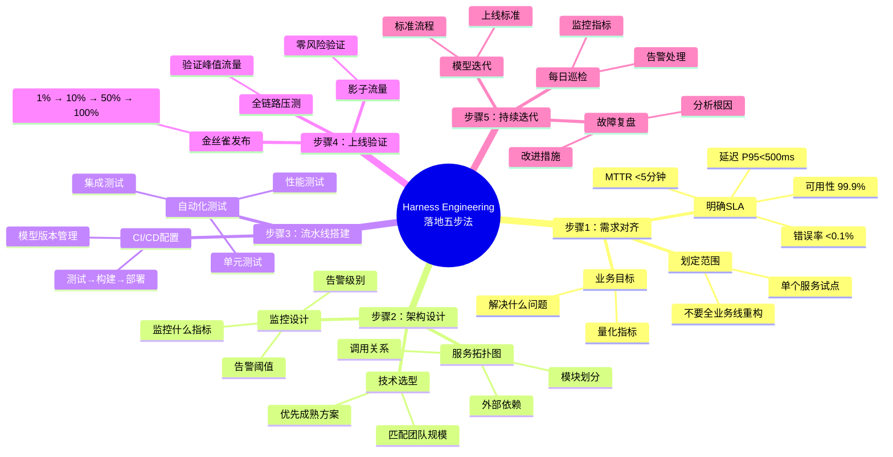

# 第6章：实战五步法｜从0到1落地Harness Engineering全流程

> 全文核心实操章节，给读者一套可直接复用、标准化的落地流程

---

## 开篇思考：为什么很多团队落地失败？

你是不是见过这样的场景：

- 老板说"我们要搞AI工程化"，团队花了几个月搭建平台，结果发现解决不了实际问题，最后被叫停
- 学了一堆工具，不知道从哪里入手，看了很多文章还是一头雾水
- 想要落地，但不知道第一步该做什么，担心出错，迟迟不敢开始

**落地Harness Engineering，最怕的不是技术难，而是不知道从哪里开始**。

这就像装修房子，你买了很多家具（工具），但没有图纸（流程），最后家里一团糟。

---

## 本章核心定位

给读者一套可直接复用、标准化的落地流程，从需求对齐到持续迭代，每一步都有明确的动作、模板、验收标准。

---

## 0. 落地流程全景图

先给你一张完整的路线图，我们在本章会一步步拆解：


**核心原则**：
- ✅ 从小范围试点开始，不要一上来就全业务线重构
- ✅ 每一步都有明确的验收标准，做到可量化、可验证
- ✅ 走完流程再逐步扩展，避免"大而全"的失败

---

## 步骤1：需求对齐——先定好目标，再动手干活

### 为什么需求对齐这么重要？

很多团队落地失败，不是因为技术不行，而是因为**目标不清晰**：

- ❌ 老板说"我们要搞AI工程化"——没有具体目标
- ❌ 工程师说"我们要上Kubeflow"——这是工具，不是目标
- ❌ 业务说"模型要更稳定"——没有量化指标

**需求对齐的核心**：把模糊的想法，变成清晰、可量化的目标。

### 核心动作1：对齐业务目标

先问自己3个问题：

**问题1：我们要解决的核心业务问题是什么？**
- 是模型上线后经常出故障？→ 目标：降低故障发生率
- 是模型迭代太慢，跟不上业务变化？→ 目标：缩短迭代周期
- 是模型效果不好，影响业务指标？→ 目标：提升模型业务效果

**问题2：当前的问题有多严重？**
- 故障频发：平均每周1-2次，每次影响几万用户
- 迭代慢：从训练到上线要2周，错过市场机会
- 效果差：推荐CTR下降，直接影响收入

**问题3：解决这个问题，能给业务带来什么价值？**
- 降低故障：减少用户流失，提升品牌口碑
- 加快迭代：更快响应市场，抢占先机
- 提升效果：直接带来收入增长

#### 业务目标示例（可直接复用）

| 问题 | 业务目标 | 量化指标 |
|------|---------|---------|
| 模型上线后经常出故障 | 提升服务稳定性 | 故障发生率从每周2次降到每月1次 |
| 模型迭代太慢 | 加快模型迭代速度 | 迭代周期从2周缩短到3天 |
| 模型效果不好 | 提升模型业务效果 | 推荐CTR提升10% |
| 出了问题找不到原因 | 提升问题定位效率 | 故障定位时间从1小时降到5分钟 |

### 核心动作2：明确SLA（服务等级协议）

> **SLA（Service Level Agreement）**：服务等级协议，就是明确告诉业务方"我们的服务能做到什么水平"。

如果没有SLA，业务方的预期和你的能力就不匹配，永远无法让业务方满意。

#### SLA模板（可直接复用）

| 指标项 | 目标值 | 说明 |
|--------|--------|------|
| **服务可用性** | 99.9% | 每月允许故障时长 ≤ 43.2分钟 |
| **推理延迟** | P95 ≤ 500ms<br/>P99 ≤ 1s | 95%的请求在500ms内返回<br/>99%的请求在1s内返回 |
| **错误率** | ≤ 0.1% | 每1000个请求中，最多1个失败 |
| **故障恢复时间（MTTR）** | ≤ 5分钟 | 出故障后，5分钟内恢复服务 |
| **数据漂移检测** | 每日检测 | 每天自动检测数据分布变化 |

#### SLA解读

**服务可用性 99.9%** 是什么概念？
- 一个月有30天 × 24小时 × 60分钟 = 43,200分钟
- 99.9%可用 = 允许故障 43.2分钟/月
- 相当于每个月可以有1-2次小故障，每次几分钟

**P95延迟 ≤ 500ms** 是什么概念？
- 100个请求里，有95个在500ms内返回
- 用户基本感觉不到延迟
- 最慢的5个请求可能超过500ms，但占比很低

**错误率 ≤ 0.1%** 是什么概念？
- 1000个请求里，最多1个失败
- 对于用户来说，基本不会遇到错误

### 核心动作3：划定落地范围

> **最大的坑**：一上来就想全业务线重构，结果战线太长，半途而废。

**正确做法**：先选单个核心模型服务做试点，跑通流程再扩展。

#### 如何选择试点服务？

| 选择标准 | 好的试点服务 | 不好的试点服务 |
|---------|------------|--------------|
| **业务重要性** | 核心业务，但不是最核心的 | 最核心的业务（风险太高）<br/>边缘业务（没价值） |
| **痛点程度** | 问题明显，业务方有强烈诉求 | 运行良好，没有痛点 |
| **复杂度** | 相对简单，能快速验证价值 | 过于复杂，短期内难见效 |
| **数据基础** | 有基本的监控、日志 | 一团黑，没有任何可观测性 |

#### 试点范围示例

**好的试点**：
- 电商推荐系统的某个子模块（比如"猜你喜欢"）
- 智能客服的文本分类模块
- 图像识别的单个模型

**不好的试点**：
- 整个推荐系统（太复杂）
- 全站搜索（风险太高）
- 边缘的小功能（没价值）

### 验收标准

✅ 输出《Harness落地需求说明书》，包含：
- 业务目标（解决什么问题）
- 量化指标（SLA）
- 试点范围（哪个服务）
- 预期收益（给业务带来什么价值）

✅ 业务方和技术方达成一致，都认可这个目标

---

## 步骤2：架构设计——画好图纸再施工

### 为什么需要架构设计？

你不会在没有图纸的情况下开始盖房子，同理，**也不要在没有设计的情况下开始搭系统**。

架构设计的核心：把抽象的目标，变成可执行的技术方案。

### 核心动作1：设计服务拓扑图

> **服务拓扑图**：就是画出你的系统由哪些服务组成，它们之间是怎么调用的。

#### 为什么要画拓扑图？

- ✅ 让团队对系统结构有共识
- ✅ 找出潜在的单点故障
- ✅ 明确每个模块的职责
- ✅ 为监控设计打基础

#### 拓扑图示例

假设我们要改造一个电商推荐系统：



从这个图我们可以看到：
- 系统由5个服务组成（网关、特征、商品池、排序、结果）
- 每个服务的依赖关系
- 哪里可能出问题（比如特征服务挂了，整个推荐就挂了）

#### 如何画出你的拓扑图？

**步骤1**：列出你的系统有哪些服务
- 用户特征服务
- 排序模型推理服务
- 推荐结果服务

**步骤2**：标出服务之间的调用关系
- 推荐API → 调用用户特征服务
- 推荐API → 调用排序模型推理服务
- 推荐API → 调用推荐结果服务

**步骤3**：标出外部依赖
- Redis缓存
- 数据库
- 第三方API

**步骤4**：找出单点故障
- 如果Redis挂了，特征服务还能工作吗？
- 如果模型服务挂了，有降级方案吗？

### 核心动作2：明确技术选型与工具匹配

根据你在第5章学的工具选型方法，为每个模块选工具。

#### 技术选表示例

| 模块 | 技术选型 | 理由 |
|------|---------|------|
| **模型服务化** | BentoML | 开箱即用，自带监控，支持多模型 |
| **特征存储** | Redis + 简单Feature Store | 快速上线，成本可控 |
| **数据监控** | Evidently AI | 新手友好，生成报告 |
| **全链路监控** | Prometheus + Grafana | 业界标准，免费开源 |
| **CI/CD** | GitLab CI | 团队已有GitLab，集成方便 |
| **容器化** | Docker | 标准方案，便于部署 |

### 核心动作3：预设监控点与告警阈值

> **最大的坑**：上线后才发现没有监控，出了问题不知道在哪里

**正确做法**：在设计阶段就想好"要监控什么"，而不是上线后补监控。

#### 监控点设计表

| 监控维度 | 监控指标 | 告警阈值 | 告警级别 |
|---------|---------|---------|---------|
| **技术指标** | QPS | QPS > 1000 | 警告 |
| | 延迟P95 | P95 > 500ms | 警告 |
| | 延迟P99 | P99 > 1s | 严重 |
| | 错误率 | 错误率 > 0.1% | 严重 |
| | GPU利用率 | GPU利用率 > 90% | 警告 |
| **业务指标** | CTR | CTR下降 > 10% | 严重 |
| | 数据漂移 | 数据漂移 > 0.2 | 警告 |

#### 告警分级

| 级别 | 示例 | 处理方式 |
|------|------|---------|
| **严重** | 错误率 > 0.1%<br/>P99延迟 > 1s | 立即处理，5分钟内响应 |
| **警告** | GPU利用率 > 90%<br/>数据漂移 > 0.2 | 当天处理，24小时内解决 |
| **提示** | QPS上升 | 关注即可，不需要立即处理 |

### 验收标准

✅ 输出《服务架构拓扑图》
- 标注出所有服务模块
- 标注出调用关系
- 标注出外部依赖

✅ 输出《技术选型表》
- 每个模块的选型
- 选型理由

✅ 输出《监控指标与告警规则表》
- 监控什么指标
- 指标到多少告警
- 告警后怎么处理

---

## 步骤3：CI/CD流水线搭建——让测试、构建、部署自动化

### 为什么需要CI/CD？

> **CI/CD（Continuous Integration/Continuous Deployment）**：持续集成/持续部署，就是让代码提交后自动完成测试、构建、部署。

没有CI/CD：
- ❌ 每次部署都要手动操作
- ❌ 容易出错，经常因为人为失误导致故障
- ❌ 效率低下，浪费时间

有CI/CD：
- ✅ 代码提交后自动测试
- ✅ 自动构建镜像
- ✅ 自动部署到测试环境
- ✅ 减少人为失误，提高效率

### 核心动作1：集成3类核心测试

在代码进入流水线之前，必须通过3类测试：

#### 测试1：单元测试（Unit Test）

> **单元测试**：测试代码的最小单元（函数、类）是否正常工作。

**为什么要写单元测试？**
- ✅ 保证代码改动不会引入新bug
- ✅ 快速验证逻辑是否正确
- ✅ 代码文档，让其他人理解你的代码

**示例：测试模型输入边界**

```python
# test_model_boundary.py
import pytest
from model_service import predict

def test_normal_input():
    """测试正常输入"""
    result = predict("正常文本")
    assert result is not None
    assert "category" in result

def test_empty_input():
    """测试空输入"""
    with pytest.raises(ValueError):
        predict("")

def test_too_long_input():
    """测试超长输入"""
    long_text = "a" * 10000
    with pytest.raises(ValueError):
        predict(long_text)

def test_malicious_input():
    """测试恶意输入"""
    malicious_inputs = [
        "<script>alert('xss')</script>",
        "'; DROP TABLE users; --",
        "\x00\x01\x02"
    ]
    for input_text in malicious_inputs:
        result = predict(input_text)
        assert result is not None
        assert "error" not in result
```

#### 测试2：集成测试（Integration Test）

> **集成测试**：测试多个模块一起工作是否正常。

**示例：测试端到端流程**

```python
# test_integration.py
def test_end_to_end_recommendation():
    """测试推荐完整流程"""
    # 1. 构造请求
    request = {
        "user_id": "test_user_123",
        "scene": "home_page"
    }

    # 2. 调用API
    response = client.post("/api/recommend", json=request)

    # 3. 验证响应
    assert response.status_code == 200
    result = response.json()
    assert "recommendations" in result
    assert len(result["recommendations"]) > 0
    assert all("item_id" in item for item in result["recommendations"])
```

#### 测试3：性能测试（Performance Test）

> **性能测试**：测试系统在高负载下的表现。

**示例：用Locust做压测**

```python
# test_performance.py
from locust import HttpUser, task, between

class RecommendUser(HttpUser):
    wait_time = between(1, 3)

    @task
    def recommend(self):
        response = self.client.post("/api/recommend", json={
            "user_id": f"user_{self.user_id}",
            "scene": "home_page"
        })
        assert response.status_code == 200
```

**运行压测**：
```bash
locust -f test_performance.py --host=http://localhost:8000
```

### 核心动作2：搭建自动化流水线

#### GitLab CI配置示例（可直接复用）

```yaml
# .gitlab-ci.yml
stages:
  - test
  - build
  - deploy

# ==================== 测试阶段 ====================
# 单元测试
unit_test:
  stage: test
  image: python:3.9
  script:
    - pip install -r requirements.txt
    - pytest test_model_boundary.py -v
    - pytest test_integration.py -v
  only:
    - merge_requests
    - main

# 性能测试
performance_test:
  stage: test
  image: python:3.9
  script:
    - pip install -r requirements.txt
    - locust -f test_performance.py --headless --users 100 --spawn-rate 10 --run-time 30s --host http://test-service:8000
  only:
    - main

# ==================== 构建阶段 ====================
# 构建Docker镜像
build_image:
  stage: build
  image: docker:latest
  services:
    - docker:dind
  script:
    # 构建镜像，用commit SHA做标签
    - docker build -t registry.example.com/model-service:$CI_COMMIT_SHORT_SHA .
    # 推送镜像到仓库
    - docker push registry.example.com/model-service:$CI_COMMIT_SHORT_SHA
    # 打上latest标签
    - docker tag registry.example.com/model-service:$CI_COMMIT_SHORT_SHA registry.example.com/model-service:latest
    - docker push registry.example.com/model-service:latest
  only:
    - main

# ==================== 部署阶段 ====================
# 部署到测试环境
deploy_test:
  stage: deploy
  image: bitnami/kubectl:latest
  script:
    # 更新K8s部署的镜像版本
    - kubectl set image deployment/model-service model-service=registry.example.com/model-service:$CI_COMMIT_SHORT_SHA -n test
    # 等待部署完成
    - kubectl rollout status deployment/model-service -n test
  environment:
    name: test
    url: https://test.example.com
  only:
    - main

# 部署到生产环境（需要手动触发）
deploy_production:
  stage: deploy
  image: bitnami/kubectl:latest
  script:
    - kubectl set image deployment/model-service model-service=registry.example.com/model-service:$CI_COMMIT_SHORT_SHA -n production
    - kubectl rollout status deployment/model-service -n production
  environment:
    name: production
    url: https://example.com
  when: manual  # 需要手动触发
  only:
    - main
```

#### 这个流水线做了什么？

**测试阶段**：
- 代码提交后，自动运行单元测试和集成测试
- 测试通过后，才能进入下一阶段

**构建阶段**：
- 自动构建Docker镜像
- 用Git commit的SHA做标签（可回溯）
- 推送到镜像仓库

**部署阶段**：
- 自动部署到测试环境
- 生产环境部署需要手动触发（安全）

### 核心动作3：配套模型版本管理

> **最大的坑**：模型和代码分离，不知道哪个模型对应哪个代码版本，出了问题无法回滚。

**正确做法**：每个模型版本对应唯一的代码版本、镜像版本。

#### 模型版本管理方案

**方案1：模型文件随代码管理**

```bash
# 目录结构
models/
  v1.0/
    model.pkl
    metadata.json
  v2.0/
    model.pkl
    metadata.json
```

**方案2：用MLflow管理模型**

```python
import mlflow

# 训练完成后，记录模型
with mlflow.start_run():
    mlflow.log_param("model_version", "2.0")
    mlflow.log_metric("accuracy", 0.95)
    mlflow.sklearn.log_model(model, "model")

# 部署时，加载指定版本
model_uri = "models:/my-model/Production"
model = mlflow.sklearn.load_model(model_uri)
```

**方案3：模型文件存储在对象存储**

```python
import boto3

s3 = boto3.client('s3')

# 保存模型
s3.upload_file("model.pkl", "my-bucket", "models/v2.0/model.pkl")

# 加载模型
s3.download_file("my-bucket", "models/v2.0/model.pkl", "model.pkl")
```

### 验收标准

✅ 代码提交后，自动完成测试、构建、部署到测试环境
✅ 每个模型版本对应唯一的代码版本、镜像版本
✅ 可以快速回滚到任意历史版本

---

## 步骤4：上线验证——零风险上线，避免线上故障

### 为什么需要上线验证？

> **最大的坑**：新版本直接全量上线，结果有bug，导致线上故障，所有用户都受影响。

**正确做法**：先小范围验证，确认没问题再逐步放量。

### 核心动作1：金丝雀发布（Canary Deployment）

> **金丝雀发布**：先给一小部分用户用新版本，确认没问题再逐步扩大。

#### 为什么叫"金丝雀"？

以前矿工下井前，会带一只金丝雀。如果有毒气，金丝雀会先死，矿工就知道有危险。

软件发布也是同理：
- 先让1%的用户用新版本（金丝雀）
- 如果出问题，只有1%用户受影响
- 如果没问题，逐步扩大到10%、50%、100%

#### 金丝雀发布流程



#### 观察指标

| 指标 | 正常范围 | 异常范围 | 处理方式 |
|------|---------|---------|---------|
| **错误率** | < 0.1% | > 0.5% | 立即回滚 |
| **延迟P95** | < 500ms | > 800ms | 暂停扩量，排查问题 |
| **业务指标** | 基本持平 | 下降 > 10% | 立即回滚 |

#### 金丝雀发布配置示例（Istio）

```yaml
# destination-rule.yaml
apiVersion: networking.istio.io/v1beta1
kind: DestinationRule
metadata:
  name: model-service
spec:
  host: model-service
  subsets:
  - name: v1  # 旧版本
    labels:
      version: v1
  - name: v2  # 新版本
    labels:
      version: v2
---
# virtual-service.yaml
apiVersion: networking.istio.io/v1beta1
kind: VirtualService
metadata:
  name: model-service
spec:
  http:
  - match:
    - headers:
        x-canary:
          exact: "true"
    route:
    - destination:
        host: model-service
        subset: v2
  - route:
    - destination:
        host: model-service
        subset: v1
      weight: 99  # 99%流量到旧版本
    - destination:
        host: model-service
        subset: v2
      weight: 1   # 1%流量到新版本
```

### 核心动作2：影子流量验证（Shadow Traffic）

> **影子流量**：让新服务"暗中"处理线上真实请求，但不把结果返回给用户，零风险验证。

#### 影子流量 vs 金丝雀发布

| 方式 | 优点 | 缺点 | 适用场景 |
|------|------|------|---------|
| **金丝雀发布** | 真实的用户反馈 | 少量用户会受影响 | 对效果有信心，想逐步放量 |
| **影子流量** | 零风险，不影响用户 | 无法收集用户行为反馈 | 验证性能、稳定性 |

#### 影子流量配置示例

```python
# FastAPI示例
from fastapi import FastAPI
import requests

app = FastAPI()

@app.post("/api/predict")
async def predict(request: dict):
    # 正常处理请求（旧版本）
    result_old = process_with_old_model(request)

    # 影子流量：同时调用新版本，但不返回结果
    try:
        result_new = process_with_new_model(request)

        # 对比结果，记录差异
        if result_old != result_new:
            log_difference(request, result_old, result_new)
    except Exception as e:
        log_error(e)

    # 返回旧版本的结果
    return result_old
```

### 核心动作3：全链路压测

> **全链路压测**：用线上真实流量（或模拟的等价流量）做压测，验证服务是否能扛住峰值。

#### 压测场景设计

| 场景 | QPS目标 | 验收标准 |
|------|---------|---------|
| **正常流量** | 1000 QPS | P95延迟 < 500ms<br/>错误率 < 0.1% |
| **峰值流量** | 3000 QPS | P95延迟 < 800ms<br/>错误率 < 0.5% |
| **极端流量** | 5000 QPS | P95延迟 < 1s<br/>错误率 < 1%<br/>服务不崩溃 |

#### 压测工具推荐

| 工具 | 适用场景 | 新手友好度 |
|------|---------|-----------|
| **Locust** | Python脚本，灵活 | ★★★★☆ |
| **JMeter** | GUI界面，可视化 | ★★★☆☆ |
| **k6** | 现代化，性能好 | ★★★★☆ |
| **云压测** | 云服务，免运维 | ★★★★★ |

### 验收标准

✅ 金丝雀发布：从1%逐步扩到100%，各项指标正常
✅ 影子流量：新旧版本结果一致，性能满足要求
✅ 全链路压测：在峰值流量下，服务稳定，满足SLA

---

## 步骤5：持续迭代——监控驱动的优化与升级

### 为什么需要持续迭代？

> **最大的误区**：上线后就结束了，不再关注。

**正确认知**：上线只是开始，真正的价值在持续迭代中体现。

### 核心动作1：建立每日巡检机制

#### 巡检清单（可直接复用）

**每日必查**：
- [ ] 查看监控看板，关注关键指标（QPS、延迟、错误率）
- [ ] 检查告警，处理未解决的告警
- [ ] 查看数据漂移报告
- [ ] 检查业务指标（CTR、转化率）

**每周必查**：
- [ ] 分析错误日志，找出高频错误
- [ ] 审核慢查询，优化性能瓶颈
- [ ] 评估模型效果，决定是否需要重新训练
- [ ] 复盘本周故障，输出改进方案

**每月必查**：
- [ ] 评估SLA达成情况
- [ ] 分析成本，优化资源使用
- [ ] 规划下月优化方向
- [ ] 复盘月度故障，更新预案

### 核心动作2：建立模型迭代流程

#### 模型迭代流程图



#### 模型上线标准（可直接复用）

| 指标 | 上线标准 |
|------|---------|
| **离线效果** | AUC / 准确率至少提升1% |
| **推理速度** | P95延迟不增加超过10% |
| **资源消耗** | GPU/内存占用不增加超过20% |
| **业务指标** | A/B测试显示业务指标不下降 |
| **稳定性** | 测试环境运行24小时无故障 |

### 核心动作3：故障复盘机制

> **故障复盘（Postmortem）**：每次故障后，系统性地分析问题、总结经验、改进流程。

#### 故障复盘模板（可直接复用）

**1. 故障基本信息**
- 故障时间：2024-01-15 14:30 - 16:00
- 影响范围：推荐服务，影响20%用户
- 故障等级：P1（严重）

**2. 故障时间线**
| 时间 | 事件 |
|------|------|
| 14:30 | 监控告警：推荐服务错误率 > 1% |
| 14:35 | 工程师介入，发现模型服务超时 |
| 14:40 | 尝试重启服务，问题未解决 |
| 14:50 | 发现是新模型加载失败，回滚到旧版本 |
| 15:00 | 服务恢复 |
| 16:00 | 问题根因分析完成 |

**3. 根本原因**
- 新模型文件损坏，加载失败
- 缺少模型加载的监控，没有及时发现
- 没有模型加载失败的降级方案

**4. 改进措施**
- [ ] 添加模型加载状态监控
- [ ] 添加模型加载失败的降级方案
- [ ] 改进CI/CD流程，上线前验证模型文件完整性

**5. 责任人**
- 监控改进：张三（1周内完成）
- 降级方案：李四（1周内完成）
- CI/CD改进：王五（2周内完成）

### 验收标准

✅ 建立了每日/每周/每月的巡检机制
✅ 建立了标准化的模型迭代流程
✅ 每次故障后都有复盘报告和改进措施

---

## 6. 五步法总结

让我们回顾一下完整的五步法：



---

## 7. 章末互动

### 思考题

你的项目，当前处于五步法的哪个阶段？

- A. 步骤1：还没开始，还在梳理需求
- B. 步骤2：需求已明确，正在设计架构
- C. 步骤3：架构已设计，正在搭建流水线
- D. 步骤4：流水线已搭建，正在准备上线
- E. 步骤5：已上线，正在持续迭代

### 投票

接下来要做的第一个动作是什么？

- [ ] 梳理需求，明确SLA
- [ ] 画服务拓扑图
- [ ] 搭建CI/CD流水线
- [ ] 准备金丝雀发布
- [ ] 建立每日巡检机制

欢迎在评论区投票和分享你的进度！👇

---

## 本章要点回顾

**核心原则**：
- ✅ 从小范围试点开始，不要一上来就全业务线重构
- ✅ 每一步都有明确的验收标准，做到可量化、可验证
- ✅ 走完流程再逐步扩展，避免"大而全"的失败

**五步法回顾**：
1. **需求对齐**：定目标、定SLA、定范围
2. **架构设计**：画拓扑、定模块、设监控点
3. **流水线搭建**：测试→构建→部署自动化
4. **上线验证**：零风险灰度+影子流量验证
5. **持续迭代**：监控驱动的优化与升级

---

**下一章**：[第7章：避坑指南｜落地中90%团队踩过的"隐形陷阱"与解决方案](./07-第七章-避坑指南.md)

我们将深入探讨90%团队都会踩的坑，以及如何提前规避，帮你少走弯路。
