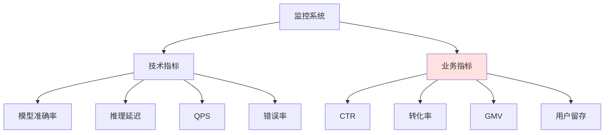
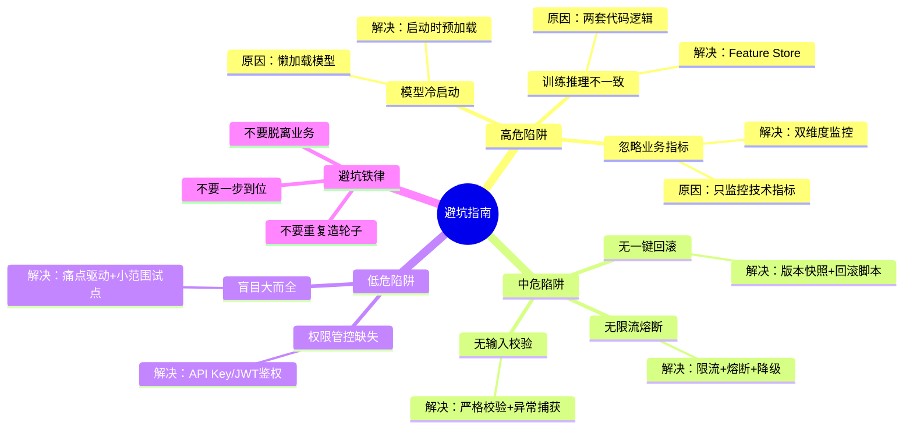

# 第7章：避坑指南｜落地中90%团队踩过的"隐形陷阱"与解决方案

> 用踩坑经验帮读者少走弯路，按发生概率与影响程度分级

---

## 开篇自问：你踩过这些坑吗？

如果你已经落地过AI模型，大概率遇到过这些问题：

- 训练时准确率99%，上线后效果暴跌，查了半天才发现训练和推理的特征计算逻辑不一致
- 只监控模型准确率，结果推荐CTR跌了一半，完全没发现，因为没监控业务指标
- 第一次请求要等10秒，因为模型冷启动需要加载权重，用户体验极差
- 新模型上线出问题，想回滚却花了1小时，因为没有一键回滚预案

**这些不是偶发问题，而是行业内90%的团队都会踩的坑**。

本章我们整理了上百个团队的落地经验，总结了8个最常见、影响最大的陷阱，并给出可直接落地的解决方案。

---

## 本章核心定位

用踩坑经验帮读者少走弯路，按发生概率与影响程度分级，讲清"坑是什么、为什么会踩、怎么解决、怎么提前避免"。

---

## 0. 陷阱分级总览

我们按**发生概率**和**影响程度**，把这8个陷阱分成3个等级：

| 等级 | 陷阱 | 发生概率 | 影响程度 | 优先级 |
|------|------|---------|---------|--------|
| 🔴 **高危** | 训练/推理特征不一致 | 90% | 极高 | 必须立即解决 |
| 🔴 **高危** | 只监控技术指标，忽略业务指标 | 75% | 极高 | 必须立即解决 |
| 🔴 **高危** | 模型冷启动问题 | 80% | 高 | 必须立即解决 |
| 🟡 **中危** | 没有一键回滚预案 | 70% | 高 | 尽快解决 |
| 🟡 **中危** | 忽略限流熔断机制 | 65% | 高 | 尽快解决 |
| 🟡 **中危** | 没有处理脏数据/异常输入 | 60% | 中高 | 计划解决 |
| 🟢 **低危高影响** | 权限管控缺失 | 30% | 极高 | 提前规避 |
| 🟢 **低危高影响** | 盲目追求"大而全" | 40% | 高 | 提前规避 |

---

## 第一部分：高危陷阱（必须重点规避）

### 陷阱1：训练/推理特征不一致，上线后模型准确率暴跌

#### 陷阱描述

你在Jupyter Notebook里训练模型时，用了一套特征计算逻辑，模型效果很好。上线时，工程师又写了另一套特征计算逻辑，结果：

- 离线AUC 0.85，上线后CTR只有0.5%
- 完全找不到原因，查了半个月才发现特征计算逻辑不一样
- 最常见的情况：
  - 归一化参数不同（训练用mean/std，线上用固定值）
  - 缺失值处理不同（训练用-1，线上用0）
  - 特征顺序不同（训练是[a,b,c]，线上是[c,b,a]）

#### 为什么会踩这个坑？

**根本原因**：训练和推理用了两套代码，逻辑有细微差异。

```python
# 训练时的特征计算（notebook）
def calculate_features_train(df):
    df['age_norm'] = (df['age'] - df['age'].mean()) / df['age'].std()
    df['price_norm'] = (df['price'] - df['price'].mean()) / df['price'].std()
    return df[['age_norm', 'price_norm']]

# 上线时的特征计算（服务代码）
def calculate_features_serve(user):
    # ❌ 错误：用了固定的mean/std，和训练时不一样
    age_norm = (user['age'] - 30) / 10  # 硬编码的值
    price_norm = (user['price'] - 100) / 20  # 硬编码的值
    return [age_norm, price_norm]
```

#### 解决方案

**方案1：搭建统一Feature Store**（推荐）

> **Feature Store（特征店）**：统一管理特征的存储、计算、服务，保证训练和推理用同一套特征计算逻辑。

```python
# 使用Feast Feature Store
from feast import FeatureStore

# 初始化Feature Store
store = FeatureStore(repo_path=".")

# 定义特征（训练和推理共用）
user_features = store.get_online_features(
    features=['user_stats:age_norm', 'user_stats:price_norm'],
    entity_rows=[{'user_id': '123'}]
)

# 训练时用这个
train_features = store.get_historical_features(
    features=['user_stats:age_norm', 'user_stats:price_norm'],
    entity_df=train_df
)

# 推理时也用这个（完全一致）
serve_features = store.get_online_features(
    features=['user_stats:age_norm', 'user_stats:price_norm'],
    entity_rows=[{'user_id': user_id}]
)
```

**方案2：特征计算逻辑统一管理**

如果没有Feature Store，至少要做到特征计算逻辑统一：

```python
# features.py - 训练和推理共用
class FeatureCalculator:
    def __init__(self):
        # 训练时保存的参数
        self.age_mean = 35.2
        self.age_std = 12.5
        self.price_mean = 150.0
        self.price_std = 80.0

    def calculate(self, user):
        """训练和推理都用这个方法"""
        age_norm = (user['age'] - self.age_mean) / self.age_std
        price_norm = (user['price'] - self.price_mean) / self.price_std
        return [age_norm, price_norm]

# 训练时
calculator = FeatureCalculator()
train_features = [calculator.calculate(user) for user in train_users]

# 推理时（完全一致）
calculator = FeatureCalculator()
serve_features = calculator.calculate(user)
```

**方案3：上线前做特征一致性校验**

```python
# 测试特征一致性
import numpy as np

def test_feature_consistency():
    # 模拟训练时的特征计算
    train_features = calculate_features_train(sample_df)

    # 模拟推理时的特征计算
    serve_features = calculate_features_serve(sample_users)

    # 对比差异
    for i in range(len(train_features)):
        diff = np.abs(train_features[i] - serve_features[i])
        assert diff < 0.01, f"Feature {i} mismatch: {diff}"

# 在CI/CD中加入这个测试
test_feature_consistency()
```

#### 如何提前避免？

1. ✅ 从第一天就建立Feature Store，或者统一管理特征计算逻辑
2. ✅ 上线前必须做特征一致性校验
3. ✅ 把特征一致性测试加入CI/CD流水线
4. ✅ 定期检查线上特征分布，及时发现漂移

---

### 陷阱2：只监控模型准确率，忽略业务指标，出了问题完全不知道

#### 陷阱描述

你搭建了监控系统，监控了：
- 模型准确率
- 推理延迟
- QPS
- 错误率

看起来很完美，但问题是：
- 模型准确率一直是95%，没变化
- 但推荐CTR从3%跌到了1.5%，业务收入腰斩
- 监控系统没有任何告警，因为没监控业务指标

**结果**：过了2天，业务方发现收入下降，一查才发现推荐完全不准了。

#### 为什么会踩这个坑？

**根本原因**：把技术指标和业务指标割裂开了。

| 技术指标 | 业务指标 |
|---------|---------|
| 模型准确率 | CTR（点击率） |
| 推理延迟 | 转化率 |
| QPS | GMV（成交额） |
| 错误率 | 用户留存 |

**问题**：模型准确率没变，不代表业务指标没变。

#### 真实案例

某电商推荐系统：
- 训练时用的是点击数据（用户点了什么）
- 上线后，用户行为变了（更倾向于加购而不是直接点击）
- 模型准确率（预测点击）还是很高，但CTR（实际点击）暴跌

#### 解决方案

**方案1：搭建业务-技术双维度监控看板**



**配置示例（Prometheus + Grafana）**

```python
# 推荐服务中同时上报技术指标和业务指标
from prometheus_client import Counter, Histogram

# 技术指标
prediction_counter = Counter('recommendation_predictions_total', 'Total predictions')
prediction_latency = Histogram('recommendation_latency_seconds', 'Prediction latency')

# 业务指标
ctr_counter = Counter('recommendation_clicks_total', 'Total clicks', ['model_version'])
conversion_counter = Counter('recommendation_conversions_total', 'Total conversions')

@app.post("/api/recommend")
async def recommend(user_id: str):
    # 记录技术指标
    with prediction_latency.time():
        items = model.predict(user_id)
        prediction_counter.inc()

    # 返回推荐结果
    return {"items": items}

@app.post("/api/click")
async def click(user_id: str, item_id: str, model_version: str):
    # 记录业务指标（点击）
    ctr_counter.labels(model_version=model_version).inc()

@app.post("/api/convert")
async def convert(user_id: str, item_id: str):
    # 记录业务指标（转化）
    conversion_counter.inc()
```

**Grafana看板配置**：

```sql
-- 技术指标：QPS
sum(rate(recommendation_predictions_total[5m]))

-- 业务指标：CTR
sum(rate(recommendation_clicks_total[5m])) / sum(rate(recommendation_predictions_total[5m]))

-- 业务指标：转化率
sum(rate(recommendation_conversions_total[5m])) / sum(rate(recommendation_predictions_total[5m]))
```

**方案2：把业务指标纳入核心告警范围**

| 告警规则 | 阈值 | 级别 |
|---------|------|------|
| CTR下降 | CTR < 2% | 🔴 严重 |
| 转化率下降 | 转化率 < 1% | 🔴 严重 |
| 模型准确率下降 | 准确率 < 90% | 🟡 警告 |

```yaml
# Prometheus告警规则
groups:
  - name: business_alerts
    rules:
      # CTR下降告警
      - alert: LowCTR
        expr: |
          sum(rate(recommendation_clicks_total[5m])) /
          sum(rate(recommendation_predictions_total[5m])) < 0.02
        for: 5m
        labels:
          severity: critical
        annotations:
          summary: "CTR低于2%"
          description: "当前CTR: {{ $value }}"
```

#### 如何提前避免？

1. ✅ 从第一天就同时监控技术指标和业务指标
2. ✅ 把业务指标纳入核心告警范围
3. ✅ 定期（每周）对比技术指标和业务指标的相关性
4. ✅ 如果技术指标正常但业务指标异常，立即调查

---

### 陷阱3：模型冷启动问题，首请求加载耗时过长，直接超时

#### 陷阱描述

你的模型服务刚启动，第一个用户请求来了：
- 服务需要加载模型权重到GPU/内存
- 加载过程需要10-30秒
- 用户的请求超时了，以为服务挂了

**结果**：每次服务重启后，前N个请求都会超时，用户体验极差。

#### 为什么会踩这个坑？

**根本原因**：模型加载是懒加载（第一次请求时才加载），而不是启动时预加载。

```python
# ❌ 错误示例：懒加载
model = None

@app.post("/api/predict")
async def predict(text: str):
    global model
    # 第一次请求时才加载模型
    if model is None:
        model = load_model()  # 需要10-30秒
    return model.predict(text)

# 结果：第一个请求会等10-30秒
```

#### 解决方案

**方案1：服务启动时预热模型**（推荐）

```python
# ✅ 正确示例：启动时预加载
model = None

@app.on_event("startup")
async def startup_event():
    """服务启动时加载模型"""
    global model
    print("Loading model...")
    model = load_model()
    print("Model loaded!")

    # 预热：跑一次测试请求
    print("Warming up model...")
    model.predict("test")
    print("Model warmed up!")

@app.post("/api/predict")
async def predict(text: str):
    # 直接使用已加载的模型
    return model.predict(text)
```

**方案2：配置就绪探针（Readiness Probe）**

K8s会在服务启动后，通过探针检查服务是否就绪：

```yaml
# deployment.yaml
readinessProbe:
  httpGet:
    path: /health/ready
    port: 8000
  initialDelaySeconds: 30  # 等待30秒，让模型加载完成
  periodSeconds: 5
  timeoutSeconds: 3
  failureThreshold: 3

livenessProbe:
  httpGet:
    path: /health/live
    port: 8000
  initialDelaySeconds: 30
  periodSeconds: 10
```

```python
@app.get("/health/ready")
async def ready():
    """检查模型是否已加载"""
    if model is None:
        return {"ready": False}
    return {"ready": True}

@app.get("/health/live")
async def live():
    """检查服务是否存活"""
    return {"live": True}
```

**方案3：多模型预加载**

如果有多个模型，可以预加载所有模型：

```python
models = {}

@app.on_event("startup")
async def startup_event():
    """预加载所有模型"""
    models['bert'] = load_model('bert')
    models['gpt'] = load_model('gpt')
    models['recommend'] = load_model('recommend')

    # 预热所有模型
    for name, model in models.items():
        model.predict("test")
```

#### 如何提前避免？

1. ✅ 服务启动时预加载模型，不要懒加载
2. ✅ 配置就绪探针，模型加载完成前不接入流量
3. ✅ 预热模型，跑一次测试请求
4. ✅ 监控模型加载时间，如果加载时间过长，考虑优化

---

## 第二部分：中危陷阱（重点关注）

### 陷阱4：没有一键回滚预案，新模型出故障时，手忙脚乱无法快速切回

#### 陷阱描述

新模型上线后，发现效果很差，需要紧急回滚：
- 工程师A说"我不知怎么回滚"
- 工程师B说"我没保留上一个版本的代码"
- 工程师C说"我找不到上一个版本的模型文件"
- 折腾了1小时，才把旧版本恢复上线

**结果**：故障恢复时间（MTTR）从5分钟变成了1小时。

#### 为什么会踩这个坑？

**根本原因**：没有版本管理的意识，或者版本管理做得不好。

#### 解决方案

**方案1：每个模型版本都做快照**（推荐）

```python
import mlflow
import shutil
from datetime import datetime

def save_model_snapshot(model, version):
    """保存模型快照"""
    timestamp = datetime.now().strftime("%Y%m%d_%H%M%S")

    # 方案1：用MLflow管理
    with mlflow.start_run():
        mlflow.log_param("version", version)
        mlflow.log_param("timestamp", timestamp)
        mlflow.sklearn.log_model(model, "model")
        run_id = mlflow.active_run().info.run_id
        print(f"Model saved: {run_id}")

    # 方案2：本地文件快照
    snapshot_dir = f"snapshots/model_v{version}_{timestamp}"
    shutil.copytree("model", snapshot_dir)
    print(f"Model saved: {snapshot_dir}")

# 训练完成后，保存快照
save_model_snapshot(trained_model, version="2.0")
```

**方案2：提前写好一键回滚脚本**

```bash
#!/bin/bash
# rollback.sh - 一键回滚脚本

# 配置
OLD_VERSION="1.0"
CURRENT_VERSION="2.0"

# 回滚步骤
echo "Rolling back from $CURRENT_VERSION to $OLD_VERSION..."

# 1. 切换K8s deployment到旧版本
kubectl set image deployment/model-service \
  model-service=registry.example.com/model-service:v1.0

# 2. 等待 rollout 完成
kubectl rollout status deployment/model-service

# 3. 验证服务是否正常
sleep 10
curl -f http://model-service/health || {
  echo "Rollback failed!"
  exit 1
}

echo "Rollback completed!"
```

**方案3：灰度发布时保留旧版本**

```python
# 金丝雀发布时，不要直接下线旧版本
# 新版本出问题时，可以快速切回

@app.post("/api/predict")
async def predict(text: str, version: str = "new"):
    if version == "old":
        return old_model.predict(text)
    else:
        return new_model.predict(text)

# 监控发现新版本有问题，立即切回
@app.post("/admin/switch_version")
async def switch_version(version: str):
    global current_version
    current_version = version
    return {"message": f"Switched to {version}"}
```

#### 如何提前避免？

1. ✅ 每个模型版本都做快照，保留代码、模型、配置
2. ✅ 提前写好一键回滚脚本，定期演练
3. ✅ 灰度发布时保留旧版本，确认没问题再下线
4. ✅ 目标：10秒内完成回滚

---

### 陷阱5：忽略限流熔断机制，峰值流量/下游接口故障直接导致整个服务瘫痪

#### 陷阱描述

大促期间，流量暴涨：
- 你的推荐服务被大量请求打垮
- 下游的翻译API超时，所有请求都在等待
- 整个系统级联失败，全部瘫痪

**结果**：一个点的故障，导致整个系统不可用。

#### 为什么会踩这个坑？

**根本原因**：没有保护机制，流量直接打到服务上。

#### 解决方案

**方案1：接口限流**

```python
from fastapi import FastAPI
from slowapi import Limiter, _rate_limit_exceeded_handler
from slowapi.util import get_remote_address
from slowapi.errors import RateLimitExceeded

app = FastAPI()
limiter = Limiter(key_func=get_remote_address)
app.state.limiter = limiter
app.add_exception_handler(RateLimitExceeded, _rate_limit_exceeded_handler)

@app.post("/api/predict")
@limiter.limit("100/minute")  # 每分钟最多100个请求
async def predict(request: Request, text: str):
    return model.predict(text)
```

**方案2：下游调用熔断**

```python
from circuitbreaker import circuit

@circuit(failure_threshold=5, recovery_timeout=60)
def call_translation_api(text):
    """调用翻译API"""
    response = requests.post("https://translate-api.com/translate", json={
        "text": text
    })
    response.raise_for_status()
    return response.json()

@app.post("/api/translate")
async def translate(text: str):
    try:
        # 尝试调用翻译API
        result = call_translation_api(text)
        return result
    except Exception as e:
        # 翻译API失败，降级到基础回复
        return {"translation": "抱歉，翻译服务暂时不可用"}
```

**方案3：请求队列**

```python
import asyncio
from fastapi import FastAPI

app = FastAPI()
queue = asyncio.Queue(maxsize=1000)  # 最多排队1000个请求

@app.post("/api/predict")
async def predict(text: str):
    try:
        # 把请求放入队列
        await queue.put((text, asyncio.Event()))
    except asyncio.QueueFull:
        # 队列满了，拒绝请求
        raise HTTPException(status_code=429, detail="Too many requests")

    # 等待处理结果
    _, event = await queue.get()
    await event.wait()
    return {"result": "..."}

# 后台worker处理队列
async def worker():
    while True:
        text, event = await queue.get()
        result = model.predict(text)
        event.set()
```

#### 如何提前避免？

1. ✅ 所有接口都配置限流规则
2. ✅ 下游调用都配置熔断机制
3. ✅ 准备降级方案，主流程失败时保证基本服务
4. ✅ 定期做压测，验证限流熔断是否生效

---

### 陷阱6：没有处理脏数据/异常输入，用户上传的不合规数据直接导致服务崩溃

#### 陷阱描述

用户上传了一张图片，但格式不对：
- 你的代码没有做输入校验
- 直接崩溃，返回500错误
- 用户以为服务挂了

#### 解决方案

**方案1：严格的输入校验**

```python
from fastapi import FastAPI, HTTPException
from pydantic import BaseModel, validator

class PredictRequest(BaseModel):
    text: str

    @validator('text')
    def validate_text(cls, v):
        # 校验长度
        if len(v) == 0:
            raise ValueError("Text cannot be empty")
        if len(v) > 10000:
            raise ValueError("Text too long (max 10000 chars)")

        # 校验字符
        if not v.isprintable():
            raise ValueError("Text contains non-printable characters")

        # 校验恶意输入
        dangerous_patterns = ['<script', 'javascript:', 'onerror=']
        if any(pattern in v.lower() for pattern in dangerous_patterns):
            raise ValueError("Text contains dangerous patterns")

        return v

@app.post("/api/predict")
async def predict(request: PredictRequest):
    try:
        result = model.predict(request.text)
        return {"result": result}
    except ValueError as e:
        raise HTTPException(status_code=400, detail=str(e))
    except Exception as e:
        # 捕获所有异常，返回标准化错误
        return {"error": "Prediction failed", "detail": str(e)}
```

**方案2：异常捕获机制**

```python
@app.post("/api/predict")
async def predict(text: str):
    try:
        # 预处理
        processed_text = preprocess(text)

        # 推理
        result = model.predict(processed_text)

        # 后处理
        output = postprocess(result)

        return {"result": output}

    except ValueError as e:
        # 输入数据问题
        raise HTTPException(status_code=400, detail=f"Invalid input: {e}")

    except ModelLoadError as e:
        # 模型加载问题
        raise HTTPException(status_code=503, detail="Model not available")

    except Exception as e:
        # 未知错误
        logger.error(f"Prediction failed: {e}", exc_info=True)
        raise HTTPException(status_code=500, detail="Internal server error")
```

#### 如何提前避免？

1. ✅ 接口入口处做严格的输入校验
2. ✅ 加入异常捕获机制，不会因为单个请求导致服务崩溃
3. ✅ 返回标准化的错误提示
4. ✅ 监控异常率，异常率过高时告警

---

## 第三部分：低危高影响陷阱（提前规避）

### 陷阱7：权限管控缺失，导致模型/数据泄露，引发合规风险

#### 陷阱描述

你的模型API没有任何鉴权：
- 任何人都可以调用
- 竞争对手可以大量调用，分析你的模型
- 敏感数据可能被泄露

#### 解决方案

**方案1：API Key鉴权**

```python
from fastapi import FastAPI, Header, HTTPException

app = FastAPI()

VALID_API_KEYS = {
    "client1": "key_abc123",
    "client2": "key_def456",
}

@app.post("/api/predict")
async def predict(text: str, x_api_key: str = Header(...)):
    # 验证API Key
    if x_api_key not in VALID_API_KEYS.values():
        raise HTTPException(status_code=401, detail="Invalid API key")

    # 处理请求
    result = model.predict(text)
    return {"result": result}
```

**方案2：JWT Token鉴权**

```python
import jwt
from fastapi import FastAPI, Header, HTTPException

SECRET_KEY = "your-secret-key"
ALGORITHM = "HS256"

def verify_token(token: str):
    """验证JWT Token"""
    try:
        payload = jwt.decode(token, SECRET_KEY, algorithms=[ALGORITHM])
        return payload
    except jwt.ExpiredSignatureError:
        raise HTTPException(status_code=401, detail="Token expired")
    except jwt.InvalidTokenError:
        raise HTTPException(status_code=401, detail="Invalid token")

@app.post("/api/predict")
async def predict(text: str, authorization: str = Header(...)):
    # 验证Token
    token = authorization.split(" ")[1]  # Bearer <token>
    payload = verify_token(token)

    # 处理请求
    result = model.predict(text)
    return {"result": result}
```

**方案3：细粒度权限控制**

```python
# 不同角色有不同权限
ROLE_PERMISSIONS = {
    "admin": ["read", "write", "delete"],
    "user": ["read"],
    "guest": [],
}

def check_permission(user_role: str, required_permission: str):
    """检查权限"""
    permissions = ROLE_PERMISSIONS.get(user_role, [])
    if required_permission not in permissions:
        raise HTTPException(status_code=403, detail="Permission denied")

@app.post("/api/predict")
async def predict(text: str, user_role: str = Header(...)):
    # 检查权限
    check_permission(user_role, "read")

    # 处理请求
    result = model.predict(text)
    return {"result": result}
```

---

### 陷阱8：盲目追求"大而全"，投入大量资源搭建全链路体系，却始终没有落地到业务

#### 陷阱描述

某初创公司看到大厂都在做MLOps，决定搭建一套"全链路AI工程化平台"：
- 花了1个月搭建Kubeflow
- 引入了10+个开源工具
- 没有明确的业务目标
- 投入3个月，没有给业务带来任何价值
- 老板叫停，项目完全放弃

#### 解决方案

**正确做法**：
1. ✅ 先明确业务痛点（是故障多？迭代慢？效果差？）
2. ✅ 针对痛点选最小方案（不要一上来就搭全链路）
3. ✅ 小范围试点，验证价值
4. ✅ 跑通闭环后，再逐步扩展

**反例**：
- ❌ 我们要上Kubeflow（这是工具，不是目标）
- ❌ 我们要搭建完整的MLOps平台（太大了，风险高）
- ❌ 我们要全业务线重构（范围太大，容易失败）

**正例**：
- ✅ 我们要解决推荐系统故障频发的问题（目标清晰）
- ✅ 先给推荐服务加监控和限流（最小方案）
- ✅ 选一个推荐子模块做试点（小范围）
- ✅ 验证价值后，推广到全业务线（逐步扩展）

---

## 8. 新手专属避坑3条铁律

如果你是新手，记住这3条铁律，能避开80%的坑：

### 铁律1：不要一步到位

❌ **错误**：我要一次性搭建完整的Harness Engineering体系
✅ **正确**：先跑通最小可行Harness，再逐步完善

**最小可行Harness**：
- FastAPI（模型服务）
- Prometheus + Grafana（基础监控）
- MLflow（模型管理）

### 铁律2：不要重复造轮子

❌ **错误**：我要自己写监控框架、限流框架
✅ **正确**：优先用成熟的开源工具

**重复造轮子的代价**：
- 花时间写代码（而不是优化模型）
- 功能不完善
- 没有社区支持，遇到问题没人能帮

### 铁律3：不要脱离业务

❌ **错误**：我们要搞AI工程化（为了工程化而工程化）
✅ **正确**：我们要解决推荐系统故障频发的问题（解决业务问题）

**如何判断是否脱离业务？**
- 问自己：这个动作能给业务带来什么价值？
- 如果说不清楚，可能就是在脱离业务

---

## 9. 陷阱自查清单

用这个清单快速检查你的项目有没有潜在陷阱：

### 高危陷阱（必须立即解决）

- [ ] 训练和推理的特征计算逻辑是否完全一致？
- [ ] 是否同时监控了技术指标和业务指标？
- [ ] 模型服务是否有冷启动预热机制？

### 中危陷阱（尽快解决）

- [ ] 是否有一键回滚预案？回滚能否在10秒内完成？
- [ ] 是否有限流熔断机制？
- [ ] 是否有严格的输入校验和异常捕获？

### 低危陷阱（提前规避）

- [ ] API是否有鉴权机制？
- [ ] 是否坚持"小范围试点，逐步扩展"的原则？

---

## 10. 章末互动

### 投票

你踩过以上哪个陷阱？

- [ ] 陷阱1：训练/推理特征不一致（90%团队都踩过）
- [ ] 陷阱2：只监控技术指标，忽略业务指标
- [ ] 陷阱3：模型冷启动问题
- [ ] 陷阱4：没有一键回滚预案
- [ ] 陷阱5：忽略限流熔断
- [ ] 陷阱6：没有处理脏数据
- [ ] 陷阱7：权限管控缺失
- [ ] 陷阱8：盲目追求"大而全"

欢迎在评论区投票和分享你的踩坑经历！👇

### 思考题

你的项目当前有没有潜在的陷阱风险？打算怎么规避？

---

## 本章要点回顾



---

**下一章**：[第8章：全案复盘｜用Harness Engineering重构AI服务的真实案例](./08-第八章-全案复盘.md)

我们将通过正反两个真实案例，验证Harness Engineering的落地价值，同时用反例帮读者规避错误的落地方式。
