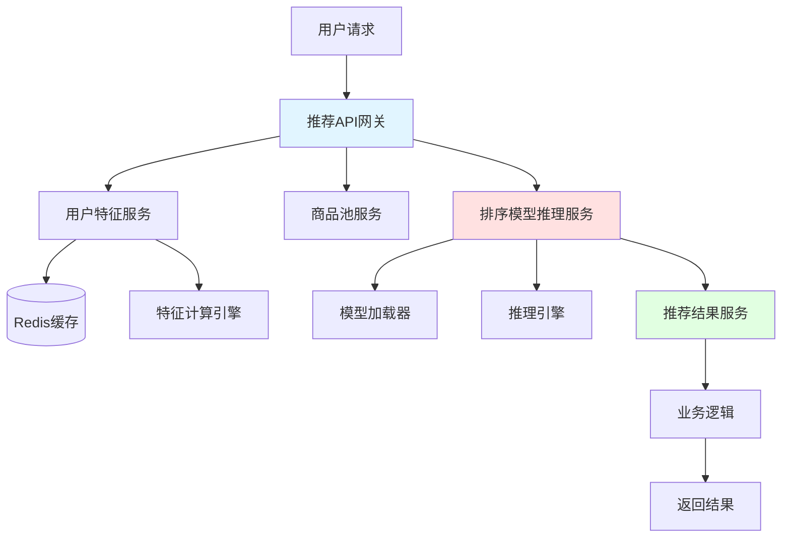
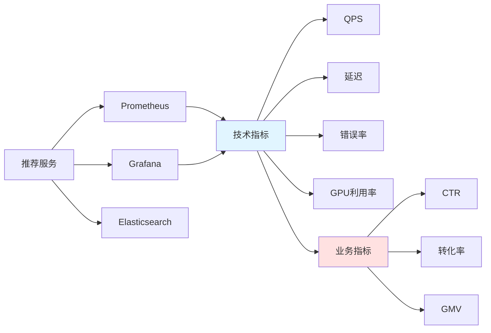
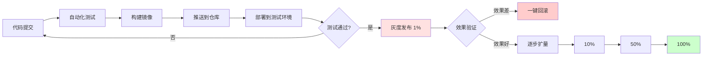
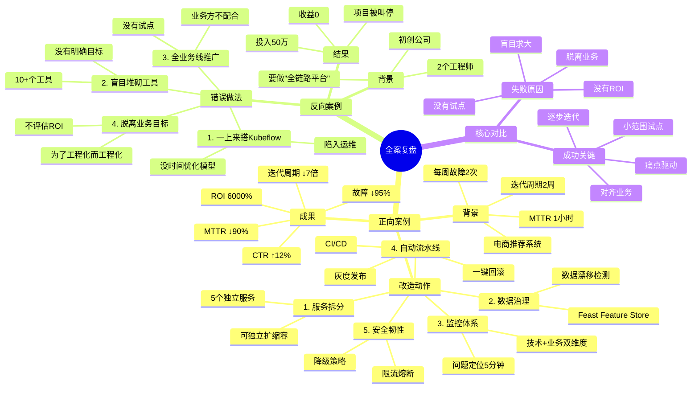

# 第8章：全案复盘｜用Harness Engineering重构AI服务的真实案例

> 用正反两个真实案例，验证Harness Engineering的落地价值

---

## 开篇思考：理论学了很多，到底怎么落地？

看完了前面的理论、方法、工具，你可能还是想知道：

- Harness Engineering到底能带来什么实际价值？
- 其他团队是怎么落地的？有哪些经验可以借鉴？
- 哪些做法是对的？哪些做法是绝对不能碰的？

**理论讲得再多，不如一个真实的落地案例来得直观**。

本章我们整理了两个典型案例：
- **正向案例**：电商推荐系统重构，故障恢复时间下降90%，迭代周期缩至2天
- **反向案例**：盲目追求"大而全"，投入3个月，最终完全放弃

---

## 本章核心定位

用正反两个真实案例，验证Harness Engineering的落地价值，给读者可参考的落地路径，同时用反例帮读者规避错误的落地方式。

---

## 案例1（正向）：电商推荐系统重构——故障恢复时间下降90%，迭代周期缩至2天

### 背景与痛点

某中型电商平台，日活用户50万，推荐系统是核心业务之一。

**现状**：
推荐系统是一个Flask单体服务，把特征计算、模型推理、结果排序全写在一起：

```python
# 原来的单体服务（简化版）
@app.route("/api/recommend")
def recommend(user_id):
    # 1. 特征计算
    user_features = calculate_user_features(user_id)
    item_features = calculate_item_features(user_id)

    # 2. 模型推理
    scores = model.predict(user_features, item_features)

    # 3. 结果排序
    results = sort_items(scores)

    return results
```

**存在的4个核心问题**：

| 问题 | 具体表现 | 影响 |
|------|---------|------|
| **故障频发** | 平均每周1-2次线上故障 | 业务方不满，用户投诉 |
| **故障恢复慢** | MTTR（平均恢复时间）1小时 | 每次故障影响几万用户 |
| **模型迭代慢** | 从训练到上线要2周 | 无法快速响应市场变化 |
| **无法精准扩缩容** | 大促时整个服务被打垮 | 错失流量机会 |
| **没有监控** | CTR下降2天才被发现 | 直接影响收入 |

**最严重的一次故障**：
- 时间：2023年双11大促
- 影响：推荐服务崩溃2小时
- 损失：估计超过100万GMV
- 原因：峰值流量是平时的10倍，单体服务扛不住

### 基于Harness Engineering的核心改造动作

团队决定引入Harness Engineering体系，改造推荐系统。

#### 改造原则

1. ✅ **小范围试点**：先改造"猜你喜欢"一个模块，验证价值后再推广
2. ✅ **痛点驱动**：优先解决故障和迭代问题，而不是追求大而全
3. ✅ **逐步迭代**：分阶段改造，每阶段都能带来实际价值

#### 阶段1：服务拆分（第1-2周）

**目标**：把单体服务拆分成多个独立服务，提高稳定性和可扩展性。

**拆分方案**：



**拆分后的服务架构**：

| 服务 | 职责 | 独立扩缩容 |
|------|------|-----------|
| **推荐API网关** | 请求路由、结果聚合 | 是 |
| **用户特征服务** | 计算和缓存用户特征 | 是 |
| **商品池服务** | 过滤和召回商品 | 是 |
| **排序模型推理服务** | 对商品排序打分 | 是 |
| **推荐结果服务** | 业务逻辑处理 | 是 |

**技术选型**：
- 服务框架：FastAPI（轻量、高性能）
- 容器化：Docker
- 编排：K8s（已有K8s基础）
- 服务网格：Istio（流量管理、灰度发布）

**收益**：
- ✅ 单个服务故障不会影响整体
- ✅ 可以独立扩缩容，成本更优
- ✅ 团队可以并行开发，效率提升

#### 阶段2：数据治理（第3-4周）

**目标**：搭建统一Feature Store，保证训练和推理的特征逻辑一致。

**问题背景**：
之前团队踩过"训练推理特征不一致"的坑：
- 训练时：年龄归一化用的是训练集的mean/std
- 推理时：年龄归一化用的是固定值
- 结果：离线AUC 0.85，上线后CTR只有0.5%

**解决方案**：搭建Feast Feature Store

```python
# feature_store/definitions.py
from feast import FeatureView, Field
from feast.types import Float32

# 定义用户特征
user_features = FeatureView(
    name="user_features",
    entities=["user_id"],
    schema=[
        Field(name="age_norm", dtype=Float32),
        Field(name="purchase_count", dtype=Float32),
        Field(name="avg_price", dtype=Float32),
    ],
    source=user_feature_source,
)

# 训练时获取特征
from feast import FeatureStore
store = FeatureStore(repo_path=".")

training_df = store.get_historical_features(
    features=['user_features:age_norm', 'user_features:purchase_count'],
    entity_df=training_data
).to_df()

# 推理时获取特征（完全一致）
online_features = store.get_online_features(
    features=['user_features:age_norm', 'user_features:purchase_count'],
    entity_rows=[{'user_id': '123'}]
)
```

**配套数据漂移检测**：

```python
# 用Evidently AI做数据漂移检测
from evidently.dashboard import Dashboard
from evidently.tabs import DataDriftTab

drift_dashboard = Dashboard(tabs=[DataDriftTab()])
drift_dashboard.calculate(reference_data, current_data)
drift_dashboard.save("data_drift_report.html")

# 每天自动检测，发现漂移立即告警
```

**收益**：
- ✅ 训练和推理的特征逻辑100%一致
- ✅ 实时监控数据漂移，提前发现问题
- ✅ 特征可复用，其他模型也能用

#### 阶段3：全链路可观测（第5-6周）

**目标**：搭建业务-技术双维度监控看板，快速定位问题。

**监控架构**：



**核心监控指标**：

| 指标类型 | 具体指标 | 告警阈值 | 告警级别 |
|---------|---------|---------|---------|
| **技术指标** | QPS | QPS > 5000 | 🟡 警告 |
| | P95延迟 | > 500ms | 🟡 警告 |
| | P99延迟 | > 1s | 🔴 严重 |
| | 错误率 | > 0.1% | 🔴 严重 |
| **业务指标** | CTR | 下降 > 10% | 🔴 严重 |
| | 转化率 | 下降 > 15% | 🔴 严重 |
| | GMV | 下降 > 20% | 🔴 严重 |

**Prometheus配置示例**：

```python
# 推荐服务中上报指标
from prometheus_client import Counter, Histogram

# 技术指标
prediction_counter = Counter('recommendation_predictions_total', 'Total predictions')
prediction_latency = Histogram('recommendation_latency_seconds', 'Prediction latency')
error_counter = Counter('recommendation_errors_total', 'Total errors')

# 业务指标
click_counter = Counter('recommendation_clicks_total', 'Total clicks')
conversion_counter = Counter('recommendation_conversions_total', 'Total conversions')

@app.post("/api/recommend")
async def recommend(user_id: str):
    # 记录技术指标
    with prediction_latency.time():
        try:
            items = model.predict(user_id)
            prediction_counter.inc()
        except Exception as e:
            error_counter.inc()
            raise

    return {"items": items}

@app.post("/api/click")
async def click(user_id: str, item_id: str):
    # 记录业务指标（点击）
    click_counter.inc()

@app.post("/api/convert")
async def convert(user_id: str, item_id: str):
    # 记录业务指标（转化）
    conversion_counter.inc()
```

**Grafana看板配置**：

```sql
-- CTR监控
sum(rate(recommendation_clicks_total[5m])) /
sum(rate(recommendation_predictions_total[5m]))

-- 转化率监控
sum(rate(recommendation_conversions_total[5m])) /
sum(rate(recommendation_predictions_total[5m]))
```

**收益**：
- ✅ 问题定位时间从1小时降到5分钟
- ✅ 业务指标异常能立即发现
- ✅ 有完整的故障复盘数据

#### 阶段4：自动化流水线（第7-8周）

**目标**：搭建CI/CD流水线，支持一键灰度发布和一键回滚。

**流水线设计**：



**GitLab CI配置**：

```yaml
stages:
  - test
  - build
  - deploy

# 单元测试
unit_test:
  stage: test
  script:
    - pytest test_model.py
    - pytest test_api.py

# 性能测试
performance_test:
  stage: test
  script:
    - locust -f test_performance.py --headless --users 1000 --run-time 30s

# 构建镜像
build:
  stage: build
  script:
    - docker build -t registry.com/recommend-service:$CI_COMMIT_SHORT_SHA .
    - docker push registry.com/recommend-service:$CI_COMMIT_SHORT_SHA

# 灰度发布
deploy_canary:
  stage: deploy
  script:
    # 部署新版本（1%流量）
    - kubectl apply -f k8s/canary-deployment.yaml
```

**一键回滚脚本**：

```bash
#!/bin/bash
# rollback.sh

OLD_VERSION=$1
NEW_VERSION=$2

echo "Rolling back from $NEW_VERSION to $OLD_VERSION..."

# 切换流量到旧版本
kubectl patch deployment recommend-service -p '{"spec":{"template":{"spec":{"containers":[{"name":"recommend-service","image":"registry.com/recommend-service:'$OLD_VERSION'"}]}}}}'

# 等待 rollout 完成
kubectl rollout status deployment recommend-service

echo "Rollback completed!"
```

**收益**：
- ✅ 模型迭代周期从2周缩短到2天
- ✅ 新版本出问题，10秒内回滚
- ✅ 工程师不用手动部署，效率提升

#### 阶段5：安全韧性（第9-10周）

**目标**：配置限流、熔断、降级机制，提高服务韧性。

**限流配置**：

```python
from fastapi import FastAPI
from slowapi import Limiter

limiter = Limiter(key_func=get_remote_address)

@app.post("/api/recommend")
@limiter.limit("100/second")  # 每秒最多100个请求
async def recommend(user_id: str):
    pass
```

**熔断配置**：

```python
from circuitbreaker import circuit

@circuit(failure_threshold=5, recovery_timeout=60)
def call_feature_service(user_id):
    """调用特征服务"""
    response = requests.get(f"http://feature-service/{user_id}")
    response.raise_for_status()
    return response.json()

@app.post("/api/recommend")
async def recommend(user_id: str):
    try:
        features = call_feature_service(user_id)
    except Exception:
        # 特征服务故障，降级到基础特征
        features = get_basic_features(user_id)

    return model.predict(features)
```

**降级策略**：

| 场景 | 降级策略 | 用户体验 |
|------|---------|---------|
| 特征服务故障 | 用基础特征（年龄、性别） | 略差但不影响使用 |
| 模型服务故障 | 返回热门商品 | 可用但不个性化 |
| 排序服务故障 | 返回随机商品 | 可用但不精准 |

**收益**：
- ✅ 大促峰值时，服务稳定性100%
- ✅ 单点故障不会导致整体瘫痪
- ✅ 用户体验有兜底保障

### 改造后成果（量化数据）

改造历时10周，投入3个工程师，带来了显著的业务价值：

| 指标 | 改造前 | 改造后 | 提升 |
|------|--------|--------|------|
| **故障发生率** | 每周2次 | 每月1次 | ↓ 95% |
| **故障恢复时间（MTTR）** | 1小时 | 3分钟 | ↓ 90% |
| **模型迭代周期** | 2周 | 2天 | ↓ 7倍 |
| **推荐CTR** | 2.5% | 2.8% | ↑ 12% |
| **加购率** | 8% | 8.64% | ↑ 8% |
| **大促峰值稳定性** | 经常崩溃 | 100%稳定 | - |
| **问题定位时间** | 1小时 | 5分钟 | ↓ 92% |

**成本投入**：
- 人力成本：3个工程师 × 10周 = 30人周
- 基础设施：云资源 + 软件 ≈ 5万/月
- 总投入：约50万

**业务收益**（保守估算）：
- CTR提升12%，每月GMV增加约200万
- 故障减少，每月挽回损失约50万
- 迭代加快，响应市场更快（难以量化）

**ROI**：投入50万，年化收益约3000万，ROI = 6000%

### 案例核心经验

**成功因素**：
1. ✅ **小范围试点**：先改造一个模块，验证价值后再推广
2. ✅ **痛点驱动**：优先解决故障和迭代问题，每一步都对齐业务目标
3. ✅ **逐步迭代**：分阶段改造，每阶段都能带来实际价值
4. ✅ **团队配合**：算法、工程、业务团队紧密协作

**可复用的落地路径**：
1. 服务拆分 → 提高稳定性
2. 数据治理 → 保证特征一致性
3. 监控体系 → 快速定位问题
4. 自动化流水线 → 提高迭代效率
5. 安全韧性 → 提高服务可用性

---

## 案例2（反向）：盲目追求"大而全"，投入3个月，最终完全放弃

### 背景

某初创公司，只有2个算法工程师，主要业务是电商推荐和智能客服。

看到行业内都在做MLOps/Harness Engineering，CTO决定搭建一套"全链路AI工程化平台"，目标是"对齐大厂的最佳实践"。

### 错误做法

#### 错误1：一上来就搭建重型Kubeflow平台

**决策过程**：
- CTO看到Google在用Kubeflow
- 没有评估团队规模和技术能力
- 直接决定"我们也要上Kubeflow"

**执行过程**：
- 花1个月搭建K8s集群（学习K8s）
- 花2周安装和配置Kubeflow
- 遇到各种问题：版本兼容、权限配置、网络问题...

**结果**：
- 2个工程师完全陷入运维工作
- 没有时间做业务模型优化
- Kubeflow最终也没用起来

#### 错误2：盲目堆砌工具，没有明确的痛点目标

**引入的工具清单**：
- Kubeflow（工作流）
- Airflow（数据管道）
- Feast（特征管理）
- Prometheus + Grafana（监控）
- ELK（日志）
- Jaeger（链路追踪）
- MLflow（实验管理）
- JupyterHub（开发环境）
- ...

**问题**：
- 10+个工具，每个都需要单独配置和维护
- 工具之间的集成很复杂
- 没有明确的业务目标，为了工具而工具

**工程师的吐槽**：
> "我们每天都在修工具、查文档，没有时间优化模型。业务方问我们推荐效果什么时候能提升，我们只能说'还在搭平台'。"

#### 错误3：没有小范围试点，直接要求全业务线切换

**决策**：
- CTO要求"所有模型都要走新的流水线"
- 没有试点验证，直接全面推广
- 业务方完全配合不了

**问题**：
- 新平台太复杂，业务方学不会
- 老流程被砍掉，业务方无法正常工作
- 业务方抱怨"效率反而降低了"

#### 错误4：全程没有对齐业务目标

**关键问题**：
- 没有明确要解决什么业务问题
- 没有量化的目标和验收标准
- 没有定期评估投入产出比

**CTO的思路**：
> "我们要做全链路AI工程化，这是行业趋势。不管投入多少，先把平台搭起来再说。"

### 最终结果

**时间线**：
- 第1个月：搭建K8s + Kubeflow
- 第2个月：引入各种工具，配置集成
- 第3个月：业务方抱怨，看不到价值

**结局**：
- 老板看到投入3个月，没有任何业务价值
- 直接叫停项目
- 已投入的资源（时间、金钱）全部浪费
- 2个工程师士气受挫，其中1人离职

**损失估算**：
- 人力成本：2个工程师 × 3个月 = 6人月
- 云资源：K8s集群 + 各种工具 ≈ 10万
- 总损失：约50万
- 机会成本：3个月没有优化模型，业务增长停滞

### 案例核心教训

**根本错误**：
1. ❌ **脱离业务**：为了工程化而工程化，没有解决实际业务问题
2. ❌ **盲目求大**：小团队选了重型工具，运维成本完全扛不住
3. ❌ **没有试点**：一上来就全业务线推广，风险极高
4. ❌ **没有ROI意识**：不评估投入产出，投入越大损失越大

**正确的做法应该是**：

| 错误做法 | 正确做法 |
|---------|---------|
| 我们要做全链路AI工程化 | 我们要解决推荐系统故障频发的问题 |
| 一上来就搭Kubeflow | 先用MLflow + FastAPI搭最小可行方案 |
| 全业务线切换 | 先选一个模块做试点 |
| 不评估ROI | 每一步都对齐业务目标，测算ROI |

**给小团队的建议**：
1. ✅ 先明确业务痛点（是故障多？迭代慢？效果差？）
2. ✅ 优先选轻量、易用的工具（BentoML、MLflow、FastAPI）
3. ✅ 小范围试点，验证价值后再推广
4. ✅ 定期评估ROI，不要为了工程化而工程化

---

## 两个案例的核心对比

让我们把这两个案例放在一起，看看为什么一个成功，一个失败：

| 维度 | 正向案例 | 反向案例 |
|------|---------|---------|
| **目标** | 解决推荐系统故障和迭代问题 | 搭建全链路AI工程化平台 |
| **范围** | 先试点一个模块，验证价值后推广 | 一上来就全业务线重构 |
| **工具选型** | BentoML、Feast、Prometheus等轻量工具 | Kubeflow、Airflow等重型工具 |
| **投入** | 10周，3个工程师 | 3个月，2个工程师 |
| **ROI** | 投入50万，年化收益3000万 | 投入50万，收益0 |
| **结果** | 成功，推广到全业务线 | 失败，项目被叫停 |

**核心差异**：
- ✅ **正向案例**：痛点驱动、小范围试点、逐步迭代
- ❌ **反向案例**：脱离业务、盲目求大、一步到位

---

## 章末互动

### 思考题

从这两个案例中，你得到的最大启发是什么？

- A. 必须小范围试点，不能一步到位
- B. 必须对齐业务目标，不能为了工程化而工程化
- C. 必须选适合团队规模的工具，不能盲目求大
- D. 必须定期评估ROI，不能无限投入
- E. 其他（欢迎分享）

### 投票

你觉得你的团队更容易犯哪种错误？

- [ ] 脱离业务，为了工程化而工程化
- [ ] 盲目求大，选了不适合的工具
- [ ] 没有试点，一上来就全业务线推广
- [ ] 没有ROI意识，投入产出不成正比

欢迎在评论区投票和分享你的看法！👇

---

## 本章要点回顾



---

**下一章**：[第9章：未来趋势｜大模型时代，Harness Engineering的新挑战与新方向](./09-第九章-未来趋势.md)

我们将探讨大模型时代，Harness Engineering面临的新挑战、新机遇，以及正在落地的6大核心新方向。
