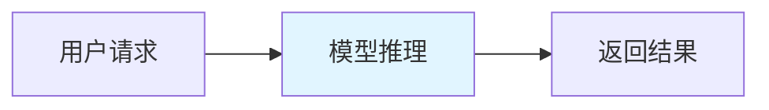
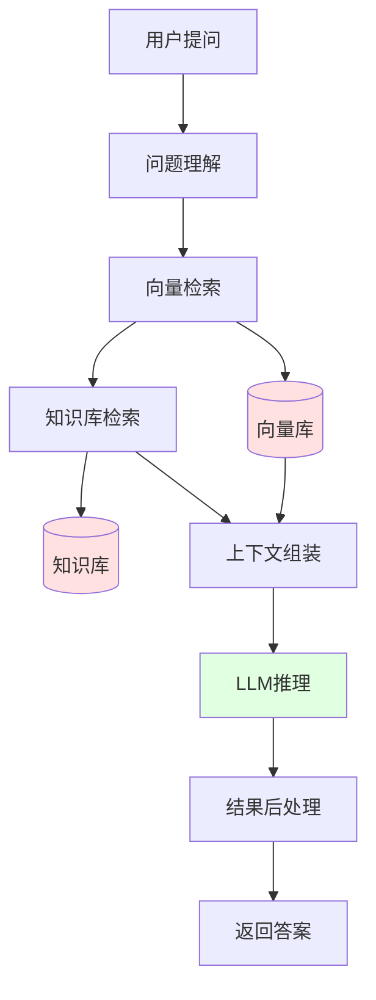
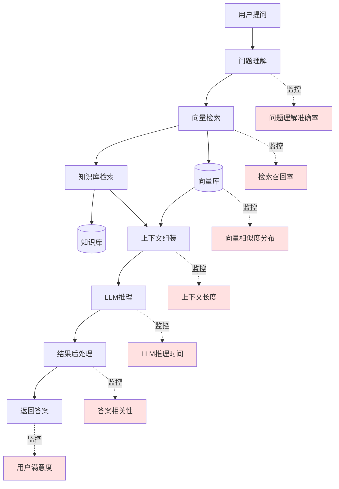
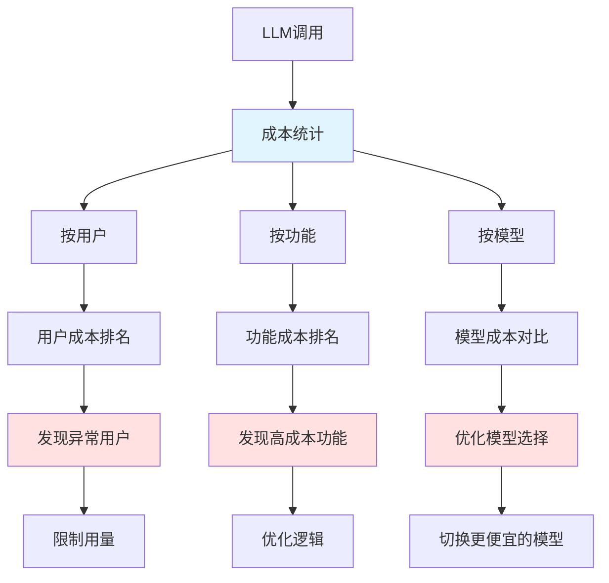
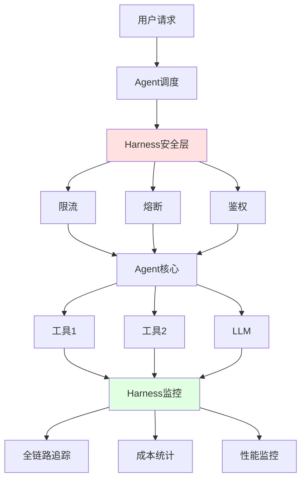
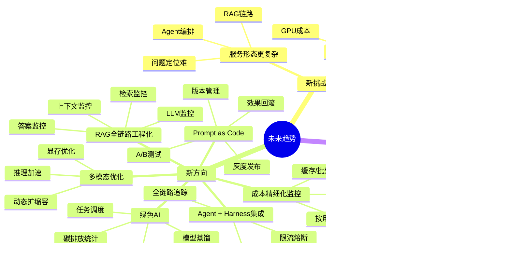

# 第9章：未来趋势｜大模型时代，Harness Engineering的新挑战与新方向

> 贴合大模型时代，讲清Harness Engineering的新变化、新需求、新方向

---

## 开篇思考：大模型时代，一切都变了吗？

ChatGPT火了之后，你可能会问：

- Harness Engineering还适用于大模型吗？
- RAG、Agent这些新形态，怎么工程化落地？
- 大模型的成本这么高，怎么管控？
- Prompt注入、越狱攻击这些安全问题，怎么防范？

**大模型时代，AI服务的形态发生了翻天覆地的变化**：

- 从单一模型推理，变成了"LLM+向量库+工具调用+知识库"的复杂链路
- 从关注准确率，变成了关注成本、安全、体验的平衡
- 从模型服务化，变成了Prompt工程、Agent编排

但有一点没有变：**稳定的工程底座，依然是AI服务落地的核心**。

---

## 本章核心定位

贴合当前大模型/多模态/Agent的落地趋势，讲清Harness Engineering在新时代的新变化、新需求、新方向，给读者前瞻性的参考。

---

## 1. 大模型时代，Harness Engineering面临的3个核心新挑战

### 挑战1：服务形态更复杂，出了问题更难定位

**传统AI服务**：



简单明了，出了问题就知道是模型的问题。

**大模型服务（以RAG为例）**：



复杂链路，出了问题可能是：
- 向量检索不准？
- 知识库没有相关内容？
- 上下文太长超出了Token限制？
- LLM推理超时？
- 任何一个环节出问题，都影响最终结果

**核心痛点**：
- 问题定位难度指数级上升
- 传统监控只监控LLM本身，不够了
- 需要全链路追踪，监控每个环节

### 挑战2：成本管控难度剧增

**传统模型**：
- 推理成本相对固定（主要是GPU算力）
- 容易预估和优化

**大模型**：
- Token成本：GPT-4每1000个Token要$0.03
- API调用成本：量大起来很贵
- GPU算力成本：自建大模型需要大量GPU

**真实案例**：

某公司做了个智能客服Agent：
- 上线前预估：每天1万次对话，每次1000 Token
- 实际运行：每天5万次对话，平均每次3000 Token（因为有对话历史）
- 月成本：从预估的$900飙升到$13,500
- 财务震惊，要求优化

**核心痛点**：
- 成本难以预估
- 没有精细化监控，不知道钱花在哪里
- 需要成本优化策略（缓存、批处理、降级）

### 挑战3：安全风险更高

**传统模型的安全问题**：
- 输入数据异常
- 模型被攻击

**大模型的安全问题**：

| 安全威胁 | 描述 | 影响 |
|---------|------|------|
| **Prompt注入** | 用户精心设计Prompt，绕过限制 | 让模型说违规内容 |
| **越狱攻击** | 通过角色扮演、情景模拟绕过安全限制 | 让模型输出有害信息 |
| **数据泄露** | 大模型可能在输出中泄露训练数据 | 隐私泄露、合规风险 |
| **版权问题** | 生成的内容可能侵犯版权 | 法律风险 |

**真实案例**：

- 2023年，某车企的ChatGPT客服被诱导，说出了竞品的内容
- 2024年，某公司的内部知识库Agent被Prompt注入，泄露了商业机密

**核心痛点**：
- 安全防护更复杂
- 需要全链路的安全防护
- 合规要求更严格

---

## 2. 当前正在落地的6大核心新方向

### 新方向1：RAG系统全链路工程化

**核心问题**：
很多团队做了RAG系统，上线后发现效果变差，但不知道问题出在哪：
- 是检索不准？
- 是上下文组装有问题？
- 还是LLM推理有问题？

**解决方案**：给RAG系统做全链路工程化



**核心监控指标**：

| 环节 | 监控指标 | 告警阈值 |
|------|---------|---------|
| **检索** | 召回率、精确率 | 召回率 < 60% |
| **上下文** | 上下文长度、Token数 | Token > 4000 |
| **LLM** | 推理时间、成本 | 时间 > 10s |
| **答案** | 相关性、用户满意度 | 相关性 < 70% |

**落地方案**：

```python
# RAG服务中集成全链路监控
from prometheus_client import Histogram, Counter

# 检索环节
retrieval_latency = Histogram('rag_retrieval_latency_seconds', 'Retrieval latency')
retrieval_recall = Counter('rag_retrieval_recall_total', 'Retrieval recall')

# LLM环节
llm_latency = Histogram('rag_llm_latency_seconds', 'LLM latency')
llm_cost = Counter('rag_llm_cost_total', 'LLM cost', ['model'])

# 答案环节
answer_relevance = Counter('rag_answer_relevance_total', 'Answer relevance', ['score'])

@app.post("/api/rag")
async def rag_query(question: str):
    # 1. 检索（带监控）
    with retrieval_latency.time():
        docs = vector_store.search(question)
        retrieval_recall.inc(len(docs))

    # 2. 上下文组装
    context = assemble_context(docs)

    # 3. LLM推理（带监控）
    with llm_latency.time():
        answer = llm.generate(question, context)
        llm_cost.inc(calculate_cost(answer))

    # 4. 后处理
    relevance = calculate_relevance(question, answer)
    answer_relevance.labels(score=relevance).inc()

    return {"answer": answer}
```

### 新方向2：Prompt as Code，把Prompt纳入工程化体系

**核心问题**：
很多团队调Prompt像"炼丹"：
- 改了Prompt不知道效果好坏
- 效果变差了不知道什么时候改的
- 无法回滚到之前的版本
- 无法做A/B测试

**解决方案**：像管理代码一样管理Prompt

**核心能力**：

| 能力 | 说明 |
|------|------|
| **版本管理** | 每个Prompt都有版本号，可追溯 |
| **灰度发布** | 新Prompt先给1%用户用，逐步扩量 |
| **A/B测试** | 同时测试多个Prompt，量化对比效果 |
| **效果回滚** | 效果变差，一键回滚到上一个版本 |
| **自动化测试** | 上线前测试Prompt是否合规 |

**落地方案**：

```python
# prompt_version.py - Prompt版本管理
PROMPTS = {
    "v1.0": """
    你是一个智能客服，请根据以下知识库内容回答用户问题。

    知识库：{context}

    用户问题：{question}

    请提供准确、友好的回答。
    """,

    "v2.0": """
    你是一个专业的客户服务助手。

    【任务】根据知识库内容回答用户问题

    【知识库】
    {context}

    【用户问题】
    {question}

    【要求】
    1. 回答要准确、简洁
    2. 如果知识库中没有相关信息，明确告知用户
    3. 保持友好、专业的语气
    """,
}

class PromptManager:
    def __init__(self):
        self.current_version = "v2.0"

    def get_prompt(self, version=None):
        """获取指定版本的Prompt"""
        version = version or self.current_version
        return PROMPTS[version]

    def render(self, version=None, **kwargs):
        """渲染Prompt"""
        template = self.get_prompt(version)
        return template.format(**kwargs)

    def ab_test(self, user_id):
        """A/B测试：根据用户ID分配不同版本"""
        if user_id % 2 == 0:
            return "v1.0"
        else:
            return "v2.0"

# 使用示例
prompt_manager = PromptManager()

@app.post("/api/chat")
async def chat(user_id: str, question: str):
    # A/B测试：不同用户用不同版本的Prompt
    prompt_version = prompt_manager.ab_test(int(user_id))

    # 渲染Prompt
    prompt = prompt_manager.render(
        version=prompt_version,
        context="...",
        question=question
    )

    # 调用LLM
    answer = llm.generate(prompt)

    # 记录效果
    log_prompt_effect(prompt_version, answer)

    return {"answer": answer}
```

**配套的自动化测试**：

```python
# test_prompt.py
def test_prompt_compliance():
    """测试Prompt是否合规"""
    for version, template in PROMPTS.items():
        # 检查是否包含敏感词
        assert "股票" not in template, f"Prompt {version} contains sensitive word"
        assert "赌博" not in template

        # 检查是否包含安全指令
        assert "不要" in template or "禁止" in template, f"Prompt {version} lacks safety instruction"

def test_prompt_effectiveness():
    """测试Prompt效果"""
    # 用测试数据集测试
    test_questions = ["...", "...", "..."]

    for version in PROMPTS.keys():
        prompt_manager = PromptManager()
        prompt_manager.current_version = version

        scores = []
        for question in test_questions:
            answer = generate_answer(question, prompt_manager)
            score = evaluate_answer(answer)
            scores.append(score)

        avg_score = sum(scores) / len(scores)
        assert avg_score > 0.7, f"Prompt {version} score too low: {avg_score}"
```

### 新方向3：LLM成本精细化监控与优化

**核心问题**：
大模型成本高昂，但很多团队不知道钱花在哪里了。

**解决方案**：精细化成本监控 + 优化策略

**成本监控架构**：



**落地方案**：

```python
# cost_monitor.py
from prometheus_client import Counter, Gauge

# 成本计数器
llm_cost_counter = Counter(
    'llm_cost_total',
    'Total LLM cost',
    ['user_id', 'function', 'model']
)

# 用量监控
llm_token_usage = Gauge(
    'llm_token_usage',
    'LLM token usage',
    ['user_id', 'function']
)

def track_llm_cost(user_id: str, function: str, model: str, tokens: int):
    """统计LLM成本"""
    # 计算成本（不同模型价格不同）
    cost_per_1k_tokens = {
        "gpt-4": 0.03,
        "gpt-3.5-turbo": 0.002,
    }

    cost = (tokens / 1000) * cost_per_1k_tokens[model]

    # 记录成本
    llm_cost_counter.labels(
        user_id=user_id,
        function=function,
        model=model
    ).inc(cost)

    # 记录用量
    llm_token_usage.labels(
        user_id=user_id,
        function=function
    ).set(tokens)

    return cost

@app.post("/api/chat")
async def chat(user_id: str, question: str):
    # 选择模型（根据复杂度）
    if is_simple_question(question):
        model = "gpt-3.5-turbo"  # 简单问题用便宜的模型
    else:
        model = "gpt-4"  # 复杂问题用贵的模型

    # 调用LLM
    response = openai.ChatCompletion.create(
        model=model,
        messages=[...]
    )

    # 统计成本
    tokens = response.usage.total_tokens
    cost = track_llm_cost(user_id, "chat", model, tokens)

    return {"answer": response.choices[0].message, "cost": cost}
```

**成本优化策略**：

| 策略 | 说明 | 预估节省 |
|------|------|---------|
| **缓存** | 相同问题直接返回缓存答案 | 30-50% |
| **批处理** | 多个请求合并处理 | 20-30% |
| **模型降级** | 简单问题用便宜的模型 | 40-60% |
| **Token优化** | 精简Prompt，减少Token | 10-20% |

**缓存示例**：

```python
from functools import lru_cache
import hashlib

@lru_cache(maxsize=1000)
def get_cached_answer(question_hash: str):
    """从缓存获取答案"""
    return cache.get(question_hash)

@app.post("/api/chat")
async def chat(question: str):
    # 计算问题的哈希
    question_hash = hashlib.md5(question.encode()).hexdigest()

    # 先查缓存
    cached_answer = get_cached_answer(question_hash)
    if cached_answer:
        return {"answer": cached_answer, "from_cache": True}

    # 缓存未命中，调用LLM
    answer = llm.generate(question)

    # 存入缓存
    cache.set(question_hash, answer, expire=3600)

    return {"answer": answer, "from_cache": False}
```

### 新方向4：轻量级Agent框架与Harness深度集成

**核心问题**：
很多团队做了Agent，但没有工程化保障：
- 没有限流，一个Agent就能把服务打垮
- 没有熔断，一个工具调用失败，整个Agent卡死
- 没有监控，Agent出了问题不知道在哪里

**解决方案**：给Agent框架配套标准化的Harness底座

**Agent + Harness架构**：



**落地方案**：

```python
# agent_with_harness.py
from langchain.agents import AgentExecutor
from slowapi import Limiter

# 1. 安全层：限流
limiter = Limiter(key_func=get_remote_address)

# 2. 安全层：熔断
from circuitbreaker import circuit

@circuit(failure_threshold=5, recovery_timeout=60)
def call_tool_safely(tool_name, inputs):
    """安全地调用工具"""
    try:
        return tools[tool_name].run(inputs)
    except Exception as e:
        # 工具调用失败，降级处理
        log_error(tool_name, e)
        return {"error": f"Tool {tool_name} failed"}

# 3. 安全层：鉴权
def verify_api_key(api_key: str):
    """验证API Key"""
    if api_key not in VALID_API_KEYS:
        raise HTTPException(status_code=401, detail="Invalid API key")

# Agent服务
@app.post("/api/agent")
@limiter.limit("10/minute")  # 限流
async def agent_endpoint(
    request: Request,
    query: str,
    api_key: str = Header(...)
):
    # 1. 鉴权
    verify_api_key(api_key)

    # 2. 调用Agent（带监控）
    with track_agent_latency() as tracer:
        result = agent.run(query)

    # 3. 返回结果
    return {"result": result}

# 4. 监控层
from prometheus_client import Histogram

agent_latency = Histogram('agent_latency_seconds', 'Agent latency')
agent_cost = Counter('agent_cost_total', 'Agent cost')

def track_agent_latency():
    """追踪Agent延迟"""
    return agent_latency.time()
```

### 新方向5：多模态模型的工程化优化

**核心问题**：
多模态模型（图像、音频、视频）的工程化挑战：
- 显存占用大
- 推理耗时长
- 容易OOM（内存溢出）

**解决方案**：针对性的工程化优化

**优化方向**：

| 优化方向 | 具体方法 | 预估效果 |
|---------|---------|---------|
| **显存优化** | 模型量化、梯度检查点 | 显存占用↓50% |
| **推理加速** | TensorRT、ONNX优化 | 延迟↓30-50% |
| **动态扩缩容** | 根据队列长度自动扩缩容 | 成本↓30% |
| **批处理** | 多个请求合并处理 | 吞吐量↑2-3倍 |

**落地方案**：

```python
# multimodal_service.py
import torch
from transformers import AutoModel

# 1. 显存优化：模型量化
model = AutoModel.from_pretrained("model-name")
model = model.quantize()  # 量化到8bit

# 2. 推理加速：使用TensorRT
import tensorrt as trt

# 3. 动态批处理
from queue import Queue
import threading

request_queue = Queue(maxsize=100)

def batch_processor():
    """后台批处理"""
    while True:
        batch = []
        # 收集一批请求（最多等待100ms）
        for _ in range(10):
            try:
                request = request_queue.get(timeout=0.1)
                batch.append(request)
            except:
                break

        if batch:
            # 批量处理
            results = model.batch_predict(batch)
            for request, result in zip(batch, results):
                request.set_result(result)

# 启动后台处理线程
threading.Thread(target=batch_processor, daemon=True).start()

@app.post("/api/generate_image")
async def generate_image(prompt: str):
    """图像生成（带批处理）"""
    future = Future()
    request_queue.put({"prompt": prompt, "future": future})
    result = await future
    return {"image": result}
```

### 新方向6：绿色AI，推理能耗监控与优化

**核心背景**：
AI模型推理消耗大量能源，碳排放问题日益突出。

**解决方案**：把能耗纳入监控体系，优化推理效率

**监控指标**：

| 指标 | 说明 | 优化目标 |
|------|------|---------|
| **GPU能耗** | 每次推理的GPU能耗 | ↓20% |
| **碳排放** | 换算成CO₂排放量 | ↓20% |
| **能效比** | 每度电处理的请求数 | ↑30% |

**落地方案**：

```python
# green_ai_monitor.py
import pynvml

# 初始化NVIDIA监控
pynvml.nvmlInit()

def get_gpu_power_usage():
    """获取GPU能耗"""
    handle = pynvml.nvmlDeviceGetHandleByIndex(0)
    power_usage = pynvml.nvmlDeviceGetPowerUsage(handle) / 1000  # 瓦特
    return power_usage

def calculate_carbon footprint(power_kw, duration_hours):
    """计算碳排放"""
    # 碳排放因子：0.5 kg CO₂/kWh（取决于地区）
    carbon_factor = 0.5
    carbon_footprint = power_kw * duration_hours * carbon_factor
    return carbon_footprint

# 监控GPU能耗
from prometheus_client import Gauge

gpu_power_gauge = Gauge('gpu_power_watts', 'GPU power usage')
carbon_footprint_gauge = Gauge('carbon_footprint_kg', 'Carbon footprint')

@app.post("/api/predict")
async def predict(inputs):
    # 记录开始时的能耗
    start_power = get_gpu_power_usage()
    start_time = time.time()

    # 推理
    result = model.predict(inputs)

    # 记录结束时的能耗
    end_power = get_gpu_power_usage()
    end_time = time.time()

    # 计算能耗和碳排放
    avg_power = (start_power + end_power) / 2 / 1000  # kW
    duration = end_time - start_time / 3600  # 小时
    carbon_footprint = calculate_carbon_footprint(avg_power, duration)

    # 上报指标
    gpu_power_gauge.set(avg_power * 1000)
    carbon_footprint_gauge.set(carbon_footprint)

    return result
```

**优化策略**：

| 策略 | 说明 | 预估效果 |
|------|------|---------|
| **模型蒸馏** | 用小模型替代大模型 | 能耗↓40% |
| **动态电压频率调整** | 根据负载调整GPU频率 | 能耗↓15% |
| **任务调度** | 在清洁能源时段运行任务 | 碳排放↓30% |
| **模型共享** | 多个任务共享模型实例 | 能耗↓20% |

---

## 3. 核心结论

**大模型时代，AI服务的落地，对工程化的要求只会越来越高**：

| 维度 | 传统模型时代 | 大模型时代 | 变化 |
|------|------------|-----------|------|
| **服务复杂度** | 单一模型推理 | RAG、Agent等多组件链路 | ↑ 极大 |
| **成本管控** | 相对固定 | Token成本、API成本高昂 | ↑ 极大 |
| **安全风险** | 输入异常、模型攻击 | Prompt注入、越狱、数据泄露 | ↑ 极大 |
| **监控要求** | 准确率、延迟 | 全链路、成本、安全、体验 | ↑ 全面 |
| **工程难度** | 中等 | 高 | ↑ 大幅 |

**核心结论**：
- Harness Engineering从"加分项"变成了"必选项"
- 没有稳定的工程底座，再先进的大模型、再聪明的Agent，都无法真正落地到业务中
- 大模型时代的Harness Engineering，需要更多维度的能力：成本管控、安全防护、全链路监控、Prompt工程...

---

## 4. 章末互动

### 思考题

你觉得大模型时代，Harness Engineering还会有哪些新的发展方向？

- A. 自动化Prompt优化（AutoML for Prompt）
- B. 联邦学习 + 工程化（隐私保护）
- C. 边缘AI + 工程化（端侧部署）
- D. AI + 区块链（模型版权保护）
- E. 其他（欢迎分享）

### 投票

你当前最关注大模型工程化的哪个方向？

- [ ] RAG系统全链路工程化
- [ ] Prompt as Code
- [ ] LLM成本监控与优化
- [ ] Agent + Harness集成
- [ ] 多模态模型优化
- [ ] 绿色AI

欢迎在评论区投票和分享你的看法！👇

---

## 本章要点回顾



---

**下一章**：[第10章：行动指南｜给不同层级学习者的成长路径与落地计划](./10-第十章-行动指南.md)

最后一章，我们将针对三类核心受众（纯新手、初级工程师、技术负责人），分别制定明确的、可执行的成长路径与落地计划，让你看完博客后，知道"接下来该做什么"。
