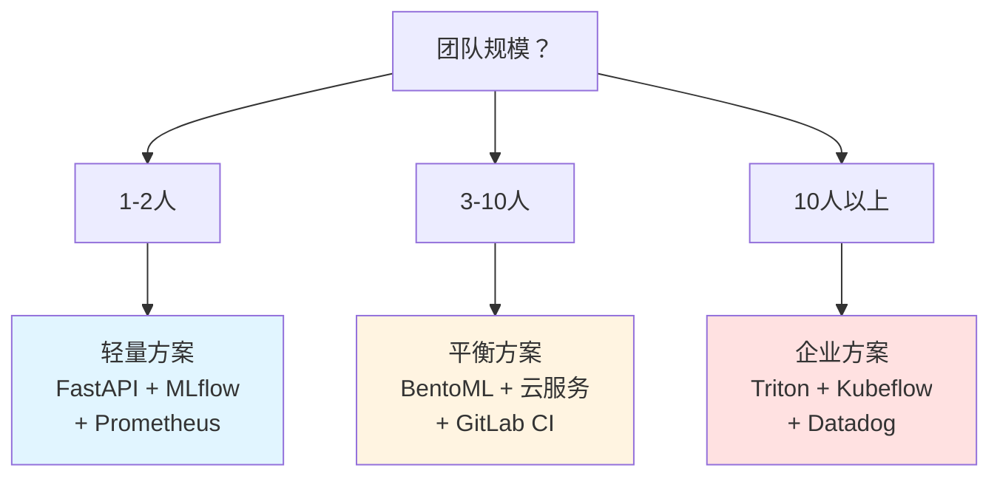
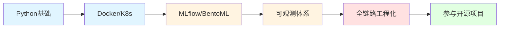
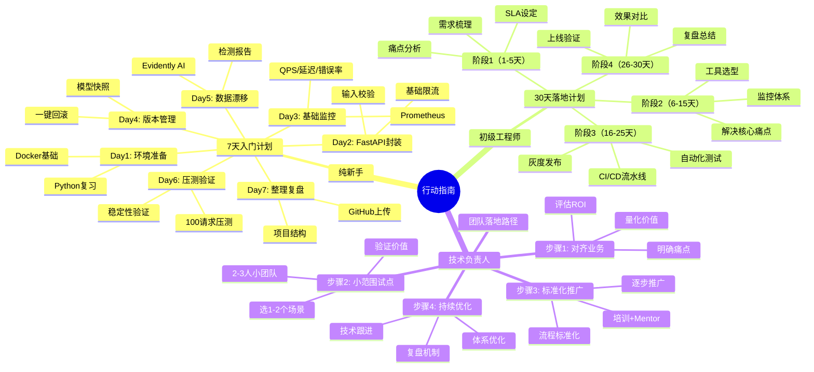

# 第10章：行动指南｜给不同层级学习者的成长路径与落地计划

> 全文收尾章节，给不同层级的读者明确的、可执行的成长路径与落地计划

---

## 开篇思考：看完这么多，接下来我该做什么？

看完了前面9章的理论、方法、工具、案例，你可能会有这些疑问：

- 我是个纯新手，该从哪里开始？
- 我是初级工程师，怎么把这个体系落地到当前项目中？
- 我是技术负责人，怎么在团队内推行这个体系？

**看文章不是目的，动手落地才是**。

本章我们针对三类核心受众，分别制定了对应的成长路径与落地计划。你可以根据自己的情况，直接照着执行。

---

## 本章核心定位

给不同层级的读者明确的、可执行的成长路径与落地计划，让读者看完博客后，知道"接下来该做什么"，真正实现"带着可行动的方案离开"。

---

## 第一类：纯新手/学生/AI爱好者——7天入门计划

### 核心目标

跑通最小可行Harness体系，建立对AI工程化的认知，完成第一个带监控的模型服务。

### 每日执行计划

#### Day1：环境准备与基础复习

**学习目标**：
- 复习Python基础（类、函数、异步编程）
- 学习Docker入门（容器化概念、基本命令）
- 了解FastAPI框架

**具体任务**：

```bash
# 任务1：安装Docker
# Windows/Mac：下载Docker Desktop安装
# Linux：curl -fsSL https://get.docker.com | sh

# 任务2：运行第一个Docker容器
docker run hello-world

# 任务3：创建一个简单的Python应用
mkdir my-first-ai-service
cd my-first-ai-service

# 创建requirements.txt
cat > requirements.txt << EOF
fastapi==0.104.1
uvicorn==0.24.0
scikit-learn==1.3.2
prometheus-client==0.19.0
EOF

# 安装依赖
pip install -r requirements.txt
```

**验收标准**：
- [ ] Docker能正常运行
- [ ] 能创建Python虚拟环境
- [ ] 了解FastAPI的基本概念

---

#### Day2：用FastAPI封装模型API

**学习目标**：
- 用FastAPI创建一个模型API
- 加入输入校验
- 加入基础限流

**具体任务**：

```python
# main.py
from fastapi import FastAPI, HTTPException
from pydantic import BaseModel, validator
import joblib
import numpy as np

app = FastAPI(title="我的第一个AI服务")

# 加载模型（使用简单的sklearn模型）
model = joblib.load("model.pkl")

class PredictRequest(BaseModel):
    text: str

    @validator('text')
    def validate_text(cls, v):
        if not v or len(v.strip()) == 0:
            raise ValueError("文本不能为空")
        if len(v) > 1000:
            raise ValueError("文本长度不能超过1000字符")
        return v

@app.get("/")
async def root():
    return {"message": "欢迎使用我的第一个AI服务"}

@app.post("/api/predict")
async def predict(request: PredictRequest):
    """预测接口"""
    try:
        # 简单的特征提取（实际项目中应该用更复杂的方法）
        features = extract_features(request.text)

        # 模型预测
        prediction = model.predict([features])[0]

        return {
            "text": request.text,
            "prediction": int(prediction),
            "confidence": float(np.max(model.predict_proba([features])))
        }

    except Exception as e:
        raise HTTPException(status_code=500, detail=f"预测失败: {str(e)}")

def extract_features(text: str):
    """特征提取（简化版）"""
    return [len(text), text.count(" "), text.count(".")]

# 启动命令：uvicorn main:app --reload
```

**运行测试**：

```bash
# 启动服务
uvicorn main:app --reload

# 测试接口
curl http://localhost:8000/
curl -X POST http://localhost:8000/api/predict -H "Content-Type: application/json" -d '{"text":"Hello World"}'
```

**验收标准**：
- [ ] FastAPI服务能正常启动
- [ ] 接口能正常返回预测结果
- [ ] 输入校验生效（空文本、超长文本会报错）

---

#### Day3：接入基础监控

**学习目标**：
- 集成Prometheus监控
- 查看QPS、延迟、错误率

**具体任务**：

```python
# 在main.py中添加监控
from prometheus_client import Counter, Histogram, make_asgi_app

# 创建监控指标
prediction_counter = Counter('predictions_total', 'Total predictions')
prediction_latency = Histogram('prediction_latency_seconds', 'Prediction latency')
prediction_errors = Counter('prediction_errors_total', 'Total prediction errors')

# 添加监控端点
metrics_app = make_asgi_app()
app.mount("/metrics", metrics_app)

# 修改预测接口，添加监控
@app.post("/api/predict")
async def predict(request: PredictRequest):
    with prediction_latency.time():
        try:
            prediction_counter.inc()
            # ... 原有预测逻辑 ...
        except Exception as e:
            prediction_errors.inc()
            raise
```

**启动Prometheus**：

```yaml
# prometheus.yml
global:
  scrape_interval: 15s

scrape_configs:
  - job_name: 'my-ai-service'
    static_configs:
      - targets: ['host.docker.internal:8000']
```

```bash
# 启动Prometheus
docker run -d \
  -p 9090:9090 \
  -v $(pwd)/prometheus.yml:/etc/prometheus/prometheus.yml \
  prom/prometheus

# 访问 http://localhost:9090 查看监控
```

**验收标准**：
- [ ] 能在Prometheus中看到QPS、延迟等指标
- [ ] 发起请求后，指标数据会更新

---

#### Day4：模型版本管理

**学习目标**：
- 实现模型版本快照
- 编写一键回滚脚本

**具体任务**：

```python
# model_version.py
import os
import shutil
from datetime import datetime
import joblib

class ModelVersionManager:
    def __init__(self, models_dir="models"):
        self.models_dir = models_dir
        os.makedirs(models_dir, exist_ok=True)
        self.current_version_file = os.path.join(models_dir, "CURRENT")

    def save_model(self, model, version):
        """保存模型快照"""
        timestamp = datetime.now().strftime("%Y%m%d_%H%M%S")
        version_dir = os.path.join(self.models_dir, f"v{version}_{timestamp}")
        os.makedirs(version_dir, exist_ok=True)

        # 保存模型
        model_path = os.path.join(version_dir, "model.pkl")
        joblib.dump(model, model_path)

        # 保存元数据
        metadata = {
            "version": version,
            "timestamp": timestamp,
            "path": version_dir
        }
        metadata_path = os.path.join(version_dir, "metadata.json")
        import json
        with open(metadata_path, 'w') as f:
            json.dump(metadata, f, indent=2)

        # 更新当前版本
        with open(self.current_version_file, 'w') as f:
            f.write(version_dir)

        print(f"模型已保存: {version_dir}")
        return version_dir

    def load_model(self, version=None):
        """加载模型"""
        if version is None:
            # 加载当前版本
            with open(self.current_version_file, 'r') as f:
                version_dir = f.read()
        else:
            # 加载指定版本
            version_dir = os.path.join(self.models_dir, version)

        model_path = os.path.join(version_dir, "model.pkl")
        model = joblib.load(model_path)

        print(f"模型已加载: {version_dir}")
        return model

    def list_versions(self):
        """列出所有版本"""
        versions = []
        for item in os.listdir(self.models_dir):
            if item.startswith("v") and os.path.isdir(os.path.join(self.models_dir, item)):
                versions.append(item)
        return sorted(versions)

# 使用示例
manager = ModelVersionManager()

# 训练新模型后保存
manager.save_model(trained_model, version="1.0")

# 加载模型
model = manager.load_model()

# 列出所有版本
print(manager.list_versions())
```

**回滚脚本**：

```bash
#!/bin/bash
# rollback.sh

echo "可用的模型版本："
ls -1 models/ | grep "^v"

read -p "请输入要回滚到的版本目录名: " VERSION_DIR

if [ -d "models/$VERSION_DIR" ]; then
    echo "models/$VERSION_DIR" > models/CURRENT
    echo "已回滚到版本: $VERSION_DIR"
    echo "请重启服务以加载新版本"
else
    echo "错误: 版本不存在"
    exit 1
fi
```

**验收标准**：
- [ ] 能保存模型快照
- [ ] 能加载指定版本的模型
- [ ] 能一键回滚到上一个版本

---

#### Day5：数据漂移检测

**学习目标**：
- 使用Evidently AI检测数据漂移
- 生成检测报告

**具体任务**：

```python
# data_drift_detection.py
import pandas as pd
from evidently import ColumnMapping
from evidently.report import Report
from evidently.metric_preset import DataDriftPreset

# 准备数据（训练集和当前数据）
reference_data = pd.DataFrame({
    "text_length": [100, 150, 200, 120, 180],
    "word_count": [20, 30, 40, 24, 36],
    "prediction": [1, 0, 1, 1, 0]
})

current_data = pd.DataFrame({
    "text_length": [250, 300, 280, 260, 320],  # 明显变长了
    "word_count": [50, 60, 56, 52, 64],  # 明显变多了
    "prediction": [1, 0, 1, 1, 0]
})

# 定义列映射
column_mapping = ColumnMapping(
    target="prediction",
    numerical_features=["text_length", "word_count"]
)

# 创建报告
report = Report(metrics=[DataDriftPreset()])

# 运行检测
report.run(reference_data=reference_data, current_data=current_data, column_mapping=column_mapping)

# 保存报告
report.save_html("data_drift_report.html")

print("数据漂移检测报告已生成: data_drift_report.html")
```

**验收标准**：
- [ ] 能生成数据漂移检测报告
- [ ] 能识别出数据分布的变化

---

#### Day6：跑通完整的最小可行Harness

**学习目标**：
- 整合前面的所有模块
- 做压测，验证服务稳定性

**具体任务**：

```python
# 完整的服务代码
from fastapi import FastAPI, HTTPException
from pydantic import BaseModel, validator
from prometheus_client import Counter, Histogram, make_asgi_app
import joblib
import numpy as np
from model_version import ModelVersionManager

app = FastAPI(title="最小可行Harness示例")

# 1. 模型版本管理
model_manager = ModelVersionManager()
model = model_manager.load_model()

# 2. 监控
prediction_counter = Counter('predictions_total', 'Total predictions')
prediction_latency = Histogram('prediction_latency_seconds', 'Prediction latency')
prediction_errors = Counter('prediction_errors_total', 'Total prediction errors')
metrics_app = make_asgi_app()
app.mount("/metrics", metrics_app)

# 3. 请求模型
class PredictRequest(BaseModel):
    text: str

    @validator('text')
    def validate_text(cls, v):
        if not v or len(v.strip()) == 0:
            raise ValueError("文本不能为空")
        if len(v) > 1000:
            raise ValueError("文本长度不能超过1000字符")
        return v

# 4. 预测接口（带监控）
@app.post("/api/predict")
async def predict(request: PredictRequest):
    with prediction_latency.time():
        try:
            prediction_counter.inc()
            features = extract_features(request.text)
            prediction = model.predict([features])[0]
            return {
                "text": request.text,
                "prediction": int(prediction)
            }
        except Exception as e:
            prediction_errors.inc()
            raise HTTPException(status_code=500, detail=f"预测失败: {str(e)}")

# 5. 健康检查
@app.get("/health")
async def health():
    return {"status": "healthy"}

def extract_features(text: str):
    return [len(text), text.count(" "), text.count(".")]
```

**压测**：

```python
# test_performance.py
import requests
import time
import concurrent.futures

def test_single_request():
    start = time.time()
    response = requests.post(
        "http://localhost:8000/api/predict",
        json={"text": "This is a test"}
    )
    latency = time.time() - start
    return {
        "status": response.status_code,
        "latency": latency
    }

def run_load_test(num_requests=100):
    print(f"开始压测，共 {num_requests} 个请求...")

    latencies = []
    errors = 0

    with concurrent.futures.ThreadPoolExecutor(max_workers=10) as executor:
        futures = [executor.submit(test_single_request) for _ in range(num_requests)]

        for future in concurrent.futures.as_completed(futures):
            result = future.result()
            if result["status"] != 200:
                errors += 1
            latencies.append(result["latency"])

    # 统计结果
    print(f"\n压测结果:")
    print(f"总请求数: {num_requests}")
    print(f"错误数: {errors}")
    print(f"错误率: {errors/num_requests*100:.2f}%")
    print(f"平均延迟: {np.mean(latencies):.3f}s")
    print(f"P95延迟: {np.percentile(latencies, 95):.3f}s")
    print(f"P99延迟: {np.percentile(latencies, 99):.3f}s")

if __name__ == "__main__":
    run_load_test(100)
```

**验收标准**：
- [ ] 服务能正常运行
- [ ] 压测100个请求，错误率 < 1%
- [ ] P95延迟 < 500ms

---

#### Day7：整理项目，完成入门闭环

**学习目标**：
- 整理项目结构
- 写博客复盘
- 上传GitHub

**具体任务**：

```bash
# 项目结构
my-first-ai-service/
├── main.py                 # 主服务
├── model_version.py        # 模型版本管理
├── data_drift_detection.py # 数据漂移检测
├── test_performance.py     # 压测脚本
├── requirements.txt        # 依赖
├── Dockerfile             # Docker配置
├── prometheus.yml         # Prometheus配置
├── README.md              # 项目文档
└── models/                # 模型目录
    ├── v1.0_20240101_120000/
    └── CURRENT
```

**README.md模板**：

```markdown
# 我的第一个AI服务

最小可行Harness示例，包含：
- FastAPI模型服务
- Prometheus监控
- 模型版本管理
- 数据漂移检测

## 快速开始

\`\`\`bash
# 安装依赖
pip install -r requirements.txt

# 启动服务
uvicorn main:app --reload

# 运行压测
python test_performance.py
\`\`\`

## 监控

访问 http://localhost:9090 查看Prometheus监控

## 作者

XXX - 2024年1月
```

**提交到GitHub**：

```bash
git init
git add .
git commit -m "First commit: 最小可行Harness"
git remote add origin https://github.com/your-username/my-first-ai-service.git
git push -u origin main
```

**验收标准**：
- [ ] 项目结构清晰
- [ ] README文档完整
- [ ] 代码已上传GitHub
- [ ] 写了一篇博客复盘（可选）

---

### 核心学习资源

| 资源类型 | 推荐资源 | 链接 |
|---------|---------|------|
| **FastAPI文档** | FastAPI官方教程 | https://fastapi.tiangolo.com/ |
| **Prometheus** | Prometheus入门教程 | https://prometheus.io/docs/introduction/first_steps/ |
| **MLflow** | MLflow官方文档 | https://mlflow.org/docs/latest/index.html |
| **视频教程** | B站《MLOps入门教程》 | 搜索"MLOps入门" |
| **实战项目** | GitHub上的MLOps项目 | 搜索"MLOps example" |

---

## 第二类：初级算法工程师/AI开发工程师——30天落地提升计划

### 核心目标

把Harness Engineering落地到你当前的项目中，解决模型上线的核心痛点，提升服务稳定性与迭代效率。

### 分阶段执行计划

#### 阶段1（第1-5天）：需求梳理与痛点分析

**核心任务**：
- 盘点当前项目的核心痛点
- 明确落地目标与SLA
- 划定试点范围

**具体动作**：

```markdown
# 痛点分析清单

## 当前项目
项目名称：____________
项目类型：[推荐系统/NLP/计算机视觉/其他]

## 核心痛点（最多选3个）
- [ ] 模型上线后经常出故障（______次/月）
- [ ] 模型迭代太慢（______周/次）
- [ ] 模型效果不好，找不到原因
- [ ] 出了问题无法快速定位（______小时）
- [ ] 其他：____________

## 量化目标
服务可用性目标：______%（当前：______%）
故障恢复时间目标：______分钟（当前：______分钟）
模型迭代周期目标：______天（当前：______周）

## 试点范围
选定的试点服务：____________
选择理由：____________
```

**输出物**：
- 《Harness落地需求说明书》
- 《痛点分析报告》

**验收标准**：
- [ ] 明确了要解决的1-3个核心痛点
- [ ] 设定了量化的SLA目标
- [ ] 确定了试点的服务范围

---

#### 阶段2（第6-15天）：工具选型与核心模块搭建

**核心任务**：
- 根据团队规模选工具
- 搭建监控体系
- 解决最核心的痛点

**具体动作**：

| 天数 | 任务 | 产出 |
|------|------|------|
| 第6-8天 | 工具选型 | 《工具选型方案》 |
| 第9-12天 | 搭建监控体系 | 监控看板、告警规则 |
| 第13-15天 | 解决核心痛点 | 对应的优化方案 |

**工具选型决策树**：



**输出物**：
- 《工具选型方案》
- 监控看板（Grafana）
- 告警规则（Prometheus）

**验收标准**：
- [ ] 监控看板能实时查看QPS、延迟、错误率
- [ ] 告警规则生效，异常时会触发告警
- [ ] 核心痛点得到缓解

---

#### 阶段3（第16-25天）：搭建CI/CD流水线

**核心任务**：
- 配置自动化测试
- 搭建CI/CD流水线
- 实现灰度发布和一键回滚

**具体动作**：

```yaml
# .gitlab-ci.yml 示例
stages:
  - test
  - build
  - deploy

# 单元测试
unit_test:
  stage: test
  script:
    - pytest test_model.py
    - pytest test_api.py

# 性能测试
performance_test:
  stage: test
  script:
    - locust -f test_performance.py --headless --users 100

# 构建镜像
build:
  stage: build
  script:
    - docker build -t registry.com/model-service:$CI_COMMIT_SHORT_SHA .
    - docker push registry.com/model-service:$CI_COMMIT_SHORT_SHA

# 灰度发布
deploy_canary:
  stage: deploy
  script:
    - kubectl apply -f k8s/canary-deployment.yaml
```

**输出物**：
- CI/CD流水线配置
- 自动化测试套件
- 灰度发布配置

**验收标准**：
- [ ] 代码提交后自动运行测试
- [ ] 测试通过后自动构建镜像
- [ ] 能自动部署到测试环境
- [ ] 能一键回滚到任意版本

---

#### 阶段4（第26-30天）：上线验证与效果复盘

**核心任务**：
- 灰度发布验证
- 效果对比分析
- 输出复盘报告

**具体动作**：

```markdown
# 上线验证清单

## 灰度发布
- [ ] 1%流量，观察24小时
- [ ] 10%流量，观察24小时
- [ ] 50%流量，观察24小时
- [ ] 100%流量

## 效果对比
| 指标 | 改造前 | 改造后 | 提升 |
|------|--------|--------|------|
| 故障发生率 | ______/月 | ______/月 | ____% |
| MTTR | ______分钟 | ______分钟 | ____% |
| 迭代周期 | ______周 | ______天 | ____% |
| 业务指标 | ______ | ______ | ____% |

## 复盘总结
成功的经验：
1. ________________
2. ________________

遇到的坑：
1. ________________
2. ________________

改进计划：
1. ________________
2. ________________
```

**输出物**：
- 《上线验证报告》
- 《效果对比分析》
- 《复盘总结》

**验收标准**：
- [ ] 新版本100%流量稳定运行
- [ ] 各项指标达到SLA要求
- [ ] 输出复盘报告

---

### 能力提升路径



---

## 第三类：技术负责人/技术决策者——团队落地路径

### 核心目标

在团队内落地Harness Engineering体系，提升AI服务的稳定性与迭代效率，给业务带来实际价值，同时控制投入成本。

### 落地执行四步法

#### 步骤1：对齐业务目标（第1-2周）

**核心任务**：
- 和业务方对齐，明确落地要解决的核心业务问题
- 避免为了工程化而工程化

**关键问题**：
1. 当前AI服务的核心痛点是什么？
   - 是故障频发，影响用户体验？
   - 是迭代太慢，无法快速响应市场？
   - 是效果不好，影响业务指标？

2. 解决这些问题，能给业务带来什么价值？
   - 减少故障能提升用户留存？
   - 加快迭代能抢占市场机会？
   - 提升效果能直接带来收入增长？

3. 愿意投入多少资源？
   - 人力：______人
   - 时间：______周
   - 预算：______万

**输出物**：
- 《AI工程化落地商业计划书》
- 《投入产出比分析》

---

#### 步骤2：小范围试点（第3-6周）

**核心任务**：
- 选1-2个核心业务场景
- 安排2-3人的小团队做试点
- 跑通闭环，验证落地价值

**试点选择标准**：

| 标准 | 好的试点 | 不好的试点 |
|------|---------|-----------|
| 业务价值 | 核心业务，痛点明显 | 边缘业务，没有痛点 |
| 复杂度 | 相对简单，能快速验证 | 过于复杂，短期难见效 |
| 风险 | 不是最核心，风险可控 | 最核心，风险太高 |
| 数据基础 | 有基本的监控和日志 | 一团黑，没有可观测性 |

**试点团队配置**：
- 算法工程师1人：负责模型优化
- 后端工程师1人：负责服务化
- 运维/平台工程师1人：负责基础设施

**试点验收标准**：
- [ ] 核心痛点得到解决（故障率↓/迭代速度↑/效果↑）
- [ ] 能量化业务价值（挽回损失XX万/增加收入XX万）
- [ ] 能测算ROI（投入XX万，收益XX万）

---

#### 步骤3：标准化推广（第7-12周）

**核心任务**：
- 试点成功后，标准化落地流程
- 输出团队内部的《AI工程化落地规范》
- 逐步推广到全团队

**标准化内容**：

| 内容 | 说明 |
|------|------|
| **工具选型** | 团队统一使用的工具栈 |
| **开发规范** | 代码规范、API规范、文档规范 |
| **测试规范** | 单元测试、集成测试、性能测试要求 |
| **发布流程** | 灰度发布、一键回滚的标准流程 |
| **监控规范** | 监控指标、告警规则、值班机制 |

**推广策略**：
1. **内部分享会**：试点团队分享经验
2. **培训计划**：对其他团队进行培训
3. **Mentor机制**：试点团队Mentor其他团队
4. **定期Review**：每周Review各团队的落地进度

---

#### 步骤4：持续优化（长期）

**核心任务**：
- 建立复盘机制
- 持续优化体系
- 跟进技术趋势

**复盘机制**：

| 频率 | 内容 | 参与人 |
|------|------|--------|
| 每周 | 工程师复盘本周故障和问题 | 工程师团队 |
| 每月 | 技术负责人Review整体进展 | 技术负责人 |
| 每季度 | 和业务方Review业务价值 | 技术+业务 |

**持续优化方向**：
- 引入新的工具和方法
- 优化现有流程，提高效率
- 拓展到新的业务场景

---

### 核心避坑提醒

#### 避坑1：不要盲目招人、盲目投入

❌ **错误做法**：
- 为了做AI工程化，招了5个专职工程师
- 投入100万搭建重型平台
- 半年后发现ROI太低，老板叫停

✅ **正确做法**：
- 先用现有团队做试点，验证价值
- 根据ROI决定是否扩大投入
- 优先用云服务，减少运维成本

---

#### 避坑2：不要脱离业务

❌ **错误做法**：
- 工程团队说"我们要做全链路AI工程化"
- 业务方问"能给我带来什么价值？"
- 工程团队答不出来

✅ **正确做法**：
- 从业务痛点出发
- 每个动作都对齐业务目标
- 定期向业务方汇报价值

---

#### 避坑3：不要追求一步到位

❌ **错误做法**：
- 要求所有服务在3个月内全部迁移
- 团队完全配合不了
- 半年后进度不到20%

✅ **正确做法**：
- 分阶段推进，每个阶段都能带来价值
- 让团队看到价值，主动配合
- 给团队足够的学习和适应时间

---

## 11. 全文收尾：核心寄语

AI行业的发展，已经从**"拼模型效果"的时代**，进入了**"拼落地能力"的时代**。

- 能把模型训练到99%的准确率，是算法能力
- 能把99%准确率的模型，稳定、低成本地给百万用户用，就是Harness Engineering的工程能力

**模型是"发动机"，Harness Engineering是"传动系统、刹车系统、安全系统"**。
- 没有发动机，车跑不起来
- 但没有传动、刹车、安全，发动机再强也上不了路

**希望这篇文章，能帮你给你的AI模型，打造一套坚不可摧的"作战装备"**。
让它真正走出实验室，在生产环境里"武装上阵"，创造实际的业务价值。

---

## 12. 章末互动

### 投票

你接下来要执行的落地计划是哪个？

- [ ] 7天入门计划（纯新手）
- [ ] 30天落地提升计划（初级工程师）
- [ ] 团队落地路径（技术负责人）

### 思考题

看完这10章，你最大的收获是什么？

- A. 理解了AI工程化的核心价值
- B. 学会了如何选型工具
- C. 掌握了从0到1的落地流程
- D. 知道了如何避坑
- E. 其他（欢迎分享）

欢迎在评论区投票和分享！👇

---

## 本章要点回顾



---

## 全文完结

恭喜你！你已经完成了《Harness Engineering：让AI模型真正"武装上阵"的工程实践》的全部10章内容。

现在，你已经掌握了：
- ✅ Harness Engineering的核心概念和价值
- ✅ 四大核心支柱（服务化、数据、可观测、安全）
- ✅ 工具选型的方法论
- ✅ 从0到1的完整落地流程
- ✅ 90%团队都会踩的坑和避坑指南
- ✅ 真实的成功和失败案例
- ✅ 大模型时代的新挑战和新方向
- ✅ 针对不同层级的行动指南

**接下来，就看你的了**：
- 如果你是纯新手，开始执行7天入门计划
- 如果你是工程师，开始在项目中落地
- 如果你是技术负责人，开始规划团队落地路径

**记住**：不要为了工程化而工程化，始终对齐业务目标，从小范围试点开始，逐步迭代，持续优化。

祝你的AI模型，能真正"武装上阵"，创造实际的业务价值！

---

**配套资源**：
- GitHub开源仓库：（待补充）
- 微信交流群：（待补充）
- 作者邮箱：（待补充）

**相关文章**：
- [第1章：破题｜当你的AI模型"走出实验室"后，为何频频"掉链子"？](./01-第一章-破题.md)
- [第2章：正名｜什么是Harness Engineering？](./02-第二章-正名.md)
- [第3章：核心辨析｜Harness Engineering vs AI Agent](./03-第三章-核心辨析.md)
- [第4章：四大支柱｜构建可靠AI服务的核心工程模块](./04-第四章-四大支柱.md)
- [第5章：工具全景图｜Harness Engineering落地工具选型指南](./05-第五章-工具全景图.md)
- [第6章：实战五步法｜从0到1落地Harness Engineering全流程](./06-第六章-实战五步法.md)
- [第7章：避坑指南｜落地中90%团队踩过的"隐形陷阱"](./07-第七章-避坑指南.md)
- [第8章：全案复盘｜用Harness Engineering重构AI服务的真实案例](./08-第八章-全案复盘.md)
- [第9章：未来趋势｜大模型时代，Harness Engineering的新挑战与新方向](./09-第九章-未来趋势.md)
- [第10章：行动指南｜给不同层级学习者的成长路径与落地计划](./10-第十章-行动指南.md)
